# OpenMC Monte Carlo Particle Transport Code

Last updated on May 06, 2026 (Commit: [e542b2f](https://github.com/openmc-dev/openmc/commit/e542b2f035e397a647cc3ad0ae39946b1ad81e7b))

## Overview & Key Concepts

<details>
<summary>Relevant Files</summary>

<ul>
<li><code>README.md</code></li>
<li><code>openmc/__init__.py</code></li>
<li><code>openmc/model/model.py</code></li>
<li><code>openmc/settings.py</code></li>
<li><code>openmc/executor.py</code></li>
<li><code>src/main.cpp</code></li>
<li><code>src/simulation.cpp</code></li>
<li><code>include/openmc/simulation.h</code></li>
</ul>

</details>

OpenMC is an open-source Monte Carlo particle transport code for simulating nuclear systems — reactors, fusion devices, shielding problems, and any geometry where neutrons or photons travel through matter. It originated at MIT's Computational Reactor Physics Group and is now maintained by a broad open-source community under the MIT license.

The codebase is a hybrid of C++17 and Python: computationally intensive particle transport runs in a compiled C++ library, while problem setup, post-processing, and high-level orchestration are handled through a Python API. This split lets users define complex models interactively (or programmatically) and then hand off the heavy computation to optimized, parallelized C++ code.

### System Architecture

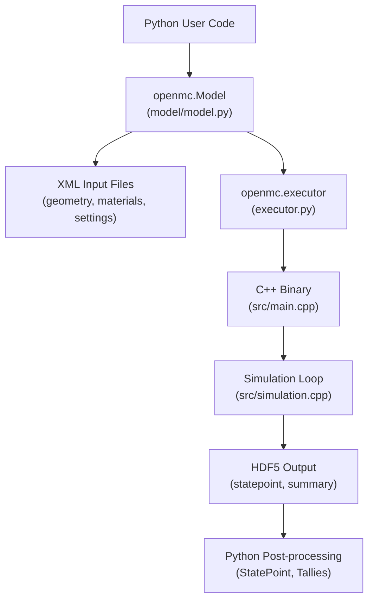

The architecture follows a clean separation of concerns across four layers:

1. **Python Model Building** — Users compose geometry, materials, tallies, and settings using Python objects.
2. **XML Serialization** — `Model.export_to_xml()` writes the model to XML files that the C++ binary reads.
3. **C++ Transport Engine** — The compiled `openmc` binary parses inputs, runs the particle transport loop, and writes HDF5 results.
4. **Python Post-processing** — `openmc.StatePoint` and related classes read simulation output back into Python for analysis.

### The `Model` Class — Central Orchestrator

`openmc.Model` (`openmc/model/model.py`) is the top-level container that bundles every piece of a simulation:

```python
import openmc

model = openmc.Model()
model.geometry   = openmc.Geometry(...)    # CSG cell/surface tree
model.materials  = openmc.Materials(...)   # Nuclide compositions
model.settings   = openmc.Settings(...)    # Run parameters
model.tallies    = openmc.Tallies(...)     # Scoring definitions

model.run()                                # Export XML and launch simulation
```

`Model.run()` calls `export_to_xml()` and then delegates to `openmc.executor.run()`, which spawns the C++ binary as a subprocess.

### Run Modes

The `RunMode` enum in `openmc/settings.py` selects what the simulation computes:

| Mode | Purpose |
|------|---------|
| `EIGENVALUE` | Compute multiplication factor k-effective for a critical system |
| `FIXED_SOURCE` | Simulate a prescribed neutron/photon source |
| `PLOT` | Render geometry visualizations |
| `VOLUME` | Stochastic volume calculation for each cell |
| `PARTICLE_RESTART` | Replay a single particle history for debugging |

### C++ Simulation Loop

`src/main.cpp` is the binary entry point. After parsing arguments and loading XML, it routes execution based on run mode. For eigenvalue and fixed-source problems, control passes to `openmc_run()` in `src/simulation.cpp`, which runs the core batch loop:

```
openmc_simulation_init()
  └─ while batches remain:
       openmc_next_batch()
         ├─ initialize_batch / initialize_generation
         ├─ transport_history_based()  or  transport_event_based()
         └─ finalize_batch() → accumulate tallies, update k-eff
openmc_simulation_finalize()
  └─ write statepoint HDF5
```

Global simulation state (current batch, k-effective, lost-particle count, etc.) lives in the `openmc::simulation` namespace declared in `include/openmc/simulation.h` and is shared across the C++ subsystem.

### Key Concepts for New Contributors

- **Geometry backends**: OpenMC supports Constructive Solid Geometry (CSG) by default. Optional builds add DAGMC (CAD-based geometry via `#ifdef OPENMC_DAGMC`) and unstructured mesh via libMesh.
- **Parallelism**: History-based parallelism (the default) assigns complete particle histories to threads/ranks. Event-based parallelism (`transport_event_based`) is an alternative that distributes individual collision events.
- **Custom containers**: Use `openmc::vector`, `openmc::array`, and `openmc::make_unique` (defined in `vector.h`, `array.h`, `memory.h`) rather than their `std::` equivalents, to remain compatible with future accelerator-targeted implementations.
- **ID management**: Python geometry objects auto-assign integer IDs via `IDManagerMixin`. Call `openmc.reset_auto_ids()` between independent model constructions (e.g., in test fixtures) to avoid ID collisions.
- **Nuclear data**: Cross-section data is stored in HDF5 format. The `OPENMC_CROSS_SECTIONS` environment variable must point to a valid `cross_sections.xml` index file for any simulation to run.

## Architecture & Data Flow

<details>
<summary>Relevant Files</summary>

<ul>
<li><code>src/main.cpp</code></li>
<li><code>src/initialize.cpp</code></li>
<li><code>src/finalize.cpp</code></li>
<li><code>include/openmc/capi.h</code></li>
<li><code>openmc/lib/__init__.py</code></li>
<li><code>openmc/lib/core.py</code></li>
<li><code>CMakeLists.txt</code></li>
<li><code>openmc/model/model.py</code></li>
</ul>

</details>

OpenMC is structured as a hybrid C++/Python system. The computationally intensive particle transport engine is written in C++17 and compiled into a shared library (`libopenmc.so`). A Python package wraps this library via `ctypes`, providing both a high-level model-building API and fine-grained runtime control through `openmc.lib`.

### High-Level Architecture

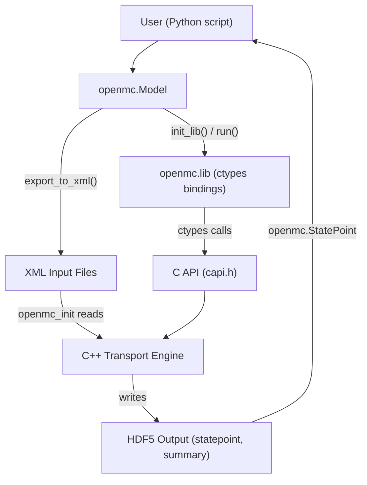

### Entry Points

There are two ways to drive an OpenMC simulation:

1. **Standalone executable** — `src/main.cpp` is the traditional entry point. It calls `openmc_init`, dispatches to `openmc_run` (or `openmc_run_random_ray`, `openmc_plot_geometry`, etc.) based on `settings::run_mode`, then calls `openmc_finalize`.

2. **Python in-process API** — `openmc.lib` loads `libopenmc.so` via `ctypes` (in `openmc/lib/__init__.py`) and exposes the same C functions as Python callables. This allows users to embed OpenMC in Python workflows, inspect state between batches, or perform coupled multi-physics simulations.

### Initialization Sequence

`openmc_init` (in `src/initialize.cpp`) runs the following steps in order:

1. **MPI setup** — If compiled with `OPENMC_MPI`, sets up the MPI communicator and creates custom MPI datatypes for `SourceSite` and `CollisionTrackSite`.
2. **Command-line parsing** — Reads flags like `-n` (particles), `-e` (event-based mode), `-r` (restart file).
3. **Optional library init** — Initializes libMesh if `OPENMC_USE_LIBMESH` is enabled.
4. **XML input reading** — Calls `read_model_xml()` or falls back to `read_separate_xml_files()` to read geometry, materials, settings, tallies, and plots.
5. **Properties import** — Optionally imports physical properties (temperatures, densities) from an HDF5 properties file.

### Run Modes

Once initialized, `main.cpp` dispatches based on `settings::run_mode`:

| Mode | Function called | Purpose |
|------|----------------|---------|
| `FIXED_SOURCE` / `EIGENVALUE` (Monte Carlo) | `openmc_run()` | History- or event-based transport |
| `FIXED_SOURCE` / `EIGENVALUE` (Random Ray) | `openmc_run_random_ray()` | Deterministic-like random ray solver |
| `PLOTTING` | `openmc_plot_geometry()` | Geometry visualization |
| `PARTICLE` | `run_particle_restart()` | Replay a single particle history |
| `VOLUME` | `openmc_calculate_volumes()` | Stochastic volume calculation |

### C API Layer (`capi.h`)

`include/openmc/capi.h` declares all symbols exposed as a stable C API using `extern "C"` linkage. These functions cover:
- Lifecycle: `openmc_init`, `openmc_run`, `openmc_finalize`, `openmc_reset`, `openmc_hard_reset`
- Geometry queries: `openmc_find_cell`, `openmc_cell_get_temperature`, `openmc_cell_set_temperature`
- Tally access: `openmc_global_tallies`, `openmc_get_keff`
- Simulation control: `openmc_simulation_init`, `openmc_next_batch`, `openmc_simulation_finalize`

Return values are `int` error codes. A non-zero return typically means an error message was written to `openmc_err_msg`.

### Python Bindings (`openmc.lib`)

`openmc/lib/__init__.py` loads `libopenmc.so` into a module-level `_dll` (a `ctypes.CDLL` object). Each submodule (`core.py`, `cell.py`, `material.py`, etc.) then configures argument types and return types on `_dll` symbols and wraps them in Python functions.

```python
# Pattern used throughout openmc/lib/core.py
_dll.openmc_run.restype = c_int
_dll.openmc_run.errcheck = _error_handler

def run(output=True):
    with quiet_dll(output):
        _dll.openmc_run()
```

The `iter_batches()` generator is especially useful for coupled simulations: it calls `openmc_next_batch()` in a loop, yielding control back to Python between each batch so tally data can be inspected or boundary conditions updated.

### Python Model API (`openmc.Model`)

`openmc/model/model.py` defines the `Model` class, which groups `Geometry`, `Materials`, `Settings`, `Tallies`, and `Plots` into a single object. The two primary workflows are:

- **File-based**: `model.export_to_xml()` writes XML input files, then the `openmc` executable (or `openmc.run()`) reads them.
- **In-process**: `model.init_lib()` exports XML internally, calls `openmc.lib.init()`, and keeps the C++ state loaded in memory. `model.finalize_lib()` calls `openmc.lib.finalize()` to free memory.

### Finalization and Memory

`openmc_finalize` (in `src/finalize.cpp`) calls `openmc_simulation_finalize` if a simulation was started, then `openmc_reset` to clear tally results, `reset_timers`, and finally `free_memory()`. The `free_memory()` function sequentially calls per-subsystem cleanup routines for geometry, surfaces, materials, tallies, mesh, weight windows, CMFD, and event queues, ensuring all global `vector&lt;unique_ptr&lt;T&gt;&gt;` containers are cleared.

### Build System

`CMakeLists.txt` uses CMake 3.16+ to configure both the standalone executable and the shared library. Key compile-time options include:

- `OPENMC_USE_OPENMP` (default ON) — shared-memory parallelism
- `OPENMC_USE_MPI` (default OFF) — distributed-memory parallelism
- `OPENMC_USE_DAGMC` (default OFF) — CAD geometry via DAGMC
- `OPENMC_USE_LIBMESH` (default OFF) — unstructured mesh tallies
- `OPENMC_ENABLE_STRICT_FP` (default OFF) — reproducible floating-point for testing

## Geometry System (CSG & DAGMC)

<details>
<summary>Relevant Files</summary>

<ul>
<li><code>openmc/geometry.py</code></li>
<li><code>openmc/surface.py</code></li>
<li><code>openmc/cell.py</code></li>
<li><code>openmc/universe.py</code></li>
<li><code>openmc/lattice.py</code></li>
<li><code>openmc/region.py</code></li>
<li><code>openmc/dagmc.py</code></li>
<li><code>src/geometry.cpp</code></li>
<li><code>src/surface.cpp</code></li>
<li><code>src/cell.cpp</code></li>
<li><code>src/universe.cpp</code></li>
<li><code>src/lattice.cpp</code></li>
<li><code>src/dagmc.cpp</code></li>
<li><code>include/openmc/geometry.h</code></li>
</ul>

</details>

OpenMC supports two geometry backends that share the same particle-tracking interface: **CSG** (Constructive Solid Geometry) and **DAGMC** (Direct Accelerated Geometry Monte Carlo for CAD models). Both are represented as `Universe` subclasses, allowing them to be freely mixed within a single model.

### Object Hierarchy

The geometry is built from five primary abstractions layered into a tree:

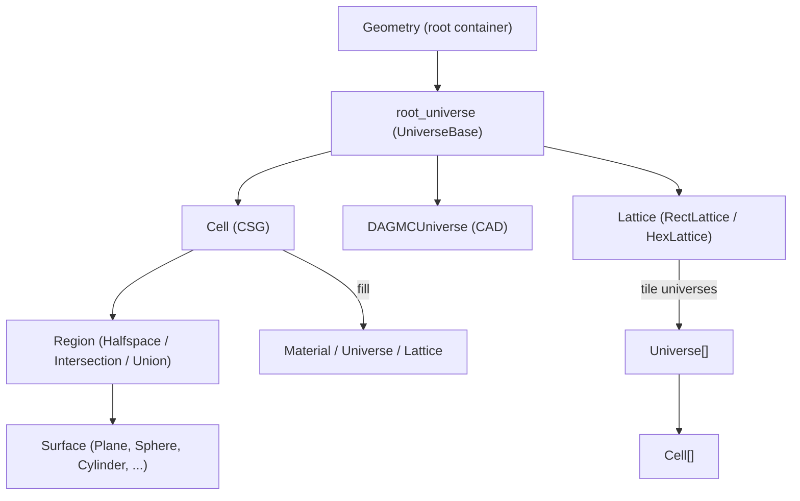

- **`Geometry`** — top-level container; owns `root_universe` and manages XML I/O and surface deduplication.
- **`Surface`** — an implicit quadratic equation (e.g., sphere, plane, cylinder). Applying `+` or `-` yields a `Halfspace` region.
- **`Region`** — boolean combination of half-spaces using `&` (Intersection), `|` (Union), and `~` (Complement).
- **`Cell`** — a bounded volume defined by a `Region` and filled with a `Material`, a `Universe`, a `Lattice`, or void.
- **`Universe`** — a named collection of cells; can be nested inside other cells to build complex hierarchies.
- **`Lattice`** — a regularly spaced array (`RectLattice` or `HexLattice`) where every tile is a `Universe`.

### Building CSG Geometry in Python

Surfaces are combined with Python operators to define cell regions:

```python
import openmc

# Define surfaces
inner = openmc.Sphere(r=0.5)
outer = openmc.Sphere(r=1.0, boundary_type='vacuum')

# Boolean region algebra
fuel_region = -inner           # inside the sphere
water_region = +inner & -outer # between the two spheres

# Cells
fuel_cell  = openmc.Cell(fill=fuel_material,  region=fuel_region)
water_cell = openmc.Cell(fill=water_material, region=water_region)

# Universe and geometry
universe = openmc.Universe(cells=[fuel_cell, water_cell])
geometry = openmc.Geometry(root=universe)
geometry.export_to_xml()
```

Surface boundary conditions (`vacuum`, `reflective`, `periodic`, `white`) are set via `boundary_type` on the surface object. The `albedo` property scales particle weight on reflection.

### Region Boolean Algebra

`Region` objects form an abstract syntax tree evaluated during particle tracking:

| Python expression | Region type | Containment rule |
|---|---|---|
| `-surf` / `+surf` | `Halfspace` | surface equation sign |
| `A & B` | `Intersection` | point in **all** sub-regions |
| `A \| B` | `Union` | point in **any** sub-region |
| `~A` | `Complement` | De Morgan inversion |

Regions also support `from_expression(string, surfaces)` to parse an infix expression string (e.g. `"-1 & (2 | -3)"`) using the shunting-yard algorithm.

### Lattices

`RectLattice` and `HexLattice` tile space with repeating `Universe` instances:

```python
lattice = openmc.RectLattice()
lattice.pitch = (1.26, 1.26)          # cm per tile
lattice.lower_left = (-6.3, -6.3)
lattice.universes = [[pin_u] * 10] * 10
lattice.outer = water_universe         # fills outside lattice bounds
```

`HexLattice` supports both `"x"` and `"y"` orientations for hexagonal packing. Lattices can be 2-D or 3-D.

### DAGMC (CAD Geometry)

`DAGMCUniverse` wraps an `.h5m` CAD geometry file and integrates transparently into the hierarchy:

```python
dagmc_univ = openmc.DAGMCUniverse(
    filename='model.h5m',
    auto_geom_ids=True,
    material_overrides={'mat:fuel': fuel_material}
)
geometry = openmc.Geometry(root=dagmc_univ)
```

Under the hood (`src/dagmc.cpp`), the C++ `DAGUniverse` loads the `.h5m` file through MOAB/DagMC, builds an OBB-tree acceleration structure, and exposes `find_cell()`, `distance()`, and `contains()` virtual methods that the common tracking loop calls identically to CSG cells.

### C++ Particle Tracking

The C++ core (`src/geometry.cpp`, `include/openmc/geometry.h`) tracks particles through the geometry hierarchy with two hot-path functions:

- **`exhaustive_find_cell(GeometryState&)`** — full search from the root used at particle birth or after large jumps.
- **`neighbor_list_find_cell(GeometryState&)`** — fast path on surface crossings using cached neighbor lists stored on each cell.
- **`distance_to_boundary(GeometryState&)`** — walks every coordinate level, calls the virtual `Cell::distance()` (CSG or DAGMC), also checks lattice tile boundaries.

At each coordinate level the tracker descends from universe → cell → fill, applying translation/rotation transforms for universe-filled cells along the way. The recursion terminates when a material-filled (leaf) cell is reached.

### Key Design Principles

- **Hierarchical composition**: Universes inside cells inside universes — arbitrarily deep nesting.
- **Virtual dispatch**: `Universe::find_cell()` and `Cell::distance()` are virtual, enabling CSG and DAGMC to coexist.
- **Neighbor lists**: After each surface crossing, only neighboring cells (stored on each `Cell`) are searched, dramatically reducing containment checks.
- **Distribcells**: A single `Cell` object may have multiple instances; `cell_instance_at_level()` computes a unique index for spatially varying material assignments.
- **XML round-trip**: All Python objects implement `to_xml_element()` / `from_xml_element()`, and `Geometry.export_to_xml()` writes the complete geometry description consumed by the C++ solver.

## Particle Transport & Physics

<details>
<summary>Relevant Files</summary>

<ul>
<li><code>include/openmc/particle.h</code></li>
<li><code>include/openmc/particle_data.h</code></li>
<li><code>include/openmc/physics.h</code></li>
<li><code>src/particle.cpp</code></li>
<li><code>src/particle_data.cpp</code></li>
<li><code>src/physics.cpp</code></li>
<li><code>src/physics_common.cpp</code></li>
<li><code>src/physics_mg.cpp</code></li>
<li><code>src/photon.cpp</code></li>
<li><code>src/source.cpp</code></li>
<li><code>src/event.cpp</code></li>
<li><code>src/eigenvalue.cpp</code></li>
</ul>

</details>

OpenMC simulates particle transport using a Monte Carlo method: particles are tracked individually through geometry, interacting with materials according to nuclear data cross sections. The C++ core handles two transport modes—**history-based** (default) and **event-based**—and supports neutrons, photons, electrons, and positrons.

### Particle Class Hierarchy

The `Particle` class is built on a three-level inheritance chain:

- **`GeometryState`** — tracks the particle's nested position through universes and lattices (a stack of `LocalCoord` entries, one per nesting level)
- **`ParticleData`** — extends `GeometryState` with physics state: energy, weight, cross-section caches, RNG seeds, and the secondary particle bank
- **`Particle`** — adds high-level event methods (`event_calculate_xs`, `event_advance`, `event_collide`, etc.) and lifecycle logic

This layered design keeps geometry-agnostic state separate from physics state, which also simplifies GPU offloading.

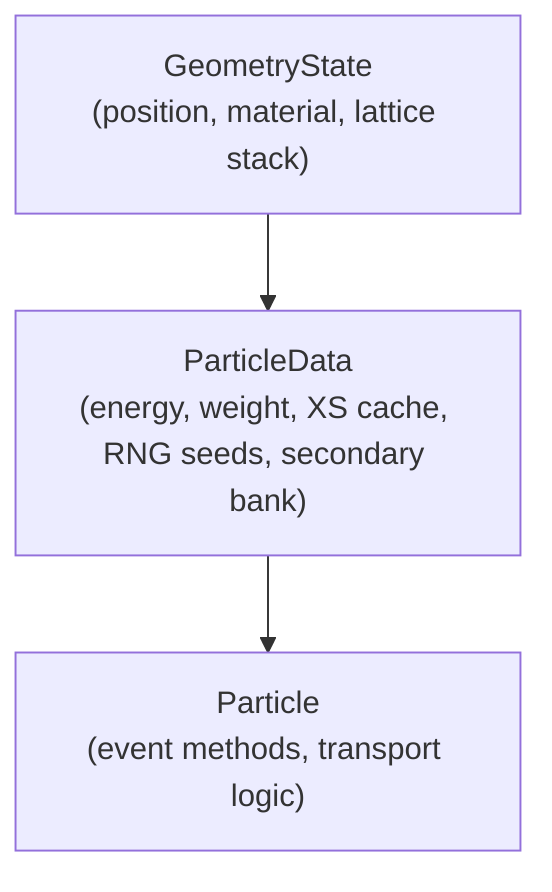

### Key Data Structures

| Structure | Purpose |
|-----------|---------|
| `LocalCoord` | Position, direction, cell/universe/lattice indices at one nesting level |
| `NuclideMicroXS` | Per-nuclide microscopic cross sections (total, absorption, fission) |
| `MacroXS` | Summed macroscopic cross sections for the current material |
| `SourceSite` | Banked particle state (position, direction, energy, weight, type) |
| `BoundaryInfo` | Distance and surface ID for the nearest boundary crossing |

Each particle carries a vector of `NuclideMicroXS` (one per nuclide in the material) and a single `MacroXS` aggregate. These caches are reused as long as the material and temperature are unchanged, avoiding redundant interpolation on the nuclear data energy grid.

### History-Based Transport Loop

The default transport mode processes one particle history completely before starting the next. The core loop in `transport_history_based_single_particle` advances a `Particle` through a sequence of events:

```cpp
while (p.alive()) {
    p.event_calculate_xs();       // 1. Look up (or reuse) cross sections
    p.event_advance();            // 2. Sample collision distance, move particle
    if (boundary_closer)
        p.event_cross_surface();  // 3a. Cross geometry boundary
    else
        p.event_collide();        // 3b. React with a nucleus
    p.event_revive_from_secondary(); // 4. Continue as a secondary if needed
}
p.event_death();                  // 5. Accumulate global tallies
```

The collision distance is sampled as `-ln(rand) / σ_total` (exponential distribution over mean free path). If the nearest surface is closer, the particle crosses it and geometry is updated; otherwise a nuclear reaction occurs.

### Collision Physics

`event_collide` dispatches to `collision()` (neutrons), `sample_photon_reaction()` (photons), or `sample_electron_reaction()` (electrons/positrons). For neutrons:

1. **Sample nuclide** — probability proportional to `σ_total × atom_density` for each nuclide in the material
2. **Fission check** — if the nuclide is fissionable, sample a fission reaction and call `create_fission_sites()` to bank prompt/delayed neutrons
3. **Secondary photons** — if photon transport is enabled, sample photon emission from inelastic reactions
4. **Absorption / survival biasing** — apply implicit capture: reduce weight by `(1 − σ_abs/σ_total)` rather than killing the particle
5. **Scattering** — sample reaction MT, outgoing energy from the appropriate distribution (S(α,β) thermal, free-gas, ACE tabulated), and a new direction
6. **Variance reduction** — apply Russian roulette or weight windows

### Fission Site Banking

In eigenvalue mode, `create_fission_sites()` determines the number of fission neutrons to bank:

```
nu_t = (weight / k_eff) × ν̄ × (σ_f / σ_total)
nu   = floor(nu_t) + Bernoulli(nu_t − floor(nu_t))
```

Each site is stored as a `SourceSite` in the shared `simulation::fission_bank`. After each generation, `synchronize_bank()` resamples these sites using uniform combing (systematic sampling) to maintain a constant source population across MPI ranks, then swaps them into `simulation::source_bank` for the next generation.

### Photon Physics

`sample_photon_reaction()` (in `src/photon.cpp`) selects among four interaction types based on per-element cross sections at the photon energy `E`:

- **Coherent (Rayleigh) scattering** — elastic scatter with form-factor-weighted angle sampling
- **Incoherent (Compton) scattering** — uses Klein-Nishina; creates a recoil electron as a secondary particle
- **Photoelectric effect** — shell-dependent electron emission followed by atomic relaxation (fluorescent photons)
- **Pair production** — creates an electron-positron pair; positron annihilation produces two 511 keV photons

### Multigroup Mode

When OpenMC is built with a multigroup cross-section library, `collision_mg()` (in `src/physics_mg.cpp`) replaces continuous-energy lookups with direct group-index access. The scatter operation samples an outgoing energy group from a matrix distribution, and `p.E()` is set to the group-average energy. The event structure and secondary banking remain identical to continuous-energy mode.

### Event-Based Transport

The alternative event-based mode (`transport_event_based` in `src/event.cpp`) batches all live particles by their next event type into shared queues:

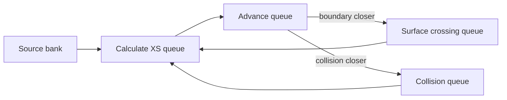

Processing each queue in an OpenMP parallel loop over many particles of the same type improves cache locality and is more GPU-friendly than the particle-by-particle history approach.

### Secondary Particle Handling

Reactions may produce secondaries stored in `p.secondary_bank()`. After a parent particle dies (weight falls to zero, or maximum event count reached), `event_revive_from_secondary()` pops the last entry from the bank and reinitializes the `Particle` from that `SourceSite`. The revived particle then continues the transport loop as if it were a new history, allowing deeply branching secondary chains to be processed without recursion.

### Source Initialization

`initialize_history()` (in `src/source.cpp`) seeds a particle from either:

- **Eigenvalue mode**: a `SourceSite` drawn from `simulation::source_bank` (the previous generation's fission bank)
- **Fixed-source mode**: a site sampled from user-defined spatial, energy, and angular distributions

RNG seeds for each particle are computed deterministically from the particle index using multiple independent streams (`N_STREAMS`), ensuring reproducibility regardless of parallelism or batch ordering.

### k-eff Estimators

OpenMC tracks three independent k-eff estimators during each generation, accumulated into `global_tallies`:

- **Tracklength**: `Σ wgt × distance × ν σ_f` — scored during `event_advance`
- **Collision**: `Σ wgt × ν σ_f / σ_total` — scored at each collision
- **Absorption**: `Σ wgt × fission fraction` — scored at absorptive events

All three are combined and MPI-reduced at the end of each generation by `calculate_generation_keff()`.

## Tally System & Scoring

<details>
<summary>Relevant Files</summary>

<ul>
<li><code>include/openmc/tallies/tally.h</code></li>
<li><code>include/openmc/tallies/filter.h</code></li>
<li><code>src/tallies/tally.cpp</code></li>
<li><code>src/tallies/tally_scoring.cpp</code></li>
<li><code>src/tallies/filter.cpp</code></li>
<li><code>openmc/tallies.py</code></li>
<li><code>openmc/filter.py</code></li>
<li><code>openmc/statepoint.py</code></li>
<li><code>src/state_point.cpp</code></li>
</ul>

</details>

The tally system is OpenMC's mechanism for recording physical quantities (flux, reaction rates, currents) during particle transport. A tally combines three ingredients: **filters** that define which phase-space regions to bin, **scores** that name the quantity to accumulate, and **nuclides** that restrict scoring to a subset of isotopes.

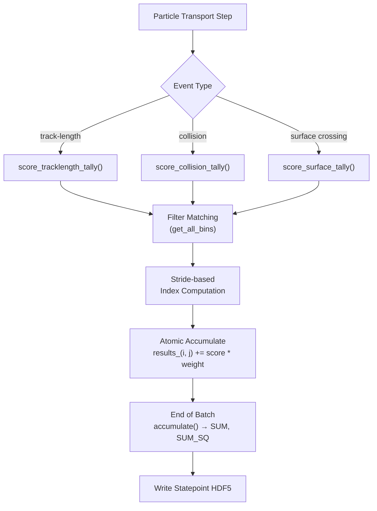

### Tally Data Structure

The C++ `Tally` class (defined in `include/openmc/tallies/tally.h`) stores:

- **`scores_`** — integer codes for quantities to record (e.g., `SCORE_FLUX`, `SCORE_TOTAL`, `SCORE_NU_FISSION`, or specific MT numbers)
- **`nuclides_`** — indices into the global nuclide list; `-1` means "sum over all nuclides in the material"
- **`filters_`** — ordered list of filter indices into `model::tally_filters`
- **`strides_`** — stride per filter dimension for linearizing multi-dimensional bins
- **`results_`** — 2D tensor of shape `[n_filter_bins, n_scores]` storing `VALUE`, `SUM`, and `SUM_SQ` moments
- **`estimator_`** — one of `TRACKLENGTH`, `COLLISION`, or `ANALOG`

The Python `Tally` class in `openmc/tallies.py` mirrors this structure. It inherits from `IDManagerMixin` for automatic ID assignment and exposes lazy-loaded statistical properties (`mean`, `std_dev`, `sum`, `sum_sq`) once a statepoint has been loaded.

### Filters

Filters partition phase space into discrete bins. Every filter subclass implements:

```cpp
virtual void get_all_bins(const Particle& p, TallyEstimator estimator,
                          FilterMatch& match) const = 0;
```

`FilterMatch` collects the matching `bins_` and associated `weights_` for one particle state. Weights are normally `1.0` but can differ for probability-weighted filters (e.g., `LegendreFilter`, `EnergyFunctionFilter`).

**Commonly used filter types:**

| Category | Examples |
|---|---|
| Geometry | `CellFilter`, `MaterialFilter`, `UniverseFilter`, `SurfaceFilter` |
| Energy | `EnergyFilter`, `EnergyoutFilter` |
| Mesh | `MeshFilter`, `MeshSurfaceFilter` |
| Angular | `MuFilter`, `PolarFilter`, `AzimuthalFilter` |
| Expansion | `LegendreFilter`, `SphericalHarmonicsFilter`, `ZernikeFilter` |
| Other | `TimeFilter`, `DelayedGroupFilter`, `ParticleFilter`, `CollisionFilter` |

Multiple filters on a single tally create a **cross-product** of bins. The total filter bin count equals the product of each filter's `n_bins`. Stride-based indexing maps a combination `(b0, b1, …)` to a single flat index:

```
filter_index = b0 * stride[0] + b1 * stride[1] + …
```

### Scoring During Transport

Three distinct scoring paths are dispatched at runtime based on the tally estimator:

1. **Track-length** — called after every geometry step. Flux estimate: `weight × distance`.
2. **Collision** — called at every collision site. Flux estimate: `weight / Σ_total`.
3. **Analog** — called when actual physical events occur (fission, absorption). Scored directly from sampled outcomes.

For surface tallies, `score_surface_tally()` is called on each crossing. Results are updated atomically using `#pragma omp atomic` so multiple OpenMP threads can score concurrently without locks.

The inner loop over each active tally iterates a `FilterBinIter` that skips zero-weight combinations:

```cpp
for (auto [filter_index, filter_weight] : FilterBinIter(tally, p)) {
    for (auto i_nuclide : tally.nuclides_) {
        for (auto score_bin : tally.scores_) {
            double score = compute_score(p, score_bin, i_nuclide, ...);
            tally.results_(filter_index, score_bin_idx) += score * filter_weight;
        }
    }
}
```

### Batch Accumulation and Statistics

At the end of each batch, `Tally::accumulate()` normalizes the per-batch `VALUE` accumulator and folds it into running statistics:

```
SUM    += val
SUM_SQ += val²
VALUE   = 0   (reset for next batch)
```

When `higher_moments_` is enabled, `SUM_THIRD` and `SUM_FOURTH` are also tracked for variance-of-variance (`vov`) estimation.

The mean and standard deviation are derived post-run:

```
mean    = SUM / n_realizations
std_dev = sqrt((SUM_SQ/n - mean²) / (n - 1))
```

### Statepoint Output and Python Post-processing

After the simulation, `src/state_point.cpp` writes tally results to an HDF5 statepoint file under `/tallies/tally {id}/`. The `openmc.StatePoint` class reads these back:

```python
import openmc

sp = openmc.StatePoint("statepoint.10.h5")
tally = sp.tallies[1]

# Results array shape: (filter_bins, nuclides, scores)
flux_mean = tally.get_values(scores=["flux"], value="mean")
flux_unc  = tally.get_values(scores=["flux"], value="std_dev")
```

Filters are reconstructed from HDF5 via `Filter.from_hdf5()`, preserving bin edges, IDs, and types. The flat results tensor is reshaped to `(n_filter_bins, n_nuclides, n_scores)` for convenient slicing and pandas-based DataFrame export via `tally.get_pandas_dataframe()`.

### Global Registry

All tallies and filters are owned by global collections in the `model` namespace:

- `model::tallies` — `vector<unique_ptr<Tally>>`
- `model::tally_filters` — `vector<unique_ptr<Filter>>`
- `model::active_tracklength_tallies`, `model::active_collision_tallies`, etc. — index lists rebuilt each batch to avoid scanning inactive tallies during transport

## Nuclear Data Processing

<details>
<summary>Relevant Files</summary>

<ul>
<li><code>openmc/data/__init__.py</code></li>
<li><code>openmc/data/neutron.py</code></li>
<li><code>openmc/data/photon.py</code></li>
<li><code>openmc/data/reaction.py</code></li>
<li><code>openmc/data/endf.py</code></li>
<li><code>openmc/data/ace.py</code></li>
<li><code>openmc/data/library.py</code></li>
<li><code>openmc/data/multipole.py</code></li>
<li><code>src/nuclide.cpp</code></li>
<li><code>src/cross_sections.cpp</code></li>
<li><code>src/wmp.cpp</code></li>
<li><code>include/openmc/nuclide.h</code></li>
</ul>

</details>

The `openmc/data` module handles reading, converting, and managing nuclear cross-section data. It supports multiple input formats and exports them to OpenMC's native HDF5 layout, which is then loaded by the C++ transport engine at runtime.

### Supported Data Formats

OpenMC ingests nuclear data from three primary formats:

- **ENDF/B** — Raw evaluated nuclear data from NNDC. Processed by NJOY into ACE files before use.
- **ACE** — Compact tabular format used by MCNP and Serpent. The Python API can read ACE tables directly and convert them.
- **HDF5** — OpenMC's native format (version 3.0). All data is ultimately stored here for fast runtime access.
- **Windowed Multipole (WMP)** — An optional compact resonance representation enabling on-the-fly Doppler broadening without pre-processed temperature grids.

### Data Processing Pipeline

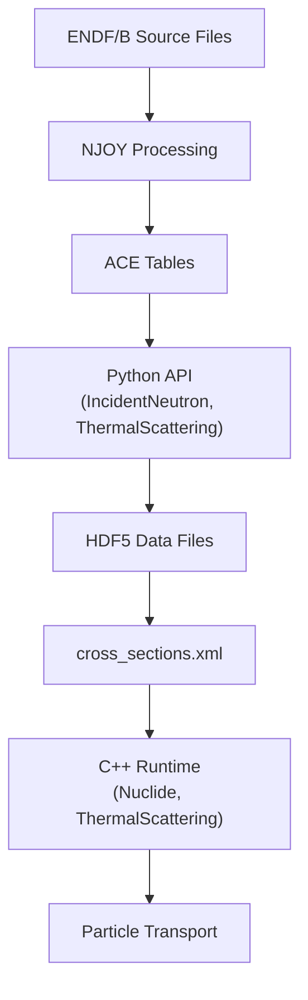

The `openmc.data.njoy` submodule wraps NJOY calls (`make_ace`, `make_pendf`, `make_ace_thermal`) to automate this conversion. Once HDF5 files exist, they are indexed by a `cross_sections.xml` file managed by `DataLibrary`.

### Key Python Classes

#### IncidentNeutron

`IncidentNeutron` (`openmc/data/neutron.py`) is the central class for continuous-energy neutron data. It holds:

- `reactions` — a dict mapping ENDF MT numbers to `Reaction` objects
- `energy` — temperature-dependent energy grids
- `kTs` — list of temperatures in eV
- `resonances`, `urr` — resolved/unresolved resonance data

```python
import openmc.data

nuc = openmc.data.IncidentNeutron.from_ace('U235.ace')
nuc.export_to_hdf5('U235.h5')

# Or read from an existing HDF5 file
nuc = openmc.data.IncidentNeutron.from_hdf5('U235.h5')
print(nuc[18])  # MT=18 fission reaction
```

#### Reaction and Product

Each `Reaction` object (in `openmc/data/reaction.py`) wraps a single ENDF reaction channel:

- `xs` — dict of `Tabulated1D` cross sections keyed by temperature string (e.g., `"294K"`)
- `products` — list of `Product` objects describing secondary particle distributions
- `mt` — ENDF MT number; `q_value` — reaction Q-value
- `redundant` — flag for reactions defined as sums of others (e.g., MT=3 = sum of inelastic channels)

#### DataLibrary

`DataLibrary` (`openmc/data/library.py`) manages the `cross_sections.xml` index file. It maps nuclide names to HDF5 file paths and is the interface between Python model setup and the C++ loader.

```python
lib = openmc.data.DataLibrary()
lib.register_file('U235.h5')
lib.register_file('lwtr.h5')   # thermal scattering for light water
lib.export_to_xml('cross_sections.xml')
```

### Windowed Multipole (WMP) Method

WMP (`openmc/data/multipole.py`, `src/wmp.cpp`) enables on-the-fly Doppler broadening using a pole-residue representation of resonances. Instead of storing cross sections at many pre-broadened temperatures, poles and residues are stored once and evaluated analytically at any temperature using the Faddeeva function.

The energy axis is divided into windows (equally spaced in `sqrt(E)`). Within each window, only the nearby poles contribute; far-away resonances are captured by a polynomial curvefit. This keeps evaluation fast even for heavy nuclides with thousands of resonances.

```python
wmp = openmc.data.WindowedMultipole.from_hdf5('U238_wmp.h5')
# Evaluate elastic, absorption, fission XS at 1 eV, 900 K
elastic, absorption, fission = wmp(1.0, 900.0)
```

### HDF5 File Layout

OpenMC's HDF5 format is hierarchical. For a neutron data file the top-level groups are:

```
U235.h5
├── filetype  "data_neutron"
├── version   [3, 0]
└── U235/
    ├── Z, A, metastable, atomic_weight_ratio
    ├── kTs/          ← temperatures in eV
    ├── energy/       ← energy grids per temperature
    ├── reactions/
    │   ├── reaction_002/  (MT=2 elastic)
    │   ├── reaction_018/  (MT=18 fission)
    │   └── ...
    ├── urr/          ← unresolved resonance probability tables
    └── fission_energy_release/
```

### C++ Runtime: Nuclide and Cross Section Lookup

At runtime the C++ `Nuclide` class (`include/openmc/nuclide.h`, `src/nuclide.cpp`) loads an HDF5 file and stores:

- `grid_` — energy grids per temperature
- `xs_` — 3D tensor (temperature × energy point × reaction type)
- `multipole_` — optional `WindowedMultipole` for on-the-fly broadening
- `urr_data_` — probability tables for the unresolved resonance region

During transport, `Material::calculate_xs` iterates over each nuclide and calls into `Nuclide::calculate_xs`. That function checks whether WMP data is available and, if so, evaluates it; otherwise it performs log-binary search plus linear interpolation on the stored grid. Thermal S(α,β) corrections are applied on top when applicable.

### Photon Data

`IncidentPhoton` (`openmc/data/photon.py`) follows the same design pattern as `IncidentNeutron`. It covers photoelectric (per subshell, MT 534+), Compton scattering, and pair production. Pre-computed Compton profiles and bremsstrahlung data are bundled as HDF5 resources inside the package.

## Depletion & Burnup

<details>
<summary>Relevant Files</summary>

<ul>
<li><code>openmc/deplete/__init__.py</code></li>
<li><code>openmc/deplete/openmc_operator.py</code></li>
<li><code>openmc/deplete/coupled_operator.py</code></li>
<li><code>openmc/deplete/independent_operator.py</code></li>
<li><code>openmc/deplete/integrators.py</code></li>
<li><code>openmc/deplete/chain.py</code></li>
<li><code>openmc/deplete/atom_number.py</code></li>
<li><code>openmc/deplete/results.py</code></li>
<li><code>openmc/deplete/cram.py</code></li>
<li><code>openmc/deplete/transfer_rates.py</code></li>
</ul>

</details>

The `openmc.deplete` module implements burnup and radioactive decay calculations. It evolves material compositions over time by solving the Bateman equations — a coupled system of ODEs describing how nuclide populations change due to neutron reactions and radioactive decay.

### Architecture Overview

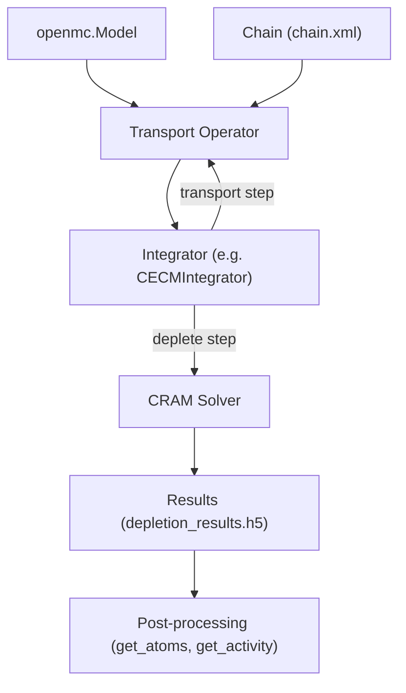

The key design separates **what** to simulate (the operator) from **how** to integrate over time (the integrator). This makes it easy to swap integration strategies without changing the physics model.

### Transport Operators

Two concrete operators implement `OpenMCOperator` (which itself extends `TransportOperator`):

- **`CoupledOperator`** — Runs full Monte Carlo transport at each depletion step. It uses OpenMC's C API in-memory to read tallied reaction rates and update material number densities, avoiding filesystem I/O between steps. This is the standard choice for coupled neutronics-depletion.

- **`IndependentOperator`** — Accepts pre-computed multigroup fluxes and microscopic cross sections (`MicroXS` objects). No transport solve occurs during depletion. Useful for parametric burnup studies or decay-only calculations (pass an empty `MicroXS`).

```python
import openmc
import openmc.deplete

model = openmc.Model(geometry, materials, settings)
operator = openmc.deplete.CoupledOperator(model, chain_file="chain.xml")

# Or transport-independent:
operator = openmc.deplete.IndependentOperator(
    materials, fluxes, micros, chain_file="chain.xml"
)
```

### Depletion Chain

The `Chain` class reads an XML file describing the nuclear transmutation network: decay modes, reaction types (capture, fission, etc.), fission product yields, and decay constants. At runtime the chain is reduced to only the nuclides present in the model, which keeps the Bateman matrix sparse and tractable.

The chain file path is set globally via `openmc.config['chain_file']` or passed explicitly to the operator.

### Time Integration

An integrator object drives the outer time loop. Each step it calls the operator for reaction rates, then delegates to the CRAM solver. Available integrators in `openmc.deplete.integrators`:

| Class | Order | Notes |
|---|---|---|
| `PredictorIntegrator` | 1st | Simplest, fastest |
| `CECMIntegrator` | 2nd | CE/CM predictor-corrector, common default |
| `CELIIntegrator` | 2nd | CE/LI CFQ4 corrector |
| `LEQIIntegrator` | 2nd | LE/QI with quadratic interpolation |
| `CF4Integrator` | 4th | Commutator-free Lie algorithm |
| `EPCRK4Integrator` | 4th | Extended predictor-corrector RK4 |
| `SICELIIntegrator` | 2nd | Stochastic implicit CE/LI |
| `SILEQIIntegrator` | 2nd | Stochastic implicit LE/QI |

SI (Stochastic Implicit) variants iterate the corrector step multiple times to reduce Monte Carlo noise bias, at the cost of additional transport solves.

```python
# Deplete over 3 cycles of 30 days at 1 GW
integrator = openmc.deplete.CECMIntegrator(
    operator,
    timesteps=[30, 30, 30],
    power=1e9,
    timestep_units="d"
)
integrator.integrate()
```

Timesteps can be specified in seconds (`"s"`), minutes (`"min"`), hours (`"h"`), days (`"d"`), years (`"a"`), or burnup (`"MWd/kg"`).

### CRAM Solver

The Chebyshev Rational Approximation Method (CRAM) solves `n(t) = exp(A·t) n₀` for each material independently. The sparse matrix `A` encodes all transmutation and decay paths from the depletion chain. Two accuracy levels are provided:

- **`CRAM16`** / **`Cram16Solver`** — 16th-order approximation
- **`CRAM48`** / **`Cram48Solver`** — 48th-order, higher accuracy for stiff systems

`IPFCramSolver` implements incomplete partial factorization (IPF), reusing LU decompositions across substeps for improved accuracy at modest extra cost.

Materials are depleted in parallel using Python's multiprocessing pool (`openmc/deplete/pool.py`), with MPI-aware distribution of materials across ranks.

### Atom Number Tracking

`AtomNumber` is an internal 2D array indexed by `(material_id, nuclide_name)` that stores total atom counts per material. It provides string or integer indexing and converts between atom counts and atom densities using stored material volumes.

### Results & Post-Processing

After each depletion step, a `StepResult` is appended and the full list is serialized to `depletion_results.h5`. The `Results` class (a list subclass) loads this file and provides high-level accessors:

```python
results = openmc.deplete.Results("depletion_results.h5")

# Atom count of Xe135 in material "1" over time
times, atoms = results.get_atoms("1", "Xe135", time_units="d")

# Volumetric activity over time
times, activity = results.get_activity("1", units="Bq/cm3")

# Reconstruct the material composition at a given step
mat = results[-1].get_material("1")
```

### Transfer Rates (Reprocessing)

`TransferRates` and `ExternalSourceRates` (in `transfer_rates.py`) extend the depletion equations with additional source/sink terms, enabling online fuel reprocessing or feed simulations — for example modeling continuous extraction of fission products or feed of fresh fuel in a molten-salt reactor. These are added to the operator before integration:

```python
transfer = openmc.deplete.TransferRates(operator, model)
transfer.set_transfer_rate("mat_fuel", ["Xe135", "Kr85"], 1e-5, "1/s")
```

## Random Ray Solver

<details>
<summary>Relevant Files</summary>

<ul>
<li><code>src/random_ray/random_ray.cpp</code></li>
<li><code>src/random_ray/random_ray_simulation.cpp</code></li>
<li><code>src/random_ray/flat_source_domain.cpp</code></li>
<li><code>src/random_ray/linear_source_domain.cpp</code></li>
<li><code>src/random_ray/source_region.cpp</code></li>
<li><code>include/openmc/random_ray/random_ray.h</code></li>
<li><code>include/openmc/random_ray/flat_source_domain.h</code></li>
</ul>

</details>

The Random Ray solver is an alternative to traditional Monte Carlo particle transport. It is a **hybrid deterministic-stochastic** method that uses stochastic ray tracing to solve the multigroup linear transport equation via power iteration. Instead of tracking probabilistic particle histories, it sweeps rays through the geometry and accumulates flux contributions to spatially-discretized **Flat Source Regions (FSRs)** — making it faster than Monte Carlo for many reactor physics problems at the cost of introducing geometric discretization error.

### Architecture Overview

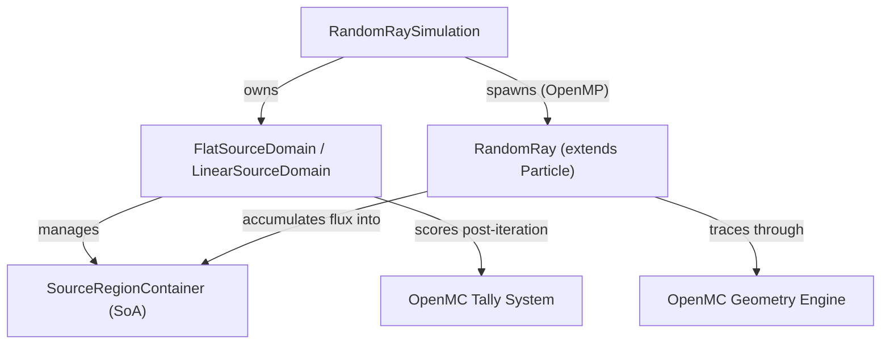

The main classes and their responsibilities are:

- **`RandomRaySimulation`** — top-level orchestrator; runs the power iteration loop and coordinates all phases per batch
- **`FlatSourceDomain`** — manages FSRs, stores cross-section and flux data, computes sources, normalizes volumes, and scores tallies
- **`LinearSourceDomain`** — extends `FlatSourceDomain` with linear flux moment tracking for higher-order source representation
- **`RandomRay`** — extends `Particle` to trace a single ray through geometry, attenuating angular flux segment by segment

### Power Iteration Loop

Each simulation batch follows this sequence inside `RandomRaySimulation::simulate()`:

1. **Source update** — Compute fission and scattering sources from the previous iteration's scalar flux (`update_all_neutron_sources`).
2. **Batch reset** — Zero out per-iteration accumulators: `scalar_flux_new`, flux moments, and volumes.
3. **Ray transport** (OpenMP parallel) — Each ray is initialized, traced, and accumulates delta flux contributions to FSRs.
4. **Finalize discovered regions** — Dynamically discovered FSRs (e.g., mesh subdivisions) are merged.
5. **Normalize flux and volumes** — Divide accumulated flux by estimated FSR volumes.
6. **Eigenvalue update** — Recompute k-eff from fission rate ratio.
7. **Tally scoring** (active batches only) — FSR fluxes are scored to OpenMC tallies.
8. **Flux swap** — `phi_old ← phi_new` to prepare for the next iteration.

### Ray Transport and Flux Attenuation

Each `RandomRay` samples a starting position and isotropic direction from the configured ray source, then advances through the geometry using OpenMC's `Particle` geometry-tracking machinery. For each segment of length `d` through a homogeneous FSR, the flux is attenuated using the Method of Characteristics (MOC) formula:

```cpp
// Flat source attenuation (per energy group g)
double tau = sigma_t * distance;
double exponential = 1.0 - std::exp(-tau);  // fast Remez approximation used
double delta_psi = (psi_incoming - source[g]) * exponential;
psi_outgoing = psi_incoming - delta_psi;
// Accumulate to scalar_flux_new[g] if in active phase
```

For the **Linear Source** mode (`LinearSourceDomain`), source gradients within each FSR are tracked and used to compute spatially-varying source corrections along the ray, improving accuracy in coarsely discretized geometries at the cost of storing flux moment matrices per region.

### Source Region Storage

FSR data is stored in a **Structure-of-Arrays (SoA)** layout inside `SourceRegionContainer` for cache efficiency and OpenMP vectorization. Each region tracks:

- `scalar_flux_old` / `scalar_flux_new` — flux from the previous and current iteration
- `source_` — flat source (scattering + fission + optional external)
- `volume_` and `volume_t_` — current and time-averaged volume estimate
- `centroid_` and `mom_matrix_` — spatial moment data (linear mode only)
- `material_`, `temp_idx_` — for cross-section lookup

Thread-safe accumulation during ray transport uses a per-region OpenMP lock so concurrent rays can safely update the same FSR.

### Configuration Options

| Option | Values | Description |
|--------|--------|-------------|
| Source shape | `FLAT`, `LINEAR`, `LINEAR_XY` | Flux representation within FSRs |
| Ray sampling | `PRNG`, `HALTON`, `S2` | Random or low-discrepancy sampling |
| Volume estimator | `NAIVE`, `SIMULATION_AVERAGED`, `HYBRID` | How FSR volumes are estimated |
| Inactive distance | float | "Dead zone" before rays start scoring |
| Active distance | float | Length over which rays contribute |

The `HYBRID` volume estimator (default) uses simulation-averaged volumes for stability in most regions, but falls back to per-iteration naive volumes when external sources are present to avoid biasing the source.

### Special Features

**Adjoint simulation:** A forward flux solve is followed by a reverse solve using transposed scattering matrices and importance-weighted sources. This enables FW-CADIS variance reduction for Monte Carlo simulations.

**Transport stabilization:** For multigroup cross-sections with negative diagonal in-group scattering (common in transport-corrected data), an optional stabilization factor `rho` prevents unphysical flux oscillations.

**Exponential approximations:** The inner transport loop avoids repeated `std::exp()` calls using rational Remez polynomial approximations (`cjosey_exponential`, `exponentialG`, `exponentialG2`), achieving ~2×10⁻⁷ relative error while significantly improving performance.

**Mesh subdivision:** An overlay mesh can further subdivide FSRs for finer spatial resolution without modifying the CSG geometry, with subdivided regions discovered dynamically during transport.

## Python API & Model Building

<details>
<summary>Relevant Files</summary>

<ul>
<li><code>openmc/model/model.py</code></li>
<li><code>openmc/material.py</code></li>
<li><code>openmc/source.py</code></li>
<li><code>openmc/mesh.py</code></li>
<li><code>openmc/mixin.py</code></li>
<li><code>openmc/checkvalue.py</code></li>
<li><code>openmc/examples.py</code></li>
<li><code>openmc/lib/core.py</code></li>
<li><code>openmc/lib/material.py</code></li>
<li><code>openmc/lib/cell.py</code></li>
</ul>

</details>

The OpenMC Python API provides a high-level interface for building nuclear transport models, running simulations, and post-processing results. All user-facing functionality lives in the `openmc/` package, while the `openmc/lib/` subpackage provides low-level ctypes bindings to the compiled C++ library.

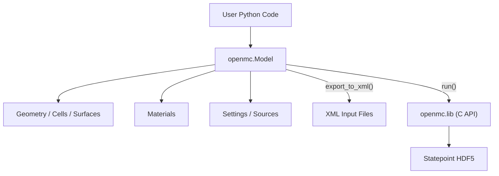

### The `Model` Class

`openmc.Model` is the central container for a complete simulation. It holds geometry, materials, settings, tallies, and plots as a single unit and coordinates export and execution.

```python
import openmc

model = openmc.Model()
model.geometry  = my_geometry
model.materials = my_materials
model.settings  = my_settings
model.tallies   = my_tallies

# Export all input files at once
model.export_to_xml()

# Run via subprocess (CLI)
statepoint_path = model.run()

# Or run in-process via C API (faster, allows batch-level control)
model.init_lib()
model.run()
model.finalize_lib()
```

Key `Model` methods:

- `export_to_xml(directory)` — writes `geometry.xml`, `materials.xml`, `settings.xml`, etc.
- `export_to_model_xml(path)` — writes everything into a single consolidated XML file.
- `from_xml()` / `from_model_xml(path)` — reconstruct a `Model` from saved XML files.
- `deplete(...)` — orchestrates burnup calculations using `openmc.deplete`.
- `calculate_volumes(...)` — runs a stochastic volume calculation.

### Defining Materials

`openmc.Material` represents a physical composition. It inherits from `IDManagerMixin`, so IDs are auto-assigned unless specified explicitly.

```python
uo2 = openmc.Material(name='UO2 Fuel')
uo2.add_nuclide('U235', 0.03, 'ao')   # 3 atom% U-235
uo2.add_nuclide('U238', 0.97, 'ao')
uo2.add_nuclide('O16',  2.00, 'ao')
uo2.set_density('g/cm3', 10.29769)
uo2.add_s_alpha_beta('c_O_in_UO2')    # thermal scattering

water = openmc.Material(name='H2O')
water.add_element('H', 2.0, 'ao')
water.add_element('O', 1.0, 'ao')
water.set_density('g/cm3', 0.7)
```

Supported density units include `'g/cm3'`, `'kg/m3'`, `'atom/b-cm'`, `'atom/cm3'`, and `'sum'` (auto-calculated). The `depletable=True` flag marks a material for tracking in burnup calculations.

### ID Management with `IDManagerMixin`

All geometry objects (`Cell`, `Surface`, `Material`, `Universe`, `Tally`) use `IDManagerMixin` defined in `openmc/mixin.py`. This mixin auto-assigns sequential integer IDs and tracks all used IDs at the class level.

```python
m1 = openmc.Material()   # auto ID = 1
m2 = openmc.Material()   # auto ID = 2
m3 = openmc.Material(id=10)  # explicit ID 10

# Reset counters between test cases
openmc.reset_auto_ids()
```

If a duplicate ID is provided, an `IDWarning` is issued (not an exception), so existing workflows are not broken.

### Input Validation with `checkvalue`

Every property setter in the Python API calls functions from `openmc/checkvalue.py` before storing a value. This provides uniform, descriptive error messages across the entire codebase.

```python
import openmc.checkvalue as cv

# Type check
cv.check_type('temperature', temp, float)

# Bounds check
cv.check_greater_than('density', density, 0.0, equality=False)

# Whitelist check
cv.check_value('percent_type', ptype, {'ao', 'wo'})

# Length check
cv.check_length('xyz', position, 3, 3)
```

### Defining Particle Sources

`openmc.IndependentSource` (and its siblings `FileSource`, `CompiledSource`, `MeshSource`) define where and how source particles are sampled. Sources use distributions from `openmc.stats` for spatial, angular, and energy sampling.

```python
source = openmc.IndependentSource()
source.space  = openmc.stats.Box([-10, -10, -10], [10, 10, 10])
source.angle  = openmc.stats.Isotropic()
source.energy = openmc.stats.Discrete([2.0e6], [1.0])  # 2 MeV mono-energetic
source.particle = 'neutron'

settings = openmc.Settings()
settings.source = [source]
settings.batches = 50
settings.particles = 10_000
```

Constraints (e.g., `fissionable=True`, `domains=[cell]`) can further restrict where source particles are accepted.

### C API Bindings (`openmc.lib`)

The `openmc/lib/` subpackage wraps the compiled C++ library via Python's `ctypes`. This enables in-process control of the simulation — running individual batches, reading/modifying material properties at runtime, or coupling to external depletion codes.

```python
import openmc.lib

openmc.lib.init()                  # initialize the C library
openmc.lib.simulation_init()       # prepare particle banks

for _ in range(settings.batches):
    openmc.lib.next_batch()        # run one batch

openmc.lib.simulation_finalize()
k, unc = openmc.lib.keff()
openmc.lib.finalize()
```

Runtime objects in `openmc.lib` mirror their Python counterparts:

- `openmc.lib.materials[id]` — a live `Material` object backed by C++ memory.
- `openmc.lib.cells[id]` — a live `Cell` with per-instance temperature/density control.
- Properties set on these objects take effect immediately in the running simulation.

### Pre-built Example Models

`openmc/examples.py` provides ready-to-run `Model` instances useful for testing and learning:

- `openmc.examples.pwr_pin_cell()` — single fuel pin in borated water.
- `openmc.examples.pwr_assembly()` — 17×17 PWR fuel assembly lattice.
- `openmc.examples.pwr_core()` — full 241-assembly core benchmark.
- `openmc.examples.slab_mg()` — 1-D multi-group slab.
- `openmc.examples.jezebel()` — bare Pu-239 sphere critical assembly.

```python
model = openmc.examples.pwr_pin_cell()
model.settings.particles = 5000
sp_path = model.run()
```

All examples use low particle counts by default so they run quickly in tests. They are the recommended starting point for regression test fixtures.

## Testing Infrastructure

<details>
<summary>Relevant Files</summary>

<ul>
<li><code>tests/testing_harness.py</code></li>
<li><code>tests/conftest.py</code></li>
<li><code>tests/unit_tests/conftest.py</code></li>
<li><code>tests/regression_tests/__init__.py</code></li>
<li><code>tests/unit_tests/</code></li>
<li><code>tests/regression_tests/</code></li>
<li><code>pytest.ini</code></li>
<li><code>tools/ci/download-xs.sh</code></li>
</ul>

</details>

OpenMC's test suite is divided into two complementary layers: fast Python **unit tests** that validate the API in isolation, and full-simulation **regression tests** that compare outputs against known-good reference data. Both layers use pytest and share configuration infrastructure through a unified `conftest.py`.

### Test Layout

```
tests/
├── conftest.py              # Top-level pytest config, env checks, shared fixtures
├── testing_harness.py       # Regression test harness base classes
├── unit_tests/              # ~100 fast Python API tests
│   ├── conftest.py          # Shared fixtures: uo2, water, sphere_model, …
│   └── test_*.py
└── regression_tests/        # ~160 full-simulation scenarios
    ├── __init__.py          # Global config dict & depletion helpers
    └── <scenario>/
        ├── test.py
        ├── inputs_true.dat  # Hash of expected XML inputs
        └── results_true.dat # Expected k-eff / tally values
```

`pytest.ini` applies minimal global options: only files named `test*.py` are collected, class-based discovery is disabled, and `UserWarning` is silenced by default.

### Unit Tests

Unit tests live in `tests/unit_tests/` and are designed to run quickly without a full OpenMC simulation. They cover:

- **API validation** — object construction, property setters/getters, and XML round-trips (e.g., `test_material.py`, `test_cell.py`, `test_source.py`)
- **Data processing** — nuclear data parsing, depletion chain math, MGXS conversions
- **`openmc.lib` bindings** — ctypes interface exercised by calling `model.init_lib()` inside a try/finally block

Common shared fixtures defined in `tests/unit_tests/conftest.py`:

| Fixture | Scope | Description |
|---|---|---|
| `uo2` | module | UO2 material with U235 + O16 |
| `water` | module | Light water with S(α,β) binding |
| `sphere_model` | module | Minimal single-sphere fixed-source model |
| `cell_with_lattice` | function | 2×2 rectangular lattice geometry |
| `mixed_lattice_model` | function | Hex-in-rect lattice with periodic BCs |

The top-level `conftest.py` also provides:
- `run_in_tmpdir` — changes to a temporary directory for tests that create files
- `endf_data` — resolves `OPENMC_ENDF_DATA` from the environment
- `resolve_paths` — session-wide patch disabling path resolution (avoids cross-section lookups during unit tests)

### Regression Tests

Each scenario under `tests/regression_tests/<name>/` contains a `test.py` that builds an OpenMC model, runs the simulation, and verifies outputs. The `testing_harness.py` module provides the base classes that implement this workflow.

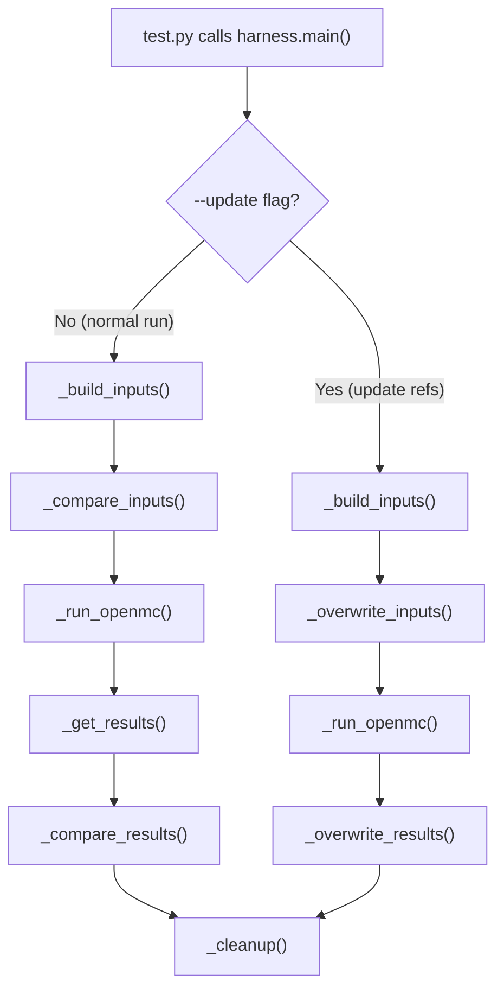

**Available harness classes** in `tests/testing_harness.py`:

| Class | Purpose |
|---|---|
| `TestHarness` | Base class; reads XML inputs, runs OpenMC, diffs `results_true.dat` |
| `HashedTestHarness` | SHA-512 hashes the results before comparing (compact reference files) |
| `PyAPITestHarness` | Builds model from Python API; also compares `inputs_true.dat` XML hash |
| `HashedPyAPITestHarness` | PyAPI variant with hashed results (most common pattern) |
| `TolerantPyAPITestHarness` | Relative-tolerance float comparison for random ray / single-precision tests |
| `WeightWindowPyAPITestHarness` | Reads `weight_windows.h5` instead of a statepoint |
| `PlotTestHarness` | Hashes PNG / voxel HDF5 plot outputs |
| `ParticleRestartTestHarness` | Runs simulation twice (initial + restart) and checks particle state |
| `CMFDTestHarness` | Verifies CMFD acceleration data (k, entropy, balance, dominance ratio) |
| `CollisionTrackTestHarness` | Compares sorted `collision_track.h5` arrays with `np.testing.assert_allclose` |

A typical regression test looks like:

```python
from openmc.examples import pwr_pin_cell
from tests.testing_harness import HashedPyAPITestHarness

def test():
    model = pwr_pin_cell()
    model.settings.particles = 1000
    harness = HashedPyAPITestHarness('statepoint.10.h5', model)
    harness.main()
```

### pytest CLI Options

The top-level `conftest.py` registers custom pytest command-line options consumed by the regression test harness:

| Option | Effect |
|---|---|
| `--exe PATH` | Path to the `openmc` executable |
| `--mpi` | Enable MPI execution with two processes |
| `--mpiexec PATH` | Override the MPI launcher (default: `mpiexec`) |
| `--update` | Regenerate `inputs_true.dat` / `results_true.dat` reference files |
| `--build-inputs` | Only build XML inputs without running |
| `--event` | Run simulation in event-based (rather than history-based) mode |

### Environment Requirements

Before running tests, the following conditions must be met:

1. **Nuclear data**: Set `OPENMC_CROSS_SECTIONS` to the NNDC HDF5 `cross_sections.xml`. The `conftest.py` checks the MD5 hash against the official NNDC dataset and warns if it differs.
2. **Strict FP build**: Rebuild with `-DOPENMC_ENABLE_STRICT_FP=on` so that floating-point optimizations don't cause results to diverge from the stored reference values.
3. **Thread count**: Set `OMP_NUM_THREADS=2` to avoid race-condition failures in OpenMP-parallel tests.

The CI download script `tools/ci/download-xs.sh` fetches both the NNDC HDF5 library (~800 MB) and the ENDF/B-VII.1 raw data, skipping downloads if the files already exist.

```bash
# Typical unit test run (no nuclear data needed for most)
pytest tests/unit_tests/

# Full regression suite
export OPENMC_CROSS_SECTIONS=$HOME/nndc_hdf5/cross_sections.xml
export OMP_NUM_THREADS=2
pytest tests/regression_tests/

# Regenerate reference files after a code change
pytest tests/regression_tests/tallies/ --update
```
