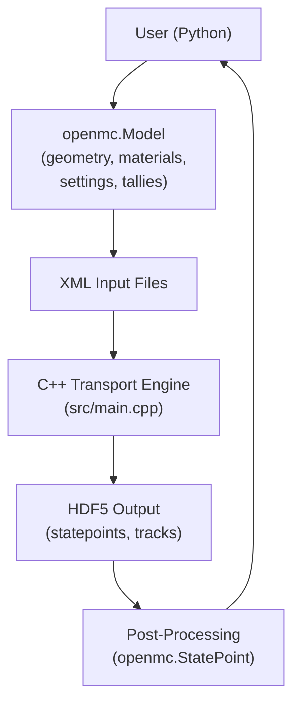
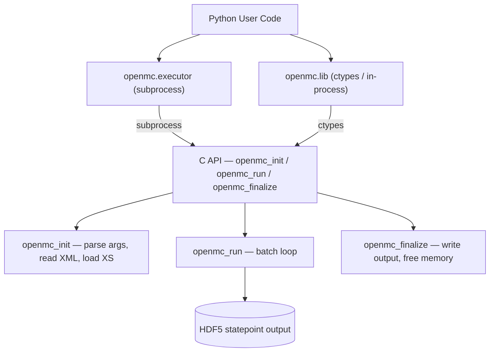
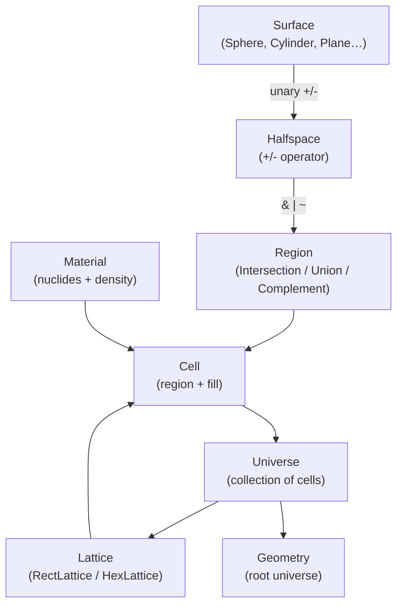
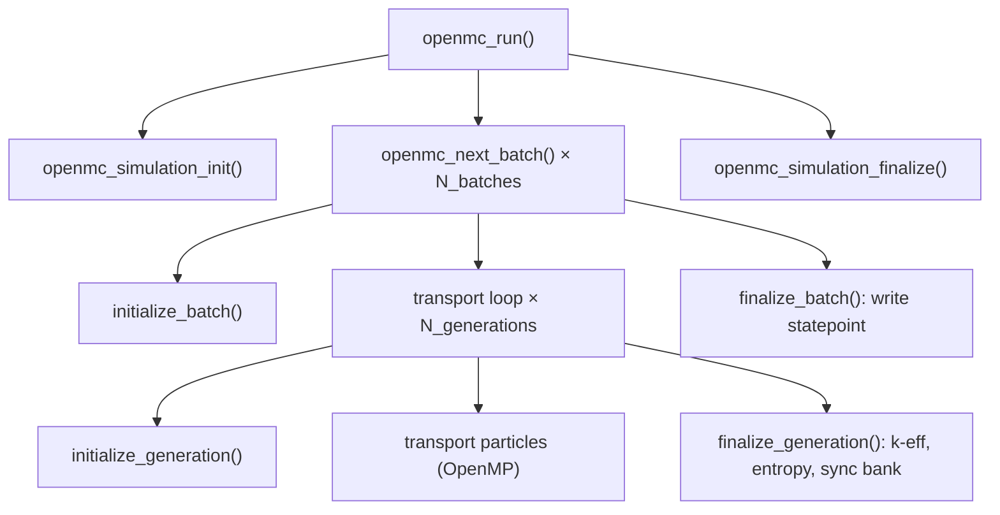
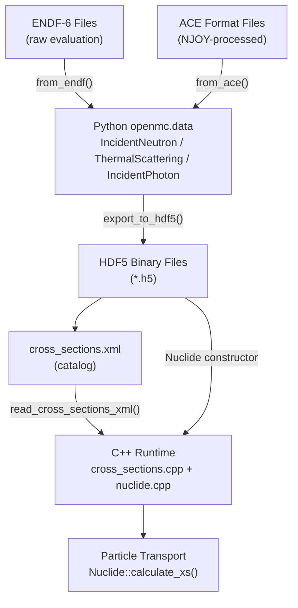
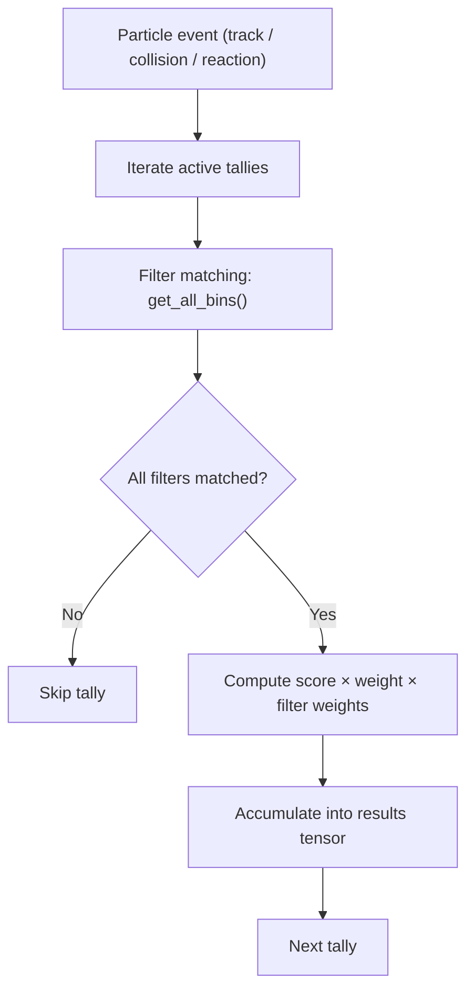
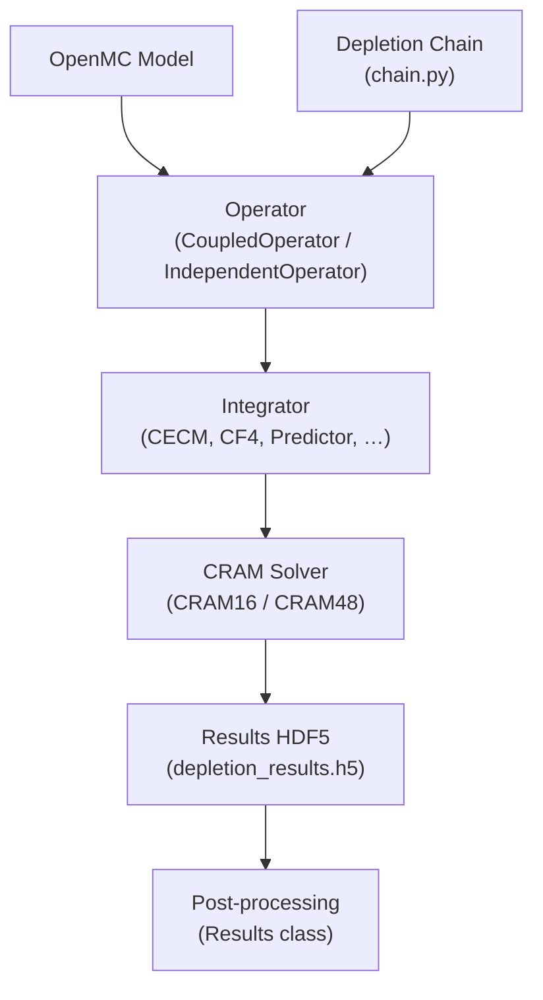
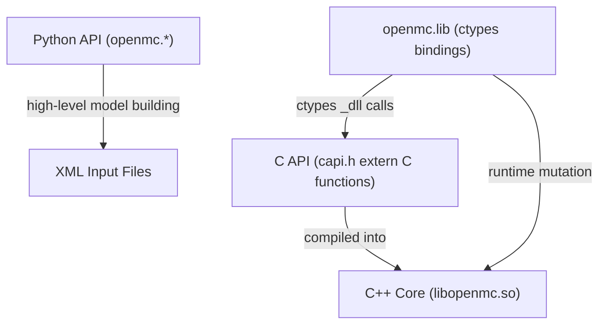
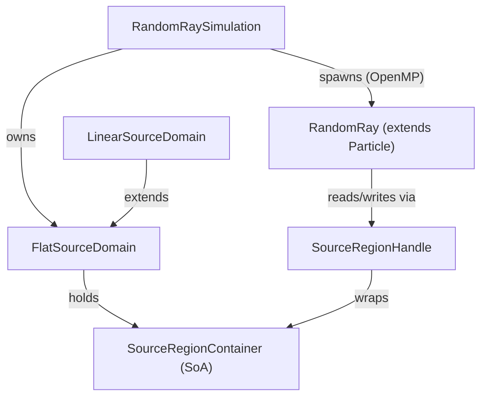
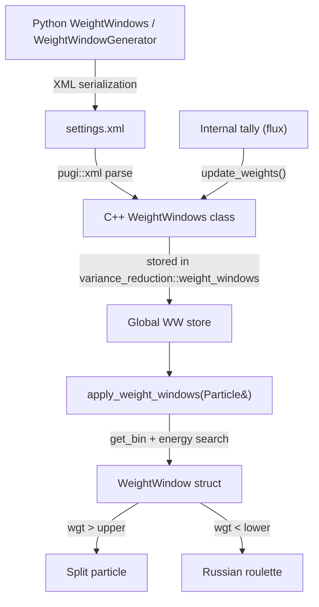

---

# OpenMC Monte Carlo Particle Transport Code

Last updated on Apr 28, 2026 (Commit: [368ea06](https://github.com/openmc-dev/openmc/commit/368ea069ca6ab1bdc6145855223d5c6b4dc6aa47))

## Overview & Key Concepts

<details>
<summary>Relevant Files</summary>

<ul>
<li><code>README.md</code></li>
<li><code>openmc/__init__.py</code></li>
<li><code>openmc/model/model.py</code></li>
<li><code>openmc/examples.py</code></li>
<li><code>openmc/settings.py</code></li>
<li><code>src/main.cpp</code></li>
<li><code>include/openmc/constants.h</code></li>
</ul>

</details>

OpenMC is an open-source **Monte Carlo particle transport code** used to simulate the behavior of neutrons and photons in nuclear systems such as reactors, fusion devices, and shielding assemblies. It was originally developed at MIT's Computational Reactor Physics Group and is now a community-driven project hosted on GitHub.

The codebase is a **hybrid C++/Python system**: the Python layer (`openmc/`) provides a rich API for building models, configuring simulations, and post-processing results, while the C++ core (`src/`, `include/openmc/`) handles the computationally intensive transport calculations.

### Architecture at a Glance



The Python API serializes model definitions to XML; the C++ engine reads those files, runs the simulation (Monte Carlo or random-ray), and writes results to HDF5 statepoint files. Python then reads those results back for analysis.

### Key Concepts

**Geometry** — OpenMC uses Constructive Solid Geometry (CSG): surfaces (planes, spheres, cylinders, etc.) are combined via Boolean operations to define cells, which are grouped into universes and optionally arranged in lattices. An optional CAD-based geometry backend (DAGMC) is available when compiled with `-DOPENMC_USE_DAGMC=ON`.

**Materials** — Each cell is filled with a `Material` that specifies nuclide compositions and densities. Nuclear cross-section data is loaded from HDF5 libraries indexed by `cross_sections.xml`.

**Settings** — The `openmc.Settings` class controls every aspect of the simulation:
- **Run mode**: `EIGENVALUE` (criticality, k-eff), `FIXED_SOURCE`, `PLOT`, `VOLUME`, or `PARTICLE_RESTART`
- **Solver**: Monte Carlo (default) or Random Ray (alternative deterministic method)
- **Particle counts**, batch numbers, energy cutoffs, and statistical options

**Tallies** — Quantities of interest (flux, reaction rates, etc.) are accumulated by attaching `Filter` objects (by energy, cell, material, etc.) to `Tally` objects.

### The `Model` Class

`openmc.Model` is the central container class that holds all simulation components. It is the recommended starting point for building any simulation:

```python
import openmc

model = openmc.Model()
model.geometry  = openmc.Geometry([...])
model.materials = openmc.Materials([...])
model.settings  = openmc.Settings()
model.tallies   = openmc.Tallies([...])

model.run()  # Exports XML and launches the C++ engine
```

### Pre-Built Examples

The `openmc.examples` module provides ready-to-run benchmark models useful for testing and learning:

```python
import openmc.examples

model = openmc.examples.pwr_pin_cell()   # PWR pin-cell (BEAVRS benchmark)
model = openmc.examples.pwr_assembly()   # PWR fuel assembly
model = openmc.examples.pwr_core()       # Full PWR core (OECD/NEA benchmark)
model = openmc.examples.slab_mg()        # Multi-group infinite slab
```

### C++ Execution Flow

The C++ entry point (`src/main.cpp`) dispatches to the appropriate solver based on the run mode:

1. **`openmc_init()`** — Parses XML, loads nuclear data, sets up geometry
2. **Dispatch** — Routes to `openmc_run()`, `openmc_run_random_ray()`, `openmc_plot_geometry()`, `openmc_calculate_volumes()`, or `run_particle_restart()`
3. **`openmc_finalize()`** — Flushes output files and cleans up memory

MPI is supported throughout; all MPI-specific code is guarded with `#ifdef OPENMC_MPI`.

### Global Constants

`include/openmc/constants.h` defines versioning and numerical tuning values shared across all C++ code:

- **File format versions**: `VERSION_STATEPOINT`, `VERSION_PARTICLE_RESTART`, `VERSION_WEIGHT_WINDOWS` — these ensure statepoint files remain readable across releases.
- **Geometry precision**: `FP_PRECISION = 1e-14` (floating-point tolerance), `FP_COINCIDENT = 1e-12` (surface coincidence detection)
- **Physical constants**: Neutron/electron masses, Planck's constant (CODATA 2018 values)

### Container Types

The C++ codebase defines its own container aliases in the `openmc::` namespace (`openmc::vector`, `openmc::array`, `openmc::unique_ptr`). These are currently typedefs to their `std::` equivalents but exist to support future accelerator (GPU) portability. **Always use `openmc::vector` rather than `std::vector` in new C++ code.**

## Architecture & Data Flow

<details>
<summary>Relevant Files</summary>

<ul>
<li><code>src/main.cpp</code></li>
<li><code>src/initialize.cpp</code></li>
<li><code>src/simulation.cpp</code></li>
<li><code>src/finalize.cpp</code></li>
<li><code>include/openmc/capi.h</code></li>
<li><code>include/openmc/simulation.h</code></li>
<li><code>include/openmc/settings.h</code></li>
<li><code>openmc/lib/core.py</code></li>
<li><code>openmc/lib/__init__.py</code></li>
<li><code>openmc/executor.py</code></li>
</ul>

</details>

OpenMC has a layered architecture: a high-performance **C++ core** that handles particle transport, wrapped by a **C API** (`capi.h`), which is then exposed to Python through two complementary interfaces—a `subprocess`-based executor and an in-process `ctypes` library.



### Entry Points

There are two ways to invoke OpenMC from Python:

- **`openmc.run()`** (in `openmc/executor.py`): Launches the `openmc` binary as a child process via `subprocess.Popen`. Arguments are assembled by `_process_CLI_arguments()` and the process's stdout is streamed back in real time. This is the simplest usage and isolates OpenMC's memory entirely.
- **`openmc.lib`** (in `openmc/lib/core.py`): Loads `libopenmc.so` via `ctypes` and calls the C API functions directly in the same process. This enables advanced workflows such as modifying materials or tallies between batches without re-launching.

```python
# Subprocess approach — simple one-shot run
openmc.run(particles=10000, threads=4)

# In-process approach — inspect state between batches
with openmc.lib.run_in_memory():
    openmc.lib.simulation_init()
    for _ in openmc.lib.iter_batches():
        k, std = openmc.lib.keff()
    openmc.lib.simulation_finalize()
```

### C API Lifecycle (`capi.h`)

Every run goes through three top-level C functions, each exposed to Python via ctypes signatures in `openmc/lib/core.py`:

1. **`openmc_init`** — Parses command-line arguments, optionally sets up MPI, reads all XML input files (or a single `model.xml`), loads cross-section data, builds geometry, and allocates tally arrays.
2. **`openmc_run`** — Drives the main batch loop until the stopping criterion is reached. Internally calls `openmc_simulation_init`, then iterates `openmc_next_batch`, then `openmc_simulation_finalize`.
3. **`openmc_finalize`** — Resets all global state, resets timers, deallocates memory, frees MPI datatypes, and finalizes optional libraries (libMesh, random ray).

### Initialization Data Flow

`openmc_init` (implemented in `src/initialize.cpp`) performs these steps in order:

1. Initialize MPI and determine rank / number of processes.
2. Parse command-line flags to set `settings::run_mode` and other `settings::` namespace variables.
3. Read **`model.xml`** (single-file format) or fall back to separate `settings.xml`, `materials.xml`, `geometry.xml`, `tallies.xml`.
4. Call `finalize_geometry()` to resolve universe hierarchy and assign temperatures.
5. Call `finalize_cross_sections()` to load temperature-interpolated ACE data.
6. Prepare tally filters and variance-reduction structures.

### Simulation Batch Loop

The main transport loop in `src/simulation.cpp` executes a nested structure:

```
openmc_run
└── openmc_simulation_init   ← allocate banks, initialize source
    └── while status == 0:
        openmc_next_batch
        ├── initialize_batch  ← increment counter, activate tallies
        └── for gen in gen_per_batch:
            ├── initialize_generation  ← clear fission bank
            ├── transport_history_based()  OR  transport_event_based()
            └── finalize_generation  ← sync bank across MPI, calc keff
        └── finalize_batch  ← accumulate tallies, write statepoints
```

Each **particle history** is initialized by `initialize_history()`, which seeds its pseudo-random number generator deterministically from `(generation * n_particles + particle_id)`, ensuring reproducibility.

### History-Based vs. Event-Based Transport

OpenMC supports two parallelism modes, selected by `settings::event_based`:

- **History-based** (default): Each OpenMP thread takes one particle and drives it from birth to death through `transport_history_based_single_particle()`. The event sequence is `event_calculate_xs → event_advance → event_cross_surface / event_collide → event_revive_from_secondary → event_death`.
- **Event-based** (`-e` flag): All in-flight particles are stored in queues. The transport loop picks the longest queue each iteration and dispatches the matching kernel (`process_calculate_xs_events`, `process_advance_particle_events`, `process_surface_crossing_events`, `process_collision_events`). This improves cache locality for large particle counts but has higher bookkeeping overhead.

### Run Modes

`settings::run_mode` selects the physics calculation:

| Mode | Flag | Description |
|---|---|---|
| `EIGENVALUE` | (default) | k-eigenvalue criticality search with inactive + active batches |
| `FIXED_SOURCE` | — | External source driven; no fission bank synchronization |
| `PLOTTING` | `-p` | Geometry visualization only |
| `VOLUME` | `-c` | Stochastic volume calculations |
| `PARTICLE` | `-r <restart>` | Replay a single particle history for debugging |

### MPI Data Flow

Under MPI, each rank transports its own slice of the source bank (`work_per_rank` particles). After each generation in eigenvalue mode, `synchronize_bank()` redistributes fission sites evenly across ranks. After all active batches complete, `broadcast_results()` sends tally arrays from rank 0 to all other ranks so every process has the full results before `openmc_finalize` writes the HDF5 statepoint.

## Geometry & Material Modeling

<details>
<summary>Relevant Files</summary>

<ul>
<li><code>openmc/surface.py</code></li>
<li><code>openmc/region.py</code></li>
<li><code>openmc/cell.py</code></li>
<li><code>openmc/universe.py</code></li>
<li><code>openmc/lattice.py</code></li>
<li><code>openmc/geometry.py</code></li>
<li><code>openmc/material.py</code></li>
<li><code>openmc/model/surface_composite.py</code></li>
<li><code>openmc/model/triso.py</code></li>
<li><code>openmc/dagmc.py</code></li>
<li><code>include/openmc/surface.h</code></li>
<li><code>include/openmc/cell.h</code></li>
<li><code>include/openmc/lattice.h</code></li>
<li><code>src/geometry.cpp</code></li>
<li><code>src/cell.cpp</code></li>
</ul>

</details>

OpenMC uses **Constructive Solid Geometry (CSG)** to define geometry: surfaces divide space into half-spaces, Boolean region algebra combines them into cells, cells are grouped into universes, and universes can be repeated via lattices. Materials are assigned independently and attached to cells at model-build time.



### Materials

`openmc.Material` holds the isotopic composition and bulk density of a region. Nuclides or natural elements are added with `add_nuclide` / `add_element`, then a density is assigned.

```python
import openmc

fuel = openmc.Material(name='UO2 fuel')
fuel.add_element('U', 1.0, percent_type='ao', enrichment=3.5)
fuel.add_element('O', 2.0)
fuel.set_density('g/cm3', 10.97)

water = openmc.Material(name='Water')
water.add_nuclide('H1',  2.0)
water.add_nuclide('O16', 1.0)
water.set_density('g/cm3', 0.74)
water.add_s_alpha_beta('c_H_in_H2O')   # thermal scattering
```

Supported density units include `'g/cm3'`, `'atom/b-cm'`, `'atom/cm3'`, and `'sum'` (sum of component partial densities). The `depletable=True` flag marks a material for burnup tracking in depletion calculations.

### Surfaces

All surfaces inherit from `openmc.Surface` and implement a quadric equation f(x,y,z). The unary `-` and `+` operators produce `Halfspace` objects (the two sides of the surface).

| Surface class | Key parameters |
|---|---|
| `Plane` / `XPlane` / `YPlane` / `ZPlane` | `a, b, c, d` or axis intercept |
| `Sphere` | `x0, y0, z0, r` |
| `ZCylinder` (also X, Y) | `x0, y0, r` |
| `ZCone` (also X, Y) | `x0, y0, z0, r2` |
| `XTorus` / `YTorus` / `ZTorus` | `y0, z0, a, b, c` |
| `Quadric` | Full 10-coefficient form |

Every surface has a `boundary_type` (`'transmission'`, `'vacuum'`, `'reflective'`, `'periodic'`, `'white'`) and can be translated or rotated non-destructively with `.translate()` / `.rotate()`.

### Region Algebra

Boolean region expressions are built with Python operators on `Halfspace` objects:

```python
cyl  = openmc.ZCylinder(r=0.43)
top  = openmc.ZPlane(z0= 190.0)
bot  = openmc.ZPlane(z0=-190.0)

fuel_region   = -cyl & +bot & -top   # Intersection  (&)
outer_region  = +cyl | +top | -bot   # Union          (|)
complement    = ~fuel_region          # Complement     (~)
```

The three concrete `Region` subclasses are `Intersection`, `Union`, and `Complement`; all support `bounding_box`, `.translate()`, `.rotate()`, and `.clone()`. A text expression parser (`Region.from_expression`) accepts infix strings like `"(1 -2) | ~(3 -4)"` using surface IDs.

### Cells

`openmc.Cell` ties a spatial `region` to a `fill`:

```python
fuel_cell = openmc.Cell(name='fuel', region=fuel_region, fill=fuel)
void_cell = openmc.Cell(region=~fuel_region)   # fill=None → void
```

The `fill_type` property returns one of `'material'`, `'universe'`, `'lattice'`, `'distribmat'`, or `'void'`. Cells filled with a universe or lattice accept `translation` and `rotation` attributes to position the sub-geometry.

### Universes

`openmc.Universe` is an ordered collection of cells that can be reused anywhere in the geometry tree. Universes nest arbitrarily, enabling complex hierarchical models.

```python
pin_universe = openmc.Universe(name='pin', cells=[fuel_cell, clad_cell, water_cell])
```

`DAGMCUniverse` is an alternative that references a CAD-based `.h5m` file instead of CSG cells, enabling mixed CSG+CAD models (requires the DAGMC optional build flag).

### Lattices

Lattices repeat a grid of universes efficiently without duplicating cell definitions.

**`RectLattice`** — Cartesian grid:

```python
lattice = openmc.RectLattice()
lattice.pitch      = [1.26, 1.26]          # cm, (x, y)
lattice.lower_left = [-10.71, -10.71]
lattice.universes  = [[pin_universe]*17]*17  # 17×17 array
lattice.outer      = water_universe         # fills outside the grid
```

**`HexLattice`** — Hexagonal grid, with universes specified ring-by-ring from center outward. The `orientation` attribute selects between flat-side (`'y'`) and pointy-top (`'x'`) layouts.

Lattice and Universe share an ID space (`Lattice.used_ids` aliases `UniverseBase.used_ids`).

### Top-Level Geometry

`openmc.Geometry` wraps the root universe and provides convenience accessors:

```python
geom = openmc.Geometry(root=root_universe, merge_surfaces=True)
geom.export_to_xml()          # writes geometry.xml
```

With `merge_surfaces=True`, duplicate surfaces (within `surface_precision` decimal places) are consolidated before export, reducing runtime overhead. `determine_paths()` traverses the full tree to assign instance counts and hierarchical path strings to every cell and material — required before accessing `cell.paths`.

### Composite Surfaces & TRISO Particles

`openmc.model.CompositeSurface` bundles multiple primitives into one shape. Built-in shapes include `CylinderSector`, `IsogonalOctagon`, `RectangularParallelepiped`, and one-sided cones. Like simple surfaces, they expose `+` / `-` operators returning `Region` objects, and their component surfaces move together under `.translate()` / `.rotate()`.

`openmc.model.TRISO` (a `Cell` subclass) represents a single TRISO micro-fuel particle. Its companion functions `pack_trisos` and `create_triso_universe` automate random packing into a matrix:

```python
spheres = openmc.model.pack_trisos(
    radius=0.04, fill=triso_fill, domain=pebble_region, packing_fraction=0.40)
triso_univ = openmc.model.create_triso_universe(
    trisos=spheres, matrix_material=graphite, domain_radius=1.5)
```

### ID Management

Every geometry object class (`Surface`, `Cell`, `Material`, `Universe`, `Lattice`) inherits from `IDManagerMixin`. IDs auto-increment from `next_id` within each class's own namespace. Passing an explicit `id` emits `IDWarning` on collision. `openmc.reset_auto_ids()` resets all counters — essential between pytest fixtures.

## Monte Carlo Particle Transport

<details>
<summary>Relevant Files</summary>

<ul>
<li><code>src/simulation.cpp</code></li>
<li><code>src/particle.cpp</code></li>
<li><code>src/physics.cpp</code></li>
<li><code>src/physics_common.cpp</code></li>
<li><code>src/eigenvalue.cpp</code></li>
<li><code>src/event.cpp</code></li>
<li><code>src/source.cpp</code></li>
<li><code>include/openmc/particle.h</code></li>
<li><code>include/openmc/particle_data.h</code></li>
<li><code>include/openmc/source.h</code></li>
<li><code>include/openmc/eigenvalue.h</code></li>
<li><code>openmc/source.py</code></li>
</ul>

</details>

OpenMC implements a **continuous-energy Monte Carlo** particle transport algorithm. Neutrons (and optionally photons, electrons, and positrons) are tracked from birth through a series of physical events until they are absorbed, leak out, or fall below an energy cutoff. Statistical results are accumulated across many such histories.

### Simulation Hierarchy

The top-level entry point `openmc_run()` (in `src/simulation.cpp`) organizes work into three nested levels:



Each **batch** contains one or more **generations**. Within a generation every source particle is tracked to completion before results are combined.

### Particle Data Structures

The `ParticleData` struct (in `include/openmc/particle_data.h`) carries all state for a live particle. The `Particle` class (in `include/openmc/particle.h`) extends it with transport event methods.

The companion `SourceSite` struct represents a banked particle (in the fission bank or source bank):

```cpp
struct SourceSite {
    Position r;           // Position [cm]
    Direction u;          // Direction (unit vector)
    double E;             // Energy [eV]
    double wgt {1.0};     // Statistical weight
    int delayed_group;    // 0 = prompt neutron
    ParticleType particle;
};
```

Per-nuclide cross section values are cached in `NuclideMicroXS` and aggregated into `MacroXS` for the current material, avoiding redundant lookups within a single event.

### History-Based Transport (Default)

Each particle is tracked through a sequential event loop inside `transport_history_based_single_particle()`:

1. **`event_calculate_xs`** — locate the particle's cell and compute macroscopic cross sections.
2. **`event_advance`** — sample a collision distance `d = -ln(ξ) / Σ_t`, find the nearest boundary, move the particle by `min(d, d_boundary)`, and score track-length tallies.
3. **`event_cross_surface`** or **`event_collide`** — depending on which distance was smaller.
4. **`event_revive_from_secondary`** — if the particle died but left secondaries in the local bank, pop one and continue.
5. **`event_death`** — accumulate k-eff estimator contributions to shared accumulators.

OpenMP parallelizes across particles with one thread per history, giving implicit load balancing with no inter-particle synchronization required during transport.

### Event-Based Transport (Optional)

Enabled via the `--event` run flag, `transport_event_based()` (in `src/event.cpp`) groups all in-flight particles by their next event type into queues (calculate-xs, advance, surface-crossing, collision). The longest queue is processed first, improving cache locality at the cost of higher memory usage. Separate queues exist for fuel and non-fuel cross section lookups, reflecting the dominant workload in reactor problems.

### Physics Interactions

`collision()` in `src/physics.cpp` dispatches based on particle type:

- **Neutrons**: Sample the colliding nuclide proportional to `n_i * σ_t,i`. Then choose elastic scatter, inelastic scatter, or absorption. If the nuclide is fissionable, call `create_fission_sites()` to bank fission neutrons. Apply Russian roulette via `apply_russian_roulette()` to control low-weight particles.
- **Photons**: Choose coherent (Rayleigh) scatter, incoherent (Compton) scatter, photoelectric absorption, or pair production, each weighted by their partial cross sections.

Thermal scattering S(α,β) tables are used when available, correlating outgoing energy and angle for bound nuclei.

### Eigenvalue (Criticality) Problems

For k-eigenvalue mode, three independent k-eff estimators are accumulated and combined with minimum-variance weights:

| Estimator | Formula |
|---|---|
| Track-length | `Σ w·d·νΣ_f` along flight paths |
| Collision | `Σ w·νΣ_f/Σ_t` at collision points |
| Absorption | `Σ w·νΣ_f/Σ_a` at absorption events |

At the end of each generation, `finalize_generation()` (in `src/eigenvalue.cpp`) calls `synchronize_bank()`, which uses **uniform combing** — a deterministic, reproducible sampling method — to down-sample the fission bank to exactly `n_particles` sites before redistributing them across MPI ranks for the next generation.

### Source Sampling

The abstract `Source` base class (in `src/source.cpp`) defines a `sample(seed)` interface. Derived types include:

- **`IndependentSource`** — independent spatial, angular, energy, and time distributions.
- **`FileSource`** — reads sites from an HDF5 file.
- **`MeshSource`** — volumetric source defined on a mesh.
- **`CompiledSourceWrapper`** — dynamically loaded user-defined source library.

Rejection sampling enforces optional constraints (cell/material domain, energy range, fissionable material only). The Python API in `openmc/source.py` mirrors these types with `IndependentSource`, `FileSource`, and `MeshSource` classes that serialize to XML for the C++ solver.

## Nuclear Data & Cross Sections

<details>
<summary>Relevant Files</summary>

<ul>
<li><code>openmc/data/neutron.py</code></li>
<li><code>openmc/data/ace.py</code></li>
<li><code>openmc/data/endf.py</code></li>
<li><code>openmc/data/reaction.py</code></li>
<li><code>openmc/data/resonance.py</code></li>
<li><code>openmc/data/thermal.py</code></li>
<li><code>openmc/data/photon.py</code></li>
<li><code>openmc/data/library.py</code></li>
<li><code>openmc/data/function.py</code></li>
<li><code>src/cross_sections.cpp</code></li>
<li><code>src/nuclide.cpp</code></li>
<li><code>include/openmc/nuclide.h</code></li>
<li><code>include/openmc/cross_sections.h</code></li>
</ul>

</details>

OpenMC separates nuclear data handling into two layers: a **Python data module** (`openmc.data`) responsible for reading, converting, and exporting nuclear data files, and a **C++ runtime layer** that loads preconverted HDF5 files at simulation startup for fast particle-transport calculations.

### Data Pipeline Overview



### Python Data Module (`openmc.data`)

#### Reading Nuclear Data

The primary Python classes are constructed via factory methods that accept multiple source formats:

```python
import openmc.data

# From pre-converted HDF5 (typical workflow)
nuc = openmc.data.IncidentNeutron.from_hdf5('U235.h5')

# From raw ENDF-6 file
nuc = openmc.data.IncidentNeutron.from_endf('n-092_U_235.endf')

# From ACE file produced by NJOY
nuc = openmc.data.IncidentNeutron.from_ace('92235.710nc')

# Export for use by OpenMC runtime
nuc.export_to_hdf5('U235.h5')
```

#### Key Python Classes

- **`IncidentNeutron`** — Top-level container for a nuclide's continuous-energy neutron data. Holds temperature-dependent energy grids, a dictionary of `Reaction` objects keyed by ENDF MT number, resolved/unresolved resonance data, and fission energy release.
- **`Reaction`** — Encapsulates one nuclear reaction (e.g. MT=18 fission). Stores temperature-indexed cross sections (as `Tabulated1D` objects) and a list of `Product` objects describing outgoing particle distributions.
- **`ThermalScattering`** — S(α,β) thermal scattering data for bound atoms (light water, graphite, etc.), with elastic and inelastic cross sections and angle–energy distributions.
- **`IncidentPhoton`** — Photon interaction cross sections (Compton, Rayleigh, pair production, photoelectric) and atomic relaxation data.
- **`DataLibrary`** — Registry mapping `(type, material_name)` pairs to HDF5 file paths; serialized as `cross_sections.xml`.

#### Tabulated Functions (`openmc.data.function`)

Cross sections and distributions are stored as `Function1D` subclasses with ENDF interpolation schemes (histogram, lin-lin, lin-log, log-log). The `Tabulated1D` class supports calling `xs(E)` to interpolate cross section values, and serializes directly to HDF5.

#### Resonance Data (`openmc.data.resonance`)

The `Resonances` container holds one or more `ResonanceRange` objects covering different energy intervals:

- **`SingleLevelBreitWigner`** / **`MultiLevelBreitWigner`** — classic Breit-Wigner formalisms
- **`RMatrixLimited`** — R-Matrix formalism for complex nuclides
- **`Unresolved`** — probability tables for the unresolved resonance region (URR)

### C++ Runtime Layer

#### Library Catalog (`src/cross_sections.cpp`)

At simulation startup OpenMC parses `cross_sections.xml` and populates two global structures in the `data::` namespace:

```cpp
namespace data {
  map<LibraryKey, size_t> library_map;  // (Type, nuclide_name) -> index
  vector<Library> libraries;            // file paths and material lists
}
```

`read_ce_cross_sections()` then iterates over every nuclide required by the geometry, locates its HDF5 file via `library_map`, and constructs a `Nuclide` object.

#### Nuclide Class (`include/openmc/nuclide.h`, `src/nuclide.cpp`)

The C++ `Nuclide` class is the runtime representation loaded from HDF5. Key members:

- `grid_` — energy grids per temperature (used for binary search)
- `xs_` — 3-D tensor `[temperature][energy_point][5]` with total, absorption, fission, nu-fission, and photon production cross sections
- `reactions_` — vector of `Reaction` objects; `reaction_index_[MT]` provides O(1) lookup by MT number
- `urr_data_` — unresolved resonance probability tables

Temperature handling supports three modes selected at runtime:

| Mode | Behavior |
|------|----------|
| `NEAREST` | Load single closest temperature |
| `INTERPOLATION` | Load bracketing temperatures, interpolate at runtime |
| `MULTIPOLE` | Reconstruct arbitrary temperatures with windowed multipole method |

#### Cross Section Evaluation

During transport, `Nuclide::calculate_xs()` is called for each particle–nuclide interaction:

1. Locate the energy index via binary search on the log-spaced union energy grid.
2. Read pre-tabulated cross sections from `xs_[i_temp][i_energy]`.
3. Apply URR probability tables if the particle energy falls in the unresolved region.
4. Return microscopic cross sections to the material routine for sampling.

### HDF5 File Structure

Each nuclide HDF5 file follows a standard hierarchy:

```
U235.h5
├── Z, A, metastable, atomic_weight_ratio   (attributes)
├── kTs/          294K, 600K, 900K ...      (temperatures in eV)
├── energy/       294K=[...], 600K=[...]    (energy grids)
├── reactions/
│   ├── reaction_001   (MT=1 total)
│   ├── reaction_002   (MT=2 elastic)
│   ├── reaction_018   (MT=18 fission)
│   └── reaction_102   (MT=102 capture)
└── urr/          294K/, 600K/ ...          (probability tables)
```

### Adding a New Cross-Section Library

To register a new data library for use in simulations:

```python
lib = openmc.data.DataLibrary()
lib.register_file('path/to/U235.h5')   # auto-detects type and nuclide
lib.register_file('path/to/H2O_sab.h5')
lib.export_to_xml('cross_sections.xml')
```

Set `OPENMC_CROSS_SECTIONS=/path/to/cross_sections.xml` (or pass it in `openmc.Settings`) and OpenMC will locate the right HDF5 file for every nuclide in the model.

## Tallies, Filters & Output

<details>
<summary>Relevant Files</summary>

<ul>
<li><code>openmc/tallies.py</code></li>
<li><code>openmc/filter.py</code></li>
<li><code>openmc/statepoint.py</code></li>
<li><code>openmc/summary.py</code></li>
<li><code>openmc/mesh.py</code></li>
<li><code>include/openmc/tallies/tally.h</code></li>
<li><code>include/openmc/tallies/filter.h</code></li>
<li><code>include/openmc/tallies/tally_scoring.h</code></li>
<li><code>src/tallies/tally.cpp</code></li>
<li><code>src/tallies/tally_scoring.cpp</code></li>
<li><code>src/state_point.cpp</code></li>
</ul>

</details>

OpenMC's tally system enables users to score physical quantities (flux, fission rate, heating, etc.) over arbitrary partitions of the simulation phase space. Every tally is defined by three orthogonal dimensions: **scores** (what to measure), **filters** (where/when to measure it), and **nuclides** (which isotopes to attribute it to).

### Tally Definition

A `Tally` object is constructed in Python, populated with filters and scores, and then serialized to XML before the simulation runs.

```python
import openmc

tally = openmc.Tally(name="fuel_flux")
tally.filters = [openmc.EnergyFilter([0.0, 0.625e-6, 20.0])]
tally.scores  = ["flux", "fission"]
tally.nuclides = ["U235", "U238"]

tallies = openmc.Tallies([tally])
tallies.export_to_xml()
```

Key `Tally` properties:

- `scores` — list of reaction/quantity strings (`"flux"`, `"fission"`, `"heating"`, `"(n,2n)"`, etc.)
- `filters` — ordered list of `Filter` objects that partition the phase space
- `nuclides` — list of nuclide names or `"total"`
- `estimator` — `"tracklength"` (default), `"collision"`, or `"analog"`
- `multiply_density` — when `True`, reaction-rate scores are multiplied by number density

### Filter Types

Filters are modular, composable phase-space binners. More than 30 filter subclasses are available, organized by the physical dimension they partition:

| Category | Examples |
|---|---|
| Spatial | `CellFilter`, `MaterialFilter`, `UniverseFilter`, `MeshFilter` |
| Energy | `EnergyFilter`, `EnergyOutFilter`, `EnergyFunctionFilter` |
| Angular | `PolarFilter`, `AzimuthalFilter`, `LegendreFilter` |
| Time / Particle | `TimeFilter`, `ParticleFilter`, `WeightFilter` |
| Mesh-extended | `MeshSurfaceFilter`, `MeshBornFilter` |

`MeshFilter` wraps a mesh object (`RegularMesh`, `RectilinearMesh`, `CylindricalMesh`, `SphericalMesh`, or `UnstructuredMesh`) to produce spatially resolved tallies over the entire geometry.

```python
mesh = openmc.RegularMesh()
mesh.dimension = [10, 10, 1]
mesh.lower_left  = [-100.0, -100.0, -1.0]
mesh.upper_right = [ 100.0,  100.0,  1.0]

tally.filters = [openmc.MeshFilter(mesh)]
tally.scores  = ["flux"]
```

### Score Accumulation in C++

During transport the C++ engine evaluates each active tally at every scoring event. The sequence is:



The results tensor has shape `(filter_bins, nuclide_bins, score_bins)` stored as a flat array. OpenMC precomputes **strides** for each filter so the innermost (last-added) filter varies fastest in memory, enabling cache-friendly accumulation.

Three estimators control *when* accumulation happens:

- **Tracklength** — continuous flight path integral; lowest variance, most widely applicable
- **Collision** — scores only at collision sites
- **Analog** — records actual physical reactions; required for certain scores (e.g., delayed neutron emission)

### Statepoint Output (HDF5)

After each batch (or the final batch), OpenMC writes a statepoint HDF5 file via `openmc_statepoint_write()` in `src/state_point.cpp`. The file layout is:

```
statepoint.N.h5
├── /global_tallies/          ← k-eff, leakage
├── /tallies/
│   ├── /filters/filter_<id>/  ← type, bins, n_bins
│   ├── /meshes/mesh_<id>/     ← mesh geometry
│   └── /tally_<id>/
│       ├── name, estimator, scores, nuclides, filters
│       ├── sum       (float64 tensor)
│       ├── sum_sq    (float64 tensor)
│       └── sum_third / sum_fourth  (for higher moments)
└── /source_bank/             ← fission source (if written)
```

### Reading Results in Python

The `StatePoint` class provides lazy-loaded access to simulation output. Tallies reconstruct their filter/score structure from the HDF5 metadata and compute statistics on demand.

```python
with openmc.StatePoint("statepoint.10.h5") as sp:
    t = sp.tallies[1]           # Tally object with results loaded
    mean   = t.mean             # shape: (filter_bins, nuclide_bins, score_bins)
    stddev = t.std_dev

    # Slice by score name
    flux = t.get_values(scores=["flux"])
```

Mean and standard deviation are derived from the raw moments:

- `mean = sum / n_realizations`
- `std_dev = sqrt(sum_sq / n_realizations - mean²)`

The companion `Summary` class reconstructs the full input geometry from `summary.h5`, which the `StatePoint` can link to for resolving cell/material names during post-processing.

### Typical Workflow

1. **Define** tallies, filters, and scores in Python
2. **Export** to XML (`tallies.export_to_xml()`)
3. **Run** the simulation (`openmc.run()`)
4. **Open** the statepoint (`openmc.StatePoint(...)`)
5. **Extract** `mean` / `std_dev` arrays for each tally and post-process

This clean separation between input definition (XML), transport scoring (C++), and result retrieval (Python/HDF5) makes it straightforward to add new filter types or post-processing routines without touching the transport kernel.

## Depletion & Burnup

<details>
<summary>Relevant Files</summary>

<ul>
<li><code>openmc/deplete/abc.py</code></li>
<li><code>openmc/deplete/coupled_operator.py</code></li>
<li><code>openmc/deplete/independent_operator.py</code></li>
<li><code>openmc/deplete/integrators.py</code></li>
<li><code>openmc/deplete/chain.py</code></li>
<li><code>openmc/deplete/cram.py</code></li>
<li><code>openmc/deplete/results.py</code></li>
<li><code>openmc/deplete/reaction_rates.py</code></li>
<li><code>openmc/deplete/microxs.py</code></li>
</ul>

</details>

The depletion (burnup) system in OpenMC solves the Bateman equations to track nuclide density evolution over time as fuel absorbs neutrons and undergoes fission. It is organized into three cooperating layers: **operators** that compute reaction rates, **integrators** that advance the solution in time, and **solvers** that evaluate the matrix exponential at each step.



### Operators

An **operator** is responsible for computing reaction rates for each burnable material. Two concrete implementations are provided:

- **`CoupledOperator`** (`coupled_operator.py`) — tightly couples depletion to OpenMC transport. On each timestep it calls the OpenMC C library to run a transport simulation, tallies reaction rates, and returns an `OperatorResult`. Normalization and fission-yield modes can be configured at construction time.

- **`IndependentOperator`** (`independent_operator.py`) — uses pre-computed multigroup fluxes and microscopic cross-sections (`MicroXS` objects) instead of running transport. Suitable for stand-alone burnup or sensitivity studies without repeated Monte Carlo runs.

Both share a common abstract parent defined in `abc.py` (`TransportOperator`) that specifies the interface: `initial_condition()`, `__call__(vec, source_rate)`, `finalize()`, and helpers for reaction-rate tallying, normalization, and fission yields.

### Depletion Chain

`Chain` (`chain.py`) is the nuclear data backbone of the depletion system. It stores every nuclide's half-life, decay modes, and transmutation reactions read from an XML chain file (or built directly from ENDF files).

Key capabilities:

- `form_matrix(rates, fission_yields)` — assembles the sparse transmutation matrix **A** combining decay and reaction terms.
- `reduce(initial_isotopes, level)` — prunes the chain to only nuclides reachable within `level` transmutation steps, reducing matrix size for efficiency.
- `decay_matrix` property — returns a cached sparse matrix for decay-only calculations.

### Integrators

Integrators loop over timesteps and orchestrate calls to the operator and CRAM solver. All inherit from `Integrator` in `abc.py`. The available schemes are:

| Class | Order | Transport calls/step |
|---|---|---|
| `PredictorIntegrator` | 1 | 1 |
| `CECMIntegrator` | 2 | 2 |
| `CELIIntegrator` | 2 | 2 |
| `LEQIIntegrator` | 3–4 | 2 |
| `CF4Integrator` | 4 | 4 |
| `EPCRK4Integrator` | 4 | 4 |
| `SICELIIntegrator` | 2 (SI) | 2 × n_steps |
| `SILEQIIntegrator` | 3–4 (SI) | 2 × n_steps |

Stochastic Implicit (SI) variants iterate the corrector step multiple times (`n_steps`, default 10) to reduce statistical noise, at the cost of additional transport solves.

Advanced control hooks available on all integrators:

- `add_transfer_rate(material, components, rate)` — continuous material feed or removal.
- `add_external_source_rate(material, composition, rate)` — inject nuclides from outside.
- `add_keff_search_control(function, x0, x1)` — adjust a parameter each step to hit a target k-eff.

### CRAM Solver

The Chebyshev Rational Approximation Method (CRAM) solver in `cram.py` evaluates the matrix exponential `exp(A·dt)·n₀` via an incomplete partial factorization (IPF) of a rational approximation. Two instances are exported:

- `CRAM16` — 16th-order, faster, lower accuracy.
- `CRAM48` — 48th-order (default), higher accuracy for stiff systems.

Both accept a `substeps` argument. When `substeps > 1`, the interval is split into equal sub-intervals sharing pre-computed LU factorizations for efficiency.

### Microscopic Cross-Sections

`MicroXS` (`microxs.py`) holds a 3-D array of shape `(n_nuclides, n_reactions, n_groups)` in barns. It is the primary input for `IndependentOperator` and can be created several ways:

```python
# From a full OpenMC transport simulation
fluxes, micros = openmc.deplete.get_microxs_and_flux(model, domains, energies)

# From a CSV file
micros = openmc.deplete.MicroXS.from_csv("micro_xs.csv")
```

### Reaction Rates

`ReactionRates` (`reaction_rates.py`) is a NumPy ndarray subclass with string-based indexing over materials, nuclides, and reactions. It is populated by the operator after each transport solve and consumed by the integrator when building the transmutation matrix.

```python
rate = reaction_rates.get("mat_1", "U235", "fission")  # returns float
```

### Results and Post-processing

`Results` (`results.py`) is a list of `StepResult` objects backed by an HDF5 file. After a depletion run, it provides convenient accessors:

```python
results = openmc.deplete.Results("depletion_results.h5")

times, keff   = results.get_keff(time_units='d')
times, atoms  = results.get_atoms("1", "Pu239", time_units='d')
times, heat   = results.get_decay_heat("1", units='W/cm3')

# Export depleted compositions for a follow-on simulation
mats = results.export_to_materials(-1)  # last burnup step
```

### Minimal Usage Example

```python
import openmc
import openmc.deplete

# Build model and specify chain file
model = openmc.Model(...)
chain_file = "/path/to/chain_endfb80_pwr.xml"

# Create coupled operator and integrator
operator = openmc.deplete.CoupledOperator(model, chain_file)
integrator = openmc.deplete.CECMIntegrator(
    operator,
    timesteps=[30, 30, 30],   # days
    power=1.0e6,              # watts
    timestep_units='d'
)

# Run depletion
integrator.integrate()

# Post-process
results = openmc.deplete.Results("depletion_results.h5")
times, keff = results.get_keff(time_units='d')
```

## Python API & C API Bindings

<details>
<summary>Relevant Files</summary>

<ul>
<li><code>openmc/lib/__init__.py</code></li>
<li><code>openmc/lib/core.py</code></li>
<li><code>openmc/lib/cell.py</code></li>
<li><code>openmc/lib/material.py</code></li>
<li><code>openmc/lib/tally.py</code></li>
<li><code>openmc/lib/filter.py</code></li>
<li><code>openmc/lib/settings.py</code></li>
<li><code>openmc/lib/nuclide.py</code></li>
<li><code>openmc/lib/error.py</code></li>
<li><code>include/openmc/capi.h</code></li>
<li><code>openmc/mixin.py</code></li>
<li><code>openmc/checkvalue.py</code></li>
</ul>

</details>

The `openmc.lib` package provides Python bindings to the OpenMC shared library (`libopenmc.so`/`libopenmc.dylib`) using Python's `ctypes` module. This lets Python code call into the running simulation engine at runtime — inspecting and modifying cells, materials, tallies, and simulation state without restarting or re-reading XML input files.

### Architecture Overview



The C++ library exposes a flat `extern "C"` interface in `include/openmc/capi.h`. Every function follows the `openmc_*` naming convention and returns an integer error code (0 = success, negative = error). Python's `ctypes` wraps these symbols through the `_dll` object loaded at import time.

### Loading the Shared Library

When `openmc.lib` is imported, `__init__.py` loads `libopenmc.so` (or `.dylib` on macOS) using `ctypes.CDLL`:

```python
from ctypes import CDLL
_dll = CDLL(str(_filename))   # _filename resolved from package resources
```

Each submodule (`cell.py`, `material.py`, `tally.py`, etc.) then registers argument types, return types, and an error-check callback for every C function it uses:

```python
_dll.openmc_cell_get_id.argtypes = [c_int32, POINTER(c_int32)]
_dll.openmc_cell_get_id.restype  = c_int
_dll.openmc_cell_get_id.errcheck = _error_handler
```

### Error Handling

The `_error_handler` function in `openmc/lib/error.py` is registered as the `errcheck` callback on every C call. It reads the global `openmc_err_msg` character buffer from the shared library and maps the integer error code to a Python exception:

| C Error Constant | Python Exception |
|---|---|
| `OPENMC_E_ALLOCATE` | `AllocationError` |
| `OPENMC_E_OUT_OF_BOUNDS` | `OutOfBoundsError` |
| `OPENMC_E_INVALID_ARGUMENT` | `InvalidArgumentError` |
| `OPENMC_E_INVALID_ID` | `InvalidIDError` |
| `OPENMC_E_GEOMETRY` | `GeometryError` |
| `OPENMC_E_WARNING` | Python `warning` (not raised) |

### Proxy Objects and Mappings

Each domain concept — Cell, Material, Tally, Filter, Nuclide — is wrapped in a Python proxy class that stores only a C-side array index (`_index`). The class's properties call through to C functions on every access, so they always reflect the live simulation state.

```python
class Cell(_FortranObjectWithID):
    @property
    def id(self):
        cell_id = c_int32()
        _dll.openmc_cell_get_id(self._index, cell_id)
        return cell_id.value

    def set_temperature(self, T, instance=None, set_contained=False):
        _dll.openmc_cell_set_temperature(self._index, T, instance, set_contained)
```

`WeakValueDictionary` caches proxy instances by index to avoid creating duplicate Python objects for the same C object. Module-level mapping objects (`openmc.lib.cells`, `openmc.lib.materials`, `openmc.lib.tallies`) implement the `Mapping` ABC and delegate `__len__` and `__getitem__` to C functions:

```python
# Access cells by user-assigned ID
cell = openmc.lib.cells[42]
cell.set_temperature(900.0)

mat = openmc.lib.materials[1]
mat.set_density(10.5, 'g/cm3')
```

### Simulation Lifecycle

The key lifecycle functions in `openmc/lib/core.py` correspond directly to C API entry points:

```python
openmc.lib.init(args=['--geometry-debug'])   # openmc_init()
openmc.lib.simulation_init()                 # openmc_simulation_init()
for _ in openmc.lib.iter_batches():
    k, sigma = openmc.lib.keff()             # openmc_get_keff()
    # inspect / mutate between batches
openmc.lib.simulation_finalize()             # openmc_simulation_finalize()
openmc.lib.finalize()                        # openmc_finalize()
```

The `run_in_memory()` context manager wraps init/finalize automatically:

```python
with openmc.lib.run_in_memory():
    for _ in openmc.lib.iter_batches():
        # modify tallies, temperatures, densities mid-run
        pass
```

`TemporarySession` is a higher-level helper that exports model XML to a temporary directory, runs `init`, and cleans up on exit — useful for calling `openmc.lib` functions without polluting the working directory.

### Input Validation with `openmc.checkvalue`

The Python API layer (not `openmc.lib`) uses `openmc/checkvalue.py` for extensive input validation in property setters. Functions like `check_type`, `check_value`, `check_greater_than`, and `check_length` raise `TypeError` or `ValueError` with descriptive messages before any C call is made:

```python
import openmc.checkvalue as cv

@temperature.setter
def temperature(self, temp):
    cv.check_type('temperature', temp, Real)
    cv.check_greater_than('temperature', temp, 0.0)
    self._temperature = temp
```

### ID Management with `IDManagerMixin`

All Python-side geometry objects (Cell, Surface, Material, Universe, etc.) inherit from `IDManagerMixin` in `openmc/mixin.py`. It auto-assigns unique integer IDs and tracks them via class-level `used_ids` sets and a `next_id` counter. Duplicate IDs emit an `IDWarning`; `reset_auto_ids()` clears all counters between model builds:

```python
openmc.reset_auto_ids()   # clear all used_ids before building a new model
cell = openmc.Cell()      # gets next available ID automatically
```

### Key C API Patterns

The C API in `capi.h` uses consistent patterns throughout:

- **Index-based access**: Objects are addressed by a 0-based array index (`int32_t index`), not by user ID. Python code calls `openmc_get_cell_index(id, &index)` first.
- **Extend functions**: New objects are allocated with `openmc_extend_cells(n, &start, &end)`, which returns the index range of the new objects.
- **Output via pointer parameters**: Return values are written through pointer arguments; the function return value is always an error code.
- **String encoding**: C strings are `const char*`; Python code encodes with `.encode()` before passing and decodes with `.decode()` after receiving.

## Random Ray Solver

<details>
<summary>Relevant Files</summary>

<ul>
<li><code>src/random_ray/random_ray_simulation.cpp</code></li>
<li><code>src/random_ray/random_ray.cpp</code></li>
<li><code>src/random_ray/flat_source_domain.cpp</code></li>
<li><code>src/random_ray/linear_source_domain.cpp</code></li>
<li><code>include/openmc/random_ray/random_ray.h</code></li>
<li><code>include/openmc/random_ray/random_ray_simulation.h</code></li>
<li><code>include/openmc/random_ray/flat_source_domain.h</code></li>
<li><code>include/openmc/random_ray/source_region.h</code></li>
</ul>

</details>

The Random Ray solver is an alternative to the standard Monte Carlo particle transport method. Instead of tracking individual source particles, it propagates "rays" — deterministic-like transport sweeps — through the geometry and accumulates scalar flux estimates in **Flat Source Regions (FSRs)**. Each ray carries an angular flux that is attenuated as it crosses material regions, contributing to a multigroup flux estimate per iteration. This approach trades stochastic noise for a power-iteration convergence pattern, making it useful for eigenvalue and fixed-source multigroup problems.

### Architecture Overview



The top-level **`RandomRaySimulation`** class owns a `FlatSourceDomain` (or its `LinearSourceDomain` subclass) and drives the power iteration loop. Each iteration spawns many `RandomRay` objects in parallel (via OpenMP), which transport rays through the geometry using the CSG engine inherited from the `Particle` class.

### Source Region Domain

`FlatSourceDomain` manages all per-region data for a simulation:

- **Source region discovery**: FSRs are discovered lazily during transport and stored in a thread-safe `ParallelMap`. After each iteration, `finalize_discovered_source_regions()` merges these into the main `SourceRegionContainer`.
- **SoA layout**: `SourceRegionContainer` stores all per-region fields (scalar flux, volume, material, centroid, tally tasks) in separate `vector` arrays for cache efficiency.
- **Mesh subdivision**: A source region can be subdivided by an overlaid mesh (e.g., for FW-CADIS weight windows). Each `SourceRegionKey` combines a base FSR index with a mesh bin index.
- **Cross section flattening**: MGXS data is extracted into compact flat arrays (`sigma_t_`, `sigma_s_`, `nu_sigma_f_`, etc.) at initialization for fast lookup during transport.

`LinearSourceDomain` extends `FlatSourceDomain` to support a spatially linear source approximation within each region. It additionally tracks flux moments and a moment matrix (spatial second moments) per region, enabling higher-order flux reconstruction.

### Per-Ray Transport Loop

Each `RandomRay` follows a two-phase path:

1. **Inactive (dead zone)**: The ray travels `distance_inactive_` before contributing to flux accumulation, ensuring the ray has equilibrated angularly.
2. **Active phase**: The ray travels `distance_active_`, contributing flux changes (`delta_psi`) and path lengths to each FSR it crosses.

The core flux attenuation in the flat-source case per energy group `g` is:

```
tau = sigma_t * distance
exponential = 1 - exp(-tau)        // using cjosey_exponential() rational approx
delta_psi[g] = (psi[g] - source[g]) * exponential
psi[g] -= delta_psi[g]
```

The `cjosey_exponential` and `exponentialG` functions are custom rational approximations (7th-order Padé) used in place of `std::exp` for speed. Each FSR uses a per-region `OpenMPMutex` lock so that concurrent rays updating the same region are serialized safely.

For the linear-source mode, the spatial gradient of the source is also evaluated, incorporating the distance from the ray midpoint to the FSR centroid, using additional exponential integral functions (`exponentialG`, `exponentialG2`).

### Iteration Loop

The `simulate()` method in `RandomRaySimulation` executes the following each batch:

1. **Source update** — `update_all_neutron_sources()` recomputes fission + scattering sources from the previous iteration's flux.
2. **Batch reset** — zeroes iteration volumes and `scalar_flux_new` for all FSRs.
3. **Transport sweep** — parallel OpenMP loop over `n_particles` rays; each calls `transport_history_based_single_ray()`.
4. **Finalize discovered regions** — merges newly found FSRs into the main container.
5. **Normalization** — divides accumulated flux contributions by estimated volumes and total active ray length.
6. **Stabilization** — `apply_transport_stabilization()` corrects for potential instability from negative in-group scattering cross sections in transport-corrected MGXS data.
7. **k-eff update** (eigenvalue mode) — `compute_k_eff()` estimates the eigenvalue from the fission rate ratio.
8. **Tally accumulation** (active batches only) — `random_ray_tally()` scores FSR fluxes to native OpenMC tallies.
9. **Flux swap** — `scalar_flux_old = scalar_flux_new` for the next iteration.

### Sampling Methods

Ray starting positions and directions can be generated using three strategies (controlled by `RandomRay::sample_method_`):

- **PRNG** — standard pseudorandom number generator (default)
- **Halton** — quasi-random low-discrepancy sequence for faster convergence
- **S2** — stratified spherical sampling for the angular direction

The ray spatial source must be an `IndependentSource` with a box (`SpatialBox`) distribution covering the entire geometry.

### Supported Modes and Limitations

| Feature | Supported |
|---|---|
| Eigenvalue (k-eff) | ✅ |
| Fixed source | ✅ |
| Adjoint / FW-CADIS | ✅ |
| Flat source approximation | ✅ |
| Linear source approximation | ✅ |
| OpenMP parallelism | ✅ |
| MPI parallelism | ❌ (rank 0 only) |
| Continuous-energy XS | ❌ (multigroup only) |

Supported tally scores are limited to: `flux`, `total`, `fission`, `nu-fission`, `kappa-fission`, and `events`. Supported filters include: `cell`, `cell_instance`, `distribcell`, `energy`, `material`, `mesh`, `universe`, and `particle`.

An instability check (`instability_check()`) runs each iteration, warning if the FSR miss rate exceeds 1% and raising a fatal error for non-physical k-eff values. Users can resolve high miss rates by increasing `n_particles` or the active ray distance.

## Variance Reduction & Weight Windows

<details>
<summary>Relevant Files</summary>

<ul>
<li><code>openmc/weight_windows.py</code></li>
<li><code>src/weight_windows.cpp</code></li>
<li><code>include/openmc/weight_windows.h</code></li>
</ul>

</details>

Weight windows are OpenMC's primary variance reduction technique, steering particle populations by **splitting** heavy particles and applying **Russian roulette** to light ones. The implementation spans a Python API for model setup and a C++ transport core for per-particle decisions.

### Core Concepts

Every spatial/energy cell in the mesh carries a lower and upper weight bound. When a particle's weight falls outside those bounds:

- **Weight too high** (above upper bound): the particle is split into `n` copies, each with weight reduced proportionally (capped by `max_split`).
- **Weight too low** (below lower bound): Russian roulette is played. The particle survives to a `survival_weight` with the appropriate probability, or is killed.
- **Weight below cutoff**: the particle is immediately killed.

### Python API

The `WeightWindows` class (in `openmc/weight_windows.py`) is the user-facing object:

```python
import openmc

mesh = openmc.RegularMesh()
mesh.lower_left = [-10, -10, -10]
mesh.upper_right = [10, 10, 10]
mesh.dimension = [20, 20, 20]

ww = openmc.WeightWindows(
    mesh=mesh,
    lower_ww_bounds=lower,   # ndarray shaped (nx, ny, nz, n_energy)
    upper_ww_bounds=upper,
    particle_type='neutron',
    energy_bounds=[1e-3, 1.0, 20.0e6],  # eV
    survival_ratio=3.0,
    max_split=10,
)
```

Key parameters:

| Parameter | Default | Description |
|-----------|---------|-------------|
| `survival_ratio` | 3.0 | Survival weight = lower bound × ratio |
| `max_split` | 10 | Maximum particles from a single split |
| `weight_cutoff` | 1e-38 | Kill weight threshold |
| `max_lower_bound_ratio` | — | Allows heavier particles before forced split |

### Automatic Weight Window Generation

`WeightWindowGenerator` automates bound creation during simulation by attaching an internal tally. Two methods are supported:

- **MAGIC** (`method='magic'`): Forward flux-based. Bounds are proportional to the local flux, normalised per energy group.
- **FW-CADIS** (`method='fw_cadis'`): Adjoint-flux-based (requires random ray mode). Bounds are inversely proportional to adjoint flux, globally normalised for optimal source-detector problems.

```python
wwg = openmc.WeightWindowGenerator(
    mesh=mesh,
    energy_bounds=[1e-3, 20.0e6],
    particle_type='neutron',
    method='magic',
    update_interval=5,         # update every 5 batches
    update_parameters={
        'value': 'mean',
        'threshold': 0.8,      # max rel. error before masking
        'ratio': 5.0,          # upper/lower ratio
    },
)
model.settings.weight_window_generators = [wwg]
```

### Data Flow



### C++ Weight Application

`apply_weight_window()` in `src/weight_windows.cpp` is the performance-critical path:

1. On first application, the birth weight window is recorded on the particle for subsequent normalisation across regions.
2. If `max_lower_bound_ratio` is set and the particle weight exceeds `lower × ratio`, a per-particle scaling factor (`ww_factor`) is stored, deferring the split.
3. Splitting creates secondary particles via `p.split()` and reduces the primary's weight.
4. Russian roulette uses `russian_roulette(p, survival_weight)`.

Checkpoints occur at **surface crossings** and **collisions**, controlled by `settings.weight_window_checkpoint_surface` and `settings.weight_window_checkpoint_collision`.

### Legacy MCNP Import

`WeightWindowsList.from_wwinp(path)` parses MCNP `wwinp` files, supporting rectilinear, cylindrical, and spherical meshes. Energy units are converted from MeV to eV automatically.

### HDF5 Output

After a run, weight windows can be exported and reused:

```python
# Export from statepoint
sp = openmc.StatePoint('statepoint.100.h5')
wws = sp.weight_windows

# Or export standalone
ww_list = openmc.WeightWindowsList([ww])
ww_list.export_to_hdf5('weight_windows.h5')
```

The HDF5 group layout is `weight_windows_{id}` containing datasets for bounds, energy bins, mesh ID, and all tuning parameters.

---