# OpenGeoSys 6

Last updated on May 07, 2026 (Commit: [72195dc](https://github.com/ufz/ogs/commit/72195dc4163a24f248badaa4f5e2569f541cd311))

## Overview

<details>
<summary>Relevant Files</summary>

<ul>
<li><code>README.md</code> — Project description and links</li>
<li><code>AGENTS.md</code> — Architecture layers and coding standards</li>
<li><code>CMakeLists.txt</code> — Top-level build configuration</li>
<li><code>Applications/CLI/ogs.cpp</code> — Main CLI entry point</li>
<li><code>Applications/ApplicationsLib/Simulation.h</code> — Simulation driver class</li>
<li><code>CMakePresets.json</code> — CMake build presets</li>
</ul>

</details>

OpenGeoSys 6 (OGS) is an open-source scientific simulation framework for modelling coupled thermo-hydro-mechanical-chemical (THMC) processes in porous and fractured media. Written in modern C++ (C++23), it uses an object-oriented, finite-element approach to solve multi-field (multi-physics) problems. Application domains include CO₂ sequestration, geothermal energy, water resources management, hydrology, and nuclear waste disposal.

The project ships two main deliverables: the **OGS simulator** (a command-line application) and the **Data Explorer** (an optional Qt-based visualisation tool). Parallel execution is supported through both MPI (via PETSc) and OpenMP.

### High-Level Architecture

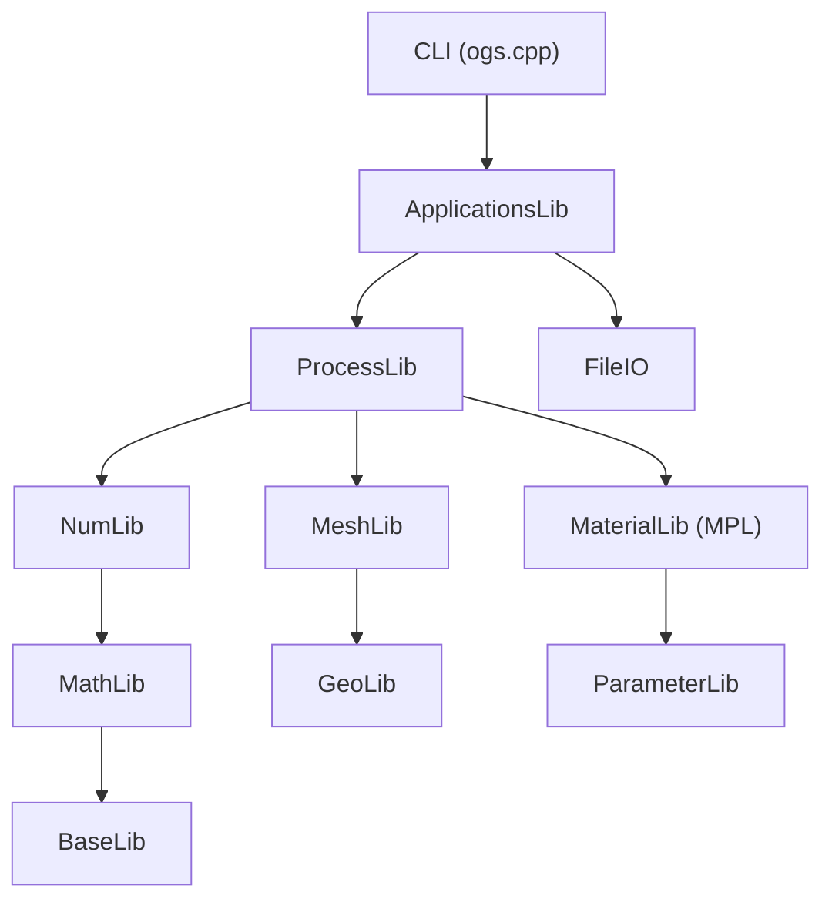

The codebase is organised into layered libraries with clear dependency directions:

- **Foundation layer** — `BaseLib` provides logging, file utilities, and configuration tree parsing. `MathLib` adds linear algebra (Eigen-based), integration, and interpolation. `NumLib` provides ODE solvers, time-stepping schemes, DOF management, and Newton-Raphson solvers.
- **Geometry layer** — `GeoLib` handles geometric objects (points, polylines, surfaces). `MeshLib` manages unstructured meshes, elements, and I/O. `MeshGeoToolsLib` and `MeshToolsLib` bridge geometry and mesh operations.
- **Materials layer** — `MaterialLib` implements the Material Property Library (MPL) for constitutive relations. `ParameterLib` provides spatially and temporally varying parameters.
- **Process layer** — `ProcessLib` contains 20+ physics implementations, each following a consistent four-file pattern (see below).
- **Applications layer** — `ApplicationsLib` orchestrates simulation setup and execution. `Applications/CLI` provides the `ogs` executable. `FileIO` handles file format conversions. `Applications/Utils` offers standalone mesh and data utilities.

### Entry Point and Simulation Flow

The main entry point is `Applications/CLI/ogs.cpp`. It parses command-line arguments, initialises MPI (if built with PETSc), sets up Python embedding, and delegates to the `Simulation` class:

```cpp
Simulation simulation(argc, argv);
simulation.initializeDataStructures(project, ...);
bool success = simulation.executeSimulation();
simulation.outputLastTimeStep();
```

The `Simulation` class (in `ApplicationsLib`) owns a `ProjectData` object that reads the XML project file (`.prj`), constructs meshes, parameters, media definitions, and process objects. It then creates and runs a `TimeLoop` that drives the time-stepping and nonlinear solver iterations.

### Process Implementation Pattern

Every physical process follows a standardised four-file structure:

1. **`{Name}Process.h`** — Inherits from `Process`, manages global assembly and time-stepping
2. **`{Name}ProcessData.h`** — Holds material properties, parameters, and solver configuration
3. **`{Name}LocalAssembler.h`** — Performs element-level assembly of mass (M), stiffness (K), and load (b) matrices
4. **`Create{Name}Process.h`** — Factory function that parses XML configuration and constructs the process

Current process implementations include: HeatConduction, LiquidFlow, RichardsFlow, HydroMechanics, ThermoHydroMechanics, ThermoRichardsMechanics, TH2M, SmallDeformation, LargeDeformation, PhaseField, ComponentTransport, SteadyStateDiffusion, WellboreSimulator, and others.

### Build System

OGS uses CMake (minimum 3.31) with Ninja as the recommended generator. The `CMakePresets.json` file provides ready-made configurations for common scenarios:

- **`release`** / **`debug`** — Standard optimised or debug builds
- **`petsc`** — Enables MPI-parallel builds via PETSc
- **`gui`** — Builds the Qt-based Data Explorer instead of the CLI

Key CMake options include `OGS_BUILD_CLI`, `OGS_BUILD_GUI`, `OGS_USE_PETSC`, `OGS_BUILD_UTILS`, and `OGS_BUILD_TESTING`. Element types and maximum FEM order are configurable via `OGS_MAX_ELEMENT_DIM` and `OGS_MAX_ELEMENT_ORDER`.

### Testing

The project uses Google Test for unit tests (located in `Tests/{LibName}/`) and CTest-driven integration tests that run full simulations from `.prj` project files with reference output comparison (in `Tests/Data/{ProcessName}/`). Tests are built when `OGS_BUILD_TESTING` is enabled and should be run from a Release build.

## Architecture & Library Layers

<details>
<summary>Relevant Files</summary>

<ul>
<li><code>Applications/CLI/ogs.cpp</code> &mdash; Main entry point for the OGS simulator</li>
<li><code>Applications/ApplicationsLib/Simulation.h</code> &mdash; High-level simulation driver</li>
<li><code>ProcessLib/Process.h</code> &mdash; Abstract base class for all physical processes</li>
<li><code>ProcessLib/TimeLoop.h</code> &mdash; Time-stepping orchestration</li>
<li><code>ProcessLib/CreateTimeLoop.cpp</code> &mdash; Factory for time loop construction from XML</li>
<li><code>BaseLib/ConfigTree.h</code> &mdash; XML configuration parser with error checking</li>
<li><code>NumLib/ODESolver/NonlinearSolver.h</code> &mdash; Newton-Raphson nonlinear solver interface</li>
<li><code>MaterialLib/MPL/Medium.h</code> &mdash; Material Property Library medium abstraction</li>
<li><code>MeshLib/Mesh.h</code> &mdash; Core mesh data structure</li>
</ul>

</details>

OpenGeoSys-6 is organised as a stack of C++ libraries, each with a well-defined responsibility. Higher layers depend only on lower ones, enforcing a clean separation between infrastructure, numerics, and physics.

### Layer Dependency Diagram

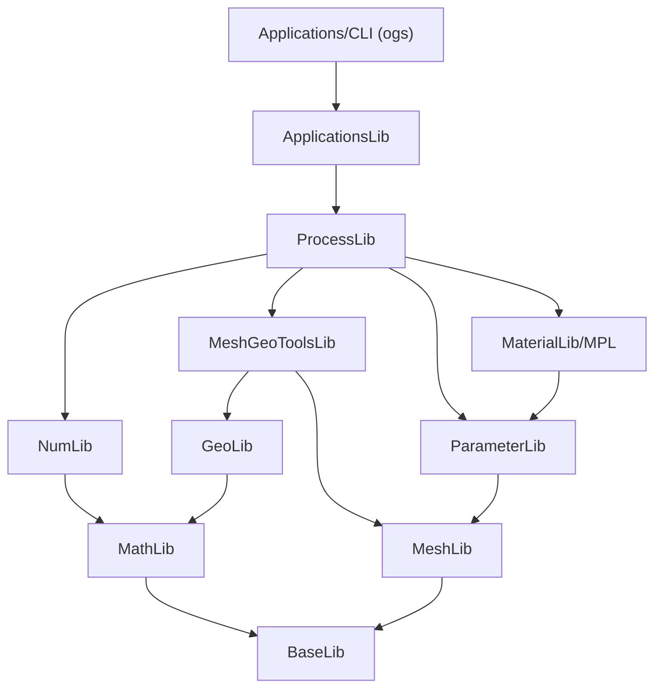

### Foundation Layer

**BaseLib** provides low-level utilities: logging (`spdlog`), file I/O helpers, date formatting, MPI initialisation, and the `ConfigTree` wrapper around Boost.PropertyTree. `ConfigTree` ensures that every XML configuration key is read exactly once, catching typos at runtime.

**MathLib** builds on BaseLib with linear algebra types (Eigen-based), integration rules (Gauss-Legendre), Kelvin vector utilities, and interpolation algorithms.

**NumLib** supplies the numerical machinery: ODE system abstractions, nonlinear solvers (Newton-Raphson via `NonlinearSolverBase`), time-stepping algorithms, DOF numbering (`LocalToGlobalIndexMap`), and finite element shape functions.

### Geometry and Mesh Layer

**GeoLib** manages geometric primitives&mdash;points, polylines, surfaces, and borehole data&mdash;used for defining boundary conditions and source terms.

**MeshLib** defines the `Mesh` class, which owns vectors of `Node` and `Element` objects plus typed property arrays (`Properties`/`PropertyVector`). It supports both serial and partitioned meshes (`NodePartitionedMesh`) for MPI-parallel runs.

**MeshGeoToolsLib** and **MeshToolsLib** bridge geometry to mesh, providing node searchers along polylines/surfaces and mesh generation/editing utilities.

### Materials and Parameters

**ParameterLib** represents spatially and temporally varying input data (constants, mesh-node fields, raster data, function expressions). Every physical parameter in a simulation is wrapped in a `Parameter` object.

**MaterialLib/MPL** (Material Property Library) models porous media at three scales: `Medium`, `Phase`, and `Component`. Each carries a `PropertyArray` of material properties (permeability, viscosity, density, etc.) evaluated through a common `Property` interface. Processes query `Medium::property(PropertyType)` to obtain constitutive values at integration points.

### Process Layer

**ProcessLib** is the largest library. The abstract `Process` class inherits from `NumLib::ODESystem` and defines the lifecycle hooks that the time loop calls:

1. `preTimestep` / `postTimestep` &mdash; per-step bookkeeping
2. `assemble` / `assembleWithJacobian` &mdash; global system assembly delegated to element-local assemblers
3. `preOutput` / `computeSecondaryVariable` &mdash; post-processing

Each concrete process (e.g. `HeatConductionProcess`, `HydroMechanicsProcess`, `TH2MProcess`) lives in its own subdirectory and follows a four-file pattern:

| File | Purpose |
|---|---|
| `{Name}Process.h` | Inherits `Process`, orchestrates assembly |
| `{Name}ProcessData.h` | Holds material references and solver config |
| `{Name}FEM.h` | Element-level local assembler (M, K, b matrices) |
| `Create{Name}Process.h` | Factory that reads XML and constructs the process |

Available process implementations include: HeatConduction, LiquidFlow, HydroMechanics, ThermoHydroMechanics, RichardsMechanics, TH2M, SmallDeformation, LargeDeformation, PhaseField, ComponentTransport, and others.

### Application Layer and Execution Flow

The `ogs` executable (`Applications/CLI/ogs.cpp`) parses command-line arguments, initialises MPI and Python, then delegates to the `Simulation` class. `Simulation::initializeDataStructures` reads the `.prj` XML file through `ProjectData`, which uses `ConfigTree` to construct meshes, parameters, media, processes, and the `TimeLoop`.

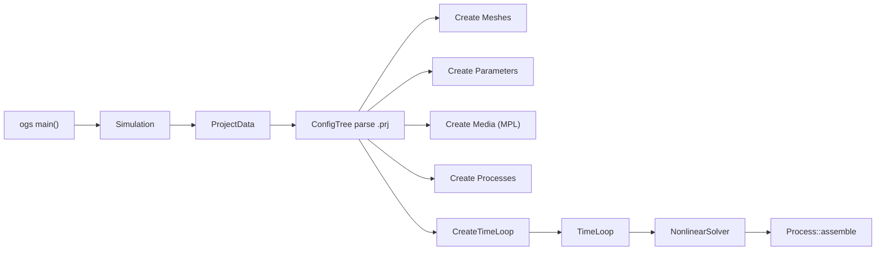

The `TimeLoop` drives the simulation: it computes adaptive time-step sizes, calls `Process::preTimestep`, invokes the nonlinear solver (which repeatedly calls `assembleWithJacobian`), and writes output. For coupled multi-physics problems, the loop supports a staggered coupling scheme through `NumLib::StaggeredCoupling`.

## Process Framework & Simulation Loop

<details>
<summary>Relevant Files</summary>

<ul>
<li><code>ProcessLib/Process.h</code> — Abstract base class for all simulation processes</li>
<li><code>ProcessLib/Process.cpp</code> — Process base class implementation</li>
<li><code>ProcessLib/TimeLoop.h</code> — Top-level simulation time loop</li>
<li><code>ProcessLib/TimeLoop.cpp</code> — Time loop implementation with adaptive time stepping</li>
<li><code>ProcessLib/ProcessVariable.h</code> — Named variables with mesh, BCs, and source terms</li>
<li><code>ProcessLib/LocalAssemblerInterface.h</code> — Element-level assembly interface</li>
<li><code>ProcessLib/VectorMatrixAssembler.h</code> — Global-to-local assembly orchestrator</li>
<li><code>ProcessLib/Assembly/ParallelVectorMatrixAssembler.h</code> — Thread-parallel assembly</li>
</ul>

</details>

The process framework is the central runtime engine of OpenGeoSys. It drives the simulation from start to finish by coordinating time stepping, nonlinear solving, and finite-element assembly across one or more coupled physical processes.

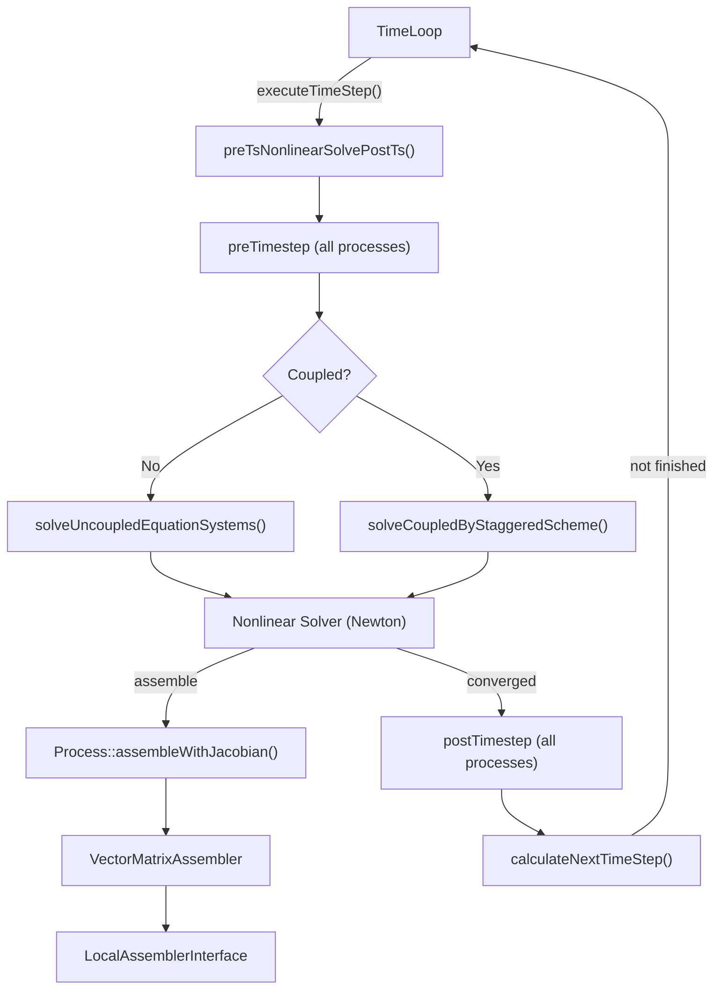

### TimeLoop — The Outer Driver

`TimeLoop` orchestrates the entire simulation. It holds solution vectors, per-process data, output handlers, and adaptive time stepping state. The main entry points called by the application are:

- **`initialize()`** — sets initial conditions, constructs DOF tables, and writes initial output.
- **`executeTimeStep()`** — advances time by the current `_dt`, calls `preTsNonlinearSolvePostTs()`, and returns whether the step succeeded.
- **`calculateNextTimeStep()`** — queries each process's time step algorithm and output constraints to compute the next `_dt`. It may reject the current step and repeat it with a smaller step size.

The method `preTsNonlinearSolvePostTs()` encapsulates one full timestep cycle: it calls `preTimestep` on all processes, dispatches either `solveUncoupledEquationSystems()` (independent processes) or `solveCoupledEquationSystemsByStaggeredScheme()` (coupled multi-physics), then calls `postTimestep` on success.

### Process — The Abstract Physics Interface

`Process` is the abstract base class that every physical simulation (heat transport, mechanics, two-phase flow, etc.) must implement. It inherits from `NumLib::ODESystem` with a first-order implicit quasi-linear ODE tag and a Newton nonlinear solver tag.

Key virtual methods that concrete processes override:

- **`initializeConcreteProcess()`** — creates local assemblers for each mesh element.
- **`assembleConcreteProcess()`** — assembles global M, K, b matrices.
- **`assembleWithJacobianConcreteProcess()`** — assembles the residual vector b and the Jacobian matrix.
- **`preTimestepConcreteProcess()` / `postTimestepConcreteProcess()`** — hooks for process-specific per-timestep logic.
- **`computeSecondaryVariableConcrete()`** — calculates derived quantities (e.g. stress, strain) after a successful nonlinear solve.

The base class manages boundary conditions (`_boundary_conditions`), source terms (`_source_term_collections`), the DOF-to-global index mapping (`_local_to_global_index_map`), and the global assembler (`_global_assembler`).

### ProcessVariable — Variables, BCs, and Source Terms

`ProcessVariable` binds a named field (e.g. temperature, displacement) to a mesh and collects its initial conditions, boundary condition configurations, source terms, and deactivated subdomains. The `Process` holds a nested vector of `ProcessVariable` references — one group per coupled process equation in the staggered scheme, or a single group for monolithic solves.

### Assembly: From Global to Local

Assembly follows a two-level pattern:

1. **`VectorMatrixAssembler`** iterates over mesh elements. For each element it extracts local DOF values from the global solution vectors using the `LocalToGlobalIndexMap`, calls the local assembler, then scatters the local contributions back into the global matrices.

2. **`LocalAssemblerInterface`** is the element-level contract. Each process creates concrete local assemblers (typically templated on shape functions and integration order) that compute:
   - `local_M_data` — mass/capacity matrix contributions
   - `local_K_data` — stiffness/conductivity matrix contributions
   - `local_b_data` — right-hand-side vector contributions
   - `local_Jac_data` — Jacobian matrix contributions (for Newton iteration)

For multi-threaded builds, `ParallelVectorMatrixAssembler` distributes element assembly across threads while maintaining correct global matrix assembly through thread-safe accumulation.

### Monolithic vs. Staggered Coupling

OGS supports two coupling strategies for multi-physics problems:

- **Monolithic** — all process variables are solved simultaneously in a single system of equations. The process uses one combined DOF table. Enabled by default (`_use_monolithic_scheme = true`).
- **Staggered** — each physical process is solved independently in sequence, iterating until coupling convergence is reached. Each process has its own DOF table and the `StaggeredCoupling` object manages the outer iteration loop. This uses `assembleForStaggeredScheme()` on the local assemblers.

The choice between these schemes is configured per-simulation in the project file and affects DOF table construction, local assembler dispatch, and the solver loop structure within `TimeLoop`.

## THMC Process Implementations

<details>
<summary>Relevant Files</summary>

<ul>
<li><code>ProcessLib/Process.h</code> — Abstract base class for all processes</li>
<li><code>ProcessLib/HeatConduction/HeatConductionProcess.h</code></li>
<li><code>ProcessLib/LiquidFlow/LiquidFlowProcess.h</code></li>
<li><code>ProcessLib/HydroMechanics/HydroMechanicsProcess.h</code></li>
<li><code>ProcessLib/ThermoHydroMechanics/ThermoHydroMechanicsProcess.h</code></li>
<li><code>ProcessLib/TH2M/TH2MProcess.h</code></li>
<li><code>ProcessLib/RichardsMechanics/RichardsMechanicsProcess.h</code></li>
<li><code>ProcessLib/SmallDeformation/SmallDeformationProcess.h</code></li>
<li><code>ProcessLib/ComponentTransport/ComponentTransportProcess.h</code></li>
</ul>

</details>

OpenGeoSys implements coupled Thermo-Hydro-Mechanical-Chemical (THMC) simulations through a modular process architecture. Each physical process inherits from the abstract `Process` base class and follows a consistent four-file pattern: a Process class, a ProcessData struct, a LocalAssembler, and a factory function.

### Architecture overview

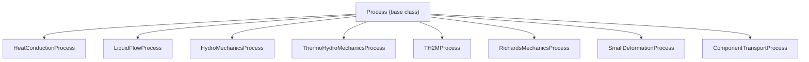

The base `Process` class uses the **Template Method Pattern**. It orchestrates assembly, time stepping, and boundary conditions, while each concrete process implements physics-specific virtual methods such as `assembleConcreteProcess` and `assembleWithJacobianConcreteProcess`. Most processes also use the **AssemblyMixin** (via CRTP) which handles the element-level assembly loop and supports matrix caching for linear problems.

### Single-physics processes

**HeatConduction** solves the thermal diffusion equation for temperature. It supports mass lumping and operates in monolithic mode only. This is the simplest scalar process in the framework.

**LiquidFlow** solves single-phase groundwater flow for pressure. It supports gravity, anisotropic permeability via rotation matrices, and aperture sizes for lower-dimensional elements.

**SmallDeformation** handles pure solid mechanics with small strains. It is templated on displacement dimension (2D/3D) and supports the B-bar method for avoiding volumetric locking, optional initial stress, and reference temperature for thermal strain.

### Coupled multi-physics processes

**HydroMechanics** couples fluid flow with solid deformation in fully saturated porous media. It solves for displacement and pressure and supports both monolithic and staggered (fixed-stress splitting) schemes. The staggered scheme uses separate DOF tables with base-node interpolation for pressure.

**ThermoHydroMechanics** extends this to three-way THM coupling, solving for temperature, pressure, and displacement. It includes numerical stabilisation (upwinding) and support for freezing via a separate ice constitutive relation. In staggered mode, it uses three process IDs: thermal (0), hydraulic (1), and mechanical (2).

**TH2M** is the most complex process, coupling THM physics with two-phase (gas + liquid) flow. It solves for gas pressure, capillary pressure, temperature, and displacement. A dedicated phase transition model handles evaporation and condensation. In staggered mode, it runs four sub-processes.

**RichardsMechanics** couples unsaturated flow (Richards equation) with mechanics, solving for capillary pressure and displacement. It features optional micro-porosity (dual-porosity) modelling and an explicit H-M coupling option for improved convergence in unsaturated zones.

**ComponentTransport** solves reactive transport of chemical species coupled with flow. Concentration-dependent density and viscosity create bidirectional coupling. It supports hydrodynamic dispersion, sorption retardation, decay reactions, and an external chemical solver interface.

### Process implementation pattern

Every process follows a four-file structure:

1. **`{Name}Process.h/.cpp`** — Inherits `Process`, wires assembly and time stepping
2. **`{Name}ProcessData.h`** — Struct holding material maps, solver configuration, and physics parameters
3. **`{Name}LocalAssembler.h`** — Element-level assembly of mass (M), stiffness (K), and RHS (b) matrices
4. **`Create{Name}Process.h/.cpp`** — Factory that parses XML configuration

```cpp
// Typical process class skeleton
template <int DisplacementDim>
class HydroMechanicsProcess final
    : public Process,
      private AssemblyMixin<HydroMechanicsProcess<DisplacementDim>>
{
    void initializeConcreteProcess(...) override;
    void assembleConcreteProcess(...) override;
    void assembleWithJacobianConcreteProcess(...) override;

    HydroMechanicsProcessData<DisplacementDim> _process_data;
    std::vector<std::unique_ptr<LocalAssemblerInterface>> local_assemblers_;
};
```

### Monolithic vs. staggered coupling

Processes that involve multiple physics (HM, THM, TH2M, RM) support two solving strategies:

- **Monolithic** — All equations are assembled into a single coupled system. Uses one shared DOF table.
- **Staggered** — Each physics is solved sequentially in coupling iterations. Requires custom DOF table construction with separate tables per sub-process and base-node interpolation for stable pressure discretisation.

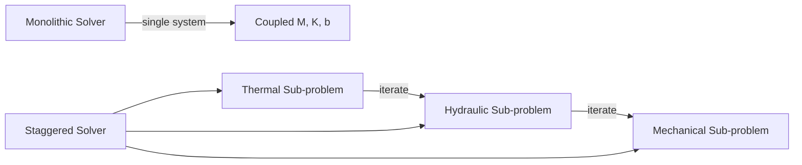

### Process variable summary

| Process | Variables | Dim Template | Coupling Schemes |
|---------|-----------|-------------|-----------------|
| HeatConduction | T | No | Monolithic |
| LiquidFlow | p | No | Monolithic |
| SmallDeformation | u | 2D/3D | Monolithic |
| HydroMechanics | u, p | 2D/3D | Monolithic, Staggered |
| ThermoHydroMechanics | T, p, u | 2D/3D | Monolithic, Staggered |
| TH2M | p\_g, p\_c, T, u | 2D/3D | Monolithic, Staggered |
| RichardsMechanics | p\_c, u | 2D/3D | Monolithic, Staggered |
| ComponentTransport | p, C | No | Monolithic |

Processes involving deformation are templated on `DisplacementDim` (2 or 3) for compile-time optimisation of shape matrices and strain operators. Scalar-only processes (HeatConduction, LiquidFlow, ComponentTransport) do not require this template parameter. All processes access material properties through `MaterialPropertyLib::MaterialSpatialDistributionMap`, which maps mesh elements to medium, phase, and component definitions configured in the project XML files.

## Material Property Library (MPL)

<details>
<summary>Relevant Files</summary>

<ul>
<li><code>MaterialLib/MPL/Medium.h</code> — Top-level material container</li>
<li><code>MaterialLib/MPL/Phase.h</code> — Phase representation (Solid, Liquid, Gas)</li>
<li><code>MaterialLib/MPL/Component.h</code> — Substance within a phase</li>
<li><code>MaterialLib/MPL/Property.h</code> — Base class for all properties</li>
<li><code>MaterialLib/MPL/PropertyType.h</code> — Property enum and O(1) lookup array</li>
<li><code>MaterialLib/MPL/VariableType.h</code> — State variables passed to property evaluation</li>
<li><code>MaterialLib/MPL/CreateMedium.cpp</code> — XML factory for Medium objects</li>
<li><code>MaterialLib/MPL/CreateProperty.cpp</code> — Dispatcher for property creation</li>
<li><code>MaterialLib/SolidModels/MechanicsBase.h</code> — Solid constitutive model interface</li>
<li><code>MaterialLib/FractureModels/FractureModelBase.h</code> — Fracture constitutive model interface</li>
</ul>

</details>

The Material Property Library (MPL) provides a hierarchical, extensible framework for defining and evaluating material properties at multiple scales. It is the central abstraction that decouples process-level physics from material behaviour, supporting scalar, vector, and tensor-valued properties with automatic derivative computation.

### Hierarchical Composition Model

MPL organises materials into three nested layers: **Medium**, **Phase**, and **Component**. Each layer can hold its own set of properties. A `Medium` contains one or more `Phase` objects (Solid, AqueousLiquid, Gas, FrozenLiquid), and each `Phase` contains one or more `Component` objects representing individual substances (e.g., water, dissolved salt).

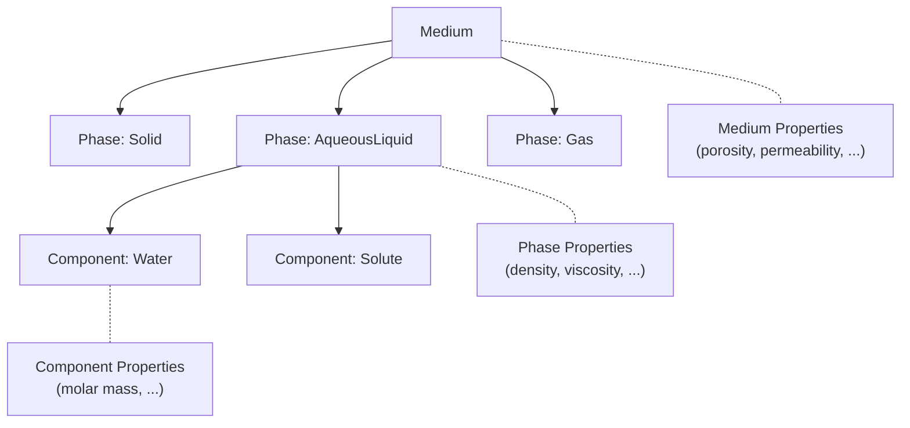

All three classes share the same property access interface:

```cpp
Property const& property(PropertyType const& p) const;
bool hasProperty(PropertyType const& p) const;
```

### Property Type System and Lookup

Properties are registered via the `PropertyType` enum in `PropertyType.h`, which defines 70+ property types (e.g., `density`, `porosity`, `permeability`, `viscosity`). Each entity stores its properties in a `PropertyArray` — a fixed-size `std::array` indexed by the enum, providing **O(1)** lookup.

```cpp
using PropertyArray =
    std::array<std::unique_ptr<Property>, PropertyType::number_of_properties>;
```

Undefined properties remain as `nullptr`. Accessing a missing property triggers a fatal error with a descriptive message, enforcing fail-fast semantics.

### Property Evaluation and Derivatives

The `Property` base class defines a virtual interface for evaluation at varying levels of complexity:

- **`value()`** — returns a constant stored value
- **`value(VariableArray, pos, t, dt)`** — computes from current state variables
- **`dValue(..., Variable)`** — first derivative with respect to a given variable
- **`d2Value(..., Variable, Variable)`** — second derivative for Jacobian assembly

The `VariableArray` struct carries the current simulation state (temperature, pressure, saturation, stress, strain, etc.) and is passed into every property evaluation call. Return values use `PropertyDataType`, a `std::variant` supporting `double`, Eigen vectors, and Eigen matrices.

### Property Implementations

Over 80 property implementations reside in `MaterialLib/MPL/Properties/`. They fall into three categories:

- **Generic models**: `Constant`, `Linear`, `Exponential`, `Curve` — reusable across any property type
- **Functional models**: Temperature- or pressure-dependent laws such as `IdealGasLaw`, `ClausiusClapeyron`
- **Domain-specific models**: `BishopsPowerLaw`, van Genuchten capillary pressure models, relative permeability curves

Each implementation may override `checkScale()` to enforce that it is used only at the correct hierarchical level (Medium, Phase, or Component).

### XML-Driven Creation

Materials are constructed from project file (`.prj`) XML via a chain of factory functions. `createMedium()` parses `&lt;medium&gt;` elements, delegates to `createPhase()` and `createProperty()`, and assembles the hierarchy. The property dispatcher in `CreateProperty.cpp` matches the `&lt;type&gt;` string from the configuration to the appropriate factory.

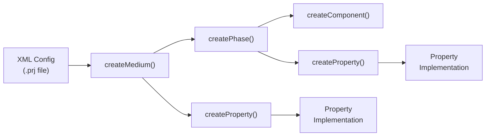

### Solid Constitutive Models

The `MaterialLib/SolidModels/` directory provides constitutive models for solid mechanics through the `MechanicsBase&lt;DisplacementDim&gt;` interface. Key features:

- **`integrateStress()`** — integrates the constitutive law over a time step, returning stress, updated state variables, and the consistent tangent matrix
- **`MaterialStateVariables`** — stores history-dependent state (plastic strain, creep strain) per integration point
- Returns `std::optional` to signal non-convergence

Implementations include `LinearElasticIsotropic`, `LinearElasticOrthotropic`, `CreepBGRa`, `Ehlers`, `Lubby2`, and an **MFront** integration layer for external material models.

### Fracture Constitutive Models

`MaterialLib/FractureModels/` provides models for fracture mechanics via `FractureModelBase&lt;DisplacementDim&gt;`. Unlike solid models, these operate on **fracture aperture** and **relative displacement** rather than strain tensors. Models include `CohesiveZoneModeI`, `Coulomb` friction, and `LinearElasticIsotropic` for elastic opening.

### Extending the Library

Adding a new material property requires four steps:

1. Add an entry to the `PropertyType` enum in `PropertyType.h`
2. Create a `Property` subclass implementing `value()`, `dValue()`, and optionally `d2Value()`
3. Write a `create*()` factory function that parses the XML configuration
4. Register the new type string in the dispatcher within `CreateProperty.cpp`

This pattern keeps the property system open for extension while maintaining a uniform evaluation interface across all process implementations.

## Numerical Methods & Solvers

<details>
<summary>Relevant Files</summary>

<ul>
<li><code>NumLib/ODESolver/NonlinearSolver.h</code> — Newton and Picard nonlinear solver implementations</li>
<li><code>NumLib/ODESolver/TimeDiscretizedODESystem.h</code> — Time-discretised ODE wrapper for nonlinear solvers</li>
<li><code>NumLib/ODESolver/NonlinearSystem.h</code> — Abstract interface for nonlinear systems</li>
<li><code>NumLib/ODESolver/MatrixTranslator.h</code> — Converts ODE matrices (M, K, b) to solver format</li>
<li><code>NumLib/NewtonRaphson.h</code> — Local (element-level) Newton-Raphson solver</li>
<li><code>NumLib/TimeStepping/CreateTimeStepper.cpp</code> — Factory for time-stepping algorithms</li>
<li><code>NumLib/Fem/ShapeFunction</code> — Finite element shape/basis function library</li>
<li><code>NumLib/DOF/LocalToGlobalIndexMap.h</code> — Degree-of-freedom index mapping</li>
<li><code>NumLib/StaggeredCoupling/StaggeredCoupling.h</code> — Staggered multi-physics coupling</li>
<li><code>MathLib/LinAlg</code> — Linear algebra backends (Eigen, PETSc)</li>
</ul>

</details>

The numerical core of OpenGeoSys solves transient, nonlinear partial differential equations by combining finite element spatial discretisation with implicit time integration and iterative nonlinear solvers. The stack is layered so that each concern (shape functions, DOF mapping, time discretisation, nonlinear iteration, linear algebra) is handled by a dedicated component in `NumLib` or `MathLib`.

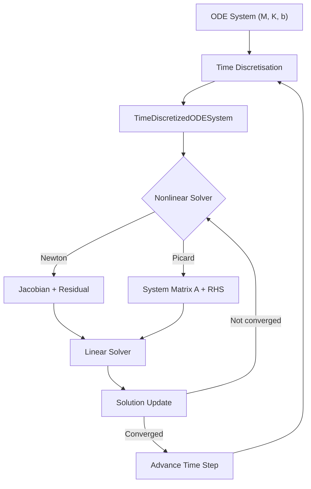

### Nonlinear Solvers

OGS formulates each process as a first-order implicit quasi-linear ODE: **M(x,t)·ẋ + K(x,t)·x − b(x,t) = 0**. The class `NonlinearSolverBase` defines the interface, with two tag-dispatched specialisations in `NonlinearSolver.h`:

- **Newton** (`NonlinearSolver<NonlinearSolverTag::Newton>`) — assembles a full Jacobian each iteration and solves J·Δx = −r. Supports configurable Jacobian recomputation frequency and globalisation strategies (fixed damping, line search) via `NewtonStepStrategy`.
- **Picard** (`NonlinearSolver<NonlinearSolverTag::Picard>`) — assembles only the system matrix A and right-hand side, iterating x = A⁻¹·rhs. Simpler but typically converges more slowly.

Both solvers delegate convergence checking to a `ConvergenceCriterion` object that can evaluate residual norms, solution-update norms, or both. A separate local Newton-Raphson solver (`NumLib/NewtonRaphson.h`) handles element-level constitutive iterations using Eigen-based linear algebra, returning `std::optional<int>` to signal convergence or failure.

### Time Discretisation and ODE System

`TimeDiscretizedODESystem` adapts an `ODESystem` (the process-level PDE) together with a `TimeDiscretization` scheme into a `NonlinearSystem` that the nonlinear solver can consume. A `MatrixTranslator` converts the raw ODE matrices into the form required by the chosen solver tag:

- For Newton: residual r = M·x̂ + K·x − b, Jacobian J = M·α + dK/dx·x − db/dx
- For Picard: A = M·α + K, rhs derived from M, K, b, and previous solutions

The coefficient α encodes the time-discretisation weight (e.g. 1/Δt for backward Euler).

### Time-Stepping Algorithms

`CreateTimeStepper` is a factory that instantiates one of four strategies from the project XML configuration:

| Algorithm | Description |
|-----------|-------------|
| **FixedTimeStepping** | User-prescribed constant or variable step sizes |
| **IterationNumberBasedTimeStepping** | Adapts Δt based on nonlinear iteration count |
| **EvolutionaryPIDcontroller** | PID-controlled adaptive stepping using error estimates |
| **SingleStep** | Trivial single-step driver for steady-state problems |

### Finite Element Shape Functions

`NumLib/Fem/ShapeFunction/` provides shape function classes for every supported element type (lines, triangles, quads, tetrahedra, hexahedra, prisms, pyramids) at multiple polynomial orders. Each class exposes `computeShapeFunction()` and `computeGradShapeFunction()` with compile-time constants `DIM`, `NPOINTS`, and `ORDER`. These are consumed by the local assemblers in `ProcessLib` during element-level integration.

### DOF Management

`LocalToGlobalIndexMap` is the central bookkeeping class that maps element-local indices to positions in the global matrix and vector. It handles multi-component variables, ghost nodes for domain decomposition, and boundary-constrained subsets. Key operations include:

- `operator()()` — returns `RowColumnIndices` for a given mesh element and component
- `getGlobalIndices()` — retrieves all DOF indices at a mesh location
- `deriveBoundaryConstrainedMap()` — creates a reduced map for boundary condition assembly

### Staggered Coupling

For multi-physics simulations (e.g. thermo-hydro-mechanical), `StaggeredCoupling` orchestrates an iterative loop over individual process solvers. The coupling structure is a tree of `CouplingNode` and `RootCouplingNode` objects, allowing hierarchical grouping. Each outer iteration calls `executeSingleIteration()` for every process, then checks per-process and global convergence criteria before advancing.

### Linear Algebra Backends

`MathLib/LinAlg/` abstracts the linear algebra layer behind `GlobalMatrix`, `GlobalVector`, and `GlobalIndexType` typedefs that resolve at compile time to either Eigen sparse types or PETSc distributed types (controlled by `USE_PETSC`). The `EigenLinearSolver` supports both direct factorisations (LU, Cholesky) and iterative methods (CG, BiCGSTAB, GMRES) with preconditioners. PETSc builds gain access to the full range of KSP solvers and can run across MPI ranks.

## Mesh, Geometry & IO

<details>
<summary>Relevant Files</summary>

<ul>
<li><code>MeshLib/Mesh.h</code> — Core mesh container (nodes, elements, properties)</li>
<li><code>MeshLib/Node.h</code> — Mesh node (3D point with ID)</li>
<li><code>MeshLib/Elements/Element.h</code> — Abstract base for all element types</li>
<li><code>MeshLib/Properties.h</code> — Property system for mesh item data</li>
<li><code>MeshLib/IO/readMeshFromFile.h</code>, <code>MeshLib/IO/writeMeshToFile.h</code> — Mesh file I/O dispatch</li>
<li><code>GeoLib/GEOObjects.h</code> — Geometry container (points, polylines, surfaces)</li>
<li><code>MeshGeoToolsLib/BoundaryElementsSearcher.h</code> — Boundary element identification</li>
<li><code>MeshToolsLib/MeshGenerators/MeshGenerator.h</code> — Regular mesh generation</li>
<li><code>Applications/FileIO</code> — Multi-format file readers and writers</li>
</ul>

</details>

The mesh and geometry subsystem provides the spatial discretisation and geometric description layers that underpin every OGS simulation. Three libraries collaborate: **MeshLib** owns the mesh data model, **GeoLib** manages geometric objects, and **MeshGeoToolsLib** bridges the two for boundary-condition assignment. **MeshToolsLib** adds mesh generation and editing utilities, while I/O is split between `MeshLib/IO` and `Applications/FileIO`.

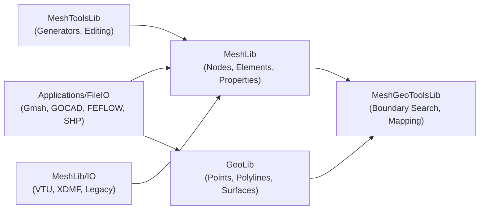

### Mesh Data Model

`MeshLib::Mesh` holds two core collections: a vector of `Node*` (3D coordinates with IDs) and a vector of `Element*` (topological cells). Each mesh also carries a `Properties` object that stores named, typed data vectors attached to nodes, cells, or integration points.

Elements use a **template-based type system**. The class `TemplateElement<RULE>` is instantiated with a rule struct that defines node counts, dimension, and topology. This gives both linear and quadratic variants of every shape:

- **1D:** `LineRule2`, `LineRule3`
- **2D:** `TriRule3`, `TriRule6`, `QuadRule4`, `QuadRule8`, `QuadRule9`
- **3D:** `TetRule4`, `TetRule10`, `HexRule8`, `HexRule20`, `PrismRule6`, `PrismRule15`, `PyramidRule5`, `PyramidRule13`

Properties are created and accessed through `MeshLib::Properties`:

```cpp
auto& prop = mesh.getProperties().createNewPropertyVector<int>(
    "MaterialIDs", MeshLib::MeshItemType::Cell, 1);
prop[element_id] = material_id;
```

### Geometry Objects

`GeoLib::GEOObjects` is a named-collection container for `Point`, `Polyline`, and `Surface` objects. Collections sharing the same name are implicitly linked (a polyline references points from its namesake point vector). Surfaces are represented as sets of triangles referencing the same point pool.

Spatial acceleration structures such as `AABB`, `OctTree`, and `SurfaceGrid` speed up geometric queries like point-in-surface tests.

### Mesh–Geometry Bridge

`MeshGeoToolsLib` connects geometry to the mesh for boundary-condition setup. `BoundaryElementsSearcher` accepts a geometric object (point, polyline, or surface) and returns the mesh boundary elements that lie on it. Internally it delegates to specialised helpers:

- `BoundaryElementsAtPoint` — finds elements at a point
- `BoundaryElementsAlongPolyline` — elements along a polyline
- `BoundaryElementsOnSurface` — elements on a surface

`MeshNodeSearcher` performs the underlying spatial lookup, and `GeoMapper` can project geometry onto mesh surfaces.

### Mesh Generation and Editing

`MeshToolsLib::MeshGenerator` provides factory functions for structured meshes: `generateLineMesh`, `generateRegularQuadMesh`, `generateRegularHexMesh`, and similar for triangles, tetrahedra, prisms, and pyramids. Additional generators handle layered meshes (`LayeredMeshGenerator`), raster-to-mesh conversion (`RasterToMesh`), and upgrading linear meshes to quadratic (`QuadraticMeshGenerator`).

Editing utilities in `MeshToolsLib/MeshEditing/` cover common operations: adding boundary layers, merging meshes, removing components, projecting points, and interpolating properties between meshes.

### File I/O

Mesh I/O is dispatched by file extension through `MeshLib::IO::readMeshFromFile` and `writeMeshToFile`. The primary format is **VTK Unstructured Grid (`.vtu`)**, handled by `VtuInterface`. Time-series output uses `PVDFile`, and parallel runs can use XDMF.

`Applications/FileIO` adds readers and writers for external tools:

| Format | Module | Capabilities |
|---|---|---|
| Gmsh (`.msh`) | `Gmsh/` | Read and write, adaptive meshing strategies |
| GOCAD | `GocadIO/` | Read structured grids and surfaces |
| FEFLOW | `FEFLOW/` | Mesh and geometry import/export |
| Shapefile | `SHPInterface` | Geometry import |
| TetGen | `TetGenInterface` | Tetrahedral mesh import |
| CSV | `CsvInterface` | Point data import/export |

Geometry files use GML/XML format (`.gml`) read through `GeoLib/IO/XmlIO`, with legacy `.gli` support retained for older projects. Raster data can be loaded via `AsciiRasterInterface` or `NetCDFRasterReader`.

## Boundary Conditions & Source Terms

<details>
<summary>Relevant Files</summary>

<ul>
<li><code>ProcessLib/BoundaryConditionAndSourceTerm/BoundaryCondition.h</code> — Base interface for all boundary conditions</li>
<li><code>ProcessLib/BoundaryConditionAndSourceTerm/CreateBoundaryCondition.cpp</code> — Factory dispatching BC creation by type string</li>
<li><code>ProcessLib/BoundaryConditionAndSourceTerm/DirichletBoundaryCondition.h</code> — Essential (fixed-value) boundary condition</li>
<li><code>ProcessLib/BoundaryConditionAndSourceTerm/NeumannBoundaryCondition.h</code> — Natural (prescribed-flux) boundary condition</li>
<li><code>ProcessLib/BoundaryConditionAndSourceTerm/GenericNaturalBoundaryCondition.h</code> — Reusable template for natural BCs</li>
<li><code>ProcessLib/BoundaryConditionAndSourceTerm/CreateSourceTerm.cpp</code> — Factory dispatching source term creation</li>
<li><code>ProcessLib/BoundaryConditionAndSourceTerm/NodalSourceTerm.h</code> — Point source at mesh nodes</li>
<li><code>ProcessLib/BoundaryConditionAndSourceTerm/VolumetricSourceTerm.h</code> — Distributed source over volume elements</li>
<li><code>ParameterLib/Parameter.h</code> — Time/space-varying parameter abstraction used by BCs and STs</li>
</ul>

</details>

Boundary conditions (BCs) and source terms (STs) define how external influences interact with the simulation domain. BCs prescribe values or fluxes on domain boundaries, while STs inject contributions into the governing equations across the domain interior or at specific nodes.

### Architecture Overview

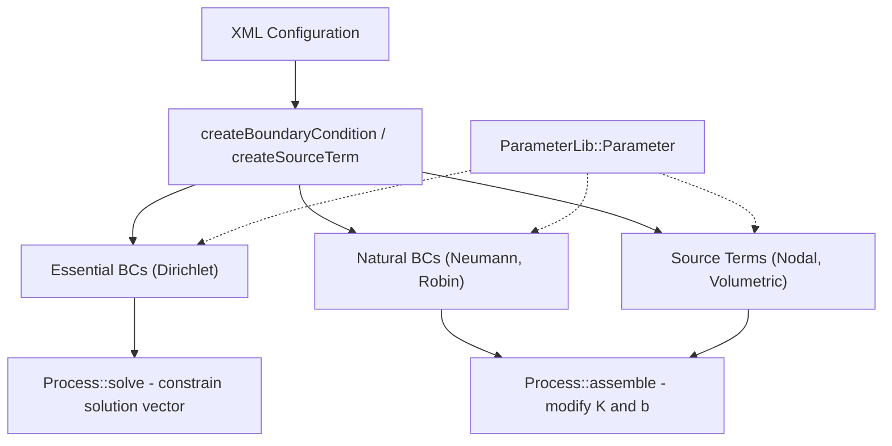

### Boundary Condition Base Class

The `BoundaryCondition` base class defines two virtual method families that separate **essential** from **natural** boundary conditions:

- **`getEssentialBCValues(t, x, bc_values)`** — Used by Dirichlet-type BCs to prescribe solution values directly. Populates an index-value vector that constrains the linear system.
- **`applyNaturalBC(t, x, process_id, K, b, Jac)`** — Used by Neumann/Robin-type BCs to modify the stiffness matrix **K** and right-hand-side vector **b** during assembly.

Both methods have empty default implementations, so each subclass overrides only the relevant one. Lifecycle hooks `preTimestep()` and `postTimestep()` support solution-dependent BCs.

### Essential Boundary Conditions

**DirichletBoundaryCondition** is the simplest BC type. It holds a reference to a `ParameterLib::Parameter` and a boundary mesh, and directly sets node values during each solve step. Variants include:

- **DirichletWithinTimeInterval** — active only during a configured time window
- **SolutionDependentDirichlet** — updates its values from the previous timestep solution via `postTimestep()`
- **ConstraintDirichlet** — dynamically activates/deactivates nodes based on a flux threshold

### Natural Boundary Conditions

Natural BCs use a shared template, `GenericNaturalBoundaryCondition`, parameterised by a data struct and a local assembler type. This avoids code duplication across Neumann, Robin, and other flux-type BCs.

```cpp
// NeumannBoundaryCondition is a type alias
using NeumannBoundaryCondition =
    GenericNaturalBoundaryCondition<NeumannBoundaryConditionData,
                                    NeumannBoundaryConditionLocalAssembler>;
```

The template creates per-element local assemblers that integrate flux contributions using shape functions. **Robin BCs** follow the same pattern but contribute to both **K** and **b**, implementing the condition α(u₀ − u) on the boundary.

### Source Terms

Source terms add contributions to the right-hand-side vector **b**. The base class `SourceTerm` defines a single pure-virtual method `integrate(t, x, b, jac)`.

| Type | Description |
|------|-------------|
| **Nodal** | Applies point loads directly at mesh nodes using parameter values |
| **Volumetric** | Integrates a distributed source f(x,t) over volume elements: ∫ f·φᵢ dΩ |
| **Anchor** | Vector/tensor source for mechanics problems (2D/3D specialised) |
| **Python** | User-defined source terms via Python callbacks |

`VolumetricSourceTerm` follows the same local-assembler pattern as natural BCs, creating typed assemblers per element that perform numerical quadrature.

### Factory and Creation Pattern

Both BCs and STs use a **string-dispatched factory** pattern. The XML `type` attribute selects which concrete class to instantiate:

```cpp
// In CreateBoundaryCondition.cpp
auto const type = config.peekConfigParameter<std::string>("type");
if (type == "Dirichlet") { /* create DirichletBoundaryCondition */ }
else if (type == "Neumann") { /* create NeumannBoundaryCondition */ }
else if (type == "Robin") { /* create RobinBoundaryCondition */ }
// ... 10+ additional types
```

Natural BCs use a **two-stage** creation: first parse the configuration into a typed config struct, then construct the BC object with resolved parameters and a derived boundary DOF table.

### Role of ParameterLib

Every BC and ST holds a `const` reference to one or more `ParameterLib::Parameter` instances. Parameters abstract time- and space-varying scalar or vector fields, supporting constant values, mesh-node data, raster inputs, and analytic functions. This decouples the BC/ST logic from the specifics of how values are provided, allowing the same Neumann BC class to handle both constant fluxes and complex spatiotemporal distributions.

### Assembly Integration

During each Newton iteration the process applies BCs and STs in order:

1. **Element assembly** builds the global stiffness matrix **K** and load vector **b**
2. **Natural BCs** call `applyNaturalBC()` to add boundary flux contributions to **K** and **b**
3. **Source terms** call `integrate()` to add body-force or point-source contributions to **b**
4. **Essential BCs** call `getEssentialBCValues()` to constrain specific DOFs before solving
