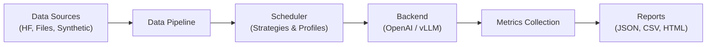
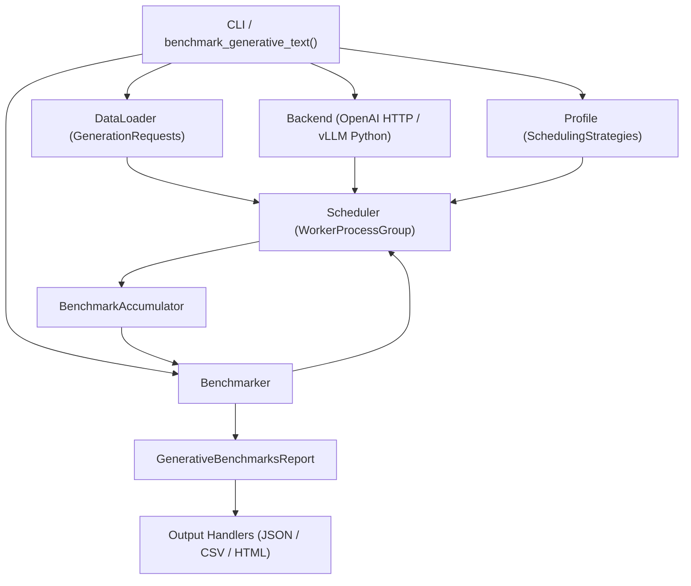
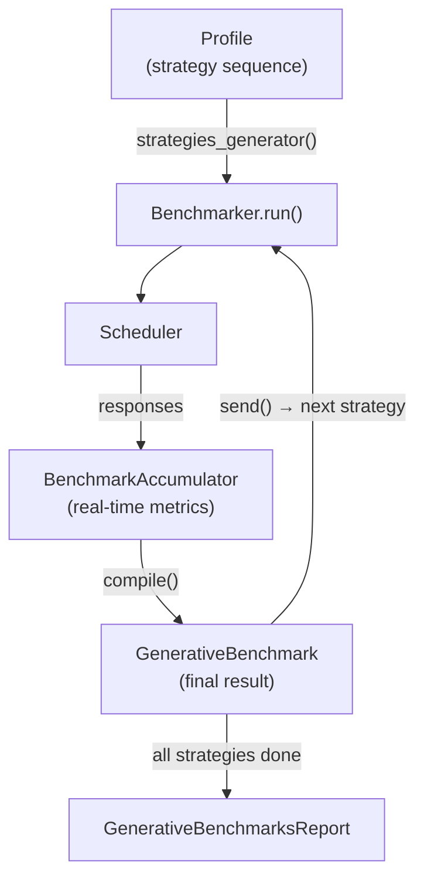
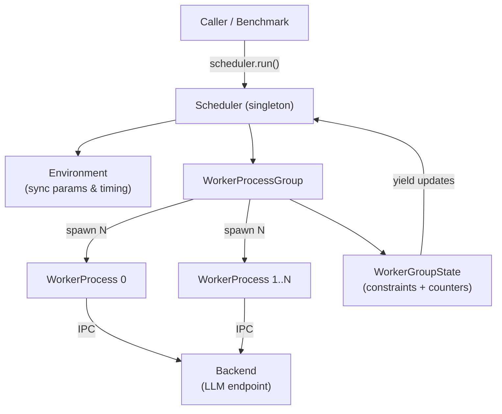
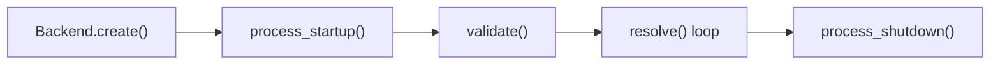
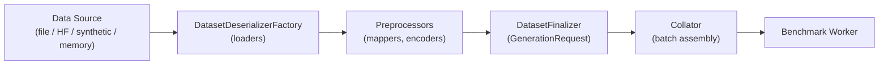
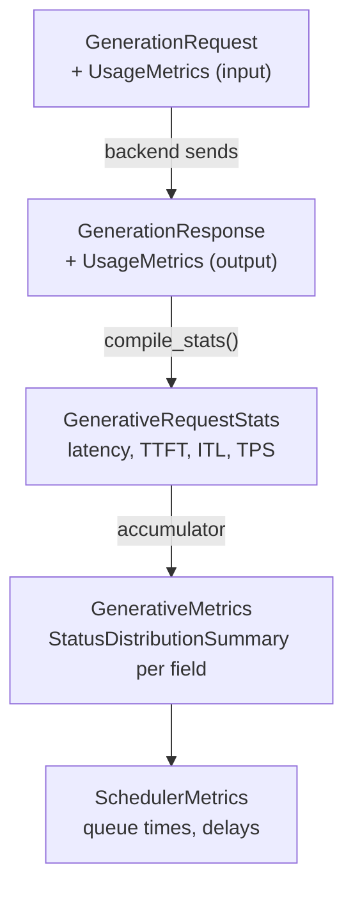
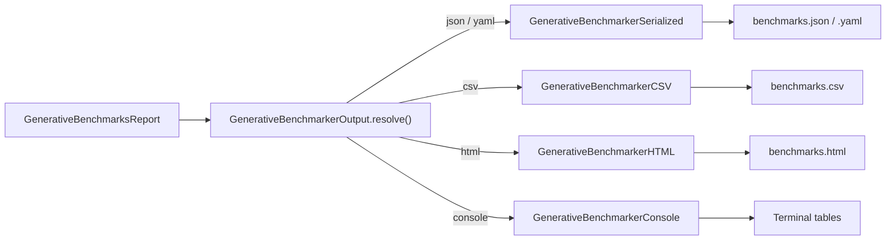
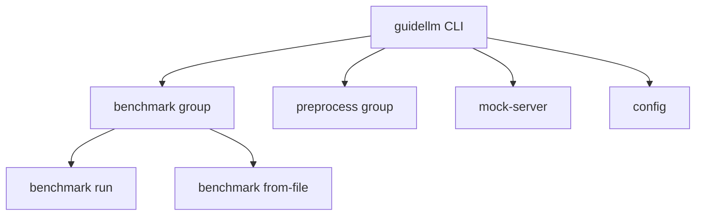
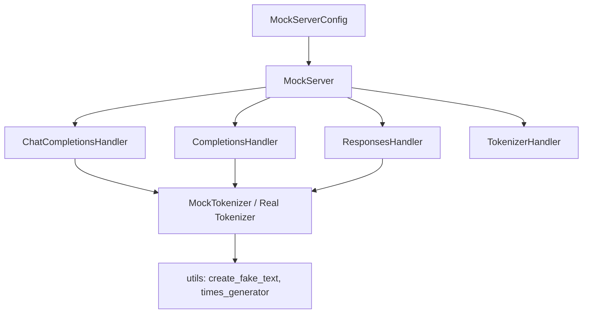

# GuideLLM: SLO-Aware LLM Inference Benchmarking Platform

Last updated on May 06, 2026 (Commit: [b10901d](https://github.com/vllm-project/guidellm/commit/b10901d0e9689c43eb4c6fc3f4e0713dbc16e27a))

## Overview & Key Concepts

<details>
<summary>Relevant Files</summary>

<ul>
<li><code>README.md</code></li>
<li><code>src/guidellm/__init__.py</code></li>
<li><code>src/guidellm/__main__.py</code></li>
<li><code>docs/index.md</code></li>
<li><code>docs/getting-started/install.md</code></li>
</ul>

</details>

**GuideLLM** is an SLO-aware benchmarking and evaluation platform for LLM inference. It simulates end-to-end interactions with OpenAI-compatible and vLLM-native servers, generates workload patterns reflecting production usage, and produces detailed reports to help teams understand system behavior, resource needs, and operational limits.



### What GuideLLM Does

GuideLLM focuses exclusively on LLM-specific workloads. Where general HTTP benchmarking tools measure raw request throughput, GuideLLM measures the metrics that matter for language model deployments:

- **TTFT** (Time To First Token) — latency from request submission to the first generated token
- **ITL** (Inter-Token Latency) — time between consecutive tokens during streaming generation
- **End-to-end latency distributions** — full statistical breakdowns (p50, p90, p99) per benchmark run
- **Token-level throughput** — input and output tokens per second under various load patterns

### Core Concepts

#### Backends

Backends are responsible for sending requests to and receiving responses from an inference server. GuideLLM supports:

- **OpenAI-compatible** — works with any server implementing the OpenAI REST API (`/completions`, `/chat/completions`, `/audio/transcription`, `/audio/translation`)
- **vLLM Python** — an in-process backend for direct vLLM integration without an HTTP round-trip

#### Data Pipeline

The data pipeline loads and prepares requests for the scheduler. GuideLLM supports multiple input sources:

- **HuggingFace datasets** — any dataset accessible via `datasets.load_dataset`
- **Local files** — `.json`, `.csv`, `.jsonl`, and `.txt` formats
- **Synthetic data** — token-count-based generation using `prompt_tokens=N,output_tokens=M` configs

#### Profiles and Scheduling Strategies

A **Profile** coordinates one or more scheduling strategies into a benchmark run. Each profile maps to a traffic shape:

| Profile | Behavior |
|---|---|
| `synchronous` | One request at a time, baseline latency |
| `concurrent` | Fixed number of parallel streams |
| `throughput` | Maximum concurrent load to find saturation point |
| `constant` | Requests at a fixed rate (req/s) |
| `poisson` | Randomized request arrivals at a target rate |
| `sweep` | Adaptive: runs synchronous + throughput first, then interpolates rates |

The `sweep` profile is particularly powerful — it automatically discovers the full operating range of a model by first measuring minimum (synchronous) and maximum (throughput) rates, then generating evenly spaced load points between them.

#### Scheduler

The scheduler manages concurrent request execution using a multiprocessing architecture with configurable worker groups. Key settings (controlled via `GUIDELLM__` environment variables or a `.env` file) include `max_concurrency`, `max_worker_processes`, and serialization format (`msgpack` or `msgspec`).

#### Outputs

After each run, GuideLLM writes:

- **`benchmarks.json`** — full structured record including config, per-request timings, and statistical summaries
- **`benchmarks.csv`** — compact tabular view suited for spreadsheets and BI tools
- **`benchmarks.html`** — visual dashboard with latency and throughput charts

### Installation

GuideLLM requires Python 3.10–3.13 on Linux or macOS.

```bash
# Recommended: installs with optional performance dependencies
pip install guidellm[recommended]

# From source (latest development)
pip install git+https://github.com/vllm-project/guidellm.git
```

Verify the install:

```bash
guidellm --help
```

### Quick Example

```bash
# Start a vLLM server
vllm serve "neuralmagic/Meta-Llama-3.1-8B-Instruct-quantized.w4a16"

# Run a sweep benchmark with synthetic 256-token prompts
guidellm benchmark \
  --target http://localhost:8000 \
  --profile sweep \
  --max-seconds 30 \
  --data "prompt_tokens=256,output_tokens=128"
```

The `sweep` profile runs synchronous and throughput baselines, then automatically fills in intermediate load points, giving a complete performance picture in a single command.

### Package Structure

The `guidellm` Python package under `src/guidellm/` is organized into focused submodules:

- `backends/` — server communication (OpenAI, vLLM Python)
- `benchmark/` — orchestration, profiles, output generation
- `data/` — loaders, preprocessors, and schema definitions
- `scheduler/` — request scheduling strategies and worker management
- `schemas/` — shared Pydantic models for requests, responses, and statistics
- `cli/` — Typer-based command-line interface (`guidellm benchmark`, `guidellm config`, etc.)
- `mock_server/` — lightweight mock inference server for testing without a real backend

## System Architecture & Data Flow

<details>
<summary>Relevant Files</summary>

<ul>
<li><code>docs/guides/architecture.md</code></li>
<li><code>src/guidellm/benchmark/entrypoints.py</code></li>
<li><code>src/guidellm/benchmark/benchmarker.py</code></li>
<li><code>src/guidellm/scheduler/scheduler.py</code></li>
<li><code>src/guidellm/backends/backend.py</code></li>
<li><code>src/guidellm/data/entrypoints.py</code></li>
</ul>

</details>

GuideLLM is structured as a layered pipeline where user-supplied configuration flows through data loading, scheduling, and backend execution before being compiled into a structured report. Each layer is independently replaceable — backends, schedulers, data sources, and output formats are all resolved from registries at runtime.

### High-Level Data Flow



### Layer 1 — Entrypoint & Resolution (`benchmark/entrypoints.py`)

`benchmark_generative_text()` is the primary async entry point. It accepts a `BenchmarkGenerativeTextArgs` object and sequentially resolves every runtime component before handing off to the `Benchmarker`:

1. **`resolve_backend`** — Instantiates the backend from a type string (e.g., `"openai_http"`), calls `process_startup()`, validates readiness, resolves the default model, then shuts down cleanly so the worker processes can re-initialize it later.
2. **`resolve_processor`** — Determines the tokenizer to use (falls back to the model identifier if none is provided).
3. **`resolve_request_loader`** — Builds a `DataLoader[GenerationRequest]` by chaining column mappers, preprocessors, a finalizer, a collator, and a sampler.
4. **`resolve_profile`** — Constructs a `Profile` that encapsulates one or more `SchedulingStrategy` instances (e.g., constant rate, throughput sweep) along with stop constraints.
5. **`resolve_output_formats`** — Converts output specifiers (`"json"`, `"csv"`, `"html"`, `"console"`) into configured handler objects.

### Layer 2 — Benchmarker (`benchmark/benchmarker.py`)

`Benchmarker` is a thread-safe singleton that loops over strategies produced by the `Profile` generator. For each strategy it:

- Builds a `BenchmarkConfig` capturing metadata about the run.
- Instantiates a fresh `BenchmarkAccumulator` (e.g., `GenerativeBenchmarkAccumulator`).
- Delegates request execution to `Scheduler.run()`.
- Calls `accumulator.update_estimate()` for every yielded response.
- Compiles the final `GenerativeBenchmark` via `benchmark_class.compile()` and **yields** it so callers can process results incrementally.

```python
async for benchmark in benchmarker.run(
    accumulator_class=GenerativeBenchmarkAccumulator,
    benchmark_class=GenerativeBenchmark,
    requests=request_loader,
    backend=backend,
    profile=profile,
    environment=NonDistributedEnvironment(),
    ...
):
    report.benchmarks.append(benchmark)
```

### Layer 3 — Scheduler (`scheduler/scheduler.py`)

`Scheduler` is itself a thread-safe singleton responsible for multiprocess coordination. Its `run()` method:

1. Resolves runtime constraints (`max_requests`, `max_seconds`, `max_error_rate`, …).
2. Syncs parameters with the `Environment` (supports distributed multi-node scenarios via `env.sync_run_params()`).
3. Creates a `WorkerProcessGroup` — a pool of async worker processes each holding a reference to the backend.
4. Starts all workers at a synchronized wall-clock time (`env.sync_run_start()`).
5. Streams `(response, request, request_info, SchedulerState)` tuples as workers complete requests.
6. Performs a final sync via `env.sync_run_end()` to collect any delayed distributed results.

### Layer 4 — Backend (`backends/backend.py`)

`Backend` is an abstract base class registered via `RegistryMixin`. Built-in implementations:

- **`openai_http`** — Speaks the OpenAI REST API; compatible with vLLM, TGI, and any OpenAI-compatible server.
- **`vllm_python`** — Calls vLLM's Python engine directly in-process.

The backend lifecycle inside each worker is: `process_startup()` → repeated `resolve()` calls → `process_shutdown()`. Because backends must be pickleable, all connections are created inside `process_startup()` after the worker forks.

### Layer 5 — Data Pipeline (`data/`)

The data pipeline converts raw sources into a stream of `GenerationRequest` objects:

- **`DataLoader`** wraps one or more dataset sources and applies a chain of `DatasetPreprocessor` steps (column mapping, token-count filtering, padding) followed by a `DatasetFinalizer`.
- A `GenerativeRequestCollator` assembles individual items into `GenerationRequest` batches with the correct prompt format for the target model.
- The `ProcessorFactory` lazily instantiates the HuggingFace tokenizer so it is only loaded once per worker process.

### Output & Reporting

After all benchmark strategies complete, each configured `GenerativeBenchmarkerOutput` handler receives the `GenerativeBenchmarksReport` via its `finalize()` method. Handlers write JSON, CSV, and HTML artifacts, or render a rich console summary. The `reimport_benchmarks_report()` entry point lets users re-export an existing JSON report to any supported format without re-running benchmarks.

## Benchmarking Engine: Profiles, Scenarios & Constraints

<details>
<summary>Relevant Files</summary>

<ul>
<li><code>src/guidellm/benchmark/benchmarker.py</code></li>
<li><code>src/guidellm/benchmark/profiles.py</code></li>
<li><code>src/guidellm/benchmark/schemas/generative/benchmark.py</code></li>
<li><code>src/guidellm/benchmark/schemas/generative/accumulator.py</code></li>
<li><code>src/guidellm/benchmark/schemas/generative/report.py</code></li>
<li><code>src/guidellm/benchmark/schemas/base.py</code></li>
<li><code>src/guidellm/benchmark/scenarios/chat.json</code></li>
<li><code>src/guidellm/benchmark/scenarios/rag.json</code></li>
</ul>

</details>

The benchmarking engine in GuideLLM is built around three cooperating concepts: **Profiles** (which strategy sequence to run), **Constraints** (when to stop each strategy), and **Scenarios** (pre-configured workload presets). Together they drive the `Benchmarker`, which orchestrates request scheduling, metric accumulation, and result compilation for each run.

### Execution Flow



The `Benchmarker.run()` method is an async generator. It pulls strategies one-by-one from the profile's `strategies_generator()`, runs the `Scheduler` for each, accumulates metrics in a `BenchmarkAccumulator`, then compiles and yields a `GenerativeBenchmark`. The compiled benchmark is fed back into the generator so adaptive profiles (like `SweepProfile`) can use measured rates to determine the next strategy.

### Profile Types

A **Profile** defines which scheduling strategies to run and in what order. All profiles share common fields: `constraints`, `rampup_duration`, and `completed_strategies`.

| Profile | `type_` value | Description |
|---|---|---|
| `SynchronousProfile` | `synchronous` | One request at a time; no `rate` accepted. Baseline latency measurement. |
| `ConcurrentProfile` | `concurrent` | Fixed concurrency levels; `rate` maps to a list of stream counts. |
| `ThroughputProfile` | `throughput` | Maximizes load; `rate` maps to `max_concurrency`. |
| `AsyncProfile` | `async` / `constant` / `poisson` | Fixed request rates using constant intervals or Poisson arrivals. |
| `SweepProfile` | `sweep` | Adaptive: runs synchronous then throughput, interpolates rates, then sweeps async. |

Profiles are registered with `@Profile.register(...)` and instantiated via the factory:

```python
profile = Profile.create(
    rate_type="sweep",
    rate=[10],        # sweep_size = 10
    random_seed=42,
)
```

### SweepProfile — Adaptive Rate Discovery

`SweepProfile` is the most powerful profile. It avoids guessing a rate range by measuring it:

1. **Synchronous run** — measures the single-request baseline rate.
2. **Throughput run** — measures the maximum saturated rate.
3. **Interpolated async runs** — `numpy.linspace` between the two measured rates generates `sweep_size - 2` intermediate rates, each run as an `AsyncConstantStrategy` or `AsyncPoissonStrategy`.

```python
self.measured_rates = list(
    np.linspace(self.synchronous_rate, self.throughput_rate, self.sweep_size - 1)
)[1:]  # skip synchronous (already run)
```

### Constraints and Warmup/Cooldown

**Constraints** tell the scheduler when to stop each strategy (e.g., after N seconds or M requests). They are resolved through `ConstraintsInitializerFactory` and passed per-strategy from `next_strategy_constraints()`.

**Warmup and cooldown** are configured via `TransientPhaseConfig`, which supports:

- `percent` — fraction of total duration or request count (e.g., `0.1` = 10%)
- `value` — absolute seconds or request count
- `mode` — one of `duration`, `requests`, `prefer_duration`, `prefer_requests`, or `both`

```python
# Exclude first 10% and last 10% of run from metrics
warmup = TransientPhaseConfig(percent=0.1, mode="prefer_duration")
cooldown = TransientPhaseConfig(percent=0.1, mode="prefer_duration")
```

Requests inside the warmup/cooldown windows are tracked but excluded from the final `GenerativeBenchmark` metrics, ensuring only stable steady-state data is reported.

### Built-in Scenarios

Scenarios are JSON files that bundle a profile type with a data spec, providing ready-made workload configurations:

**`scenarios/chat.json`** — Simulates interactive chat traffic:
```json
{
  "profile": "sweep",
  "data": ["prompt_tokens=512,prompt_tokens_stdev=128,...,output_tokens=256,..."]
}
```

**`scenarios/rag.json`** — Simulates retrieval-augmented generation with large contexts:
```json
{
  "profile": "sweep",
  "data": ["prompt_tokens=4096,prompt_tokens_stdev=512,...,output_tokens=512,..."]
}
```

Both use the `sweep` profile so a single command automatically explores the full throughput-latency curve for that workload shape.

### Benchmark Result Schema

Each strategy execution produces a `GenerativeBenchmark` containing:

- **`config`** (`BenchmarkConfig`) — full execution parameters: strategy, constraints, warmup/cooldown, profile, backend, and environment info.
- **`scheduler_metrics`** — timing boundaries: `request_start_time`, `measure_start_time`, `measure_end_time`, `request_end_time`.
- **`metrics`** (`GenerativeMetrics`) — statistical distributions for latency, throughput, token rates, TTFT, and ITL.
- **`requests`** — per-request stats split into `successful`, `incomplete`, and `errored` buckets.

Multiple `GenerativeBenchmark` objects from a single run series are collected into a `GenerativeBenchmarksReport`, which can be saved to JSON or YAML for later analysis.

## Scheduler, Strategies & Worker Processes

<details>
<summary>Relevant Files</summary>

<ul>
<li><code>src/guidellm/scheduler/scheduler.py</code></li>
<li><code>src/guidellm/scheduler/strategies.py</code></li>
<li><code>src/guidellm/scheduler/worker.py</code></li>
<li><code>src/guidellm/scheduler/worker_group.py</code></li>
<li><code>src/guidellm/scheduler/environments.py</code></li>
<li><code>src/guidellm/scheduler/schemas.py</code></li>
<li><code>src/guidellm/scheduler/constraints/constraint.py</code></li>
</ul>

</details>

The scheduler subsystem is the execution engine behind GuideLLM benchmarks. It coordinates distributed request processing across multiple worker processes, applies timing strategies, enforces stopping constraints, and aggregates results—all through a clean async interface.



### Scheduler

`Scheduler` (`scheduler.py`) is a **thread-safe singleton** that exposes a single `async def run()` method. It is generic over `RequestT` and `ResponseT`, so it works with any request/response pair.

Key responsibilities of `run()`:

1. Resolves raw constraint kwargs into typed `Constraint` objects via `ConstraintsInitializerFactory`.
2. Calls `env.sync_run_params()` to distribute requests, strategy, and constraints to each node.
3. Creates a `WorkerProcessGroup`, waits for all workers to reach a startup barrier, then fires the synchronized start time.
4. Iterates `worker_group.request_updates()`, forwarding each `(response, request, request_info, state)` tuple to `env.update_run_iteration()` and then yielding it to the caller.
5. On completion, drains `env.sync_run_end()` to collect any results from remote nodes.
6. Guarantees cleanup via a `try/finally` block that calls `worker_group.shutdown()`.

```python
async for response, request, info, state in scheduler.run(
    requests=dataset,
    backend=backend,
    strategy=AsyncConstantStrategy(rate=10.0),
    env=None,          # defaults to NonDistributedEnvironment
    max_requests=500,
    max_duration=60,
):
    process(response, info)
```

### Scheduling Strategies

All strategies extend `SchedulingStrategy` and implement two abstract methods:

- `next_request_time(worker_index)` — returns the Unix timestamp at which the next request should start.
- `request_completed(request_info)` — called after each request finishes; used to update internal timing state.

Shared multiprocessing primitives (`mp_context.Value`, `mp_context.Event`) are initialized via `init_processes_timings()` so all workers see a consistent global clock.

| Strategy | Key Field | Behaviour |
|---|---|---|
| `SynchronousStrategy` | — | One request at a time; next starts only after previous completes |
| `ConcurrentStrategy` | `streams` | Fixed number of parallel streams; supports optional `rampup_duration` |
| `ThroughputStrategy` | `max_concurrency` | Fire-and-forget; maximises load up to optional concurrency cap |
| `AsyncConstantStrategy` | `rate` (req/s) | Uniform intervals; optional linear ramp-up from 0 to target rate |
| `AsyncPoissonStrategy` | `rate` (req/s) | Exponentially distributed inter-arrival times for realistic traffic |

`ConcurrentStrategy` and `ThroughputStrategy` both accept a `rampup_duration` to linearly spread the initial burst of requests, preventing thundering-herd effects at benchmark start.

### Worker Processes

`WorkerProcess` (`worker.py`) runs inside a spawned OS process and drives the actual request lifecycle:

1. **Startup** — Initialises the backend (`process_startup` + `validate`) and the IPC messaging layer, then waits on a `Barrier` until every peer is ready.
2. **Processing loop** — Acquires a semaphore slot (enforcing `async_limit`), calls `strategy.next_request_time()`, optionally sleeps until that moment, dequeues the next conversation from the IPC channel, and calls `backend.resolve()`.
3. **Status updates** — Publishes `pending → in_progress → first_token → completed | errored | cancelled` transitions via `_send_update()`.
4. **Shutdown** — On `constraint_reached_event`, cancels pending work; runs a `_cancel_requests_loop` for any remaining queued items; then shuts down the backend and messaging.

The worker uses `uvloop` for the asyncio event loop when available, reducing scheduling latency.

### WorkerProcessGroup

`WorkerProcessGroup` (`worker_group.py`) orchestrates all workers from the main process:

- Computes `num_processes` and per-process `async_limit` from strategy/backend limits and global settings.
- Chooses an IPC transport (`queue`, `manager_queue`, or `pipe`) from settings.
- Starts a background `_process_health_monitor` task that detects workers killed by OS signals (SIGSEGV, OOM) and sets the `error_event` before the Python exception handler has a chance.

`WorkerGroupState` runs inline in the main process (no extra process), maintains thread-safe counters for every request state transition, and evaluates all registered constraints after each update via `_update_with_constraints()`. When a constraint signals `stop_processing`, it sets `constraint_reached_event`; when all work is done, it sets `shutdown_event`.

### Environment Abstraction

`Environment` (`environments.py`) is an abstract interface that decouples the scheduler from deployment topology. It defines a five-step lifecycle:

1. `sync_run_params()` — distribute workload and synchronise parameters
2. `sync_run_start()` — return a coordinated start timestamp
3. `update_run_iteration()` — called after every yielded update
4. `sync_run_error()` — propagate errors across nodes
5. `sync_run_end()` — aggregate remote results and raise stored errors

`NonDistributedEnvironment` is the default (single-machine) implementation; all methods are no-ops except `sync_run_start()` (returns `now + start_delay`) and `sync_run_end()` (re-raises any stored errors).

### Constraints

Constraints are callable objects satisfying the `Constraint` protocol:

```python
def my_constraint(state: SchedulerState, request: RequestInfo) -> SchedulerUpdateAction: ...
```

`SchedulerUpdateAction` carries two control signals:

- `request_queuing`: `"continue"` or `"stop"` — controls whether new requests are enqueued.
- `request_processing`: `"continue"`, `"stop_local"`, or `"stop_all"` — controls whether workers keep pulling from the queue.

Built-in constraint initialisers (e.g., `MaxNumberConstraint`, `MaxDurationConstraint`) are registered with `ConstraintsInitializerFactory` and resolved from plain kwargs like `max_requests=500` or `max_duration=60` before the run begins. Constraints are evaluated on every state update, enabling smooth, low-latency termination without polling.

## Backend Layer: OpenAI HTTP & vLLM Python

<details>
<summary>Relevant Files</summary>

<ul>
<li><code>src/guidellm/backends/backend.py</code></li>
<li><code>src/guidellm/backends/openai/http.py</code></li>
<li><code>src/guidellm/backends/openai/request_handlers.py</code></li>
<li><code>src/guidellm/backends/vllm_python/vllm.py</code></li>
<li><code>src/guidellm/backends/vllm_python/vllm_response.py</code></li>
<li><code>docs/guides/backends.md</code></li>
</ul>

</details>

GuideLLM provides two production-ready backends that handle all communication with generative AI models. The `openai_http` backend talks to any OpenAI-compatible HTTP server, while the `vllm_python` backend drives vLLM's `AsyncLLMEngine` directly in-process — no HTTP layer required.

### Abstract Base: `Backend`

Every backend inherits from `Backend` (`src/guidellm/backends/backend.py`), which blends a registry mixin with the `BackendInterface` protocol. Registering a backend is one decorator:

```python
@Backend.register("my_backend")
class MyBackend(Backend):
    ...
```

Instances are created through the factory method `Backend.create("openai_http", target="http://...")`, which looks up the registry and forwards kwargs to the constructor. The lifecycle follows five phases:

1. **Create** — configure the backend object (pickleable, safe to ship across processes)
2. **`process_startup`** — allocate resources (HTTP client, engine) inside the worker
3. **`validate`** — verify connectivity or engine health
4. **`resolve`** — accept a `GenerationRequest` and yield `(GenerationResponse, RequestInfo)` tuples
5. **`process_shutdown`** — release resources cleanly



### OpenAI HTTP Backend (`openai_http`)

`OpenAIHTTPBackend` (`src/guidellm/backends/openai/http.py`) connects to any OpenAI-compatible server using an async `httpx` client with HTTP/2 enabled by default. Key constructor parameters:

- `target` — base URL (trailing `/v1` is stripped automatically)
- `model` — model ID; auto-detected from `/v1/models` if omitted
- `request_format` — which API endpoint to call (see table below)
- `api_key` — sets `Authorization: Bearer` header
- `stream` — SSE streaming (default `True`)
- `validate_backend` — health-check config; defaults to a `GET /health` ping

**Supported request formats:**

| Format string | Endpoint |
|---|---|
| `/v1/chat/completions` (default) | Chat completions |
| `/v1/completions` | Legacy text completions |
| `/v1/responses` | OpenAI Responses API |
| `/v1/audio/transcriptions` | Audio transcription |
| `/v1/audio/translations` | Audio translation |
| `/v1/embeddings` | Embeddings (no streaming) |
| `/pooling` | vLLM pooling endpoint |

During `resolve`, the backend selects the correct `OpenAIRequestHandler` from `OpenAIRequestHandlerFactory`, formats the HTTP body, and either awaits a full response or iterates an SSE stream, capturing precise per-token timings in `RequestInfo.timings`.

### Request Handler System

`OpenAIRequestHandlerFactory` is a registry that maps endpoint paths to handler classes. Each handler implements four methods:

- `format(data, ...)` → `GenerationRequestArguments` — builds the request body
- `add_streaming_line(line)` → `int | None` — parses one SSE chunk; returns `None` on completion
- `compile_streaming(request, args)` → `GenerationResponse` — assembles the final response
- `compile_non_streaming(request, args, response)` → `GenerationResponse` — wraps a single full response

The inheritance chain is `TextCompletionsRequestHandler` → `ChatCompletionsRequestHandler` → `AudioRequestHandler` / `PoolingRequestHandler`. `ResponsesRequestHandler` and `EmbeddingsRequestHandler` stand independently. All handlers populate `UsageMetrics` (input/output token counts, word counts, multimodal counts) from the API usage payload.

Custom handlers can be injected per-request via the `request_handlers` dict on `OpenAIHTTPBackend`, allowing handler overrides without touching the global registry.

### vLLM Python Backend (`vllm_python`)

`VLLMPythonBackend` (`src/guidellm/backends/vllm_python/vllm.py`) loads and runs vLLM's `AsyncLLMEngine` directly. There is no network round-trip; inference happens inside the same process group. This eliminates HTTP serialization overhead and enables true token-by-token timing.

```python
backend = VLLMPythonBackend(
    model="meta-llama/Llama-3-8B-Instruct",
    vllm_config={"tensor_parallel_size": 1, "gpu_memory_utilization": 0.9},
    request_format="default-template",  # use tokenizer's built-in chat template
)
```

Key behaviors:

- **Single process only** — `processes_limit` returns `1` because one `AsyncLLMEngine` is already parallelized internally via vLLM.
- **CPU fallback** — when CUDA is absent and no `device` is in `vllm_config`, the backend sets `device="cpu"` automatically.
- **Chat template control** — `request_format` accepts `"plain"` (raw concatenation), `"default-template"` (tokenizer default), a file path, or an inline Jinja2 string.
- **Multimodal support** — image and audio columns are converted to vLLM `multi_modal_data` dicts; PIL images for vision models, decoded numpy arrays for audio models. Requires `guidellm[vision]` or `guidellm[audio]` extras.
- **Cancel safety** — `asyncio.CancelledError` is caught in `resolve`, and whatever partial output vLLM produced is compiled into a `GenerationResponse` before re-raising.

### Passing Sampling Parameters

Both backends accept extra sampling parameters through the `extras` field in `--backend-kwargs`:

```bash
guidellm benchmark \
  --target http://localhost:8000 \
  --model meta-llama/Llama-3-8B-Instruct \
  --data "prompt_tokens=256,output_tokens=128" \
  --backend-kwargs '{"extras": {"body": {"temperature": 0.6, "top_p": 0.95}}}'
```

The `extras.body` dict is merged into every outgoing request body. `extras.headers` and `extras.params` allow injecting HTTP headers and query parameters respectively.

## Data Pipeline: Loaders, Preprocessors & Collators

<details>
<summary>Relevant Files</summary>

<ul>
<li><code>src/guidellm/data/loaders.py</code></li>
<li><code>src/guidellm/data/builders.py</code></li>
<li><code>src/guidellm/data/collators.py</code></li>
<li><code>src/guidellm/data/preprocessors/preprocessor.py</code></li>
<li><code>src/guidellm/data/preprocessors/mappers.py</code></li>
<li><code>src/guidellm/data/preprocessors/encoders.py</code></li>
<li><code>src/guidellm/data/deserializers/deserializer.py</code></li>
<li><code>src/guidellm/data/deserializers/synthetic.py</code></li>
<li><code>src/guidellm/data/finalizers.py</code></li>
<li><code>src/guidellm/data/schemas.py</code></li>
<li><code>docs/guides/datasets.md</code></li>
</ul>

</details>

GuideLLM's data pipeline transforms raw input sources — files, Hugging Face datasets, synthetic configs, or in-memory objects — into `GenerationRequest` objects consumed by benchmarking workers. The pipeline is composed of four sequential stages: **deserialization**, **preprocessing**, **finalization**, and **collation**.



### Stage 1 — Deserialization

`DatasetDeserializerFactory` (`deserializers/deserializer.py`) is the entry point. It tries each registered `DatasetDeserializer` in turn until one succeeds, returning a HuggingFace `Dataset` or `IterableDataset`.

Four built-in deserializers cover all common sources:

- **`SyntheticTextDatasetDeserializer`** — generates realistic prompt/output pairs on the fly from a `SyntheticTextDatasetConfig` (e.g. `prompt_tokens=256,output_tokens=128`).
- **`HuggingFaceDatasetDeserializer`** — loads any HF Hub ID or local directory via `datasets.load_dataset`.
- **`FileDatasetDeserializer`** — handles `.txt`, `.csv`, `.jsonl`, `.json`, `.parquet`, `.arrow`, `.hdf5`.
- **`MemoryDatasetDeserializer`** — wraps Python lists or dicts already in memory.

```python
dataset = DatasetDeserializerFactory.deserialize(
    data="garage-bAInd/Open-Platypus",
    processor_factory=lambda: tokenizer,
    random_seed=42,
    split="train",
)
```

### Stage 2 — Preprocessing

Preprocessors are plain callables that accept and return `list[dict[str, Any]]`. They are applied in sequence inside `DatasetsIterator.generator()`.

**`GenerativeColumnMapper`** (`preprocessors/mappers.py`) is the most important preprocessor. It inspects each dataset's column names and maps them to logical column types using configurable regex patterns with pluralisation and turn-suffix support:

| Logical Type | Default Column Names |
|---|---|
| `text_column` | `prompt`, `instruction`, `question`, `input`, `context`, `text` |
| `prefix_column` | `system_prompt`, `system`, `prefix` |
| `prompt_tokens_count_column` | `prompt_tokens_count`, `input_tokens_count` |
| `output_tokens_count_column` | `output_tokens_count`, `completion_tokens_count` |
| `image_column` | `image`, `picture`, `photo` |

Custom mappings override the defaults and are passed as a dict:

```python
GenerativeColumnMapper(column_mappings={
    "text_column": "user_query",
    "prefix_column": "system_message",
})
```

**`MediaEncoder`** (`preprocessors/encoders.py`) is a second built-in preprocessor that encodes image, audio, and video columns into metric-ready dicts (pixel counts, frame counts, byte sizes) using optional extra libraries.

`DataDependentPreprocessor` is an extended protocol used by `GenerativeColumnMapper` that adds a `setup_data()` call before iteration. This allows the mapper to inspect all dataset column names once and build its regex-resolved mapping table before any rows are processed.

### Stage 3 — Finalization

`GenerativeRequestFinalizer` (`finalizers.py`) converts the structured column dicts output by the preprocessors into `GenerationRequest` objects. For each conversation turn it:

1. Accumulates `prompt_tokens_count` into `input_metrics.text_tokens`.
2. Accumulates `output_tokens_count` into `output_metrics.text_tokens`.
3. Calls `add_text_metrics()` on each prefix and prompt text (word/char counts).
4. Adds image pixel/byte counts, video frame/second/byte counts, and audio sample/second/byte counts.

```python
request: GenerationRequest = finalizer([{"text_column": ["Hello world"], ...}])
```

### Stage 4 — Collation &amp; Loading

`GenerativeRequestCollator` (`collators.py`) is a thin wrapper that unwraps single-element batches (batch size &gt; 1 is not yet supported) and returns the `GenerationRequest` directly.

`DataLoader` (`loaders.py`) wraps PyTorch's `DataLoader` around a `DatasetsIterator`. It manages:

- **Epoch tracking** — calls `set_epoch()` on the iterator to vary random seeds across epochs.
- **Worker sharding** — `DatasetsIterator.__iter__` uses `worker_info` to split items across parallel workers without overlap.
- **Pre-caching** — if `data_samples` is set, all samples are eagerly generated into a list at construction time, enabling shuffling without stream restarts.

```python
loader = DataLoader(
    data=["openai/gsm8k"],
    data_args=[{"split": "train"}],
    data_samples=0,          # 0 = streaming mode
    processor_factory=lambda: tokenizer,
    preprocessors=[GenerativeColumnMapper()],
    finalizer=GenerativeRequestFinalizer(),
    collator=GenerativeRequestCollator(),
    sampler="shuffle",
    num_workers=4,
)
```

### Dataset Preprocessing CLI

The `guidellm preprocess dataset` command (`builders.py`) runs a standalone pipeline that resizes prompts and assigns output token targets, then saves the result. It uses the same `DatasetDeserializerFactory` and `GenerativeColumnMapper` internals, plus `ShortPromptStrategy` handling (`ignore`, `concatenate`, `pad`, `error`) and `IntegerRangeSampler` for token count distributions.

```bash
guidellm preprocess dataset input.jsonl output.jsonl \
  --processor gpt2 \
  --config "prompt_tokens=512,output_tokens=256,prefix_tokens_max=100" \
  --short-prompt-strategy concatenate
```

### Configuration Schemas

`SyntheticTextDatasetConfig` and `PreprocessDatasetConfig` (both in `schemas.py`) are Pydantic models that accept token distribution parameters (`prompt_tokens`, `prompt_tokens_stdev`, `prompt_tokens_min`, `prompt_tokens_max`, plus output equivalents). Both can be supplied as a JSON string, `key=value` pairs, or a `.json`/`.yaml` file path via `load_config()`.

## Metrics & Request/Response Schemas

<details>
<summary>Relevant Files</summary>

<ul>
<li><code>src/guidellm/benchmark/schemas/generative/metrics.py</code></li>
<li><code>src/guidellm/schemas/request.py</code></li>
<li><code>src/guidellm/schemas/response.py</code></li>
<li><code>src/guidellm/schemas/request_stats.py</code></li>
<li><code>src/guidellm/schemas/statistics.py</code></li>
<li><code>src/guidellm/schemas/base.py</code></li>
<li><code>docs/guides/metrics.md</code></li>
</ul>

</details>

GuideLLM's metrics and schema system provides a layered pipeline from raw request/response data up to aggregated statistical summaries. Each benchmark run flows through four major schema layers: request construction, response capture, per-request statistics, and final aggregated metrics.



### Request & Response Schemas

**`GenerationRequest`** (in `schemas/request.py`) is the primary request container. It carries a UUID, optional columnar data, and two `UsageMetrics` instances — one for inputs and one for outputs.

**`UsageMetrics`** tracks multimodal resource consumption across four modalities:

- **Text**: `text_tokens`, `text_words`, `text_characters`
- **Image**: `image_tokens`, `image_count`, `image_pixels`, `image_bytes`
- **Video**: `video_tokens`, `video_frames`, `video_seconds`, `video_bytes`
- **Audio**: `audio_tokens`, `audio_samples`, `audio_seconds`, `audio_bytes`
- **Tool calls**: `tool_call_tokens`, `mixed_content_tool_tokens`, `tool_call_count`

A `total_tokens` computed field sums non-None token counts across all modalities.

**`GenerationResponse`** (in `schemas/response.py`) mirrors the request, adds a `text` output field, and exposes a `compile_stats()` method. This method merges input/output metrics from both request and response (preferring the response's values for accuracy) and returns a `GenerativeRequestStats` object.

```python
response = GenerationResponse(request_id="req-123", text="Hello!", ...)
stats = response.compile_stats(request, info)
# stats.time_to_first_token_ms, stats.output_tokens_per_second, etc.
```

### Per-Request Statistics (`GenerativeRequestStats`)

`GenerativeRequestStats` in `schemas/request_stats.py` extends `StandardBaseDict` and contains the merged `UsageMetrics` plus a `RequestInfo` with timing data. All performance numbers are **computed properties**, calculated on access:

| Property | Description |
|---|---|
| `request_latency` | End-to-end duration (seconds) |
| `prompt_tokens` | Total input token count |
| `output_tokens` | Output token count (falls back to streaming iteration count) |
| `time_to_first_token_ms` | Milliseconds from request start to first token |
| `time_per_output_token_ms` | Average ms per output token including first token |
| `inter_token_latency_ms` | Average ms between tokens, **excluding** first token |
| `output_tokens_per_second` | Output throughput |
| `tokens_per_second` | Total token throughput |

Timing helpers like `output_tokens_timings` and `iter_tokens_timings` return lists of `(timestamp, token_count)` tuples used downstream for rate and concurrency distribution analysis.

### Statistical Infrastructure

`DistributionSummary` and `StatusDistributionSummary` in `schemas/statistics.py` form the statistical backbone.

**`DistributionSummary`** captures a full distribution from raw values or a probability density function (PDF):
- Central tendency: `mean`, `median`, `mode`
- Spread: `variance`, `std_dev`
- Extrema: `min`, `max`, `count`, `total_sum`
- Full percentile set via `Percentiles`: p0.1, p1, p5, p10, p25, p50, p75, p90, p95, p99, p99.9

Three factory methods support different data shapes:
- `from_values()` — raw scalar or weighted `(value, weight)` tuples
- `rate_distribution_from_timings()` — event timestamps &rarr; per-second rates
- `concurrency_distribution_from_timings()` — `(start, end)` intervals &rarr; concurrency levels

**`StatusDistributionSummary`** wraps four `DistributionSummary` instances using the generic `StatusBreakdown[SuccessfulT, ErroredT, IncompleteT, TotalT]` pattern, one per status category: `successful`, `incomplete`, `errored`, and `total`.

### Aggregated Benchmark Metrics

`GenerativeMetrics` in `benchmark/schemas/generative/metrics.py` is the top-level result object compiled from the `GenerativeBenchmarkAccumulator`. It holds `StatusDistributionSummary` for every key dimension:

**Request-level fields:**
- `request_totals` — count breakdown by status
- `requests_per_second`, `request_concurrency`, `request_latency`
- `request_streaming_iterations_count`

**Token-level fields:**
- `prompt_token_count`, `output_token_count`, `total_token_count`
- `time_to_first_token_ms`, `time_per_output_token_ms`, `inter_token_latency_ms`
- `prompt_tokens_per_second`, `output_tokens_per_second`, `tokens_per_second`
- `output_tokens_per_iteration`, `iter_tokens_per_iteration`

**Domain-specific summaries** (each containing input/output/total × value/rate/concurrency):

- `text` → `GenerativeTextMetricsSummary` (tokens, words, characters)
- `image` → `GenerativeImageMetricsSummary` (tokens, images, pixels, bytes)
- `video` → `GenerativeVideoMetricsSummary` (tokens, frames, seconds, bytes)
- `audio` → `GenerativeAudioMetricsSummary` (tokens, samples, seconds, bytes)
- `tool_call` → `GenerativeToolCallMetricsSummary` (tokens, mixed_tokens, count)

**`SchedulerMetrics`** is compiled alongside and records wall-clock timestamps for the full benchmark lifecycle plus average queue, resolve, and processing delays — useful for diagnosing scheduler overhead rather than model latency.

### Base Schema Classes

All schemas inherit from one of two bases in `schemas/base.py`:

- **`StandardBaseModel`** — strict schema, no extra fields allowed, used for immutable result types.
- **`StandardBaseDict`** — extends with `extra="allow"` for flexible metric containers like `UsageMetrics` and `GenerativeRequestStats`.

The generic **`StatusBreakdown[S, E, I, T]`** class provides the four-slot result container reused throughout, parameterised on the value type for each status slot.

## Output Formats & Benchmark Reports

<details>
<summary>Relevant Files</summary>

<ul>
<li><code>src/guidellm/benchmark/outputs/output.py</code></li>
<li><code>src/guidellm/benchmark/outputs/console.py</code></li>
<li><code>src/guidellm/benchmark/outputs/csv.py</code></li>
<li><code>src/guidellm/benchmark/outputs/html.py</code></li>
<li><code>src/guidellm/benchmark/outputs/serialized.py</code></li>
<li><code>src/guidellm/benchmark/schemas/generative/report.py</code></li>
<li><code>docs/guides/outputs.md</code></li>
</ul>

</details>

After a benchmark run completes, GuideLLM transforms results into one or more output formats through a registry-based formatter system. Each formatter extends an abstract base class and is resolved by a string key, allowing flexible, composable output pipelines declared entirely from the CLI or environment variables.

### The Report Container

`GenerativeBenchmarksReport` is the central data object holding all benchmark results. It captures:

- **`metadata`** — `GenerativeBenchmarkMetadata` with GuideLLM version, Python version, and OS platform.
- **`args`** — The `BenchmarkGenerativeTextArgs` used for every benchmark in the run.
- **`benchmarks`** — A list of `GenerativeBenchmark` objects, one per rate or strategy step.

The report can be persisted and reloaded with `save_file` / `load_file`, auto-detecting format from the file extension (`.json` or `.yaml`). Passing a directory resolves to `benchmarks.json` by default.

```python
from guidellm.benchmark import GenerativeBenchmarksReport

# Load a saved report
report = GenerativeBenchmarksReport.load_file("results/benchmarks.json")

for benchmark in report.benchmarks:
    print(benchmark.config.strategy.type_, benchmark.metrics.requests_per_second)
```

### Output Formatter Architecture



`GenerativeBenchmarkerOutput` is an abstract Pydantic model that mixes in `RegistryMixin`. Subclasses self-register with `@GenerativeBenchmarkerOutput.register("key")`. The `resolve()` class method accepts format strings, file paths with extensions, or pre-built instances and returns a `dict[str, formatter]` ready to `await output.finalize(report)`.

### Available Output Formats

**Console** (`console`)

Renders multiple rich tables in the terminal. Tables cover:

- Run summary (strategy, timing, warmup, token totals)
- Request token statistics (input/output/total tokens per request)
- Request latency (latency, TTFT, ITL, TPOT)
- Server throughput (requests/sec, token throughput, concurrency)
- Modality-specific tables for text, image, video, audio, and tool-call outputs

Console output is enabled by default and can be disabled with `--disable-console-outputs`.

**JSON / YAML** (`json`, `yaml`)

Handled by `GenerativeBenchmarkerSerialized`, both formats persist the full `GenerativeBenchmarksReport` model, including all request-level distribution data. JSON is the recommended format for reloading results in Python.

**CSV** (`csv`)

`GenerativeBenchmarkerCSV` writes a multi-row hierarchical header CSV where each benchmark becomes one data row. Metric columns are grouped as:

- Run Info, Benchmark, Timings
- Request Counts, Request Latency (TTFT, ITL, TPOT, streaming iterations)
- Server Throughput, Token Metrics, Token Throughput, Token Streaming
- Modality columns (text/image/video/audio tokens, words, pixels, frames, etc.)
- Scheduler State and Scheduler Metrics
- Runtime Info (metadata and args as JSON blobs)

Statistical distributions are exported as mean, median, std dev, and a percentile array `[min, p0.01, p0.1, p5, p10, p25, p75, p90, p95, p99, max]`.

**HTML** (`html`)

`GenerativeBenchmarkerHTML` builds an interactive browser report. It converts all metric data to camelCase JSON and injects it into a pre-built HTML/JS template as `window.*` globals, enabling client-side rendering of charts and distribution histograms.

### Configuring Outputs via CLI

Use `--outputs` to select one or more formats and `--output-dir` to set the destination directory. Multiple formats can be combined with commas or by repeating the flag:

```bash
guidellm benchmark run \
  --target http://localhost:8000 \
  --profile sweep \
  --data "prompt_tokens=256,output_tokens=128" \
  --output-dir results/ \
  --outputs json,csv,html \
  --sample-requests 20
```

You can also specify exact filenames; GuideLLM infers the format from the extension:

```bash
--outputs report.json --outputs summary.csv
```

To attach extra metadata (tags, hardware info) to every report, pass a JSON string via `--output-extras`:

```bash
--output-extras '{"tag": "v2-baseline", "gpu": "H100"}'
```

The defaults produce `benchmarks.json`, `benchmarks.csv`, and `benchmarks.html` in the current directory. Use `--disable-progress` to suppress live progress tables and `--disable-console-outputs` to skip the final summary tables entirely.

## CLI Interface & Configuration

<details>
<summary>Relevant Files</summary>

<ul>
<li><code>src/guidellm/cli/__init__.py</code></li>
<li><code>src/guidellm/cli/benchmark/run.py</code></li>
<li><code>src/guidellm/cli/benchmark/from_file.py</code></li>
<li><code>src/guidellm/cli/config.py</code></li>
<li><code>src/guidellm/cli/mock_server.py</code></li>
<li><code>src/guidellm/settings.py</code></li>
<li><code>src/guidellm/benchmark/schemas/generative/entrypoints.py</code></li>
</ul>

</details>

GuideLLM exposes a `guidellm` CLI built with [Click](https://click.palletsprojects.com/). It is organized into four top-level commands: `benchmark`, `preprocess`, `mock-server`, and `config`. All commands also support environment variable overrides via the `GUIDELLM` prefix, making it straightforward to configure in CI or containerized environments.



### Command Groups

**`guidellm benchmark run`** is the primary entry point for performance testing. It accepts a rich set of options covering the target endpoint, data sources, execution profile, output formats, and stopping constraints.

**`guidellm benchmark from-file`** reloads a previously saved benchmark report and re-exports it to one or more formats (`console`, `json`, `html`, `csv`) without re-running inference.

**`guidellm mock-server`** starts a local OpenAI/vLLM-compatible server that simulates model inference with configurable latency, TTFT, and ITL distributions — useful for CI testing without a real GPU.

**`guidellm config`** prints all active environment variables for the current settings, making it easy to verify configuration before a run.

### Running a Benchmark

The minimal invocation requires only `--target` and `--data`:

```bash
guidellm benchmark run \
  --target http://localhost:8000 \
  --data "openai/gsm8k" \
  --profile sweep \
  --max-seconds 300 \
  --outputs "benchmark.json,report.csv"
```

Key options for `benchmark run`:

| Option | Description |
|---|---|
| `--target` | Backend URL (e.g., `http://localhost:8000`) |
| `--data` | HuggingFace dataset ID, file path, or synthetic config |
| `--profile` | Execution profile: `sweep`, `constant`, `poisson`, `concurrent`, etc. |
| `--rate` | Request rate(s); meaning depends on `--profile` |
| `--backend` | Backend type: `openai_http` (default), `vllm`, etc. |
| `--model` | Model ID to benchmark |
| `--max-seconds` | Wall-clock time limit per benchmark |
| `--max-requests` | Request count limit per benchmark |
| `--outputs` | Output file names or aliases (`json`, `csv`, `html`) |
| `--scenario` | Load a built-in or custom scenario file (YAML/JSON) |
| `--warmup` / `--cooldown` | Transient phase configs (fraction or seconds) |
| `--detect-saturation` | Enable over-saturation detection with defaults |

Options can also be set via environment variables with the `GUIDELLM` prefix (e.g., `GUIDELLM_TARGET=http://localhost:8000`).

### Scenario Files

Instead of specifying every option on the command line, you can supply a **scenario file** — a YAML or JSON file that pre-populates `BenchmarkGenerativeTextArgs`. CLI options always override scenario values:

```bash
guidellm benchmark run --scenario chat --target http://localhost:8000
```

The `BenchmarkGenerativeTextArgs.create()` method handles loading the file, merging built-in scenario data, and applying CLI overrides. Scenario files can also be loaded from a previously saved benchmark report (the `args` key is extracted automatically).

### Mock Server

For development and testing, spin up a local mock server that mimics the OpenAI/vLLM API:

```bash
guidellm mock-server \
  --host 0.0.0.0 \
  --port 8080 \
  --model llama-3.1-8b-instruct \
  --ttft-ms 150 \
  --itl-ms 10 \
  --output-tokens 128
```

Latency values accept a standard deviation parameter (e.g., `--ttft-ms-std 20`) to simulate realistic variance.

### Global Settings (`settings.py`)

Application-wide defaults live in `src/guidellm/settings.py` as a `pydantic_settings.BaseSettings` subclass. Settings are populated from environment variables using the `GUIDELLM__` prefix and `__` as a nested delimiter:

```bash
export GUIDELLM__LOGGING__CONSOLE_LOG_LEVEL=DEBUG
export GUIDELLM__MAX_CONCURRENCY=256
export GUIDELLM__DEFAULT_SWEEP_NUMBER=5
```

Key setting groups:

- **`logging`** — console log level, optional log file path
- **`dataset`** — preferred column names and dataset split ordering
- **`report_generation`** — URL for the HTML report template
- **Scheduler tuning** — multiprocessing mode, concurrency limits, poll intervals

Run `guidellm config` to print the current effective configuration as a shell-exportable `.env` file.

## Mock Server for Testing & Development

<details>
<summary>Relevant Files</summary>

<ul>
<li><code>src/guidellm/mock_server/server.py</code></li>
<li><code>src/guidellm/mock_server/config.py</code></li>
<li><code>src/guidellm/mock_server/handlers/chat_completions.py</code></li>
<li><code>src/guidellm/mock_server/handlers/completions.py</code></li>
<li><code>src/guidellm/mock_server/handlers/responses.py</code></li>
<li><code>src/guidellm/mock_server/handlers/tokenizer.py</code></li>
<li><code>src/guidellm/mock_server/models.py</code></li>
<li><code>src/guidellm/mock_server/utils.py</code></li>
</ul>

</details>

The mock server is a self-contained [Sanic](https://sanic.dev/)-based HTTP server that mimics OpenAI and vLLM API endpoints. It lets you run GuideLLM benchmarks locally — without a live model — by simulating configurable latency patterns, token counts, and streaming behavior.

### Architecture Overview



The `MockServer` creates one handler per supported endpoint at startup. Each handler holds a reference to the tokenizer (either real or mock) and the shared config object so that timing and token-count settings are applied consistently.

### Configuration (`MockServerConfig`)

All settings are Pydantic fields with an environment-variable prefix of `GUIDELLM_MOCK_SERVER_`.

| Field | Default | Description |
|---|---|---|
| `host` | `127.0.0.1` | Bind address |
| `port` | `8000` | Listening port |
| `model` | `llama-3.1-8b-instruct` | Model name returned in responses |
| `processor` | `None` | HuggingFace tokenizer path; uses `MockTokenizer` when `None` |
| `ttft_ms` / `ttft_ms_std` | 150 / 0 | Time-to-first-token mean &amp; std deviation (ms) |
| `itl_ms` / `itl_ms_std` | 10 / 0 | Inter-token latency mean &amp; std deviation (ms) |
| `output_tokens` / `output_tokens_std` | 128 / 0 | Output token count mean &amp; std deviation |
| `request_latency` / `request_latency_std` | 3.0 / 0 | Non-streaming response latency (s) |

Setting non-zero `*_std` values causes each response to sample from a normal distribution, which reproduces realistic variance seen in production LLM deployments.

```python
from guidellm.mock_server.config import MockServerConfig
from guidellm.mock_server.server import MockServer

config = MockServerConfig(
    host="0.0.0.0",
    port=8080,
    model="my-test-model",
    ttft_ms=200.0,
    ttft_ms_std=20.0,
    itl_ms=15.0,
    output_tokens=256,
)
server = MockServer(config)
server.run()
```

### Exposed Endpoints

| Method | Path | Purpose |
|---|---|---|
| GET | `/health` | Liveness check — returns `{"status": "healthy"}` |
| GET | `/v1/models` | Lists the configured model name |
| POST | `/v1/chat/completions` | OpenAI chat completions (streaming + non-streaming) |
| POST | `/v1/completions` | Legacy text completions (streaming + non-streaming) |
| POST | `/v1/responses` | OpenAI Responses API (streaming + non-streaming) |
| POST | `/tokenize` | Tokenize a string and return token IDs |
| POST | `/detokenize` | Convert token IDs back to a string |
| POST | `/v1/audio/transcriptions` | Returns a fixed mock transcription |

### How Handlers Simulate Latency

Every streaming handler follows the same pattern:

1. **TTFT delay** — `asyncio.sleep(ttft_ms / 1000)` before the first token.
2. **ITL delay** — `asyncio.sleep(itl_ms / 1000)` between each subsequent token.
3. **Token generation** — `create_fake_tokens_str()` builds deterministic fake text matching the requested token count.
4. **Final chunk** — a `finish_reason: "stop"` chunk is written, followed by an optional usage statistics chunk and `data: [DONE]`.

For non-streaming requests, the handler accumulates the total ITL across all tokens before responding, so the wall-clock time is consistent with what a streaming client would observe.

### Mock Tokenizer (`MockTokenizer`)

When no real HuggingFace `processor` is specified, `MockTokenizer` is used. It implements `PreTrainedTokenizerBase` using:

- **Tokenization**: regex splitting into words, punctuation, and whitespace.
- **Token IDs**: deterministic hash of each token string modulo a large prime (`100_000_007`).
- **Decoding**: `Faker`-generated text seeded from the sum of token IDs, ensuring reproducibility.

This means tests can run without downloading any model weights, while still producing realistic token-count statistics.

### Utility Functions (`utils.py`)

- `create_fake_text(num_tokens, processor)` — returns a single string with exactly `num_tokens` tokens.
- `create_fake_tokens_str(num_tokens, processor)` — returns the list of individual token strings (used when streaming).
- `times_generator(mean, std)` — infinite generator of non-negative floats sampled from a normal distribution; drives per-token ITL variation.
- `sample_number(mean, std)` — single sample from the same distribution (used for TTFT and non-streaming latency).

### Request / Response Models (`models.py`)

All endpoint payloads are validated via Pydantic models, providing full type-safety and clear error messages:

- `ChatCompletionsRequest` / `ChatCompletionsResponse` / `ChatCompletionChunk`
- `CompletionsRequest` / `CompletionsResponse`
- `ResponsesRequest` / `ResponsesResponse`
- `TokenizeRequest` / `TokenizeResponse`, `DetokenizeRequest` / `DetokenizeResponse`
- `ErrorResponse` / `ErrorDetail` — returned as HTTP 400 on validation failures

vLLM-specific extensions such as `guided_json`, `guided_regex`, `guided_choice`, and `priority` are accepted in request models so existing vLLM clients work without modification.
