# WRF Model (Weather Research and Forecasting)

Last updated on Feb 04, 2026 (Commit: [f15568c](https://github.com/wrf-model/WRF/commit/f15568ccc1447780e3bd664b9f0196edd784bf33))

## Overview & Key Concepts

<details>
<summary>Relevant Files</summary>

<ul>
<li><code>README</code></li>
<li><code>README.md</code></li>
<li><code>doc/INSTRUCTIONS</code></li>
<li><code>doc/README.cmake_build</code></li>
<li><code>run/README.namelist</code></li>
<li><code>run/README.physics_files</code></li>
</ul>

</details>

The **Weather Research and Forecasting (WRF) Model** is an open-source, community numerical weather prediction (NWP) system developed and maintained by the National Center for Atmospheric Research (NCAR). Version 4.7.1 is the current release in this repository. It is used globally for both operational weather forecasting and atmospheric research at scales ranging from large eddy simulations to continental domains.

WRF is public-domain software, freely available without license fees. The name "WRF" is a registered trademark of the University Corporation for Atmospheric Research (UCAR).

### Core Solver: ARW

The primary dynamical core in this codebase is the **Advanced Research WRF (ARW)** solver, an Eulerian mass-based, non-hydrostatic model. Its key numerical properties include:

- **Arakawa C-grid** horizontal staggering for wind and mass variables
- **Runge-Kutta 2nd/3rd order** time integration with a time-split acoustic step
- **2nd–6th order advection** options (horizontal and vertical); WENO advection available
- **Hybrid sigma-pressure vertical coordinate** (introduced in V3.9)
- **Positive-definite and monotonic advection** for moisture, scalars, TKE, and chemical tracers
- **Digital filter initialization** and divergence damping options
- **Global modeling** on a latitude-longitude grid

### High-Level Architecture

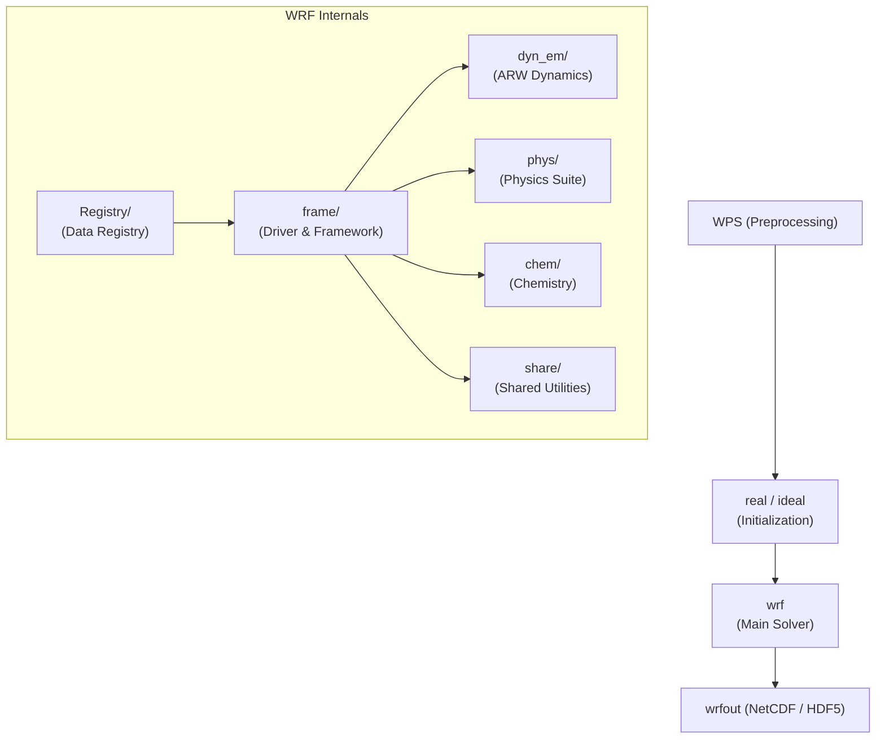

### Repository Directory Structure

| Directory | Purpose |
|-----------|---------|
| `dyn_em/` | ARW Eulerian mass-coordinate dynamics (solver, advection, diffusion) |
| `phys/` | Physics parameterizations (microphysics, PBL, radiation, surface) |
| `chem/` | Chemistry, aerosol, and emission drivers |
| `frame/` | WRF software framework: domain management, I/O, communications |
| `share/` | Shared routines: I/O mediators, interpolation, model constants |
| `Registry/` | Active data registry — defines all state fields, I/O, and nesting |
| `run/` | Run directory: namelist template, physics lookup tables |
| `var/` | WRFDA data assimilation system |
| `hydro/` | WRF-Hydro terrestrial hydrological routing coupling |
| `wrftladj/` | Tangent linear and adjoint model for variational data assimilation |
| `external/` | External libraries: I/O APIs, RSL communication, ESMF time |
| `tools/` | Registry preprocessors and code generation utilities |
| `arch/` | Compiler configuration stanzas (`configure.defaults`) |
| `test/` | Idealized and real-data test cases |

### Key Concepts

#### Active Data Registry

The `Registry/` directory contains a set of files (e.g., `Registry.EM`, `registry.chem`) that serve as the **single source of truth** for all model state variables. The Registry drives automatic code generation for I/O, nesting communication, and namelist access — a developer adding a new field edits the Registry rather than scattered source files.

#### Physics Suite

WRF offers a large menu of selectable physics modules, controlled at runtime via `namelist.input`:

- **Microphysics**: Kessler, WSM3/5/6, Lin, Thompson (aerosol-aware), Morrison, P3, SBM, and more
- **Cumulus parameterization**: Kain-Fritsch, Betts-Miller-Janjic, Grell 3D, Tiedtke, NSAS, and more
- **Planetary boundary layer**: YSU, MYJ, ACM2, MYNN-EDMF, BouLac, and more
- **Land surface**: Noah, Noah-MP (4-level), RUC, CLM4, SSiB
- **Radiation**: RRTM, RRTMG (LW+SW), CAM, Goddard; separate longwave and shortwave options
- **Urban canopy**: Single-layer UCM, multi-layer BEP/BEM

Many physics options require additional lookup table files (e.g., `RRTMG_LW_DATA`, `VEGPARM.TBL`) that must be present in the run directory. These are listed in `run/README.physics_files`.

#### Parallelism and I/O

- **Multi-level parallelism**: distributed-memory MPI (via RSL_LITE), shared-memory OpenMP, or hybrid
- **I/O formats**: NetCDF (default), parallel NetCDF (pnetcdf), HDF5, GRIB1/GRIB2, and internal binary
- Up to 24 auxiliary history/input streams are individually controllable via namelist

#### Nesting

WRF supports **one-way and two-way nesting** with multiple domains and multiple nest levels. Moving nests (both user-specified and automatic vortex-following) are also available for hurricane track applications.

### Build Systems

WRF provides two build paths:

1. **Legacy (`configure` / `compile`)** — generates a `configure.wrf` file for the platform; compile targets are specified by case name (e.g., `compile em_real`).
2. **CMake-based (`configure_new` / `compile_new`)** — introduced for better dependency detection and out-of-source builds. Requires CMake ≥ 3.20 and auto-detects netCDF via `nc-config`.

```bash
# CMake build (recommended)
./configure_new -p GNU -x -- -DWRF_CORE=ARW -DWRF_CASE=EM_REAL -DWRF_NESTING=BASIC
./compile_new -j 8
```

Executables are placed under `install/bin/` (CMake) or `main/` (legacy).

### Namelist Configuration

All simulation parameters are controlled through `namelist.input` in the run directory. Sections include `&time_control`, `&domains`, `&physics`, `&dynamics`, `&bdy_control`, and more. Variables marked `(max_dom)` must be specified once per nested domain. The file `run/README.namelist` documents every available variable with inline comments.

## System Architecture & Data Flow

<details>
<summary>Relevant Files</summary>

<ul>
<li><code>main/wrf.F</code></li>
<li><code>main/module_wrf_top.F</code></li>
<li><code>frame/module_integrate.F</code></li>
<li><code>frame/module_domain.F</code></li>
<li><code>frame/module_domain_type.F</code></li>
<li><code>share/mediation_wrfmain.F</code></li>
<li><code>share/mediation_integrate.F</code></li>
</ul>

</details>

WRF uses a strict four-layer software architecture that cleanly separates orchestration, framework services, mediation logic, and model physics. Understanding these layers is essential for navigating the codebase.

### Four-Layer Architecture

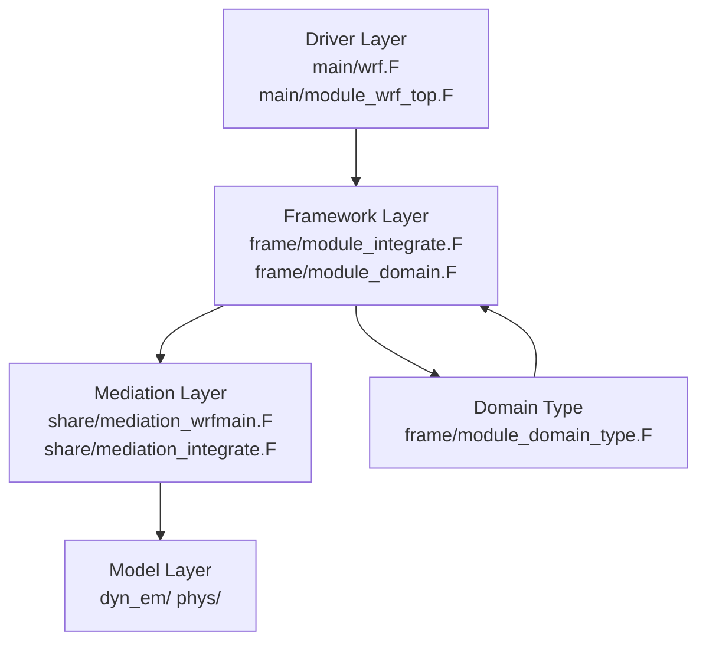

- **Driver Layer** (`main/`) — program entry point, lifecycle control (`wrf_init`, `wrf_run`, `wrf_finalize`)
- **Framework Layer** (`frame/`) — domain structures, time integration loop, parallel decomposition
- **Mediation Layer** (`share/`) — hooks between the framework and model; handles I/O and boundary conditions
- **Model Layer** (`dyn_em/`, `phys/`) — actual dynamics solver and physics parameterizations

### Program Entry and Initialization

The main program in `main/wrf.F` calls just five top-level routines in sequence:

1. `wrf_init()` — reads namelists, allocates the head domain, reads input or restart data
2. `wrf_dfi()` — optional Digital Filter Initialization pass
3. `wrf_adtl_check()` — adjoint/tangent-linear checks (WRFPLUS builds only)
4. `wrf_run()` — advances the model through all timesteps
5. `wrf_finalize()` — closes I/O streams and shuts down MPI

`wrf_init` (in `module_wrf_top.F`) calls `alloc_and_configure_domain()` to build the root `domain` structure, then delegates to `med_initialdata_input()` in the Mediation Layer to read the initial conditions from a `wrfinput` file or a restart file.

### Time Integration and Recursive Nesting

The core time-stepping engine lives in `frame/module_integrate.F`. The single subroutine `integrate(grid)` is called recursively to handle nested domains:

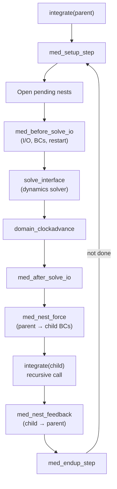

Each recursive call advances the child domain until it catches up with the parent's new time. This design naturally supports arbitrarily deep nesting without special-case logic.

### The `domain` Type — Central Data Container

`frame/module_domain_type.F` defines `TYPE domain`, the single structure that carries all state for one grid level. Key groupings within it:

- **Field arrays** — all prognostic variables (wind, temperature, moisture, etc.) as dynamically allocated arrays
- **Grid dimensions** — separate index ranges for domain (`sd`/`ed`), memory patch (`sm`/`em`), and physical patch (`sp`/`ep`) in each spatial dimension
- **Domain hierarchy** — `parents(:)` and `nests(:)` pointer arrays plus `next` linked-list pointer
- **Timing** — `domain_clock` (ESMF clock), `start_subtime`/`stop_subtime`, and `alarms(:)` for scheduled I/O
- **Parallel metadata** — MPI `communicator`, tile counts (`num_tiles_x`, `num_tiles_y`), task mappings

The global pointer `head_grid` always refers to the root domain; `current_grid` tracks the active domain during debugging.

### Mediation Layer — I/O and Boundary Conditions

`share/mediation_integrate.F` provides the hooks called around every solve step. `med_before_solve_io` is the most complex routine in this file; it checks ESMF alarms and conditionally:

- Writes **restart** snapshots (RESTART\_ALARM)
- Writes **history** output (HISTORY\_ALARM and AUXHIST\*\_ALARM)
- Reads time-varying **auxiliary inputs**: chemistry emissions, nudging observations, lateral boundary conditions (BOUNDARY dataset), volcano emissions
- In WRFPLUS builds: saves trajectory data and reads adjoint forcing

`share/mediation_wrfmain.F` handles the one-time initialization bridge. `med_initialdata_input` decides whether to perform a cold start (reading `wrfinput`) or a warm restart (reading a `wrfrst` file), then calls the Model Layer routine `start_domain` or `input_restart` accordingly.

### Parallel Execution Model

WRF uses a hybrid MPI + OpenMP model:

- **MPI** distributes the horizontal domain across tasks; each task owns a contiguous patch defined by `i_start`/`i_end`/`j_start`/`j_end`
- **OpenMP** further divides each patch into independent tiles processed in parallel (`!$OMP PARALLEL DO` loops)
- Each domain carries its own MPI `communicator`, enabling independent collective operations per nest level
- `alloc_and_configure_domain()` sets up communicators and tile boundaries at domain creation time

### Configuration Flow

Namelist settings are read once by `initial_config()` during `wrf_init` into a global `model_config_rec` structure. `med_add_config_info_to_grid()` (called via a macro-generated include `config_assigns.inc`) copies the relevant fields into each `domain` structure so that physics and dynamics routines can access configuration without touching global state directly.

## Registry & Compile-Time Code Generation

<details>
<summary>Relevant Files</summary>

<ul>
<li><code>Registry/Registry.EM</code></li>
<li><code>Registry/Registry.EM_COMMON</code></li>
<li><code>Registry/registry.dimspec</code></li>
<li><code>tools/registry.c</code></li>
<li><code>tools/gen_defs.c</code></li>
<li><code>tools/gen_wrf_io.c</code></li>
<li><code>tools/gen_comms.stub</code></li>
<li><code>frame/module_configure.F</code></li>
</ul>

</details>

WRF uses a **declarative Registry system** to define every model state variable, namelist parameter, and array dimension in one place. At build time, a C program called the *registry* reads these files and emits dozens of Fortran `INCLUDE` files that constitute the bulk of the model's data structures and I/O scaffolding — no hand-written boilerplate required.

### Registry File Format

Registry files live in the `Registry/` directory. Each non-comment line starts with a **table keyword** that tells the code generator what to emit:

| Keyword | Purpose |
|---------|---------|
| `state` | A model state array (prognostic or diagnostic variable) |
| `rconfig` | A namelist parameter read from `namelist.input` |
| `dimspec` | Maps a one-letter dimension code to a physical dimension |
| `package` | Conditionally activates a set of state variables |
| `i1` | A work (scratch) array not persisted on the domain type |

A `state` entry encodes all metadata needed to generate Fortran declarations, I/O calls, halo exchanges, nesting interpolation, and restart handling in a single line:

```text
#<Table> <Type> <Sym>    <Dims>  <Use>   <NTL> <Stagger> <IO>                 <Dname>  <Desc>         <Units>
state    real   u        ikjb    dyn_em  2     X         i0rhusdf=(bdy_interp:dt)  "U"  "x-wind component"  "m s-1"
```

The `<IO>` field is a compact string of flags: `i`=input, `r`=restart, `h`=history, `u`=update, `s`=surface, `d`=diagnostic, `f`=forcing, and so on. Numbers after a letter (e.g. `i0`, `h5`) select the I/O stream.

### Dimension Specifications

`Registry/registry.dimspec` maps single-character (or short) dimension codes to how their sizes are determined at run time:

```text
dimspec    i    1    standard_domain    x    west_east
dimspec    k    2    standard_domain    z    bottom_top
dimspec    l    2    namelist=num_soil_layers    z    soil_layers
dimspec    m    2    constant=12        z    months_per_year
```

The `How defined` column can be `standard_domain` (one of the three spatial axes from the domain data structure), `namelist=<var>` (read from a namelist integer), or `constant=<N>`. Conditional `ifdef`/`endif` blocks inside registry files allow different dimension layouts for EM, NMM, and DA cores.

### Code Generation Pipeline

The registry tool (`tools/registry.c`) is a standalone C program compiled early in the WRF build. It:

1. **Pre-parses** all registry files, expanding `#include` directives and evaluating `ifdef`/`endif` blocks against compile-time flags (e.g. `EM_CORE=1`, `BUILD_CHEM=1`).
2. **Parses** the pre-processed stream into an Abstract Syntax Tree of `node_t` structs.
3. **Generates** Fortran include files into the `inc/` directory.

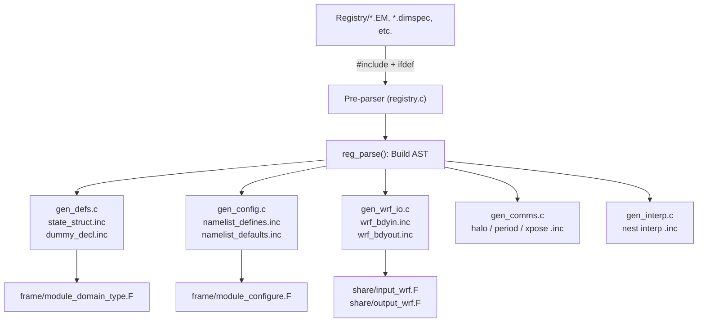

### Generated Include Files

The most important generated files and the Fortran modules that consume them:

<ul>
<li><strong>state_struct.inc</strong> — Fortran POINTER declarations for every <code>state</code> field; included into the domain TYPE in <code>frame/module_domain_type.F</code>.</li>
<li><strong>namelist_defines.inc / namelist_statements.inc / namelist_defaults.inc</strong> — declarations, NAMELIST groups, and default-value assignments for all <code>rconfig</code> entries; included inside <code>module_configure.F:initial_config</code>.</li>
<li><strong>config_reads.inc / config_assigns.inc</strong> — READ statements and assignments that copy namelist values into <code>model_config_rec</code>; also in <code>module_configure.F</code>.</li>
<li><strong>wrf_bdyin.inc / wrf_bdyout.inc</strong> — per-field calls to the WRF I/O API for boundary slab I/O; included in <code>share/input_wrf.F</code> and <code>share/output_wrf.F</code>.</li>
<li><strong>halo_*.inc / period_*.inc</strong> — MPI halo-exchange calls; included in <code>frame/module_comm_dm.F</code>.</li>
</ul>

### Communication Stubs vs. Real Comms

`tools/gen_comms.stub` is a minimal fallback that emits only a warning when parallel communication routines are requested but no real `gen_comms.c` is linked in. For distributed-memory builds, the RSL Lite layer supplies a full `gen_comms.c` that generates the actual MPI halo, period, and transpose calls for every declared field.

### Adding a New State Variable

To add a variable to WRF, a developer edits **only** the appropriate Registry file — no generated files should ever be edited by hand. The workflow is:

1. Add a `state` line to the relevant `Registry/Registry.*` file with the correct dimensions, I/O flags, description, and units.
2. Re-run `./configure` and `./compile` — the registry tool regenerates all include files automatically.
3. Use the variable via the domain's grid structure (e.g. `grid%my_new_var`) everywhere in Fortran source.

This approach keeps the data model consistent across state allocation, I/O, halo exchange, nesting, and restarts without duplicating code in multiple locations.

## ARW Dynamical Core

<details>
<summary>Relevant Files</summary>

<ul>
<li><code>dyn_em/solve_em.F</code></li>
<li><code>dyn_em/module_em.F</code></li>
<li><code>dyn_em/module_small_step_em.F</code></li>
<li><code>dyn_em/module_first_rk_step_part1.F</code></li>
<li><code>dyn_em/module_first_rk_step_part2.F</code></li>
<li><code>dyn_em/module_advect_em.F</code></li>
<li><code>dyn_em/module_diffusion_em.F</code></li>
<li><code>dyn_em/module_bc_em.F</code></li>
</ul>

</details>

The ARW (Advanced Research WRF) dynamical core solves the fully compressible, non-hydrostatic Euler equations on a terrain-following coordinate. It advances the model state by one timestep using a **Runge-Kutta (RK) time integration** scheme combined with **acoustic time-splitting** to handle the disparate timescales of meteorological and acoustic wave modes efficiently.

### Time Integration Architecture

The entry point is `solve_em` in `dyn_em/solve_em.F`, which orchestrates a 2nd- or 3rd-order Runge-Kutta loop. Within each RK sub-step, a nested **small-step loop** integrates the fast acoustic (sound) modes at a shorter time increment.

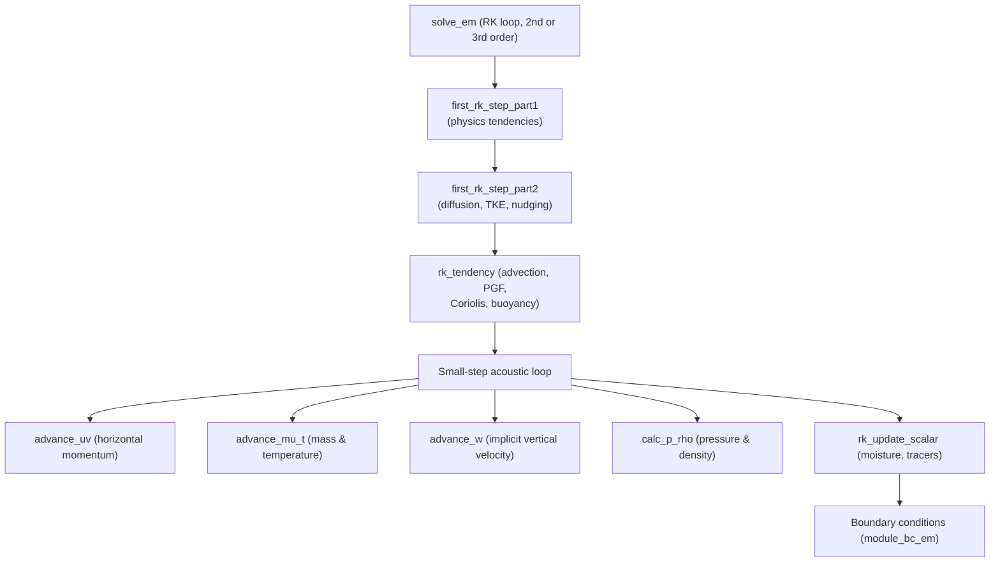

The physics tendencies computed in the first RK step are **frozen** across all subsequent RK sub-steps, while the dynamical tendencies are recomputed each sub-step. This operator-splitting keeps computational cost manageable without sacrificing accuracy for slow physical processes.

### Runge-Kutta Step Computation (`module_em.F`)

`module_em.F` contains the core RK operators applied within each sub-step:

- **`rk_step_prep`** — Constructs coupled variables `ru = μu`, `rv = μv`, `rw = μw` (where μ is the dry-air mass) needed for flux-form advection.
- **`rk_tendency`** — Assembles all dynamical tendencies for u, v, w, θ, geopotential (φ), and μ by summing:
  - Flux-form advection (calls into `module_advect_em`)
  - Pressure gradient forces
  - Coriolis and map-factor curvature terms
  - Buoyancy
  - Rayleigh sponge damping near the model top
- **`rk_scalar_tend`** / **`rk_update_scalar`** — Transports moisture, chemistry, and tracer scalars using the same advection operators.

### Acoustic Time-Splitting (`module_small_step_em.F`)

Acoustic waves propagate much faster than advective flows. To avoid a prohibitively small global timestep, the acoustic modes are sub-cycled within each RK stage. The small-step scheme is **vertically implicit** for the sound wave terms, removing the vertical CFL constraint for acoustic waves while keeping horizontal acoustic modes explicit.

Key routines in the small-step loop:

| Routine | Role |
|---|---|
| `small_step_prep` | Saves baseline state; initializes acoustic tendency arrays |
| `advance_uv` | Updates u, v with horizontal pressure gradient |
| `advance_mu_t` | Updates dry-air mass μ and potential temperature θ from flux divergence |
| `advance_w` | Updates w with vertically implicit tridiagonal solve |
| `calc_p_rho` | Diagnoses perturbation pressure p' and density ρ from updated state |
| `small_step_finish` | Reconstructs final prognostic state after acoustic sub-cycling |

### Physics Tendency Calculation (First RK Step)

`module_first_rk_step_part1.F` computes all **parameterized physics tendencies** once per timestep before the RK loop begins:

- Radiation (shortwave and longwave)
- Land-surface and sea-ice models
- Planetary boundary layer (PBL) mixing
- Cumulus and shallow convection parameterizations
- Fire and FDDA data assimilation nudging

`module_first_rk_step_part2.F` then applies **explicit mixing and dissipation**:

- Horizontal and vertical diffusion (calls `horizontal_diffusion_2`, `vertical_diffusion_2`)
- TKE budget (`tke_rhs`, including shear production, buoyancy, and dissipation)
- Stochastic perturbations (SKEBS, SPPT) for ensemble applications

### Advection Schemes (`module_advect_em.F`)

Advection uses a **flux-form** discretization: ∂q/∂t = -(1/ρ) ∇·(ρ **V** q). Multiple scheme orders are available and selected at runtime:

- **3rd–6th order centered-upwind** schemes (`flux3` through `flux6` stencils) for momentum and scalars
- **Positive-definite** advection (`advect_scalar_pd`) to prevent negative mixing ratios
- **Monotone** advection (`advect_scalar_mono`) for strict shape preservation
- **WENO** (Weighted Essentially Non-Oscillatory) schemes (`advect_weno_u/v/w`, `advect_scalar_weno`) for high-order non-oscillatory transport

Scheme orders are controlled by namelist parameters `h_mom_adv_order`, `v_mom_adv_order`, `h_sca_adv_order`, and `v_sca_adv_order`.

### Diffusion and Mixing (`module_diffusion_em.F`)

Turbulent mixing is handled by `calculate_km_kh`, which dispatches to one of several closure options:

- **Smagorinsky** (`smag_km`, `smag2d_km`) — diagnostic eddy viscosity from local deformation
- **TKE-based** (`tke_km`) — predicts turbulent kinetic energy and derives mixing length from TKE
- **Isotropic** (`isotropic_km`) — simple constant or specified coefficients

The deformation tensor (computed by `cal_deform_and_div`) drives anisotropic horizontal diffusion. Vertical diffusion uses a tridiagonal implicit solver to handle stiff near-surface gradients stably.

### Boundary Conditions (`module_bc_em.F`)

Four boundary treatment types are supported:

- **Specified** (`spec_bdy_dry`, `spec_bdy_scalar`) — outer rows/columns set directly from input data; used for real-data simulations with lateral nudging zones
- **Relaxation** (`relax_bdy_dry`) — values relax toward specified boundary values across a transition zone
- **Periodic** — enforced through halo exchange in the distributed-memory layer
- **Open/symmetric** — zero-gradient or reflected conditions at domain edges

Physical (non-penetrating) boundaries enforce `w = 0` at the surface and model top via `set_phys_bc_dry_1` and `set_phys_bc_smallstep_1`.

## Physics Parameterizations

<details>
<summary>Relevant Files</summary>

<ul>
<li><code>phys/module_microphysics_driver.F</code></li>
<li><code>phys/module_cumulus_driver.F</code></li>
<li><code>phys/module_pbl_driver.F</code></li>
<li><code>phys/module_radiation_driver.F</code></li>
<li><code>phys/module_surface_driver.F</code></li>
<li><code>phys/module_physics_init.F</code></li>
<li><code>phys/module_diagnostics_driver.F</code></li>
</ul>

</details>

WRF's physics layer is organized as a set of **driver modules**, each responsible for one physical process. Every driver dispatches to a user-selected parameterization scheme via a `SELECT CASE` on an integer option variable set in `namelist.input`. This design lets you swap schemes without touching the dynamical core.

### Execution Order

Each Runge-Kutta step calls the drivers in the order shown below. Later drivers consume outputs produced by earlier ones, creating a strict data-flow dependency chain.

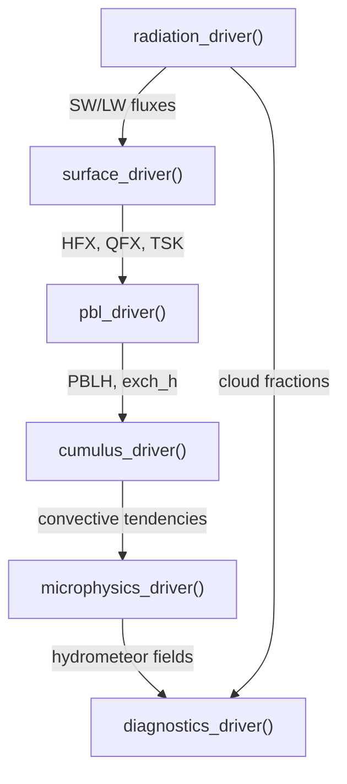

### Parameterization Selection Variables

Each driver reads one (or more) integer switches from the model state. The table below maps the most important switches to their driver.

| Namelist Variable | Controls | Driver |
|---|---|---|
| `mp_physics` | Microphysics scheme | `microphysics_driver` |
| `cu_physics` | Cumulus scheme | `cumulus_driver` |
| `bl_pbl_physics` | PBL scheme | `pbl_driver` |
| `ra_lw_physics` | Longwave radiation | `radiation_driver` |
| `ra_sw_physics` | Shortwave radiation | `radiation_driver` |
| `sf_surface_physics` | Land surface model | `surface_driver` |
| `sf_sfclay_physics` | Surface layer scheme | `surface_driver` / `pbl_driver` |

### Microphysics (`module_microphysics_driver.F`)

`microphysics_driver()` advances cloud and precipitation processes. It is the most scheme-rich driver — `mp_physics` selects among more than 20 options:

- **1** — Kessler (warm rain)
- **5 / 6 / 7** — WSM 3/5/6-class ice
- **8** — Thompson (aerosol-aware)
- **10** — Morrison double-moment
- **50** — P3 (predicted particle properties)
- **55** — NSSL 2-moment

Key outputs include column precipitation rates (`RAINNC`, `SNOWNC`, `GRAUPELNC`), hydrometeor tendency arrays, and — when WRF-Chem is active — CCN nucleation feedback.

### Cumulus (`module_cumulus_driver.F`)

`cumulus_driver()` represents sub-grid convection. It runs on its own sub-cycling counter (`STEPCU`) so convective tendencies can be applied every N dynamical steps. Scheme options include:

- **1** — Kain-Fritsch
- **2** — Betts-Miller-Janjić
- **4** — Grell-Devenyi ensemble
- **6** — Grell-Freitas scale-aware
- **16** — Tiedtke
- **7** — Simplified Arakawa-Schubert (SAS)

Outputs are convective heating/moistening tendencies (`RTHCUTEN`, `RQVCUTEN`), convective precipitation (`RAINC`), and shallow-cloud fractions used by the radiation driver.

### Planetary Boundary Layer (`module_pbl_driver.F`)

`pbl_driver()` computes turbulent mixing from the surface up to the top of the boundary layer. Sub-cycling is controlled by `STEPBL`. Popular schemes:

- **1** — YSU (non-local, first-order)
- **2** — MYJ (local, 1.5-order TKE)
- **5** — MYNN EDMF (eddy-diffusivity mass-flux)
- **8** — Bougeault-Lacarrère
- **9** — CAM UW (University of Washington)

The driver also handles optional **gravity wave drag** (`gwd_opt`) and urban canopy effects (`sf_urban_physics`) via BEP (Building Effect Parameterization).

### Radiation (`module_radiation_driver.F`)

`radiation_driver()` computes longwave (LW) and shortwave (SW) radiative transfer separately. Common choices:

- **RRTM / RRTMG** — rapid radiative transfer (LW and SW)
- **Goddard** — NASA Goddard SW
- **CAM** — Community Atmosphere Model radiation
- **GFDL** — Geophysical Fluid Dynamics Laboratory scheme

The driver optionally accounts for aerosol optical depth (`aer_opt`), solar eclipses, and cumulus cloud fractions passed in from `cumulus_driver`. Outputs are heating-rate tendencies (`RTHRATENLW`, `RTHRATENSW`) and top-of-atmosphere / surface flux diagnostics.

### Surface (`module_surface_driver.F`)

`surface_driver()` couples the atmosphere to the land (or ocean) surface. It calls a **surface-layer scheme** to compute stability and exchange coefficients, then a **land surface model (LSM)** to evolve soil, snow, and canopy state:

- LSM options: Slab (2), Noah (1), RUC (3), Noah-MP (4), CLM (3), Pleim-Xiu (7)
- Surface-layer options: MM5 (1), MYJ (2), TEMF, etc.

Outputs fed back to the PBL driver include sensible heat flux (`HFX`), latent heat flux (`QFX`), friction velocity (`UST`), and skin temperature (`TSK`).

### Initialization (`module_physics_init.F`)

`phy_init()` is called once at model start. It sequences initialization of every scheme in the same order as the runtime drivers: `mp_init` → `cu_init` → `bl_init` → `sf_init` → `ra_init`. Scheme-specific look-up tables, restart state arrays (e.g., `mp_restart_state` for Thompson aerosols), and physical constants are set here.

### Diagnostics (`module_diagnostics_driver.F`)

`diagnostics_driver()` runs at history-output times to derive fields that are not directly predicted:

- Radar reflectivity and cloud optical depth
- Lightning parameterization output
- Hail size (HailCast)
- Solar radiation diagnostics (WRF-Solar)
- NWP verification diagnostics (`diagnostic_output_nwp`)

Because it only produces output fields and does not feed back into the physics, it has no upstream dependencies on a specific physics call order.

## I/O Framework & Parallelism

<details>
<summary>Relevant Files</summary>

<ul>
<li><code>frame/module_io.F</code></li>
<li><code>frame/module_io_quilt.F</code></li>
<li><code>frame/module_comm_dm.F</code></li>
<li><code>frame/module_streams.F</code></li>
<li><code>share/module_io_wrf.F</code></li>
<li><code>external/RSL_LITE/</code></li>
<li><code>external/io_netcdf/</code></li>
<li><code>doc/README.io_config</code></li>
</ul>

</details>

WRF uses a layered, package-independent I/O architecture that cleanly separates the user-facing API from format-specific backends, and decouples I/O operations from parallel computation via optional dedicated I/O server processes.

### Layered I/O Architecture

The I/O stack has three distinct layers:

1. **WRF User API** (`frame/module_io.F`) — `wrf_*` routines that application code calls directly.
2. **Package Dispatcher** — compile-time `#ifdef` guards and a `use_package()` function route each call to the correct backend.
3. **I/O Backends** (`external/io_*/`) — `ext_*` routines that implement each format (NetCDF, GRIB, HDF5, ADIOS2, …).

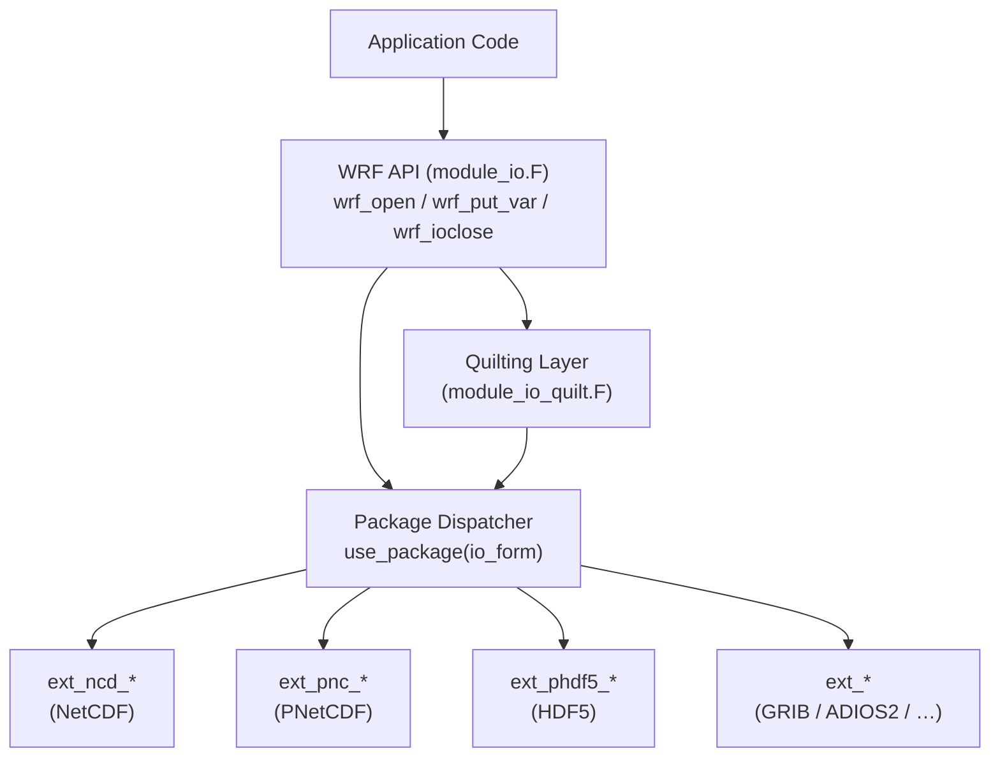

### Abstract Handle System

`module_io.F` maintains an array of up to 1 000 WRF handles. Each handle stores the active `io_form`, whether the file is open for input or output, and a mapping to the package-specific file handle (e.g., a NetCDF `ncid`). This indirection lets format backends be swapped without touching calling code.

```fortran
! Lifecycle
CALL init_io_handles()
CALL add_new_handle(io_form, for_out, DataHandle)   ! returns WRF handle
CALL get_handle(Hndl, io_form, for_out, DataHandle) ! resolves to pkg handle
CALL free_handle(DataHandle)
```

### I/O Stream Types

WRF defines up to 26 concurrent I/O streams, governed by `frame/module_streams.F` and compile-time Registry entries:

| Stream category | Count | Typical use |
|---|---|---|
| History (`history_only` … +11) | 12 | Model output snapshots |
| Input (`input_only` … +11) | 12 | Initial / lateral BCs |
| Restart | 1 | Full model restart state |
| Boundary | 1 | Nested-domain boundaries |

At runtime, which variables appear in each stream can be overridden via a plain-text file specified with the `iofields_filename` namelist key. Each line has the form:

```
+:h:0:QVAPOR,U,V
```

Meaning: **add** (`+`) fields `QVAPOR`, `U`, `V` to **history** (`h`) stream **0**.

### Quilting: Dedicated I/O Server Processes

When `nio_tasks_per_group > 0` in `namelist.input`, WRF reserves a subset of MPI ranks as **I/O server** (quilt) tasks (`frame/module_io_quilt.F`). This allows compute tasks to overlap output with computation.

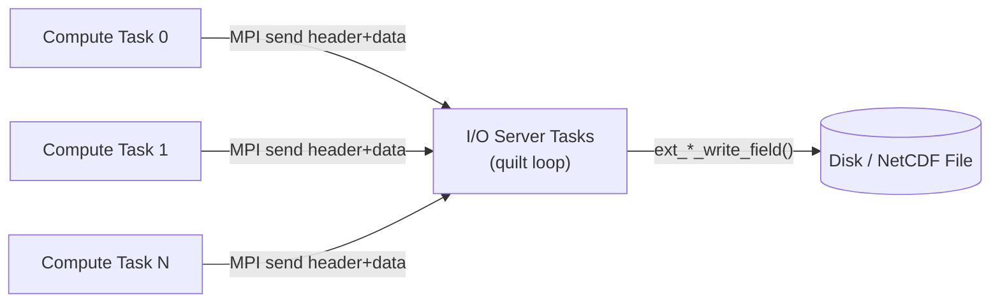

- **Compute tasks** call `wrf_quilt_open_for_write_begin()`, which packs an I/O request header and ships it via MPI.
- **Server tasks** run an infinite `quilt()` loop that receives headers, dispatches them to the appropriate `ext_*` routine, and writes to disk.
- Multiple server groups (`nio_groups`) can be used for load balancing across several output files.

### Parallel I/O Modes

WRF supports three file-writing modes, selected by `io_form` and compile flags:

- **Monitor (single task)** — only MPI rank 0 writes; handle is broadcast to all ranks. Simple but a bottleneck at scale.
- **Multi-file** — each MPI rank writes its own file (e.g., `wrfout.0000.nc`, `wrfout.0001.nc`). No coordination needed; files must be joined in post-processing.
- **Quilting servers** — dedicated ranks handle I/O asynchronously, overlapping with computation. Best for large core counts.

### Domain Decomposition & MPI Communication

Spatial parallelism is managed by `external/RSL_LITE/`. The global grid is partitioned into a 2-D processor mesh of `ntasks_x × ntasks_y` tiles. The `MPASPECT` utility factorises the total task count to minimise the aspect ratio of each tile.

Key communicators in `module_dm.F`:

```fortran
local_communicator          ! Active domain (Cartesian MPI topology)
local_communicator_periodic ! Same, with periodic boundary conditions
local_iocommunicator        ! I/O-specific subset
local_communicator_x        ! Row broadcast
local_communicator_y        ! Column broadcast
local_quilt_comm            ! Compute ↔ I/O server
```

Halo exchange routines are generated automatically from Registry halo specifications and compiled into `REGISTRY_COMM_DM_subs.inc`.

### Hybrid MPI + OpenMP

Within each MPI patch, WRF further subdivides work into OpenMP **tiles** along the vertical column. Each thread handles one tile, reducing MPI message count and improving cache reuse:

```fortran
!$OMP PARALLEL DO SCHEDULE(RUNTIME) PRIVATE(nt) NUM_THREADS(num_tiles)
DO nt = 1, num_tiles
  CALL physics_driver(..., its=tile_bdy_indices(1,nt), ite=tile_bdy_indices(2,nt))
END DO
!$OMP END PARALLEL DO
```

### Supported I/O Backends

Each backend lives under `external/io_*/` and implements the same contract of `ext_pkg_open_*`, `ext_pkg_read_field`, `ext_pkg_write_field`, and `ext_pkg_ioclose` routines.

| Backend | Flag | Notes |
|---|---|---|
| NetCDF 3/4 | `-DNETCDF` | Default; serial or via quilting |
| Parallel NetCDF | `-DPNETCDF` | Native MPI-I/O |
| Parallel HDF5 | `-DPHDF5` | Native MPI-I/O |
| ADIOS2 | `-DADIOS2` | Asynchronous streaming |
| PIO | `-DPIO` | NCAR abstraction layer |
| GRIB1 / GRIB2 | `-DGRIB1` / `-DGRIB2` | Multi-file only |
| Internal | `-DINTIO` | WRF-native binary |

## Domain Nesting & Model Initialization

<details>
<summary>Relevant Files</summary>

<ul>
<li><code>frame/module_nesting.F</code></li>
<li><code>dyn_em/module_initialize_real.F</code></li>
<li><code>dyn_em/module_initialize_ideal.F</code></li>
<li><code>dyn_em/nest_init_utils.F</code></li>
<li><code>share/start_domain.F</code></li>
<li><code>main/real_em.F</code></li>
<li><code>main/ideal_em.F</code></li>
<li><code>share/dfi.F</code></li>
</ul>

</details>

WRF supports simultaneous simulation of multiple nested domains at different horizontal (and optionally vertical) resolutions. Each domain is initialized independently — with real observational data or synthetic profiles — before the coupled model integration begins. This section covers how nested domains are tracked, how they are initialized for real versus idealized cases, and how Digital Filter Initialization (DFI) can be applied after initialization to suppress noise.

### Domain Nesting Hierarchy

`frame/module_nesting.F` maintains the runtime state of the nest hierarchy through a small set of subroutines.

- **`init_module_nesting()`** — zeros the `active_domain(max_domains)` logical array at startup.
- **`nests_to_open(parent, nestid_ret, kid_ret)`** — inspects namelist time windows (`start_*` / `end_*`) and `grid_allowed` flags to decide whether a child domain should be opened during the current integration step.
- **`set_overlaps(grid)`** — stub reserved for sibling-grid pointer relationships (not yet implemented).

Domains activate in a strict parent-to-child sequence. A child domain cannot be opened before its parent is active.

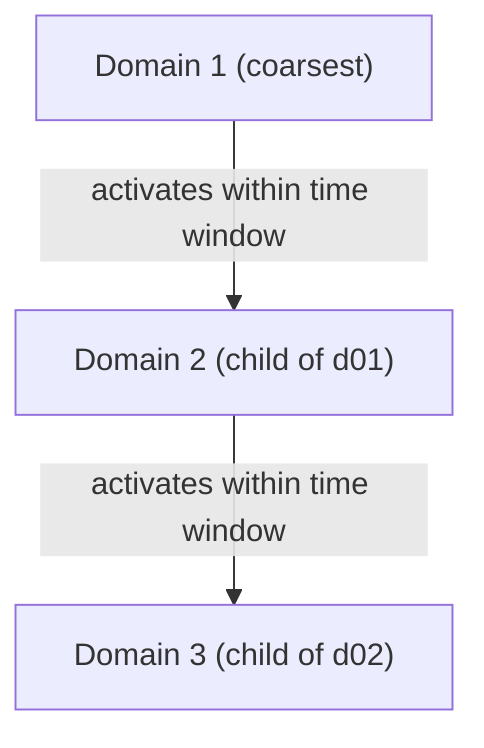

### Real-Data Initialization

`main/real_em.F` is the top-level driver for real-data preprocessing. It orchestrates the full workflow for every domain and every WPS time period.

Key steps inside `med_sidata_input`:

1. Open the WPS metgrid file for the current domain and time.
2. Read horizontal fields (`u_gc`, `v_gc`, `t_gc`, `rh_gc`, `ght_gc`, `p_gc`) from WPS.
3. Call `init_domain()` → `init_domain_rk()` in `dyn_em/module_initialize_real.F`.
4. Assemble output files (`wrfinput_d0X`, `wrfbdy_d01`, optional nudging/SST files).

`init_domain_rk` in `module_initialize_real.F` performs the heavy lifting:

- Vertically interpolates WPS pressure-level data onto WRF eta levels.
- Computes base-state fields (`pb`, `phb`, `alb`) and perturbation state.
- Handles terrain-following coordinate blending, lake masks, and sea-ice fields.
- Checks physics flag consistency (`flag_metgrid`, `flag_psfc`, `flag_pinterp`, etc.).
- Supports both legacy SI format and modern metgrid format.

### Idealized Initialization

`main/ideal_em.F` is the simpler driver used for sensitivity studies and unit-test cases. There is no time loop and no external data file.

`med_initialdata_output` sets `grid%input_from_file = .false.` and calls `init_domain()` → `init_domain_rk()` in `dyn_em/module_initialize_ideal.F`.

Supported test cases (selected by the `ideal_case` namelist variable):

| Case name | Description |
|---|---|
| `hill2d_x` | 2-D flow over an isolated hill |
| `squall2d_x/y` | 2-D squall line along x or y axis |
| `b_wave` | Baroclinic wave with jet sounding |
| `les` | Large-eddy simulation domain |
| `seabreeze2d_x` | 2-D sea breeze circulation |

`init_domain_rk` reads an ASCII sounding file, applies optional vertical stretching, optionally seeds convection with a warm thermal bubble, enforces hydrostatic balance, and writes `wrfinput`.

### Nested Domain Initialization Utilities

`dyn_em/nest_init_utils.F` provides the glue between a parent domain and its child during nesting.

- **`init_domain_constants_em(parent, nest)`** — copies time-invariant constants (p\_top, base-state parameters, map factors) from the parent grid to the child grid.
- **`init_domain_vert_nesting(parent, nest, use_baseparam_fr_nml)`** — dispatches to one of two vertical refinement routines based on `vert_refine_method`:
  - Method 1: `vert_cor_vertical_nesting_integer` — integer ratio refinement (e.g., 3:1).
  - Method 2: `vert_cor_vertical_nesting_arbitrary` — namelist-specified eta levels.
- **`blend_terrain(...)`** — blends interpolated coarse-grid terrain with fine-grid terrain inside the nest boundary zone to avoid sharp mismatches.
- **`adjust_tempqv(...)`** — adjusts temperature and water vapour after terrain blending while conserving relative humidity.
- **`compute_vcoord_1d_coeffs(...)`** — recalculates hybrid-coordinate coefficients (`c1h/c2h/c3h/c4h`) on the child's vertical grid.

### `start_domain` Dispatch

`share/start_domain.F` is a thin dispatcher called after field initialization to finalize boundary conditions and timeseries locations. For the EM dynamical core it calls `start_domain_em()`. When compiled with WRFPLUS, it routes to tangent-linear or adjoint variants.

### Digital Filter Initialization (DFI)

`share/dfi.F` implements DFI, an optional post-initialization step that filters high-frequency noise by integrating the model briefly backwards and then forwards with physics disabled.

The three phases are:

1. **`DFI_BCK`** — `dfi_bck_init` negates the time step, disables diffusion and physics, then integrates backward for `dfi_bckstop_h` hours.
2. **`DFI_FWD`** — `dfi_fwd_init` restores a positive time step and integrates forward for `dfi_fwdstop_h` hours; `dfi_accumulate` accumulates filter-weighted state at each step.
3. **`DFI_FST`** — `dfi_fst_init` re-enables all physics, calls `dfi_array_reset` to replace state fields with the filtered average, and restarts the forecast.

Available filter windows (set via `dfi_nfilter`): uniform, Lanczos, Hamming, Blackman, Kaiser, Potter, Dolph-Chebyshev, and RHO quick-start.

### End-to-End Initialization Flow

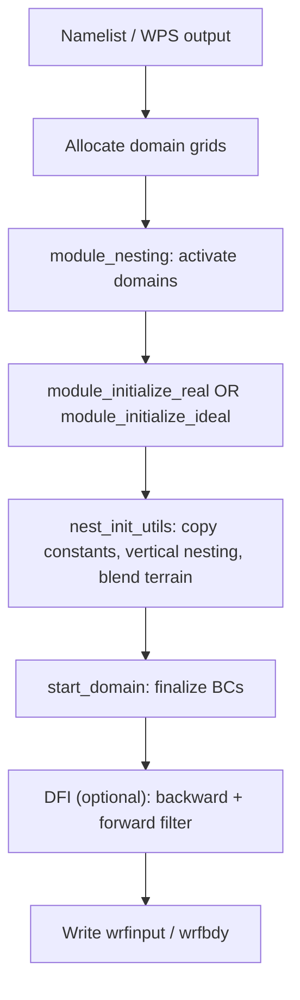

## Data Assimilation (WRFDA)

<details>
<summary>Relevant Files</summary>

<ul>
<li><code>var/da/da_main/da_wrfvar_main.f90</code></li>
<li><code>var/da/da_minimisation/da_minimisation.f90</code></li>
<li><code>var/da/da_control/da_control.f90</code></li>
<li><code>var/da/da_obs/da_obs.f90</code></li>
<li><code>var/da/da_4dvar/da_4dvar.f90</code></li>
<li><code>var/da/da_radiance/</code></li>
<li><code>doc/README.DA</code></li>
</ul>

</details>

WRFDA (WRF Data Assimilation) is the variational data assimilation system embedded within the WRF modeling framework. It combines a numerical weather prediction background state with diverse observational data to produce an optimal analysis, minimizing a cost function that balances background and observation errors. WRFDA supports 3D-Var, 4D-Var, and hybrid ensemble-variational (3DEnVar) approaches.

### System Overview

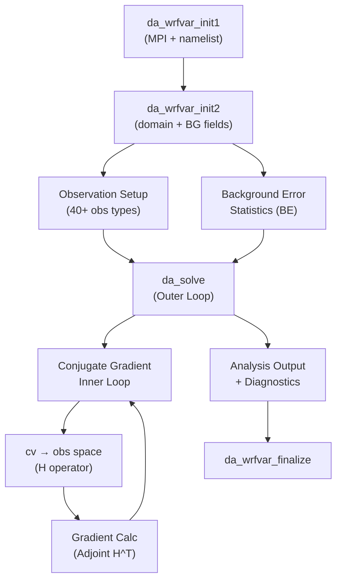

The main entry point is `da_wrfvar_main.f90`, which orchestrates two initialization phases, a minimization run, and a clean shutdown including optional 4D-Var trajectory cleanup.

### Module Organization

WRFDA's source lives under `var/da/` and is divided into purpose-specific subdirectories:

| Directory | Purpose |
|---|---|
| `da_main/` | Program entry, I/O interface |
| `da_control/` | Global namelist, physical constants, flags |
| `da_minimisation/` | CG and Lanczos solvers, cost/gradient routines |
| `da_obs/` | Forward (H) and adjoint (H^T) operators |
| `da_4dvar/` | Non-linear, tangent-linear, and adjoint model |
| `da_radiance/` | Satellite radiance (45+ instruments via RTTOV/CRTM) |
| `da_vtox_transforms/` | Control variable ↔ model state transforms |
| `da_define_structures/` | Core data type definitions |
| `da_recursive_filter/` | Spatial correlation via recursive filtering |

### Cost Function and Minimization

The assimilation minimizes the cost function:

```
J = Jb + Jo
Jb = 0.5 * (x - xb)^T B^-1 (x - xb)
Jo = 0.5 * (H(x) - y)^T R^-1 (H(x) - y)
```

where `xb` is the background, `y` are observations, `B` is the background error covariance, `R` is the observation error covariance, and `H` is the forward observation operator.

`da_minimisation.f90` implements two solvers:
- **Conjugate Gradient (CG)** — default inner-loop minimizer (`da_minimise_cg.inc`)
- **Lanczos** — Hessian eigendecomposition for sensitivity studies (`da_minimise_lz.inc`)

The control variable transform chain converts minimization variables to model-space increments:

```
cv (control space)
  → vv (spectral/wavelet space)
  → vp (vertical EOF space)
  → x  (grid-point state: u, v, T, q, ps)
  → y  (observation space via H)
```

### Control Variables and Configuration

`da_control.f90` is the central configuration hub for WRFDA. It defines:
- **Physical constants**: gravity, gas constant, earth radius
- **Namelist variables**: exposed to users via `wrfvar` namelists
- **Observation-type switches**: `use_rad`, `use_radar_rf`, `use_gpspwobs`, etc.
- **Analysis-mode flags**: `var4d`, `anal_type_hybrid_dual_res`, `anal_type_verify`
- **I/O unit numbers**: for cost function logs, gradient output, observation statistics

The `cv_options` integer (values 3, 5, 6, or 7) selects the control variable structure and associated background error statistics. Humidity can be represented as specific humidity or relative humidity via `cv_options_hum_*` parameters.

### Observation Handling

`da_obs.f90` provides the forward and adjoint observation operators for all supported data types. Key steps for each observation:

1. **Horizontal interpolation** — bilinear from model grid to observation location
2. **Vertical interpolation** — log-pressure interpolation to observation level
3. **Physical transformation** — e.g., (T, q) → relative humidity, (u, v) → wind speed/direction
4. **Radiative transfer** — RTTOV or CRTM for satellite radiance channels

More than 40 observation categories are supported, including SYNOP, SOUND, AIREP, GEOAMV, GPS refractivity/PW, radar reflectivity/velocity, and satellite radiances.

### 4D-Var Extension

When compiled with `#ifdef VAR4D`, the `da_4dvar` module enables time-varying assimilation over an analysis window. Three model instances are integrated:

- **Non-linear (NL) model** — forward simulation, saving trajectory states
- **Tangent linear (TL) model** — linearized propagation of increments
- **Adjoint (AD) model** — backward accumulation of gradients through time

The cost function sums observation terms at each sub-window time: `J = Jb + Σ Jo(t_i)`. Lateral boundary conditions can be treated as additional control variables.

### Satellite Radiance Assimilation

The `da_radiance/` directory implements a full pipeline for assimilating brightness temperatures from 45+ satellite instruments (AIRS, IASI, AMSU-A/B, ATMS, SEVIRI, AHI, FY-3, and more):

1. **Data ingestion** — BUFR, HDF5, or NetCDF satellite files
2. **Quality control** — cloud detection, outlier rejection, spatial thinning
3. **Bias correction** — Variational Bias Correction (VarBC) updated online
4. **Forward model** — RTTOV (ESA) or CRTM (JCSDA) radiative transfer
5. **Adjoint/K-matrix** — channel Jacobians used in gradient computation

### Key Data Structures

- **`be_type`** — Background error statistics: vertical eigenvalues/eigenvectors, horizontal recursive filter coefficients, balance (regression) coefficients
- **`iv_type`** — Observation innovations organized by type, holding location, observed value, observation error, and QC flags
- **`y_type`** — Computed innovations and per-observation cost contributions
- **`j_type`** — Scalar cost components: `jb`, `jo`, penalty terms `jp`
- **`vp_type`** — Control variable increments on the model grid (5 primary components plus ensemble weights in hybrid mode)

## WRF-Chem: Chemistry & Aerosols

<details>
<summary>Relevant Files</summary>

<ul>
<li><code>chem/chem_driver.F</code></li>
<li><code>chem/chemics_init.F</code></li>
<li><code>chem/emissions_driver.F</code></li>
<li><code>chem/aerosol_driver.F</code></li>
<li><code>chem/dry_dep_driver.F</code></li>
<li><code>chem/mechanism_driver.F</code></li>
<li><code>Registry/registry.chem</code></li>
</ul>

</details>

WRF-Chem integrates atmospheric chemistry directly into the WRF dynamical core, allowing two-way feedback between chemistry, radiation, and microphysics. The chemistry system is orchestrated by `chem_driver.F`, which calls each sub-process in sequence every model timestep (or sub-step, depending on `chemdt`).

### Architecture Overview

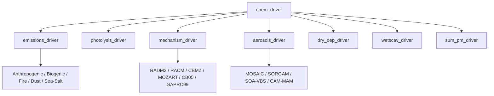

The `chem` array is the central state object. Each driver reads from and writes back to this array, advancing species concentrations through emissions, gas-phase chemistry, aerosol dynamics, and removal.

### Initialization (`chemics_init.F`)

`chem_init` runs once at startup (or restart) to configure step counters and validate option combinations:

- `stepchem` = `nint(chemdt * 60 / dt)` — how often chemistry runs relative to the dynamical timestep
- `stepphot` = `nint(photdt * 60 / dt)` — photolysis update frequency
- `stepbioe` = `nint(bioemdt * 60 / dt)` — biogenic emissions frequency

Photolysis schemes are initialized here (`photmad_init`, `tuv_init`, `ftuv_init`), and species concentrations are seeded based on `chem_opt`.

### Emissions (`emissions_driver.F`)

`emissions_driver` injects source terms into the `chem` array from multiple origin types each call:

- **Anthropogenic** — sector-based surface fluxes (industry, traffic, residential) distributed over `kemit` levels
- **Biogenic** — temperature/light-dependent isoprene and terpene fluxes; schemes: GUNTHER1, BEIS314, MEGAN2
- **Biomass burning** — fire emissions with vertical plume-rise injection
- **Dust** — wind-driven mobilization; schemes: GOCART, GOCART-AFWA, UoC (5 size bins)
- **Sea-salt** — wind-dependent production (5 size bins via GOCART)
- **Other** — DMS ocean flux, lightning NOx, aircraft, volcanic SO2/ash, NH3, GHG (CO2/CH4 via VPRM)

### Gas-Phase Chemistry (`mechanism_driver.F`)

`mechanism_driver` dispatches to mechanism-specific solvers after photolysis rates (`ph_*` arrays) are available. Supported mechanisms include:

| Mechanism | Option keyword | Notes |
|-----------|----------------|-------|
| RADM2 | `RADM2`, `RADM2SORG` | ~60 species; classic regional mechanism |
| RACM | `RACMSORG_KPP` | ~170 species; KPP-based stiff solver |
| CBMZ | `CBMZ`, `CBMZ_MOSAIC_4BIN` | ~50 species; couples with MOSAIC |
| MOZART | `MOZART`, `MOZCART` | 100+ species; KPP solver |
| CB05 / SAPRC99 | `CB05_MADE_SORGAM` | Carbon Bond 5 and SAPRC variants |
| GOCART | `GOCART_SIMPLE` | Simplified sulfur/dust/carbon |

ODE solvers available: **LSODES**, **RODAS**, and auto-generated **KPP** solvers.

### Aerosol Processing (`aerosol_driver.F`)

`aerosols_driver` handles gas-to-particle partitioning, secondary aerosol formation, and heterogeneous chemistry. The scheme is selected via `chem_opt`:

- **MOSAIC** (4-bin / 8-bin) — sectional model with full aqueous-phase chemistry; computes aerosol pH (`ph_aer01`–`ph_aer04`) and N2O5 hydrolysis rates
- **SORGAM / MADE** — modal secondary organic aerosol dynamics
- **SOA-VBS** — volatility basis set for SOA formation and heterogeneous reactions
- **CAM-MAM** (3-mode / 7-mode) — modal model used with CAMMGMP microphysics

### Dry Deposition & Settling (`dry_dep_driver.F`)

`dry_dep_driver` removes species from the lowest model layers via:

- Surface resistance / deposition velocity (`dep_vel`, `dvel` arrays)
- Gravitational settling (`gocart_settling`, `vash_settling`) — size-bin dependent
- Boundary-layer mixing (`module_vertmx_wrf`)
- CCN activation diagnostics (`ccn1`–`ccn6` at supersaturations 0.02 % – 1.0 %)

Dust deposition diagnostics are tracked per bin: `dustdrydep_1`–`dustdrydep_5` and `dustgraset_1`–`dustgraset_5`.

### Key Namelist Options

```fortran
&chem
  chem_opt       = 202,   ! e.g. CBMZ_MOSAIC_8BIN_NEW_AQ
  phot_opt       = 3,     ! 1=PHOTMAD, 2=TUV, 3=FastTUV
  chemdt         = 5.0,   ! chemistry timestep (minutes)
  photdt         = 30.0,  ! photolysis timestep (minutes)
  bio_emiss_opt  = 3,     ! 0=off, 1=GUNTHER1, 2=BEIS314, 3=MEGAN2
  dust_opt       = 1,     ! 1=GOCART, 2=GOCART-AFWA, 3=UoC
  seas_opt       = 1,     ! sea-salt emissions on/off
  aer_opt        = 1,     ! aerosol-radiation coupling option
/
```

The combination of `chem_opt` determines which gas-phase mechanism, aerosol scheme, and ODE solver are active. Incompatible combinations (e.g., mismatched `mp_physics`) are caught during `chem_init`.

## WRF-Hydro, WRFPLUS & Model Extensions

<details>
<summary>Relevant Files</summary>

<ul>
<li><code>hydro/HYDRO_drv/module_HYDRO_drv.F90</code></li>
<li><code>hydro/CPL/module_wrf_HYDRO.F90</code></li>
<li><code>hydro/Routing/module_RT.F90</code></li>
<li><code>hydro/Routing/module_channel_routing.F90</code></li>
<li><code>hydro/Routing/Overland/module_overland.F90</code></li>
<li><code>hydro/Routing/Subsurface/module_subsurface.F90</code></li>
<li><code>hydro/Routing/Reservoirs/module_reservoir.F90</code></li>
<li><code>wrftladj/module_em_tl.F</code></li>
<li><code>wrftladj/module_em_ad.F</code></li>
<li><code>doc/README.hydro</code></li>
<li><code>doc/README.WRFPLUS</code></li>
</ul>

</details>

WRF supports two major model extensions: **WRF-Hydro**, a fully-coupled hydrological routing system, and **WRFPLUS**, which adds tangent-linear and adjoint model variants used in variational data assimilation. Both are compiled into the same `wrf.exe` executable and share WRF's parallel infrastructure.

### WRF-Hydro

WRF-Hydro extends WRF to simulate the full terrestrial water cycle by routing surface, subsurface, and channel flows at a finer spatial resolution than the atmospheric grid. It is activated at build time by setting `WRF_HYDRO=1` and configured via a separate `hydro.namelist` file.

#### Coupling Layer (`hydro/CPL`)

The entry point for WRF-Hydro is `wrf_cpl_HYDRO()` in `module_wrf_HYDRO.F90`. This routine:

- Receives atmospheric state (soil moisture, rainfall) from the WRF land surface model (LSM)
- Transfers variables across grid resolutions using downscaling routines (`module_wrf_HYDRO_downscale.F90`)
- Manages adaptive timesteps independently for terrain and channel routing
- Coordinates MPI domain decomposition for parallel runs

#### Hydro Driver (`hydro/HYDRO_drv`)

`module_HYDRO_drv.F90` provides three lifecycle routines called by the coupling layer:

- `HYDRO_ini()` — initializes domain, reads parameter files, allocates routing structures
- `HYDRO_exe()` — steps through overland, subsurface, channel, and groundwater routing
- `HYDRO_rst_out()` — writes restart files at configurable time intervals

#### Routing System (`hydro/Routing`)

The routing subsystem is organized into specialized sub-modules:

- **Overland** (`Routing/Overland/`) — simulates surface water movement and infiltration across the terrain grid; includes mass balance diagnostics
- **Subsurface** (`Routing/Subsurface/`) — models lateral soil water flow, managing state, input, output, and static parameters in separate modules
- **Channel** (`module_channel_routing.F90`) — routes flow through the river network using the stream connectivity defined in the routing domain
- **Reservoirs** (`Routing/Reservoirs/`) — supports level-pool, hybrid persistence, and RFC (River Forecast Center) forecast-based reservoir operations
- **Groundwater** (`module_GW_baseflow.F90`, `module_gw_gw2d.F90`) — baseflow recession (bucket model) or spatially distributed 2D groundwater dynamics

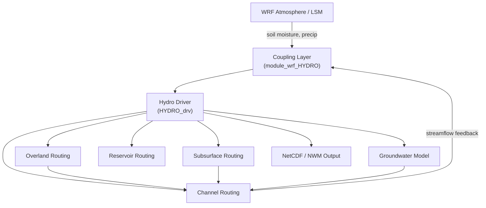

Output can be written in standard hydro format or the **National Water Model (NWM)** format via `module_NWM_io.F90`, making WRF-Hydro suitable for both research and operational forecasting workflows.

### WRFPLUS — Tangent-Linear and Adjoint Models

WRFPLUS bundles three model variants in one build: the standard non-linear WRF model, a **tangent-linear (TL) model**, and an **adjoint model**. Together they enable **4D-Var data assimilation** through the WRFDA system.

#### Tangent-Linear Model (`wrftladj/module_em_tl.F`)

The TL model propagates small perturbations forward in time by linearizing the full non-linear dynamics. Variables prefixed with `g_` carry the tangent (sensitivity) fields alongside the base-state trajectory. Key routines include:

- `g_rk_tendency()` — linearized Runge-Kutta tendency computation for momentum, thermodynamics, and moisture
- `g_rk_scalar_tend()` — scalar field advection sensitivities (WENO, centered, monotonic schemes)
- `g_Q_DIABATIC_ADD/SUBTR()` — linearized diabatic heating from convective parameterizations (Grell, Tiedtke, KF)
- Rayleigh damping, 6th-order diffusion, and boundary relaxation all have TL counterparts

#### Adjoint Model (`wrftladj/module_em_ad.F`)

The adjoint model runs backward in time, accumulating sensitivity gradients of a scalar cost function with respect to model inputs. Variables prefixed with `a_` hold the adjoint state. It mirrors every TL routine in reverse order:

- `a_rk_tendency()` — adjoint tendency accumulation
- Forward trajectory values are recomputed or stored (checkpointing) to support the backward sweep
- The adjoint is primarily generated by the **TAPENADE** automatic differentiation tool, with manual corrections by domain experts

#### Use in 4D-Var

The typical 4D-Var workflow is:

1. Run the **non-linear model** to produce a background trajectory
2. Run the **TL model** to compute innovation sensitivities
3. Run the **adjoint model** backward to obtain cost-function gradients
4. Update the initial condition using a gradient-based optimizer
5. Repeat until convergence

WRFPLUS does not introduce a separate executable — the same `wrf.exe` binary switches behavior based on compile-time flags and namelist settings. See `doc/README.WRFPLUS` for build instructions and the WRFDA Users Guide for assimilation workflow details.
