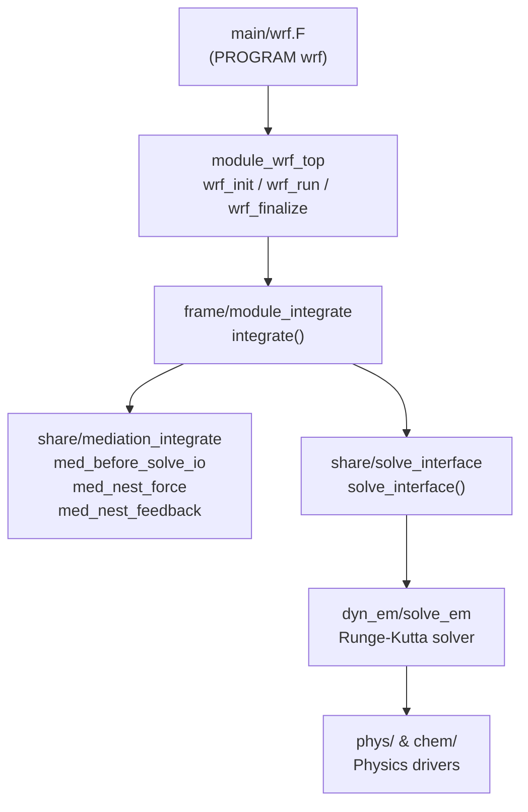

Relevant Files

<ul>
<li><code>main/wrf.F</code></li>
<li><code>main/module_wrf_top.F</code></li>
<li><code>frame/module_integrate.F</code></li>
<li><code>frame/module_domain.F</code></li>
<li><code>frame/module_domain_type.F</code></li>
<li><code>share/mediation_integrate.F</code></li>
<li><code>share/mediation_wrfmain.F</code></li>
<li><code>frame/module_configure.F</code></li>
<li><code>frame/module_driver_constants.F</code></li>
</ul>

WRF is organized into three horizontal software layers — **Driver**, **Mediation**, and **Model** — stacked so that the driver layer remains entirely model-agnostic while the model layer contains all physics and dynamics. Data flows downward through the layers at each time step and returns upward through I/O callbacks.

### Layered Architecture

The three layers divide responsibility cleanly:

- **Driver Layer** (`main/`, `frame/`) — model-independent orchestration: program startup, configuration broadcast, domain allocation, clock management, and the integration loop.
- **Mediation Layer** (`share/`) — the bridge between the driver and the dynamical core. Handles initial data input, history/restart I/O, nest initialization, lateral boundary forcing, and feedback.
- **Model Layer** (`dyn_em/`, `phys/`, `chem/`) — solver, physics parameterizations, and chemistry. Receives a `TYPE(domain)` pointer and advances state by one time step.

### Program Entry Point (`main/wrf.F`)

The Fortran `PROGRAM wrf` is the single entry point. It calls four top-level routines in sequence:

1. `wrf_init` — initializes MPI/OpenMP, reads and broadcasts the `namelist.input`, allocates the top-level (`head_grid`) domain, reads initial or restart data.
2. `wrf_dfi` — optional Digital Filter Initialization pass.
3. `wrf_run` — enters the integration loop by calling `integrate(head_grid)`.
4. `wrf_finalize` — flushes I/O, calls `MPI_Finalize`.

### Initialization Sequence (`module_wrf_top`)

Inside `wrf_init`, the following steps occur in order:

- `init_modules(1/2)` — initializes external I/O packages and MPI quilt processes.
- `initial_config` — reads `namelist.input` on rank 0 and broadcasts it as a byte buffer via `wrf_dm_bcast_bytes`.
- `setup_physics_suite / set_physics_rconfigs` — validates and derives physics configuration.
- `alloc_and_configure_domain` — allocates the `TYPE(domain)` head grid and links it into the global domain linked list (`head_grid`).
- `Setup_Timekeeping` — sets up ESMF clocks and alarms for the domain.
- `med_initialdata_input` — opens `wrfinput_d01` (or restart file) and reads all registered state variables.

### The `TYPE(domain)` Data Structure

Every simulation domain is represented by a single Fortran derived type `TYPE(domain)` (defined across `frame/module_domain_type.F` and extended in `frame/module_domain.F`). Key aspects:

- Domains form a **linked list** with parent/child pointers, enabling arbitrarily deep two-way nesting.
- All 3-D meteorological arrays (winds, temperature, moisture scalars, chemistry tracers) live as allocatable array members on the domain object.
- `grid%domain_clock` is an ESMF clock that tracks the current simulation time for the domain independently of its parent.
- The global pointer `head_grid` always points to the outermost (coarsest) domain; `current_grid` is updated during integration for debugging.

### Integration Loop (`frame/module_integrate.F`)

The `integrate(grid)` subroutine is the innermost driver-layer loop. It is **recursive** — when a nested domain needs to be advanced, `integrate` calls itself on the child. The per-time-step flow is:

1. `med_setup_step` — sets tracer array indices.
2. `nests_to_open` — checks whether any child domain should be activated at this time; if so, allocates and initializes it via `med_nest_initial`.
3. `med_before_solve_io` — writes history and restart output if alarms are ringing.
4. `solve_interface` → `solve_em` — advances the domain one time step using third-order Runge-Kutta.
5. `domain_clockadvance` — increments the domain's ESMF clock.
6. `med_after_solve_io` — post-solve I/O hook.
7. For each child: `med_nest_force` (lateral BC), recursive `integrate(child)`, `med_nest_feedback` (two-way feedback to parent).

### Configuration System (`frame/module_configure.F`)

All namelist variables are declared inside `TYPE(model_config_rec_type)` via a Registry-generated include file (`namelist_defines.inc`). A per-domain view (`TYPE(grid_config_rec_type)`) is extracted by `model_to_grid_config_rec`. On distributed-memory runs the entire configuration record is serialized to a byte buffer and broadcast so every MPI rank holds identical settings.

### Key Constants (`frame/module_driver_constants.F`)

Runtime limits are compile-time parameters:

| Parameter | Value | Meaning |
|---|---|---|
| `max_levels` | 20 | Maximum nesting depth |
| `max_nests` | 20 | Maximum children per domain |
| `max_domains` | derived | Total simultaneous domains |
| `max_eta` | 10001 | Maximum vertical levels |

Data ordering (e.g., `DATA_ORDER_XYZ`) is set at configure time and controls how 3-D arrays are laid out in memory, affecting both halo communication patterns and physics loop tiling.