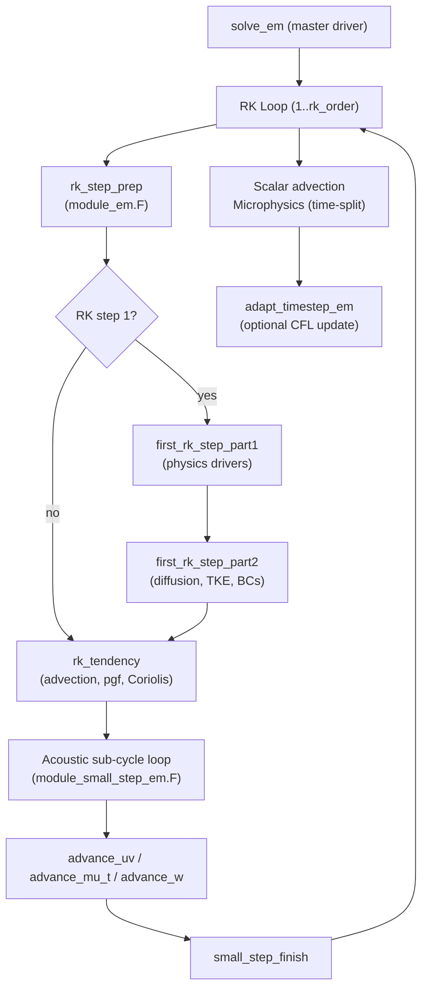

Relevant Files

<ul>
<li><code>dyn_em/solve_em.F</code></li>
<li><code>dyn_em/module_em.F</code></li>
<li><code>dyn_em/module_first_rk_step_part1.F</code></li>
<li><code>dyn_em/module_first_rk_step_part2.F</code></li>
<li><code>dyn_em/module_small_step_em.F</code></li>
<li><code>dyn_em/module_advect_em.F</code></li>
<li><code>dyn_em/module_diffusion_em.F</code></li>
<li><code>dyn_em/module_bc_em.F</code></li>
<li><code>dyn_em/adapt_timestep_em.F</code></li>
<li><code>dyn_em/start_em.F</code></li>
</ul>

The ARW (Advanced Research WRF) dynamical core advances atmospheric state variables one timestep at a time using a **split-explicit Runge-Kutta scheme**. Fast acoustic modes are handled via sub-cycling at a shorter acoustic timestep, while slower dynamics and physics operate at the full model timestep.

### Overall Solver Architecture

`solve_em.F` is the master driver. It is called once per timestep for each domain and orchestrates all dynamics, physics tendencies, and time integration. The integration is 2nd or 3rd order Runge-Kutta (controlled by `rk_order`), with each RK sub-step further split into a large-step tendency calculation and an acoustic sub-cycling loop.

### Runge-Kutta Time Integration

Each large timestep `dt` is split into 2 or 3 RK sub-steps with fractional timesteps:

- **2nd-order RK**: sub-step fractions `dt/2`, `dt`
- **3rd-order RK**: sub-step fractions `dt/3`, `dt/2`, `dt`

Physics tendencies (radiation, surface, PBL, cumulus) are computed **once** during the first RK sub-step (`module_first_rk_step_part1.F`) and stored as `*_tendf` arrays. All subsequent RK sub-steps reuse these frozen tendencies, keeping the physics cost constant regardless of `rk_order`.

### Physics Tendencies (Part 1 & Part 2)

`module_first_rk_step_part1.F` calls physics drivers in this sequence:

1. Pre-radiation and radiation (longwave + shortwave)
2. Land surface model
3. Cumulus and shallow convection parameterizations
4. PBL turbulence scheme
5. FDDA grid nudging and optional fire/chemistry drivers

`module_first_rk_step_part2.F` then applies those tendencies to the dynamics state, computes deformation and divergence for turbulence closure, solves for eddy diffusivity (`xkmh`, `xkhh`) via TKE, and applies lateral boundary conditions using routines from `module_bc_em.F`.

### Acoustic (Small-Step) Sub-Cycling

Sound waves propagate faster than the advective CFL limit allows for the large timestep. WRF handles this by sub-cycling the pressure, momentum, and mass equations at a shorter timestep `dts = dt / num_sound_steps` (typically 4–6 sub-steps).

Each acoustic sub-step in `module_small_step_em.F` executes:

1. **`calc_coef_w`** — pre-computes implicit tridiagonal coefficients for vertical velocity
2. **`advance_uv`** — advances horizontal momentum with pressure gradient force
3. **`advance_mu_t`** — advances column dry-air mass (`mu`) and potential temperature
4. **`advance_w`** — solves for vertical velocity implicitly (tridiagonal), then updates geopotential
5. **`calc_p_rho`** — diagnoses perturbation pressure and inverse density from updated state

The vertical momentum equation is solved **implicitly** to remove the CFL restriction from vertical acoustic waves, allowing larger `dts` than a purely explicit scheme.

### Advection Schemes

`module_advect_em.F` implements momentum and scalar advection with selectable order and scheme:

- 2nd, 4th, or 6th-order centered differences (horizontal)
- WENO (Weighted Essentially Non-Oscillatory) variants
- Positive-definite and monotonic flux limiters for scalars

All advection velocities (`ru`, `rv`, `rom`) are mass-weighted (`u × mu`), ensuring mass consistency with the terrain-following coordinate.

### Diffusion and Turbulence

`module_diffusion_em.F` provides:

- **Deformation-based eddy viscosity** using the Smagorinsky model: eddy viscosity scales as `(Δx)² × |D|` where `|D|` is the deformation magnitude
- **Horizontal diffusion**: 2nd-order (Laplacian) or 4th-order (bi-harmonic) on model levels
- **Vertical diffusion**: implicit Crank-Nicolson for stability with variable diffusivity
- **TKE closure**: optional prognostic TKE equation with shear production, buoyancy, and dissipation terms

### Boundary Conditions

`module_bc_em.F` supports several lateral BC modes:

- **Specified** (`spec_bdy_dry`): boundary values read from external data files and interpolated in time
- **Relaxation** (`relax_bdy_dry`): gradual nudging toward external values over a configurable zone width (`spec_bdy_width`)
- **Open/symmetric/periodic**: for idealized simulations

Boundary tendencies are applied to `u`, `v`, `w`, `t`, `ph`, and `mu` at every large timestep.

### Adaptive Timestep

`adapt_timestep_em.F` monitors horizontal and vertical CFL numbers each step:

- `max_horiz_cfl` = max(`|u| dt/dx`, `|v| dt/dy`)
- `max_vert_cfl` = max(`|w| dt/dz`)

When CFL exceeds a threshold the timestep is reduced; it grows back at a limited rate (`max_step_increase_pct`) to avoid oscillations. The adaptive scheme also snaps `dt` to output and boundary-condition update times.

### Initialization

`start_em.F` runs once before time integration begins. It sets up:

- Terrain-following η-coordinate metrics (`dnw`, `rdnw`, `znu`, `c1h/f`, `c2h/f`)
- Hydrostatic base-state profiles (`t_base`, `phb`, `pb`, `u_base`)
- Initial perturbation fields (`u_2`, `v_2`, `w_2`, `t_2`, `ph_2`, `mu_2`)
- Map-scale factors for the chosen map projection
- Acoustic sub-step count (`time_step_sound`) from an initial CFL estimate