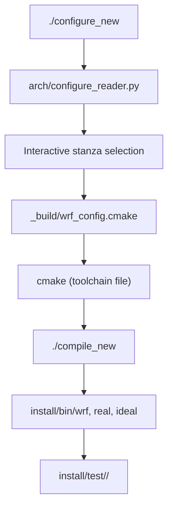

<details>
<summary>Relevant Files</summary>

<ul>
<li><code>configure</code></li>
<li><code>configure_new</code></li>
<li><code>arch/configure.defaults</code></li>
<li><code>arch/Config.pl</code></li>
<li><code>CMakeLists.txt</code></li>
<li><code>doc/README.cmake_build</code></li>
<li><code>test/em_real/</code></li>
<li><code>main/real_em.F</code></li>
<li><code>main/ideal_em.F</code></li>
</ul>

</details>

WRF supports two parallel build systems: a legacy shell/Perl-based approach centered on the `configure` script, and a modern CMake-based approach introduced via `configure_new`. Both ultimately produce the same set of executables (`wrf`, `real`, and `ideal`) but differ in tooling, dependency discovery, and automation support.

### Legacy Build System (`configure` + `compile`)

The traditional workflow starts by running `./configure`, which parses command-line flags and then delegates to the Perl script `arch/Config.pl`. That script reads architecture stanzas from `arch/configure.defaults` and writes a `configure.wrf` Makefile fragment containing compiler paths, optimization flags, and preprocessor defines. Running `./compile` then picks up that fragment and drives the recursive `make` across all source subdirectories.

**`configure` flags:**

| Flag | Purpose |
|------|---------|
| `-d` | Debug build (no optimization) |
| `-D` | Debug with floating-point traps and traceback |
| `-r8` | Promote reals to 8-byte (double precision) |
| `-os`, `-mach` | Override OS/machine auto-detection |
| `chem` / `kpp` | Enable WRF-Chem or KPP chemistry |
| `wrfda` / `4dvar` | Configure for data assimilation cores |
| `titan` / `mars` / `venus` | Planetary atmosphere variants |

**`arch/configure.defaults` stanza structure:**

Each stanza targets a specific OS, compiler, and parallelism combination. Key fields per stanza include `SFC`/`SCC` (serial compilers), `DM_FC`/`DM_CC` (MPI compilers), `FCOPTIM`/`FCNOOPT` (optimization flags), `DMPARALLEL`, `OMP`, and `RWORDSIZE`. Supported compiler families include GNU (gfortran/gcc), Intel (ifort/icc), NVIDIA/PGI (nvfortran), IBM (xlf/xlc), and Cray cross-compilers.

### Modern Build System (`configure_new` + CMake)

The CMake-based system (`CMakeLists.txt`) requires CMake 3.20+ and enforces out-of-source builds. Running `./configure_new` launches an interactive wizard powered by `arch/configure_reader.py`, which reads the same `configure.defaults` stanzas but only shows entries whose compilers are present in `PATH`. It writes a CMake toolchain file to `_build/wrf_config.cmake`, after which CMake configures and `./compile_new` drives the build.



**Non-interactive CMake example:**

```bash
./configure_new -p GNU -x -- \
  -DWRF_CORE=ARW \
  -DWRF_NESTING=BASIC \
  -DWRF_CASE=EM_REAL \
  -DUSE_MPI=ON
./compile_new -j 12
```

**Key CMake cache variables:**

| Variable | Options | Default |
|----------|---------|---------|
| `WRF_CORE` | `ARW`, `DA`, `DA_4D_VAR`, `PLUS`, `CONVERT` | `ARW` |
| `WRF_NESTING` | `NONE`, `BASIC`, `MOVES`, `VORTEX` | `NONE` |
| `WRF_CASE` | `EM_REAL`, `EM_FIRE`, `EM_LES`, `EM_B_WAVE`, … | `EM_REAL` |
| `USE_MPI` / `USE_OPENMP` | `ON` / `OFF` | `OFF` |
| `USE_DOUBLE` | `ON` / `OFF` | `OFF` |
| `ENABLE_CHEM` / `ENABLE_KPP` | `ON` / `OFF` | `OFF` |
| `ENABLE_HYDRO` | `ON` / `OFF` | `OFF` |

Dependency discovery uses `find_package()` with optional `*_ROOT` hints (e.g., `netCDF_ROOT`, `HDF5_ROOT`, `MPI_ROOT`). The CMake build also copies test-case input files from `test/<case>/` into `install/test/<case>/` automatically.

### Initializing Simulations: `real_em.F` vs `ideal_em.F`

Before `wrf` can run, initial conditions must be created by one of two preprocessor executables:

**`real` (from `main/real_em.F`)** — reads WPS output files (`met_em.*.nc`) containing interpolated reanalysis or forecast data. It calls `module_initialize_real` to produce `wrfinput_d0X` (initial conditions) and `wrfbdy_d01` (lateral boundary conditions). This path supports multiple nested domains, chemistry initialization, and data assimilation restart files.

**`ideal` (from `main/ideal_em.F`)** — synthesizes atmospheric conditions from namelist parameters and an optional `input_sounding` vertical profile. It calls `module_initialize_ideal` and produces only `wrfinput_d01`; no boundary conditions are generated because the domain is periodic or isolated.

| Aspect | `real` | `ideal` |
|--------|--------|---------|
| Input | WPS `met_em.*` files | Namelist + `input_sounding` |
| Boundary file | `wrfbdy_d01` generated | Not generated |
| Nested domains | Full multi-domain support | Simplified |
| Use case | Operational / hindcast runs | Sensitivity studies, development |

### Test Cases

Test cases live under `test/` and are named after the `WRF_CASE` CMake variable. Each directory provides one or more `namelist.input.*` files covering specific scenario variants.

**Real-data test cases (`test/em_real/`):**

The default `namelist.input` configures a 36-hour, two-domain run (15 km outer / 5 km inner) starting 2019-09-04 12 UTC with the `CONUS` physics suite. Variant namelists cover chemistry (`namelist.input.chem`), fire behavior (`namelist.input.fire`), global domains, ndown one-way nesting, and PBL-to-LES scale bridging.

**Ideal test cases:**

- `em_b_wave` — mid-latitude baroclinic wave (benchmark)
- `em_squall2d_x` / `em_squall2d_y` — 2-D squall line (x- or y-aligned)
- `em_quarter_ss` — quarter-circle shear / supercell thunderstorm
- `em_les` — Large-Eddy Simulation boundary layer
- `em_heldsuarez` — Held-Suarez global dry-atmosphere test
- `em_grav2d_x` / `em_hill2d_x` — 2-D gravity wave / mountain-wave cases
- `em_tropical_cyclone` — tropical cyclone bogussing
- `em_fire` — coupled fire-atmosphere model
- `em_scm_xy` — single-column model

### Running a Simulation (Quick Reference)

```bash
# Real-data workflow
cd install/test/em_real
# (place met_em.* files here)
./real            # produces wrfinput_d01, wrfbdy_d01
mpirun -np 16 ./wrf

# Ideal workflow (e.g., squall line)
cd install/test/em_squall2d_x
./ideal           # produces wrfinput_d01
mpirun -np 4 ./wrf
```

To clean a CMake build entirely, run `./cleanCMake.sh` from the source root. For the legacy system, `./clean -a` removes compiled objects and the `configure.wrf` file.