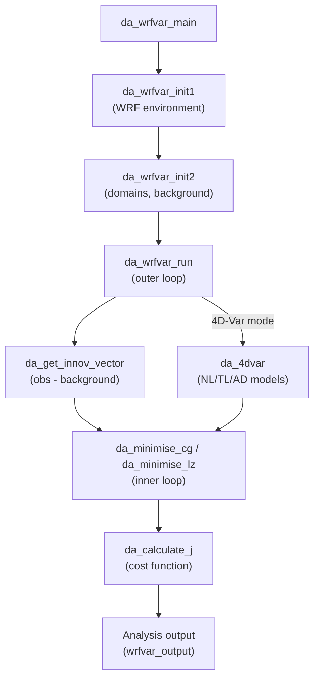

Relevant Files

<ul>
<li><code>var/da/da_main/da_wrfvar_main.f90</code></li>
<li><code>var/da/da_main/da_wrfvar_top.f90</code></li>
<li><code>var/da/da_minimisation/da_minimisation.f90</code></li>
<li><code>var/da/da_4dvar/da_4dvar.f90</code></li>
<li><code>var/da/da_obs/da_obs.f90</code></li>
<li><code>var/da/da_radiance/da_radiance.f90</code></li>
<li><code>var/da/da_control/da_control.f90</code></li>
<li><code>doc/README.DA</code></li>
</ul>

WRFDA (WRF Data Assimilation) is the variational data assimilation component of the WRF modeling system. It combines model background forecasts with observational data to produce an optimal analysis state, minimizing a cost function that balances background and observation errors. WRFDA supports 3D-Var, 4D-Var, and hybrid ensemble-variational methods.

### System Architecture

The entry point is `da_wrfvar_main.f90`, which calls a two-phase initialization followed by the main assimilation run. The top-level module (`da_wrfvar_top.f90`) orchestrates domain setup, background error loading, observation ingestion, and the minimization loop through a series of included `.inc` files.

### Cost Function and Minimization

The variational analysis minimizes a cost function with multiple terms:

**J = J_b + J_o + J_c + J_e**

- **J_b** — Background term: departure from the background forecast, weighted by background error covariance B
- **J_o** — Observation term: departure from observations, weighted by observation error covariance R
- **J_c** — Constraint term: physical constraints (divergence, wind perturbation energy)
- **J_e** — Ensemble term: hybrid ensemble contribution (when enabled)

The minimization module (`da_minimisation.f90`) provides two solvers:

- `da_minimise_cg()` — Conjugate Gradient (CG) solver, default for 3D-Var
- `da_minimise_lz()` — Lanczos solver, useful for producing eigenvalue-based preconditioning

Key namelist parameters controlling minimization:

| Parameter | Description |
|---|---|
| `ntmax` | Maximum inner-loop iterations per outer loop |
| `eps` | Convergence criterion for gradient norm |
| `precondition_cg` | Enable CG preconditioning |
| `cv_options` | Control variable option (CV5, CV6, CV7, etc.) |

### 4D-Var Mode

When compiled with `#ifdef VAR4D`, WRFDA activates time-dependent assimilation via `da_4dvar.f90`. Unlike 3D-Var (which assimilates all observations at a single analysis time), 4D-Var propagates the model state forward and backward across an assimilation window:

1. **Nonlinear model** (`da_nl_model`) — integrates WRF forward, saving trajectory
2. **Tangent linear model** (`da_tl_model`) — linearized forward propagation
3. **Adjoint model** (`da_ad_model`) — backward propagation of gradient information
4. Observations are assimilated at their actual times (FGAT: First Guess at Appropriate Time)

Configuration keys: `var4d = .true.`, `num_fgat_time`, `var4d_lbc` (lateral boundary control).

### Observation Handling

`da_obs.f90` implements the observation operator **H** (and its adjoint **H^T**) that maps the model state to observation space. The module covers 60+ observation types:

**Conventional observations:** SYNOP, METAR, SHIPS, BUOY, SOUND, PILOT, PROFILER, TAMDAR, AIREP, RADAR, LIGHTNING, RAIN

**Satellite observations:** Radiance (AMSU-A/B, ATMS, HIRS, IASI, MWTS, MWHS, AHI, GOES-ABI, SEVIRI, AMSR2, GMI, SSMIS), AMVs (GEOAMV, POLARAMV), SATEM, SSMI, QSCAT

**GPS observations:** GPSREF (refractivity), GPSPW (precipitable water), GPSEPH (excess phase)

The core transforms are:
- `da_transform_xtoy()` — forward operator (model space → observation space)
- `da_transform_xtoy_adj()` — adjoint operator (observation space → model space)

### Radiance Data Assimilation

The `da_radiance/` directory contains a complete satellite radiance subsystem interfacing with two radiative transfer models:

- **CRTM** (Community Radiative Transfer Model) via `da_crtm.f90`
- **RTTOV** (Radiative Transfer for TOVS) via `da_rttov.f90`

Each RT model provides forward (`_direct`), tangent linear (`_tl`), adjoint (`_ad`), and K-matrix (`_k`) operators. The radiance module also handles:

- **Bias correction** — Variational bias correction (VarBC) with scan-angle and air-mass predictors
- **Cloud detection** — Automatic screening of cloud-contaminated channels
- **Quality control** — Sensor-specific QC routines (e.g., `da_qc_amsua.inc`, `da_qc_iasi.inc`)
- **Multi-format I/O** — BUFR, HDF5, and NetCDF4 readers for different satellite platforms

### Control Variables and Background Errors

`da_control.f90` is the central configuration module, defining all namelist parameters and physical constants used across WRFDA. Key background error options (`cv_options`):

- **CV5** — Streamfunction, velocity potential, unbalanced temperature/pressure, pseudo-relative humidity
- **CV6** — Adds moisture control variable extensions
- **CV7** — Direct wind components (u, v) instead of stream function

The control variable size is tracked via `cv_size_domain_jb`, `cv_size_domain_je`, etc., enabling flexible hybrid configurations where ensemble covariances augment the static background error.

### Typical Workflow

1. Prepare background (`wrfinput` from WRF forecast) and observation files
2. Configure `namelist.input` with `&wrfvar4`, `&wrfvar5`, `&wrfvar7` groups
3. Run `da_wrfvar.exe` — initializes, reads obs, runs minimization loop
4. Output: `wrfvar_output` (analysis), diagnostic files (cost function history, observation statistics, filtered radiances)
5. For cycling: feed `wrfvar_output` back into WRF as the next forecast initial condition