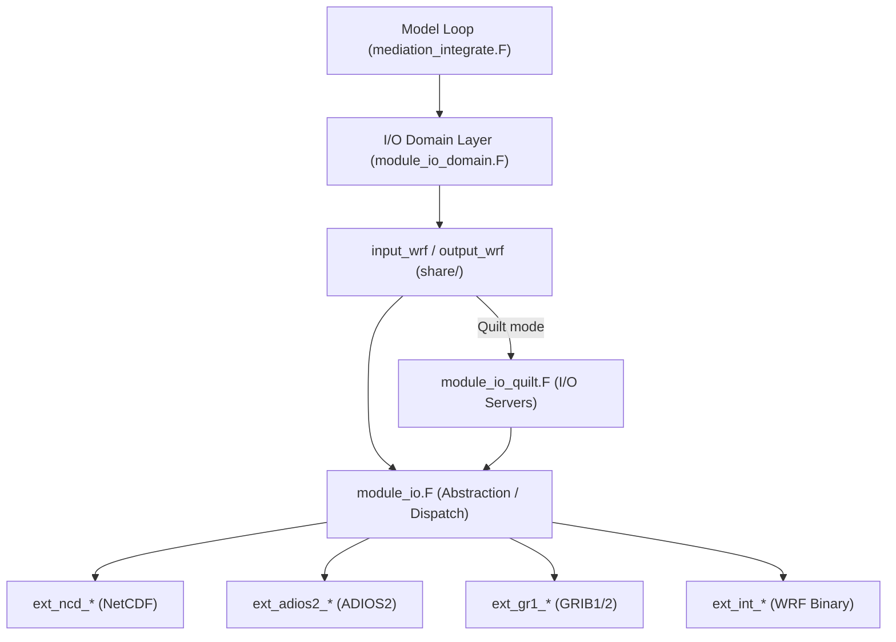

<details>
<summary>Relevant Files</summary>

<ul>
<li><code>frame/module_io.F</code></li>
<li><code>frame/module_io_quilt.F</code></li>
<li><code>frame/module_streams.F</code></li>
<li><code>share/module_io_wrf.F</code></li>
<li><code>share/input_wrf.F</code></li>
<li><code>share/output_wrf.F</code></li>
<li><code>external/io_netcdf/wrf_io.F90</code></li>
<li><code>external/io_adios2/wrf_io.F90</code></li>
<li><code>doc/README.io_config</code></li>
<li><code>Registry/registry.io_boilerplate</code></li>
</ul>

</details>

WRF's I/O system is a layered, pluggable framework that decouples the model from any specific file format. A thin abstraction layer in `frame/module_io.F` dispatches calls to interchangeable backends (NetCDF, ADIOS2, GRIB, etc.), while a dedicated **quilt server** mechanism offloads file operations from compute tasks to maximize parallel efficiency.

### Layered Architecture



Each backend exposes an identical set of routines (e.g., `ext_*_open_for_write`, `ext_*_write_field`, `ext_*_close`) so the upper layers never need to know which format is active.

### Key Components

**`frame/module_io.F` — Abstraction Layer**

This module is the single entry point for all I/O calls. Functions like `wrf_open_for_write_begin`, `wrf_write_field`, and `wrf_iosync` forward to the correct backend based on the `io_form_*` namelist setting. The integer codes map as follows:

- `1` → WRF internal binary (INTIO)
- `2` → NetCDF (default)
- `4` → Parallel HDF5
- `5` / `10` → GRIB1 / GRIB2
- `14` → ADIOS2

**`frame/module_io_quilt.F` — Parallel Quilt Servers**

When `nio_tasks_per_group > 0` is set in the namelist, a subset of MPI ranks becomes **I/O server tasks** (quilters). Compute ranks pack field data and command headers and send them via MPI; the servers receive, reassemble, and write to disk asynchronously. This pattern prevents all compute ranks from blocking on file I/O simultaneously.

**`frame/module_streams.F` — Stream Definitions**

Defines the constants and alarm logic for every named stream (`history_only`, `restart_only`, `auxinput1_only`, `auxhist1_only`, …). The model checks these alarms each time step to decide whether output is due.

**`share/input_wrf.F` & `share/output_wrf.F` — Core Read/Write**

These routines iterate all domain state variables and check the Registry-assigned I/O mask for each variable. If the mask includes the current stream, the variable is read from or written to the open file handle via `wrf_read_field` / `wrf_write_field`.

### I/O Streams

WRF supports multiple independent streams, each configurable with its own format, interval, and variable set:

| Stream | Namelist prefix | Default format key |
|---|---|---|
| Main history | `history_*` | `io_form_history` |
| Main input | `input_*` | `io_form_input` |
| Restart | `restart_*` | `io_form_restart` |
| Lateral boundary | `boundary_*` | `io_form_boundary` |
| Auxiliary history 1–N | `auxhist{N}_*` | `io_form_auxhist{N}` |
| Auxiliary input 1–N | `auxinput{N}_*` | `io_form_auxinput{N}` |

### Runtime Field Configuration

Without recompiling, you can add or remove variables from any stream using the `iofields_filename` namelist option. Each domain can point to a different file. The file format is:

```
op:streamtype:streamid:variables
```

- `op` — `+` to add, `-` to remove
- `streamtype` — `h` (history) or `i` (input)
- `streamid` — `0` for the main stream, `1`–N for auxiliary streams

**Example `iofields_filename` file:**

```
+:h:0:U,V,W,T,PH       # add fields to main history
-:h:0:QVAPOR            # remove QVAPOR from main history
+:i:5:T,QVAPOR          # add fields to auxinput5
```

### NetCDF & ADIOS2 Backends

**`external/io_netcdf/`** is the most commonly used backend. It supports both NetCDF3 (classic) and NetCDF4/HDF5. Use `use_netcdf_classic = .true.` for the classic format and `ncd_nofill = .true.` to skip fill-value operations for a write-speed boost.

**`external/io_adios2/`** provides an HDF5-based backend via the ADIOS2 library, with built-in compression support. Key compile-time options are exposed as namelist variables:

- `adios2_compression_enable` — toggle BLOSC compression (default: `.true.`)
- `adios2_blosc_compressor` — compressor algorithm (default: `"lz4"`)
- `adios2_numaggregators` — number of MPI aggregator ranks for collective I/O

### Data Flow Summary

1. The model loop calls `med_after_solve_io()` at the end of each time step.
2. Stream alarms are checked; any due stream triggers `output_wrf(switch=<stream>)`.
3. `output_wrf` scans state variables, writes each matching field via `wrf_write_field`.
4. In quilt mode, compute ranks send packed headers + data over MPI to I/O servers, which call `ext_*_write_field` directly and flush to disk.
5. Symmetrically, `input_wrf` handles reading at initialization and during the forecast for boundary updates or data assimilation streams.