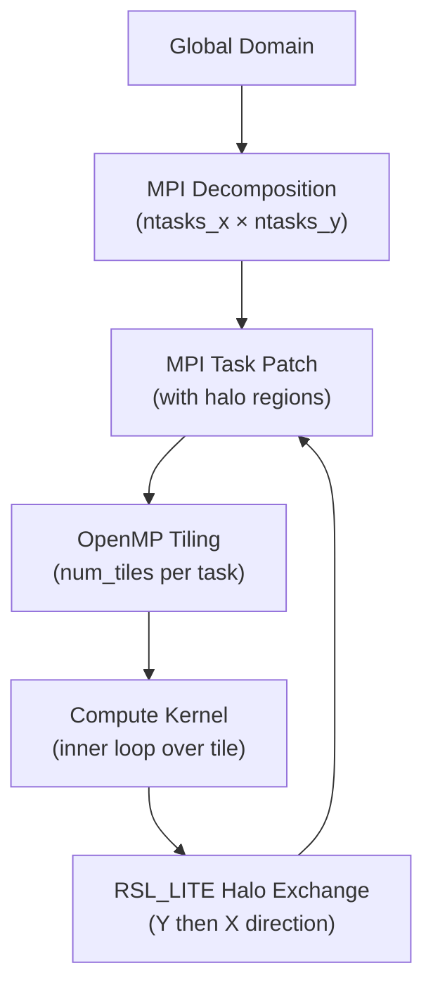

<details>
<summary>Relevant Files</summary>

<ul>
<li><code>frame/module_comm_dm.F</code></li>
<li><code>frame/module_comm_nesting_dm.F</code></li>
<li><code>frame/module_tiles.F</code></li>
<li><code>frame/module_nesting.F</code></li>
<li><code>external/RSL_LITE/module_dm.F</code></li>
<li><code>external/RSL_LITE/gen_comms.c</code></li>
<li><code>external/RSL_LITE/task_for_point.c</code></li>
<li><code>share/module_MPP.F</code></li>
<li><code>frame/module_sm.F</code></li>
</ul>

</details>

WRF uses a **hybrid MPI + OpenMP** parallelism model. MPI distributes the global domain across tasks (distributed memory), while OpenMP tiles each task's subdomain for multi-threaded computation (shared memory). Communication between MPI tasks is managed by the **RSL_LITE** library.

### Hybrid Parallelism Overview



The decomposition is **2D Cartesian**: tasks are arranged in a `ntasks_x` × `ntasks_y` grid. Each task owns a rectangular patch of the domain plus surrounding **halo** cells copied from neighbors.

### MPI Domain Decomposition (`share/module_MPP.F`, `external/RSL_LITE`)

`module_MPP.F` stores per-task index metadata:

- `MYPE` — MPI rank; `INPES`, `JNPES` — task grid dimensions
- `MY_IS_GLB` / `MY_IE_GLB`, `MY_JS_GLB` / `MY_JE_GLB` — global index extents owned by this task
- `MYIS`/`MYIE`/`MYJS`/`MYJE` — interior (non-halo) loop bounds for computation
- Up to 5 sub-region variants (`MYIS1`–`MYIS5`) for stencil-aware loop splitting

The RSL_LITE layer (`external/RSL_LITE/module_dm.F`) creates a **2D MPI Cartesian topology** and manages communicators:

```fortran
local_communicator          ! all tasks in this domain
local_communicator_periodic ! periodic-boundary variant
local_communicator_x        ! row subcommunicator (X direction)
local_communicator_y        ! column subcommunicator (Y direction)
```

The subroutine `patch_domain_rsl_lite()` computes each task's patch, memory (halo-extended), and interior bounds. It also sets up **transposed decompositions** (XyZz, XzYy, XzYx) needed for spectral operations and FFTs.

#### Load Balancing (`external/RSL_LITE/task_for_point.c`)

The function `TASK_FOR_POINT` maps each grid point `(i, j)` to an MPI rank. Remainder points are distributed to **boundary tasks** (which carry lighter stencil loads), keeping interior tasks evenly loaded.

### Halo Exchange Protocol (`external/RSL_LITE/gen_comms.c`)

After each computation phase, ghost/halo cells are refreshed with a **two-pass exchange** that uses the row/column subcommunicators to avoid a global all-to-all:

1. **`RSL_LITE_INIT_EXCH`** — initialize exchange buffers
2. **`RSL_LITE_EXCH_Y`** — exchange north/south halos via `local_communicator_y`
3. **`RSL_LITE_EXCH_X`** — exchange east/west halos via `local_communicator_x`

Maximum halo width is 6 cells (`max_halo_width 6`). The communication subroutines themselves are **registry-generated** and included by `frame/module_comm_dm.F` and `frame/module_comm_nesting_dm.F` at compile time via `#include` directives gated on `#ifdef DM_PARALLEL`.

### OpenMP Tiling (`frame/module_tiles.F`, `frame/module_sm.F`)

Within each MPI task, the patch is subdivided into **tiles** for OpenMP threads. The core routine is `set_tiles2()`:

- Reads `tile_sz_x` / `tile_sz_y` from the namelist, or `WRF_NUM_TILES` / `WRF_NUM_TILES_X` / `WRF_NUM_TILES_Y` environment variables.
- Falls back to `omp_get_max_threads()` (from `frame/module_sm.F`) to set a sensible default.
- Supports three strategies: 1D-X, 1D-Y, or **2D-XY** (least-aspect-ratio balanced).
- Stores per-tile bounds in `grid%i_start`, `grid%i_end`, `grid%j_start`, `grid%j_end`.

Compute loops then iterate over tiles, enabling `!$OMP PARALLEL DO` over the tile index:

```fortran
!$OMP PARALLEL DO SCHEDULE(RUNTIME)
DO tile = 1, grid%num_tiles
  DO j = grid%j_start(tile), grid%j_end(tile)
    DO i = grid%i_start(tile), grid%i_end(tile)
      ! physics / dynamics kernel
    END DO
  END DO
END DO
!$OMP END PARALLEL DO
```

`set_tiles_once()` caches tile configurations across calls (up to `MAX_TILING_ZONES` zones) to avoid repeated setup overhead.

### Nested Domain Parallelism (`frame/module_nesting.F`, `frame/module_comm_nesting_dm.F`)

Nested (child) domains may run on a **subset of MPI tasks**. Each parent-child pair maintains its own inter-communicator (`intercomm_to_mom`, `intercomm_to_kid`). The flag array `domain_active_this_task(max_domains)` tracks which domains are live on each rank.

An **intermediate grid** sits between parent and child: it carries parent-resolution data on the child decomposition and serves as the staging area for interpolation and feedback. `module_comm_nesting_dm.F` provides the halo-exchange subroutines specific to these cross-domain transfers.

### Key Compilation Flags

| Flag | Effect |
|---|---|
| `DM_PARALLEL` | Enables MPI distributed-memory paths |
| `_OPENMP` | Enables OpenMP shared-memory paths |
| `STUBMPI` | Replaces MPI with serial stubs (single-task builds) |