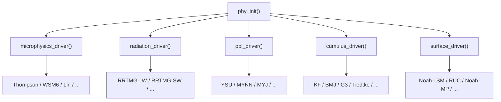

Relevant Files

<ul>
<li><code>phys/module_physics_init.F</code></li>
<li><code>phys/module_microphysics_driver.F</code></li>
<li><code>phys/module_radiation_driver.F</code></li>
<li><code>phys/module_pbl_driver.F</code></li>
<li><code>phys/module_cumulus_driver.F</code></li>
<li><code>phys/module_surface_driver.F</code></li>
<li><code>phys/module_sf_noahdrv.F</code></li>
<li><code>phys/module_bl_ysu.F</code></li>
<li><code>phys/module_ra_rrtmg_lw.F</code></li>
<li><code>phys/module_mp_thompson.F</code></li>
</ul>

WRF organizes its atmospheric physics into six major categories, each controlled by a namelist integer option. A **driver module** (mediation layer) reads the option, routes execution to the chosen scheme, and returns tendencies that are applied to the model state. All physics initialization runs through `phy_init()` in `module_physics_init.F` before the first time step.

### Initialization (`module_physics_init.F`)

`phy_init()` is called once per domain at model start. It allocates physics arrays, reads look-up tables, and sets scheme-specific constants. Key namelist flags it processes include `mp_physics`, `ra_lw_physics`, `ra_sw_physics`, `bl_pbl_physics`, `cu_physics`, `sf_sfclay_physics`, and `sf_surface_physics`. Pre-built physics suites such as `"CONUS"` or `"tropical"` set many of these flags automatically.

### Microphysics (`module_microphysics_driver.F`, `module_mp_thompson.F`)

The microphysics driver selects among 25+ schemes via `mp_physics`. It passes moisture arrays — Qv, Qc, Qr, Qi, Qs, Qg, Qh, plus optional number concentrations — to the chosen scheme and collects precipitation rates and updated tendencies.

| `mp_physics` | Scheme | Moments |
|---|---|---|
| 1 | Kessler | 1 (warm rain only) |
| 3 / 5 / 6 / 7 | WSM3 / WSM5 / WSM6 / WSM7 | 1 |
| 8 | Thompson | 2 (ice/rain) |
| 28 | Thompson Aerosol-Aware | 2 + aerosol |
| 40 | Morrison | 2 |
| 30 | NSSL 2-moment | 2 |
| 36 | P3 | 2 (predicted particle properties) |

**Thompson microphysics** (`mp_physics=8` or `28`) predicts rain and ice number concentrations. It uses a Field et al. (2005) snow size distribution and supports nine graupel density options (50–800 kg m⁻³). The aerosol-aware variant (`mp_physics=28`) prognoses cloud-condensation nucleus (CCN) and ice-nuclei (IN) concentrations, coupling to the radiation driver via effective radii for each hydrometeor category.

### Radiation (`module_radiation_driver.F`, `module_ra_rrtmg_lw.F`)

The radiation driver calls separate longwave (LW) and shortwave (SW) routines on a user-defined call frequency (`radt` minutes). Cloud effective radii from microphysics feed directly into the optical-depth calculation.

- **`ra_lw_physics=4` — RRTMG-LW**: 16 spectral bands (10–3250 cm⁻¹), 140 g-points, full trace-gas absorption (CO₂, CH₄, N₂O, CFCs), ice/liquid cloud parameterizations by Baum et al. and Fu et al.
- **`ra_sw_physics=4` — RRTMG-SW**: companion shortwave module with 14 bands.
- Additional options include the original RRTM (`=1`), CAM (`=10`), GFDL (`=31`), and Goddard (`=32`) schemes.

Aerosol direct effects are activated with `aer_opt` and `aer_ra_feedback=1`, passing aerosol optical depth from the chemistry module or a climatology into the radiation calculation.

### Planetary Boundary Layer (`module_pbl_driver.F`, `module_bl_ysu.F`)

The PBL driver computes vertical turbulent mixing and diagnostic PBL height (`PBLH`). It returns momentum, heat, and moisture tendencies (`RUBLTEN`, `RTHBLTEN`, `RQVBLTEN`, etc.) plus exchange coefficients (`EXCH_H`, `EXCH_M`).

**YSU** (`bl_pbl_physics=1`) is a non-local K-profile scheme. It diagnoses PBL height from the bulk Richardson number, applies a counter-gradient correction for heat/moisture, and adds an explicit entrainment flux at the PBL top. Optional top-down mixing is enabled with `ysu_topdown_pblmix=1`.

Other popular options:
- **MYNN** (`=5`): TKE-closure, widely used for convection-allowing forecasts.
- **MYJ** (`=2`): Mellor-Yamada-Janjic, local TKE-based.
- **ACM2** (`=7`): Asymmetric Convective Model with non-local transport.

### Cumulus Convection (`module_cumulus_driver.F`)

Convective parameterization is typically active at grid spacings larger than ~4 km (`cu_physics &gt; 0`). The driver routes to deep and/or shallow convection schemes and returns `RAINC` (convective rain), `RTHCUTEN` (heating), and cloud fraction diagnostics.

- **KF** (`=1`): Kain-Fritsch, trigger-function based mass-flux scheme.
- **BMJ** (`=2`): Betts-Miller-Janjic, relaxation-type adjustment.
- **G3** (`=6`): Grell 3D ensemble, scale-aware with multiple closures.
- **New Tiedtke** (`=16`): Bechtold et al., used in tropical suite.

### Surface Physics (`module_surface_driver.F`, `module_sf_noahdrv.F`)

The surface driver pairs a **land surface model** (LSM) with a **surface layer** (SfcLay) scheme. The LSM evolves soil/snow state; the SfcLay computes exchange coefficients from similarity theory.

**Noah LSM** (`sf_surface_physics=2`) is the default for most configurations. It solves the surface energy and water balance across four soil layers, predicting soil temperature (`TSLB`), total/liquid soil moisture (`SMOIS`, `SH2O`), snow depth, and skin temperature (`TSK`). Output fluxes `HFX` and `QFX` feed directly into the PBL scheme.

**Noah-MP** (`=4`) extends Noah with multiple switchable sub-physics options (`opt_rad`, `opt_alb`, `opt_run`, `opt_snf`, etc.) for radiation transfer, snow albedo, runoff generation, and more, enabling ensemble-style uncertainty exploration within a single LSM framework.

Urban schemes (`sf_urban_physics`): **UCM** (`=1`), **BEP** (`=2`), and **BEP+BEM** (`=3`) add building canopy effects on top of Noah, coupling urban heat, drag, and energy storage back to the PBL.

### Choosing a Physics Suite

Pre-configured physics suites (`physics_suite = "CONUS"` or `"tropical"`) set consistent combinations of the above options. Individual flags in `&physics` always override suite defaults, allowing selective substitution of one scheme while keeping the rest of the suite intact.