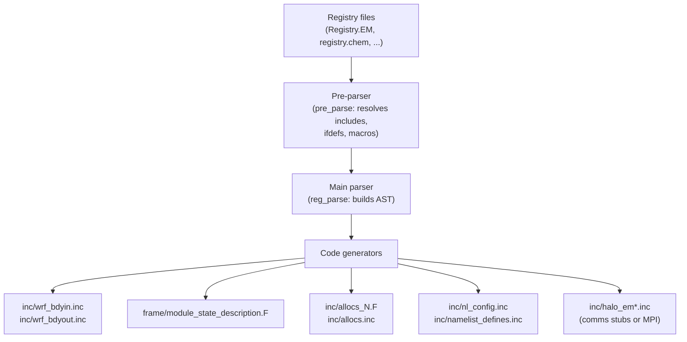

<details>
<summary>Relevant Files</summary>

<ul>
<li><code>Registry/Registry.EM</code></li>
<li><code>Registry/Registry.EM_COMMON</code></li>
<li><code>Registry/registry.chem</code></li>
<li><code>Registry/registry.dimspec</code></li>
<li><code>tools/registry.c</code></li>
<li><code>tools/gen_wrf_io.c</code></li>
<li><code>tools/gen_mod_state_descr.c</code></li>
<li><code>tools/gen_allocs.c</code></li>
<li><code>tools/gen_comms.stub</code></li>
</ul>

</details>

The Registry is WRF's central metadata system — a set of plain-text description files that declare every model state variable, namelist configuration option, and array dimension. Rather than hand-coding I/O routines, memory allocations, and communication patterns for each of thousands of fields, WRF reads these Registry files at build time and **automatically generates** the required Fortran source code. This design keeps the scientific source free of boilerplate and makes adding a new variable a single-line change.

### Registry File Structure

Registry files live in the `Registry/` directory. Multiple files are assembled together via `include` directives. The top-level entry points are configuration-specific:

- `Registry.EM` — the ARW (Eulerian mass-coordinate) core, includes `registry.em_shared_collection`
- `Registry.EM_COMMON` — shared state variables common to all EM configurations
- `registry.dimspec` — dimension character-to-axis mappings used across all files
- `registry.chem` — chemistry and aerosol state variables
- Many optional sub-registries (`registry.fire`, `registry.lake`, `registry.stoch`, …) pulled in by package definitions

Each file uses four record types:

| Record | Purpose | Example |
|--------|---------|---------|
| `dimspec` | Declares an array dimension letter, its axis, and how its size is determined | `dimspec k 2 standard_domain z bottom_top` |
| `state` | Declares a model state variable with type, dimensions, I/O flags, and metadata | `state real U ikj dyn_em 2 X iruhsd= "U" "x-wind" "m s-1"` |
| `rconfig` | Declares a namelist configuration parameter | `rconfig integer chem_opt namelist,physics max_domains 0 rh ...` |
| `package` | Groups state variables that are conditionally activated by a namelist option | `package tracer_test1 tracer_opt==2 - tracer:tr17_1,...` |

### Anatomy of a `state` Entry

A `state` line encodes everything the code generator needs to know about a field:

```text
#<Table>  <Type>  <Sym>    <Dims>  <Use>    <NumTLev>  <Stagger>  <IO>          <DName>   <Descrip>   <Units>
state     real    XLAT     ij      misc     1          -          i0123rh0156d  "XLAT"    "LATITUDE"  "degree_north"
```

- **Dims** — a compact string of dimension letters (`i`=west-east, `j`=south-north, `k`=bottom-top, etc.) defined in `registry.dimspec`
- **Stagger** — grid staggering (`X`, `Y`, `Z`, or `-` for unstaggered)
- **IO** — a bitmask string encoding which streams read/write this field (e.g., `i` = input, `r` = restart, `h` = history, digits 0–9 select auxiliary streams)
- **NumTLev** — number of time levels to allocate (important for Runge-Kutta stepping)

### The Code Generator (`tools/registry`)

The `registry` executable (built from `tools/registry.c` and related C files) is invoked at build time before any Fortran is compiled. Its pipeline is:



The generator functions and their outputs:

- **`gen_wrf_io`** (`gen_wrf_io.c`) — produces `wrf_bdyin.inc` and `wrf_bdyout.inc`, the boundary-condition I/O calls for every registered field
- **`gen_module_state_description`** (`gen_mod_state_descr.c`) — produces `module_state_description.F`, a Fortran module declaring integer `PARAM_*` and `P_*` constants for 4D scalar arrays (e.g., moisture species indices) and package activation flags
- **`gen_alloc`** (`gen_allocs.c`) — produces `allocs.inc` and a set of `allocs_N.F` subroutines (split into 32 files to avoid Fortran continuation-line limits) that dynamically allocate all domain fields at runtime
- **`gen_comms`** (`gen_comms.stub`) — in its stub form, this is a no-op; in parallel builds, an actual `gen_comms.c` is linked in that emits halo-exchange calls for every field requiring ghost-cell communication
- **`gen_namelist_defines` / `gen_namelist_defaults`** — Fortran `PARAMETER` and default value declarations for all `rconfig` entries
- **`gen_nest_interp`** — interpolation call sequences for nested-domain variables

### Adding a New Variable

To introduce a new state variable in WRF, a developer only needs to add one `state` line to the appropriate Registry file. The build system then regenerates all boilerplate. No manual editing of allocation routines, I/O loops, or communication patterns is required. Optional fields are grouped under `package` records so they are only allocated and communicated when the corresponding namelist option is active, keeping memory footprint small for configurations that do not need them.