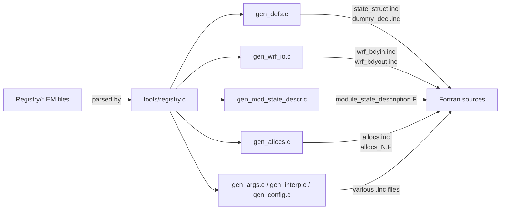

<details>
<summary>Relevant Files</summary>

<ul>
<li><code>Registry/Registry.EM</code></li>
<li><code>Registry/Registry.EM_COMMON</code></li>
<li><code>Registry/registry.dimspec</code></li>
<li><code>Registry/registry.io_boilerplate</code></li>
<li><code>Registry/registry.em_shared_collection</code></li>
<li><code>tools/gen_defs.c</code></li>
<li><code>tools/gen_wrf_io.c</code></li>
<li><code>tools/gen_mod_state_descr.c</code></li>
<li><code>tools/gen_allocs.c</code></li>
<li><code>tools/gen_comms.stub</code></li>
</ul>

</details>

The WRF Registry is the single source of truth for all model state variables, namelist parameters, and array dimension specifications. Instead of manually writing Fortran declarations, I/O calls, and memory allocations in dozens of files, developers declare a field once in a Registry text file. A suite of C programs in `tools/` then reads those declarations at build time and emits the corresponding Fortran source automatically.

### Registry File Hierarchy

Registry files are plain text and composed through `include` directives. The EM core entry point is `Registry.EM`, which pulls in shared content via `registry.em_shared_collection`:

```
Registry.EM
  └─ registry.em_shared_collection
       ├─ Registry.EM_COMMON      (core state variables)
       ├─ registry.io_boilerplate (I/O namelist entries)
       ├─ registry.fire
       ├─ registry.cam / registry.clm / ...
       └─ (20+ physics-specific sub-files)
```

`Registry.EM_COMMON` contains over 3 600 lines covering all EM dynamics fields (wind components, geopotential, mixing ratios, soil layers, land-surface fields, etc.). Physics-specific variables live in their own sub-files (`registry.cam`, `registry.lake`, `registry.stoch`, …) so that optional packages remain self-contained.

### Registry Entry Types

Four primary keywords appear in registry files:

| Keyword | Purpose |
|---|---|
| `state` | A model state field (array or scalar) stored in the domain data structure |
| `rconfig` | A namelist configuration parameter |
| `dimspec` | A named dimension, mapping a one-letter shorthand to its size source |
| `package` | An optional physics package that activates a set of state variables |

### `state` Entry Format

```
state  <type>  <name>  <dims>  <use>  <NumTLev>  <Stagger>  <IO>  <DNAME>  <DESCRIP>  <UNITS>
```

A concrete example from `Registry.EM_COMMON`:

```fortran
state    real   u   ikjb   dyn_em   2   X   i0rhusdf=(bdy_interp:dt)   "U"   "x-wind component"   "m s-1"
```

Key columns:
- **dims** – A string of one-letter dimension codes (`i`=x, `k`=z, `j`=y). The `b` suffix adds boundary halos; `f`/`t` add time tendencies.
- **NumTLev** – Number of time levels held in memory (2 = current + previous for time-stepping).
- **Stagger** – Grid staggering (`X`, `Y`, `Z`, or `-` for mass-point).
- **IO** – Compact bitmask string (`i0rh…d`) encoding which I/O streams the field participates in (input, restart, history, boundary, etc.).

### Dimension Specifications (`registry.dimspec`)

One-letter codes used in `state` entries must be declared in `registry.dimspec` before they can be used:

```
dimspec    i    1    standard_domain    x    west_east
dimspec    k    2    standard_domain    z    bottom_top
dimspec    l    2    namelist=num_soil_layers    z    soil_layers
dimspec    p    -    constant=7501               c    microphysics_rstrt_state
```

A dimension can be sized by a standard domain extent, a namelist variable, or a compile-time constant. The `ifdef` guards in `registry.dimspec` allow dimension order to differ between the EM and DA cores.

### Code Generation Pipeline



Each generator reads the parsed node tree (`Domain.fields`, `FourD`, `Packages`, etc.) and writes Fortran `include` files or full modules:

- **`gen_defs.c`** – Emits Fortran type declarations (`state_struct.inc`) that form the `domain` derived type, plus dummy-argument lists (`dummy_decl.inc`, `dummy_new_decl.inc`) used by mediation-layer calls.
- **`gen_wrf_io.c`** – Emits `wrf_bdyin.inc` and `wrf_bdyout.inc`, which contain the actual `wrf_read_field` / `wrf_write_field` calls for every state variable. It handles 4-D tracer arrays, boundary arrays, and staggered fields automatically.
- **`gen_mod_state_descr.c`** – Emits `module_state_description.F`, a Fortran module with `INTEGER PARAMETER` constants (`P_qv`, `NUM_moist`, …) that allow model code to index into 4-D scalar arrays by name rather than hard-coded integers.
- **`gen_allocs.c`** – Emits `allocs.inc` and up to 32 `allocs_N.F` subroutines that `ALLOCATE` every state variable array at runtime using the domain extents passed in via argument.
- **`gen_comms.stub`** – Stub that emits a warning when the real parallel communications generator (`gen_comms.c` from RSL Lite) is not linked in.

### Adding a New State Variable

1. Choose the appropriate registry file (e.g., `Registry.EM_COMMON` for EM dynamics, or a physics sub-file).
2. Add a `state` line with the correct type, dimension string, time levels, stagger, and I/O flags.
3. If the variable belongs to an optional package, add or extend a `package` line.
4. Re-run the build system. The `registry` executable regenerates all `.inc` files before Fortran compilation begins, so the new field appears automatically in the domain type, I/O code, and allocators.

No hand-editing of generated files is needed or recommended; they are marked with "DO NOT EDIT" headers by `print_warning()`.