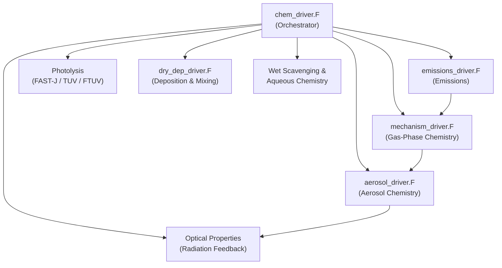

<details>
<summary>Relevant Files</summary>

<ul>
<li><code>chem/chem_driver.F</code></li>
<li><code>chem/chemics_init.F</code></li>
<li><code>chem/emissions_driver.F</code></li>
<li><code>chem/aerosol_driver.F</code></li>
<li><code>chem/mechanism_driver.F</code></li>
<li><code>chem/dry_dep_driver.F</code></li>
<li><code>Registry/registry.chem</code></li>
<li><code>Registry/Registry.EM_CHEM</code></li>
</ul>

</details>

WRF-Chem extends the base WRF model with fully online atmospheric chemistry, coupling meteorology, emissions, gas-phase reactions, aerosol dynamics, and deposition within every model timestep. The chemistry system is highly modular: users select a gas-phase mechanism, an aerosol scheme, a photolysis option, and emission sources independently, allowing a wide range of scientific configurations.

### Architecture Overview



The main entry point each timestep is `chem_driver()` in `chem/chem_driver.F`. It reads `config_flags%chem_opt` to determine which mechanisms are active, then dispatches to the appropriate sub-drivers in the order shown above.

### Initialization (`chemics_init.F`)

`chem_init()` runs once at simulation start and prepares all chemistry state:

- Reads `chem_opt`, `phot_opt`, and `aer_ic_opt` from the namelist.
- Allocates the 4-D species array `chem(i, k, j, num_chem)` — the central data structure holding every advected chemical tracer.
- Initialises mechanism-specific lookup tables (e.g., `cbmz_init_wrf_mixrats()`, `mosaic_init_wrf_mixrats()`, `aerosols_sorgam_init()`).
- Sets up photolysis rate tables and reads any external climatology files.

### Emissions (`emissions_driver.F`)

`emissions_driver()` integrates sources from multiple independent modules before every chemistry solve:

- **Anthropogenic** — time-interpolated gridded inventories (TNO, EDGAR) read into `emis_ant(i, kemit, j, species)`.
- **Biogenic** — BEIS3.14 or MEGAN2.04 calculates isoprene, monoterpenes, and other VOCs from LAI, PAR, and temperature.
- **Fire / Biomass Burning** — a plume-rise model distributes emissions vertically; frequency controlled by `plumerisefire_frq`.
- **Dust** — GOCART, AFWA, or University of Cologne schemes driven by wind speed, soil texture (`erod`), and vegetation cover.
- **Sea Salt** — five size-bin scheme driven by 10-m wind (`u10`, `v10`).
- **GHG Fluxes** — VPRM model for CO₂/CH₄ biosphere exchange.

### Gas-Phase Chemistry (`mechanism_driver.F`)

`mechanism_driver()` selects and calls the solver matching `chem_opt`. Supported mechanisms include:

| Mechanism | Description |
|-----------|-------------|
| RADM2 | Regional Acid Deposition Model v2, ~159 species |
| RACM / RACM-SOA-VBS | Regional Atmospheric Chemistry Mechanism + SOA |
| CBMZ | Carbon Bond Mechanism Z |
| CB05 | Updated carbon bond with improved VOC speciation |
| MOZART | Multi-scale solver with stratospheric coupling |
| SAPRC99 | Speciated Pollutant Removal Chemistry, ~100 species |
| KPP-based | Kinetic PreProcessor auto-generated solvers |

Photolysis rates (e.g., `ph_no2`, `ph_o31d`) are passed as 3-D arrays into each solver, pre-computed by the selected photolysis scheme (FAST-J, TUV, or FTUV).

### Aerosol Chemistry (`aerosol_driver.F`)

`aerosols_driver()` routes to the appropriate aerosol scheme:

- **GOCART** — simple mass-based transport of sulfate, BC, OC, dust (4 bins), and sea salt (4 bins).
- **MADE/SORGAM** — three-mode (Aitken, accumulation, coarse) thermodynamic equilibrium using ISORROPIA.
- **MOSAIC** — 4-bin or 8-bin sectional scheme with full aqueous chemistry, coagulation, and condensation.
- **CAM-MAM** — 3-mode or 7-mode modal scheme with aerosol–cloud interactions and nucleation.
- **SOA-VBS** — volatility basis set treating semi-volatile organics in binned volatility classes.

Key process coverage per scheme:

- **Nucleation** (binary/ternary H₂SO₄–H₂O, ion-induced)
- **Coagulation** (Brownian, shear, gravitational)
- **Water uptake** (hygroscopic growth from composition)
- **Heterogeneous reactions** (e.g., N₂O₅ hydrolysis on aerosol surfaces)

The aerosol extinction field `aerwrf(i, k, j)` is computed at the end of each timestep and fed back into the WRF radiation scheme, enabling aerosol–radiation–meteorology coupling.

### Dry Deposition & Vertical Mixing (`dry_dep_driver.F`)

`dry_dep_driver()` removes species from the lowest model layer and mixes tracers through the PBL:

- **Gas deposition** — Wesely scheme computes aerodynamic (`Ra`), sublayer (`Rb`), and surface (`Rc`) resistances from vegetation type (`ivgtyp`), friction velocity (`ust`), and solar radiation.
- **Aerosol deposition** — scheme-specific drivers (`gocart_drydep_driver()`, `mosaic_drydep_driver()`) account for gravitational settling, Brownian diffusion, and impaction.
- **Vertical mixing** — K-theory diffusion using PBL height (`pbl_h`) redistributes all tracers; activated aerosol CCN concentrations (`ccn1`–`ccn6`) are treated separately.

### Registry & State Variables

`Registry/registry.chem` defines every chemistry variable that WRF allocates and manages:

- Emission fields `e_so2`, `e_no`, `e_iso`, `e_pm_25`, `e_eci`, `e_so4i`, … (200+ named species).
- Wet-scavenging sinks (`qlsink`, `precr`, `preci`).
- Aerosol optical diagnostics (`tauaer1`–`tauaer4`, `gaer1`–`gaer4`).
- Restart fields (`last_chem_time_year/month/day/…`) to resume chemistry state across job boundaries.

Variables carry dimension tags (`ikj` for 3-D, `ij` for 2-D), I/O flags (`h` for history output, `r` for restart), and unit strings, ensuring consistent I/O across all supported mechanisms.

### Selecting a Configuration

A minimal namelist excerpt activating CBMZ gas-phase chemistry with MOSAIC-4-bin aerosols:

```fortran
&chem
 chem_opt        = 401   ! CBMZ + MOSAIC 4-bin
 phot_opt        = 4     ! FTUV photolysis
 gas_drydep_opt  = 1     ! Wesely dry deposition
 aer_drydep_opt  = 1     ! aerosol dry deposition
 bio_emiss_opt   = 3     ! MEGAN2.04 biogenic emissions
 dust_opt        = 1     ! GOCART dust
 seas_opt        = 1     ! sea salt
/
```

Changing `chem_opt` is the primary lever: it simultaneously selects the gas-phase solver, the aerosol scheme, and the set of advected tracers registered in `registry.chem`.