---

# WRF Model (Weather Research and Forecasting)

Last updated on Feb 04, 2026 (Commit: [f15568c](https://github.com/wrf-model/WRF/commit/f15568ccc1447780e3bd664b9f0196edd784bf33))

## Overview & Key Concepts

<details>
<summary>Relevant Files</summary>

<ul>
<li><code>README</code></li>
<li><code>README.md</code></li>
<li><code>main/wrf.F</code></li>
<li><code>main/module_wrf_top.F</code></li>
<li><code>doc/README.DA</code></li>
<li><code>doc/README.hydro</code></li>
<li><code>doc/README.WRFPLUS</code></li>
<li><code>run/README.namelist</code></li>
</ul>

</details>

WRF (Weather Research and Forecasting) is an open-source, community mesoscale numerical weather prediction (NWP) system developed primarily at the National Center for Atmospheric Research (NCAR). Version 4.7.1 of this repository represents the **WRF-ARW** (Advanced Research WRF) modeling system — a production-grade atmospheric model used worldwide for research, operational forecasting, and coupled earth-system applications.

The codebase is structured around a **hierarchical software architecture** that cleanly separates scientific model logic from parallelism, I/O, and hardware concerns. This design allows WRF to run on laptops, clusters, and supercomputers using the same source code.

### Core Modeling Subsystems

WRF is not a single program but a family of tightly integrated subsystems:

- **WRF-ARW solver** — The primary non-hydrostatic, compressible atmospheric model. It uses Eulerian mass coordinates, an Arakawa C-grid, and Runge-Kutta 2nd/3rd-order time integration.
- **WRFDA** (Data Assimilation) — 3DVAR, 4DVAR, and hybrid EnVar data assimilation system. Source is under `var/`.
- **WRFPLUS** — Contains the tangent-linear and adjoint models of WRF-ARW, required for 4DVAR. Source is under `wrftladj/`.
- **WRF-Hydro** — A terrestrial hydrological coupling architecture compiled as a library and linked into WRF. Activated via the `WRF_HYDRO=1` environment variable. Source is under `hydro/`.
- **WRF-Chem** — Inline atmospheric chemistry and aerosol modeling. Source is under `chem/`.

### Top-Level Execution Flow

The main program entry point is `main/wrf.F`, which orchestrates the entire model lifecycle by calling four routines from `module_wrf_top`:

```fortran
CALL wrf_init      ! Initialize MPI, read config, set up domains
CALL wrf_dfi       ! Optional digital filter initialization
CALL wrf_run       ! Time integration loop (calls integrate())
CALL wrf_finalize  ! Clean up, MPI_FINALIZE
```

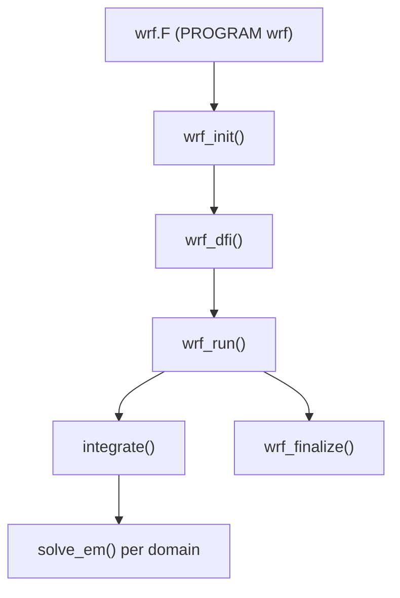

### Key Architectural Concepts

**Active Data Registry**

The `Registry/` directory contains a set of data-driven description files (e.g., `Registry.EM`, `registry.chem`) that define every model state variable. The Registry drives code generation for I/O, nesting communication, halo exchanges, and configuration — avoiding manual duplication across thousands of fields.

**Layered Architecture**

| Layer | Directory | Role |
|-------|-----------|------|
| Driver | `main/`, `frame/` | Initialization, I/O, parallelism, time-keeping |
| Mediation | `share/` | Domain coupling, interpolation, boundary conditions |
| Model | `dyn_em/`, `phys/`, `chem/` | Scientific dynamics and physics |

**Parallel Execution Model**

WRF supports three parallelism modes, configured at compile time:

- **DM** (Distributed Memory) — MPI via the RSL\_LITE communication layer
- **SM** (Shared Memory) — OpenMP thread parallelism
- **Hybrid** — Combined MPI + OpenMP

**Nesting**

WRF supports one-way nesting, two-way interactive nesting (with feedback), and moving nests (vortex-following for tropical cyclones). Multiple nest levels and integer grid ratio refinements are supported.

### Namelist-Driven Configuration

Runtime behavior is entirely controlled through Fortran namelist files (primarily `namelist.input` in the run directory). The `run/README.namelist` file documents hundreds of options organized into named groups:

- `&time_control` — Simulation dates, output intervals, I/O formats
- `&domains` — Grid sizes, nest ratios, time steps
- `&physics` — Parameterization scheme selectors (microphysics, PBL, radiation, etc.)
- `&dynamics` — Advection options, diffusion, damping
- `&bdy_control` — Boundary condition settings

### Test Cases

Idealized and real-data test configurations are available under `test/`:

- **Idealized**: `em_b_wave`, `em_les`, `em_squall2d_x`, `em_heldsuarez`, `em_tropical_cyclone`, and more
- **Real-data**: `em_real` — the standard starting point for operational-style simulations

Each test case directory contains namelist files and links to the compiled executables (`ideal.exe` or `real.exe`, plus `wrf.exe`).

## System Architecture & Data Flow

<details>
<summary>Relevant Files</summary>

<ul>
<li><code>frame/module_domain_type.F</code></li>
<li><code>frame/module_domain.F</code></li>
<li><code>frame/module_integrate.F</code></li>
<li><code>frame/module_driver_constants.F</code></li>
<li><code>frame/module_configure.F</code></li>
<li><code>share/mediation_wrfmain.F</code></li>
<li><code>share/mediation_integrate.F</code></li>
<li><code>share/start_domain.F</code></li>
<li><code>main/module_wrf_top.F</code></li>
</ul>

</details>

WRF is organized into three distinct layers that separate model-agnostic driver logic from physics-specific implementations. This layered architecture allows the driver to remain generic while individual physics packages evolve independently.

```
Driver Layer  (frame/)   → Domain management, time integration, parallelism
Mediation Layer (share/) → I/O, initialization bridges, nesting coordination
Model Layer  (dyn_em/)   → Physics solvers and dynamics kernels
```

### Three-Layer Architecture

The **Driver Layer** (`frame/`) owns the top-level execution flow. It allocates domain memory, manages nested grid hierarchies, and drives the recursive time integration loop. The **Mediation Layer** (`share/`) bridges the driver and physics worlds — it handles reading initial data, writing history and restart files, and interpolating boundary conditions between parent and child domains. The **Model Layer** contains physics solvers (dynamics, microphysics, PBL, etc.) that are invoked through `solve_interface`.

This separation means the driver code in `module_integrate.F` never calls solver routines directly. All interactions are mediated through well-defined subroutines like `med_before_solve_io`, `solve_interface`, and `med_nest_feedback`.

### Domain Data Structure

Every active domain is represented by a single instance of `TYPE domain` (defined in `frame/module_domain_type.F`). This type bundles all meteorological state variables, grid metadata, timing information, and hierarchy pointers into one record.

Key structural components:

- **Hierarchy pointers** — `nests(1..max_nests)%ptr` for children, `parents(1)%ptr` for the single parent
- **Three index sets** per dimension — domain (`sd`/`ed`), memory (`sm`/`em`), and patch (`sp`/`ep`) bounds
- **ESMF clock** — `domain_clock` and an `alarms` array for I/O triggers
- **Fieldlist** — a Registry-generated linked list of all prognostic and diagnostic fields

Global constants from `module_driver_constants.F` bound the hierarchy:

| Constant | Value | Meaning |
|---|---|---|
| `max_levels` | 20 | Maximum nesting depth |
| `max_nests` | 20 | Maximum children per domain |
| `max_parents` | 1 | Only one parent allowed per domain |

### Initialization Sequence

`wrf_init` in `main/module_wrf_top.F` performs startup in a fixed sequence:

1. **`init_modules`** — initializes MPI, I/O quilt processes, and all internal WRF modules.
2. **`initial_config`** — monitor process reads `namelist.input` and broadcasts the full `model_config_rec` to all MPI tasks.
3. **`alloc_and_configure_domain`** — allocates the root domain (`head_grid`), calls `wrf_patch_domain` to partition the global grid across MPI tasks, and allocates all field arrays.
4. **`Setup_Timekeeping`** — creates the ESMF clock, sets start/stop times, and registers I/O alarms.
5. **`med_initialdata_input`** — reads the `wrfinput` or restart file, then calls `start_domain` to run physics-package-specific initialization.

### Recursive Time Integration

The core engine is the `integrate` subroutine in `frame/module_integrate.F`. It is **recursive**: advancing a parent domain by one timestep causes all child domains to advance by multiple smaller timesteps before the parent loop continues.

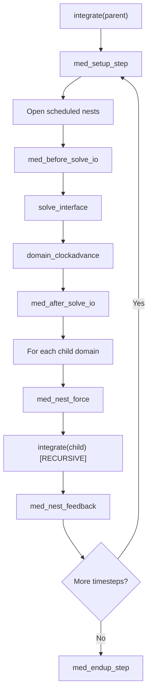

The recursive design guarantees synchronization: all child timesteps within a parent interval complete before the parent loop continues. Each child's `stop_subtime` is set to the parent's new clock time so the child knows exactly when to stop.

### Data Flow: From Namelist to Running Forecast

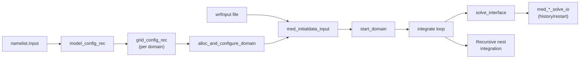

### Configuration Management

`frame/module_configure.F` centralizes all namelist handling. The global `model_config_rec` record holds one value per variable for all domains. Before a domain's timestep, `model_to_grid_config_rec` extracts a domain-specific `grid_config_rec`. This matters for multi-domain runs where, for example, each nest may use a different microphysics scheme and therefore a different set of moisture tracer indices.

`set_scalar_indices_from_config` ensures the correct tracer counts (`num_moist`, `num_chem`, etc.) are active for each domain before `solve_interface` is called.

### Parallel Decomposition

For MPI builds, `wrf_patch_domain` calls `wrf_dm_patch_domain` to partition each domain's global grid into per-task patches. Each task stores its patch plus surrounding halo rows/columns (`sm`/`em` bounds are wider than `sp`/`ep`). Three transposition variants (standard, X-transpose, Y-transpose) are precomputed to support different stencil orientations in the dynamics solver. Only the monitor MPI task reads the namelist; the full configuration is broadcast via a serialized buffer to all tasks.

## ARW Dynamics Core & Time Integration

<details>
<summary>Relevant Files</summary>

<ul>
<li><code>dyn_em/solve_em.F</code></li>
<li><code>dyn_em/module_em.F</code></li>
<li><code>dyn_em/module_first_rk_step_part1.F</code></li>
<li><code>dyn_em/module_first_rk_step_part2.F</code></li>
<li><code>dyn_em/module_small_step_em.F</code></li>
<li><code>dyn_em/module_advect_em.F</code></li>
<li><code>dyn_em/module_diffusion_em.F</code></li>
<li><code>dyn_em/module_bc_em.F</code></li>
<li><code>dyn_em/adapt_timestep_em.F</code></li>
<li><code>dyn_em/start_em.F</code></li>
</ul>

</details>

The ARW (Advanced Research WRF) dynamical core advances atmospheric state variables one timestep at a time using a **split-explicit Runge-Kutta scheme**. Fast acoustic modes are handled via sub-cycling at a shorter acoustic timestep, while slower dynamics and physics operate at the full model timestep.

### Overall Solver Architecture

`solve_em.F` is the master driver. It is called once per timestep for each domain and orchestrates all dynamics, physics tendencies, and time integration. The integration is 2nd or 3rd order Runge-Kutta (controlled by `rk_order`), with each RK sub-step further split into a large-step tendency calculation and an acoustic sub-cycling loop.

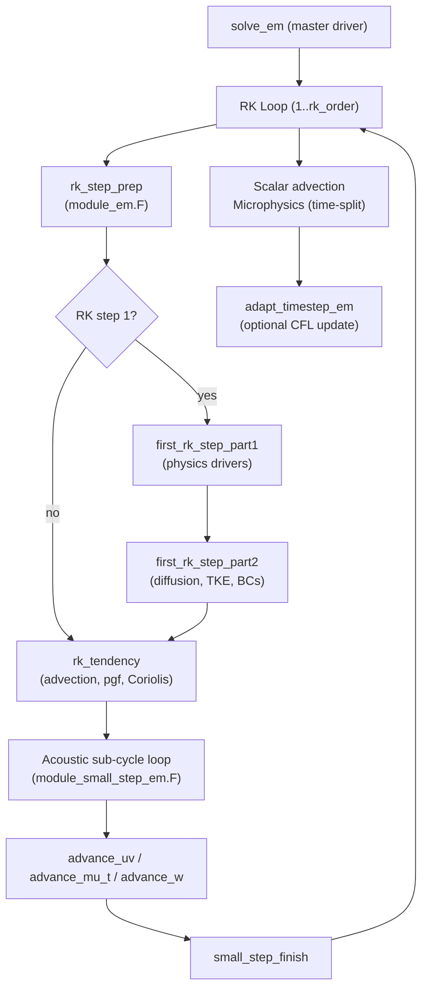

### Runge-Kutta Time Integration

Each large timestep `dt` is split into 2 or 3 RK sub-steps with fractional timesteps:

- **2nd-order RK**: sub-step fractions `dt/2`, `dt`
- **3rd-order RK**: sub-step fractions `dt/3`, `dt/2`, `dt`

Physics tendencies (radiation, surface, PBL, cumulus) are computed **once** during the first RK sub-step (`module_first_rk_step_part1.F`) and stored as `*_tendf` arrays. All subsequent RK sub-steps reuse these frozen tendencies, keeping the physics cost constant regardless of `rk_order`.

### Physics Tendencies (Part 1 & Part 2)

`module_first_rk_step_part1.F` calls physics drivers in this sequence:

1. Pre-radiation and radiation (longwave + shortwave)
2. Land surface model
3. Cumulus and shallow convection parameterizations
4. PBL turbulence scheme
5. FDDA grid nudging and optional fire/chemistry drivers

`module_first_rk_step_part2.F` then applies those tendencies to the dynamics state, computes deformation and divergence for turbulence closure, solves for eddy diffusivity (`xkmh`, `xkhh`) via TKE, and applies lateral boundary conditions using routines from `module_bc_em.F`.

### Acoustic (Small-Step) Sub-Cycling

Sound waves propagate faster than the advective CFL limit allows for the large timestep. WRF handles this by sub-cycling the pressure, momentum, and mass equations at a shorter timestep `dts = dt / num_sound_steps` (typically 4–6 sub-steps).

Each acoustic sub-step in `module_small_step_em.F` executes:

1. **`calc_coef_w`** — pre-computes implicit tridiagonal coefficients for vertical velocity
2. **`advance_uv`** — advances horizontal momentum with pressure gradient force
3. **`advance_mu_t`** — advances column dry-air mass (`mu`) and potential temperature
4. **`advance_w`** — solves for vertical velocity implicitly (tridiagonal), then updates geopotential
5. **`calc_p_rho`** — diagnoses perturbation pressure and inverse density from updated state

The vertical momentum equation is solved **implicitly** to remove the CFL restriction from vertical acoustic waves, allowing larger `dts` than a purely explicit scheme.

### Advection Schemes

`module_advect_em.F` implements momentum and scalar advection with selectable order and scheme:

- 2nd, 4th, or 6th-order centered differences (horizontal)
- WENO (Weighted Essentially Non-Oscillatory) variants
- Positive-definite and monotonic flux limiters for scalars

All advection velocities (`ru`, `rv`, `rom`) are mass-weighted (`u × mu`), ensuring mass consistency with the terrain-following coordinate.

### Diffusion and Turbulence

`module_diffusion_em.F` provides:

- **Deformation-based eddy viscosity** using the Smagorinsky model: eddy viscosity scales as `(Δx)² × |D|` where `|D|` is the deformation magnitude
- **Horizontal diffusion**: 2nd-order (Laplacian) or 4th-order (bi-harmonic) on model levels
- **Vertical diffusion**: implicit Crank-Nicolson for stability with variable diffusivity
- **TKE closure**: optional prognostic TKE equation with shear production, buoyancy, and dissipation terms

### Boundary Conditions

`module_bc_em.F` supports several lateral BC modes:

- **Specified** (`spec_bdy_dry`): boundary values read from external data files and interpolated in time
- **Relaxation** (`relax_bdy_dry`): gradual nudging toward external values over a configurable zone width (`spec_bdy_width`)
- **Open/symmetric/periodic**: for idealized simulations

Boundary tendencies are applied to `u`, `v`, `w`, `t`, `ph`, and `mu` at every large timestep.

### Adaptive Timestep

`adapt_timestep_em.F` monitors horizontal and vertical CFL numbers each step:

- `max_horiz_cfl` = max(`|u| dt/dx`, `|v| dt/dy`)
- `max_vert_cfl` = max(`|w| dt/dz`)

When CFL exceeds a threshold the timestep is reduced; it grows back at a limited rate (`max_step_increase_pct`) to avoid oscillations. The adaptive scheme also snaps `dt` to output and boundary-condition update times.

### Initialization

`start_em.F` runs once before time integration begins. It sets up:

- Terrain-following η-coordinate metrics (`dnw`, `rdnw`, `znu`, `c1h/f`, `c2h/f`)
- Hydrostatic base-state profiles (`t_base`, `phb`, `pb`, `u_base`)
- Initial perturbation fields (`u_2`, `v_2`, `w_2`, `t_2`, `ph_2`, `mu_2`)
- Map-scale factors for the chosen map projection
- Acoustic sub-step count (`time_step_sound`) from an initial CFL estimate

## Physics Parameterizations

<details>
<summary>Relevant Files</summary>

<ul>
<li><code>phys/module_physics_init.F</code></li>
<li><code>phys/module_microphysics_driver.F</code></li>
<li><code>phys/module_radiation_driver.F</code></li>
<li><code>phys/module_pbl_driver.F</code></li>
<li><code>phys/module_cumulus_driver.F</code></li>
<li><code>phys/module_surface_driver.F</code></li>
<li><code>phys/module_sf_noahdrv.F</code></li>
<li><code>phys/module_bl_ysu.F</code></li>
<li><code>phys/module_ra_rrtmg_lw.F</code></li>
<li><code>phys/module_mp_thompson.F</code></li>
</ul>

</details>

WRF organizes its atmospheric physics into six major categories, each controlled by a namelist integer option. A **driver module** (mediation layer) reads the option, routes execution to the chosen scheme, and returns tendencies that are applied to the model state. All physics initialization runs through `phy_init()` in `module_physics_init.F` before the first time step.

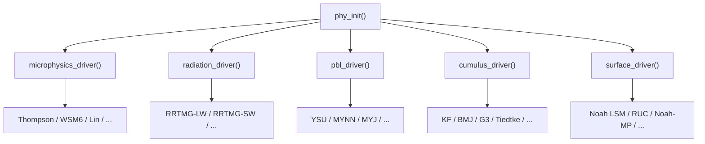

### Initialization (`module_physics_init.F`)

`phy_init()` is called once per domain at model start. It allocates physics arrays, reads look-up tables, and sets scheme-specific constants. Key namelist flags it processes include `mp_physics`, `ra_lw_physics`, `ra_sw_physics`, `bl_pbl_physics`, `cu_physics`, `sf_sfclay_physics`, and `sf_surface_physics`. Pre-built physics suites such as `"CONUS"` or `"tropical"` set many of these flags automatically.

### Microphysics (`module_microphysics_driver.F`, `module_mp_thompson.F`)

The microphysics driver selects among 25+ schemes via `mp_physics`. It passes moisture arrays — Qv, Qc, Qr, Qi, Qs, Qg, Qh, plus optional number concentrations — to the chosen scheme and collects precipitation rates and updated tendencies.

| `mp_physics` | Scheme | Moments |
|---|---|---|
| 1 | Kessler | 1 (warm rain only) |
| 3 / 5 / 6 / 7 | WSM3 / WSM5 / WSM6 / WSM7 | 1 |
| 8 | Thompson | 2 (ice/rain) |
| 28 | Thompson Aerosol-Aware | 2 + aerosol |
| 40 | Morrison | 2 |
| 30 | NSSL 2-moment | 2 |
| 36 | P3 | 2 (predicted particle properties) |

**Thompson microphysics** (`mp_physics=8` or `28`) predicts rain and ice number concentrations. It uses a Field et al. (2005) snow size distribution and supports nine graupel density options (50–800 kg m⁻³). The aerosol-aware variant (`mp_physics=28`) prognoses cloud-condensation nucleus (CCN) and ice-nuclei (IN) concentrations, coupling to the radiation driver via effective radii for each hydrometeor category.

### Radiation (`module_radiation_driver.F`, `module_ra_rrtmg_lw.F`)

The radiation driver calls separate longwave (LW) and shortwave (SW) routines on a user-defined call frequency (`radt` minutes). Cloud effective radii from microphysics feed directly into the optical-depth calculation.

- **`ra_lw_physics=4` — RRTMG-LW**: 16 spectral bands (10–3250 cm⁻¹), 140 g-points, full trace-gas absorption (CO₂, CH₄, N₂O, CFCs), ice/liquid cloud parameterizations by Baum et al. and Fu et al.
- **`ra_sw_physics=4` — RRTMG-SW**: companion shortwave module with 14 bands.
- Additional options include the original RRTM (`=1`), CAM (`=10`), GFDL (`=31`), and Goddard (`=32`) schemes.

Aerosol direct effects are activated with `aer_opt` and `aer_ra_feedback=1`, passing aerosol optical depth from the chemistry module or a climatology into the radiation calculation.

### Planetary Boundary Layer (`module_pbl_driver.F`, `module_bl_ysu.F`)

The PBL driver computes vertical turbulent mixing and diagnostic PBL height (`PBLH`). It returns momentum, heat, and moisture tendencies (`RUBLTEN`, `RTHBLTEN`, `RQVBLTEN`, etc.) plus exchange coefficients (`EXCH_H`, `EXCH_M`).

**YSU** (`bl_pbl_physics=1`) is a non-local K-profile scheme. It diagnoses PBL height from the bulk Richardson number, applies a counter-gradient correction for heat/moisture, and adds an explicit entrainment flux at the PBL top. Optional top-down mixing is enabled with `ysu_topdown_pblmix=1`.

Other popular options:
- **MYNN** (`=5`): TKE-closure, widely used for convection-allowing forecasts.
- **MYJ** (`=2`): Mellor-Yamada-Janjic, local TKE-based.
- **ACM2** (`=7`): Asymmetric Convective Model with non-local transport.

### Cumulus Convection (`module_cumulus_driver.F`)

Convective parameterization is typically active at grid spacings larger than ~4 km (`cu_physics &gt; 0`). The driver routes to deep and/or shallow convection schemes and returns `RAINC` (convective rain), `RTHCUTEN` (heating), and cloud fraction diagnostics.

- **KF** (`=1`): Kain-Fritsch, trigger-function based mass-flux scheme.
- **BMJ** (`=2`): Betts-Miller-Janjic, relaxation-type adjustment.
- **G3** (`=6`): Grell 3D ensemble, scale-aware with multiple closures.
- **New Tiedtke** (`=16`): Bechtold et al., used in tropical suite.

### Surface Physics (`module_surface_driver.F`, `module_sf_noahdrv.F`)

The surface driver pairs a **land surface model** (LSM) with a **surface layer** (SfcLay) scheme. The LSM evolves soil/snow state; the SfcLay computes exchange coefficients from similarity theory.

**Noah LSM** (`sf_surface_physics=2`) is the default for most configurations. It solves the surface energy and water balance across four soil layers, predicting soil temperature (`TSLB`), total/liquid soil moisture (`SMOIS`, `SH2O`), snow depth, and skin temperature (`TSK`). Output fluxes `HFX` and `QFX` feed directly into the PBL scheme.

**Noah-MP** (`=4`) extends Noah with multiple switchable sub-physics options (`opt_rad`, `opt_alb`, `opt_run`, `opt_snf`, etc.) for radiation transfer, snow albedo, runoff generation, and more, enabling ensemble-style uncertainty exploration within a single LSM framework.

Urban schemes (`sf_urban_physics`): **UCM** (`=1`), **BEP** (`=2`), and **BEP+BEM** (`=3`) add building canopy effects on top of Noah, coupling urban heat, drag, and energy storage back to the PBL.

### Choosing a Physics Suite

Pre-configured physics suites (`physics_suite = "CONUS"` or `"tropical"`) set consistent combinations of the above options. Individual flags in `&physics` always override suite defaults, allowing selective substitution of one scheme while keeping the rest of the suite intact.

## Registry & Code Generation System

<details>
<summary>Relevant Files</summary>

<ul>
<li><code>Registry/Registry.EM</code></li>
<li><code>Registry/Registry.EM_COMMON</code></li>
<li><code>Registry/registry.chem</code></li>
<li><code>Registry/registry.dimspec</code></li>
<li><code>tools/registry.c</code></li>
<li><code>tools/gen_wrf_io.c</code></li>
<li><code>tools/gen_mod_state_descr.c</code></li>
<li><code>tools/gen_allocs.c</code></li>
<li><code>tools/gen_comms.stub</code></li>
</ul>

</details>

The Registry is WRF's central metadata system — a set of plain-text description files that declare every model state variable, namelist configuration option, and array dimension. Rather than hand-coding I/O routines, memory allocations, and communication patterns for each of thousands of fields, WRF reads these Registry files at build time and **automatically generates** the required Fortran source code. This design keeps the scientific source free of boilerplate and makes adding a new variable a single-line change.

### Registry File Structure

Registry files live in the `Registry/` directory. Multiple files are assembled together via `include` directives. The top-level entry points are configuration-specific:

- `Registry.EM` — the ARW (Eulerian mass-coordinate) core, includes `registry.em_shared_collection`
- `Registry.EM_COMMON` — shared state variables common to all EM configurations
- `registry.dimspec` — dimension character-to-axis mappings used across all files
- `registry.chem` — chemistry and aerosol state variables
- Many optional sub-registries (`registry.fire`, `registry.lake`, `registry.stoch`, …) pulled in by package definitions

Each file uses four record types:

| Record | Purpose | Example |
|--------|---------|---------|
| `dimspec` | Declares an array dimension letter, its axis, and how its size is determined | `dimspec k 2 standard_domain z bottom_top` |
| `state` | Declares a model state variable with type, dimensions, I/O flags, and metadata | `state real U ikj dyn_em 2 X iruhsd= "U" "x-wind" "m s-1"` |
| `rconfig` | Declares a namelist configuration parameter | `rconfig integer chem_opt namelist,physics max_domains 0 rh ...` |
| `package` | Groups state variables that are conditionally activated by a namelist option | `package tracer_test1 tracer_opt==2 - tracer:tr17_1,...` |

### Anatomy of a `state` Entry

A `state` line encodes everything the code generator needs to know about a field:

```text
#<Table>  <Type>  <Sym>    <Dims>  <Use>    <NumTLev>  <Stagger>  <IO>          <DName>   <Descrip>   <Units>
state     real    XLAT     ij      misc     1          -          i0123rh0156d  "XLAT"    "LATITUDE"  "degree_north"
```

- **Dims** — a compact string of dimension letters (`i`=west-east, `j`=south-north, `k`=bottom-top, etc.) defined in `registry.dimspec`
- **Stagger** — grid staggering (`X`, `Y`, `Z`, or `-` for unstaggered)
- **IO** — a bitmask string encoding which streams read/write this field (e.g., `i` = input, `r` = restart, `h` = history, digits 0–9 select auxiliary streams)
- **NumTLev** — number of time levels to allocate (important for Runge-Kutta stepping)

### The Code Generator (`tools/registry`)

The `registry` executable (built from `tools/registry.c` and related C files) is invoked at build time before any Fortran is compiled. Its pipeline is:

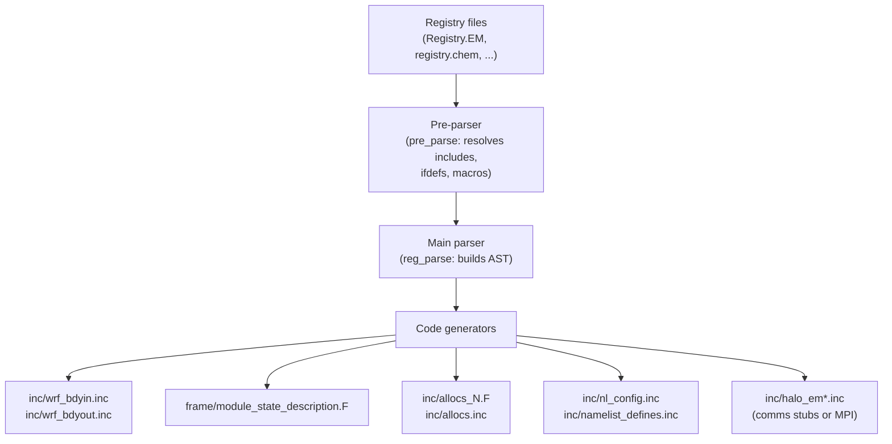

The generator functions and their outputs:

- **`gen_wrf_io`** (`gen_wrf_io.c`) — produces `wrf_bdyin.inc` and `wrf_bdyout.inc`, the boundary-condition I/O calls for every registered field
- **`gen_module_state_description`** (`gen_mod_state_descr.c`) — produces `module_state_description.F`, a Fortran module declaring integer `PARAM_*` and `P_*` constants for 4D scalar arrays (e.g., moisture species indices) and package activation flags
- **`gen_alloc`** (`gen_allocs.c`) — produces `allocs.inc` and a set of `allocs_N.F` subroutines (split into 32 files to avoid Fortran continuation-line limits) that dynamically allocate all domain fields at runtime
- **`gen_comms`** (`gen_comms.stub`) — in its stub form, this is a no-op; in parallel builds, an actual `gen_comms.c` is linked in that emits halo-exchange calls for every field requiring ghost-cell communication
- **`gen_namelist_defines` / `gen_namelist_defaults`** — Fortran `PARAMETER` and default value declarations for all `rconfig` entries
- **`gen_nest_interp`** — interpolation call sequences for nested-domain variables

### Adding a New Variable

To introduce a new state variable in WRF, a developer only needs to add one `state` line to the appropriate Registry file. The build system then regenerates all boilerplate. No manual editing of allocation routines, I/O loops, or communication patterns is required. Optional fields are grouped under `package` records so they are only allocated and communicated when the corresponding namelist option is active, keeping memory footprint small for configurations that do not need them.

## I/O Framework & Parallel Output

<details>
<summary>Relevant Files</summary>

<ul>
<li><code>frame/module_io.F</code></li>
<li><code>frame/module_io_quilt.F</code></li>
<li><code>frame/module_streams.F</code></li>
<li><code>share/module_io_wrf.F</code></li>
<li><code>share/input_wrf.F</code></li>
<li><code>share/output_wrf.F</code></li>
<li><code>external/io_netcdf/wrf_io.F90</code></li>
<li><code>external/io_adios2/wrf_io.F90</code></li>
<li><code>doc/README.io_config</code></li>
<li><code>Registry/registry.io_boilerplate</code></li>
</ul>

</details>

WRF's I/O system is a layered, pluggable framework that decouples the model from any specific file format. A thin abstraction layer in `frame/module_io.F` dispatches calls to interchangeable backends (NetCDF, ADIOS2, GRIB, etc.), while a dedicated **quilt server** mechanism offloads file operations from compute tasks to maximize parallel efficiency.

### Layered Architecture

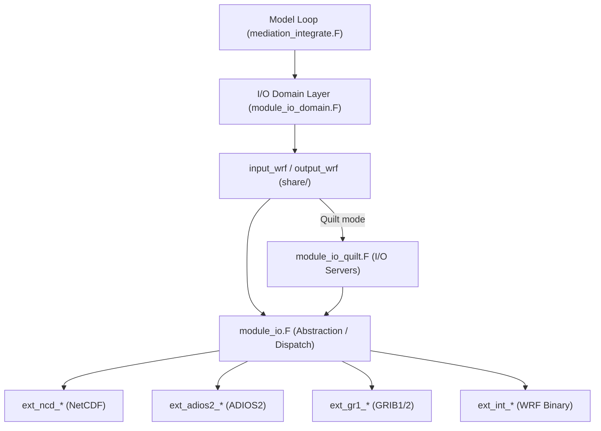

Each backend exposes an identical set of routines (e.g., `ext_*_open_for_write`, `ext_*_write_field`, `ext_*_close`) so the upper layers never need to know which format is active.

### Key Components

**`frame/module_io.F` — Abstraction Layer**

This module is the single entry point for all I/O calls. Functions like `wrf_open_for_write_begin`, `wrf_write_field`, and `wrf_iosync` forward to the correct backend based on the `io_form_*` namelist setting. The integer codes map as follows:

- `1` → WRF internal binary (INTIO)
- `2` → NetCDF (default)
- `4` → Parallel HDF5
- `5` / `10` → GRIB1 / GRIB2
- `14` → ADIOS2

**`frame/module_io_quilt.F` — Parallel Quilt Servers**

When `nio_tasks_per_group > 0` is set in the namelist, a subset of MPI ranks becomes **I/O server tasks** (quilters). Compute ranks pack field data and command headers and send them via MPI; the servers receive, reassemble, and write to disk asynchronously. This pattern prevents all compute ranks from blocking on file I/O simultaneously.

**`frame/module_streams.F` — Stream Definitions**

Defines the constants and alarm logic for every named stream (`history_only`, `restart_only`, `auxinput1_only`, `auxhist1_only`, …). The model checks these alarms each time step to decide whether output is due.

**`share/input_wrf.F` & `share/output_wrf.F` — Core Read/Write**

These routines iterate all domain state variables and check the Registry-assigned I/O mask for each variable. If the mask includes the current stream, the variable is read from or written to the open file handle via `wrf_read_field` / `wrf_write_field`.

### I/O Streams

WRF supports multiple independent streams, each configurable with its own format, interval, and variable set:

| Stream | Namelist prefix | Default format key |
|---|---|---|
| Main history | `history_*` | `io_form_history` |
| Main input | `input_*` | `io_form_input` |
| Restart | `restart_*` | `io_form_restart` |
| Lateral boundary | `boundary_*` | `io_form_boundary` |
| Auxiliary history 1–N | `auxhist{N}_*` | `io_form_auxhist{N}` |
| Auxiliary input 1–N | `auxinput{N}_*` | `io_form_auxinput{N}` |

### Runtime Field Configuration

Without recompiling, you can add or remove variables from any stream using the `iofields_filename` namelist option. Each domain can point to a different file. The file format is:

```
op:streamtype:streamid:variables
```

- `op` — `+` to add, `-` to remove
- `streamtype` — `h` (history) or `i` (input)
- `streamid` — `0` for the main stream, `1`–N for auxiliary streams

**Example `iofields_filename` file:**

```
+:h:0:U,V,W,T,PH       # add fields to main history
-:h:0:QVAPOR            # remove QVAPOR from main history
+:i:5:T,QVAPOR          # add fields to auxinput5
```

### NetCDF & ADIOS2 Backends

**`external/io_netcdf/`** is the most commonly used backend. It supports both NetCDF3 (classic) and NetCDF4/HDF5. Use `use_netcdf_classic = .true.` for the classic format and `ncd_nofill = .true.` to skip fill-value operations for a write-speed boost.

**`external/io_adios2/`** provides an HDF5-based backend via the ADIOS2 library, with built-in compression support. Key compile-time options are exposed as namelist variables:

- `adios2_compression_enable` — toggle BLOSC compression (default: `.true.`)
- `adios2_blosc_compressor` — compressor algorithm (default: `"lz4"`)
- `adios2_numaggregators` — number of MPI aggregator ranks for collective I/O

### Data Flow Summary

1. The model loop calls `med_after_solve_io()` at the end of each time step.
2. Stream alarms are checked; any due stream triggers `output_wrf(switch=<stream>)`.
3. `output_wrf` scans state variables, writes each matching field via `wrf_write_field`.
4. In quilt mode, compute ranks send packed headers + data over MPI to I/O servers, which call `ext_*_write_field` directly and flush to disk.
5. Symmetrically, `input_wrf` handles reading at initialization and during the forecast for boundary updates or data assimilation streams.

## Parallelism & Domain Decomposition

<details>
<summary>Relevant Files</summary>

<ul>
<li><code>frame/module_comm_dm.F</code></li>
<li><code>frame/module_comm_nesting_dm.F</code></li>
<li><code>frame/module_tiles.F</code></li>
<li><code>frame/module_nesting.F</code></li>
<li><code>external/RSL_LITE/module_dm.F</code></li>
<li><code>external/RSL_LITE/gen_comms.c</code></li>
<li><code>external/RSL_LITE/task_for_point.c</code></li>
<li><code>share/module_MPP.F</code></li>
<li><code>frame/module_sm.F</code></li>
</ul>

</details>

WRF uses a **hybrid MPI + OpenMP** parallelism model. MPI distributes the global domain across tasks (distributed memory), while OpenMP tiles each task's subdomain for multi-threaded computation (shared memory). Communication between MPI tasks is managed by the **RSL_LITE** library.

### Hybrid Parallelism Overview

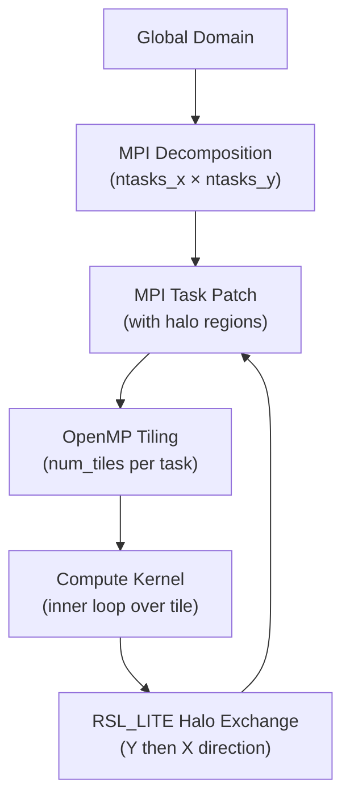

The decomposition is **2D Cartesian**: tasks are arranged in a `ntasks_x` × `ntasks_y` grid. Each task owns a rectangular patch of the domain plus surrounding **halo** cells copied from neighbors.

### MPI Domain Decomposition (`share/module_MPP.F`, `external/RSL_LITE`)

`module_MPP.F` stores per-task index metadata:

- `MYPE` — MPI rank; `INPES`, `JNPES` — task grid dimensions
- `MY_IS_GLB` / `MY_IE_GLB`, `MY_JS_GLB` / `MY_JE_GLB` — global index extents owned by this task
- `MYIS`/`MYIE`/`MYJS`/`MYJE` — interior (non-halo) loop bounds for computation
- Up to 5 sub-region variants (`MYIS1`–`MYIS5`) for stencil-aware loop splitting

The RSL_LITE layer (`external/RSL_LITE/module_dm.F`) creates a **2D MPI Cartesian topology** and manages communicators:

```fortran
local_communicator          ! all tasks in this domain
local_communicator_periodic ! periodic-boundary variant
local_communicator_x        ! row subcommunicator (X direction)
local_communicator_y        ! column subcommunicator (Y direction)
```

The subroutine `patch_domain_rsl_lite()` computes each task's patch, memory (halo-extended), and interior bounds. It also sets up **transposed decompositions** (XyZz, XzYy, XzYx) needed for spectral operations and FFTs.

#### Load Balancing (`external/RSL_LITE/task_for_point.c`)

The function `TASK_FOR_POINT` maps each grid point `(i, j)` to an MPI rank. Remainder points are distributed to **boundary tasks** (which carry lighter stencil loads), keeping interior tasks evenly loaded.

### Halo Exchange Protocol (`external/RSL_LITE/gen_comms.c`)

After each computation phase, ghost/halo cells are refreshed with a **two-pass exchange** that uses the row/column subcommunicators to avoid a global all-to-all:

1. **`RSL_LITE_INIT_EXCH`** — initialize exchange buffers
2. **`RSL_LITE_EXCH_Y`** — exchange north/south halos via `local_communicator_y`
3. **`RSL_LITE_EXCH_X`** — exchange east/west halos via `local_communicator_x`

Maximum halo width is 6 cells (`max_halo_width 6`). The communication subroutines themselves are **registry-generated** and included by `frame/module_comm_dm.F` and `frame/module_comm_nesting_dm.F` at compile time via `#include` directives gated on `#ifdef DM_PARALLEL`.

### OpenMP Tiling (`frame/module_tiles.F`, `frame/module_sm.F`)

Within each MPI task, the patch is subdivided into **tiles** for OpenMP threads. The core routine is `set_tiles2()`:

- Reads `tile_sz_x` / `tile_sz_y` from the namelist, or `WRF_NUM_TILES` / `WRF_NUM_TILES_X` / `WRF_NUM_TILES_Y` environment variables.
- Falls back to `omp_get_max_threads()` (from `frame/module_sm.F`) to set a sensible default.
- Supports three strategies: 1D-X, 1D-Y, or **2D-XY** (least-aspect-ratio balanced).
- Stores per-tile bounds in `grid%i_start`, `grid%i_end`, `grid%j_start`, `grid%j_end`.

Compute loops then iterate over tiles, enabling `!$OMP PARALLEL DO` over the tile index:

```fortran
!$OMP PARALLEL DO SCHEDULE(RUNTIME)
DO tile = 1, grid%num_tiles
  DO j = grid%j_start(tile), grid%j_end(tile)
    DO i = grid%i_start(tile), grid%i_end(tile)
      ! physics / dynamics kernel
    END DO
  END DO
END DO
!$OMP END PARALLEL DO
```

`set_tiles_once()` caches tile configurations across calls (up to `MAX_TILING_ZONES` zones) to avoid repeated setup overhead.

### Nested Domain Parallelism (`frame/module_nesting.F`, `frame/module_comm_nesting_dm.F`)

Nested (child) domains may run on a **subset of MPI tasks**. Each parent-child pair maintains its own inter-communicator (`intercomm_to_mom`, `intercomm_to_kid`). The flag array `domain_active_this_task(max_domains)` tracks which domains are live on each rank.

An **intermediate grid** sits between parent and child: it carries parent-resolution data on the child decomposition and serves as the staging area for interpolation and feedback. `module_comm_nesting_dm.F` provides the halo-exchange subroutines specific to these cross-domain transfers.

### Key Compilation Flags

| Flag | Effect |
|---|---|
| `DM_PARALLEL` | Enables MPI distributed-memory paths |
| `_OPENMP` | Enables OpenMP shared-memory paths |
| `STUBMPI` | Replaces MPI with serial stubs (single-task builds) |

## WRFDA: Data Assimilation System

<details>
<summary>Relevant Files</summary>

<ul>
<li><code>var/da/da_main/da_wrfvar_main.f90</code></li>
<li><code>var/da/da_main/da_wrfvar_top.f90</code></li>
<li><code>var/da/da_minimisation/da_minimisation.f90</code></li>
<li><code>var/da/da_4dvar/da_4dvar.f90</code></li>
<li><code>var/da/da_obs/da_obs.f90</code></li>
<li><code>var/da/da_radiance/da_radiance.f90</code></li>
<li><code>var/da/da_control/da_control.f90</code></li>
<li><code>doc/README.DA</code></li>
</ul>

</details>

WRFDA (WRF Data Assimilation) is the variational data assimilation component of the WRF modeling system. It combines model background forecasts with observational data to produce an optimal analysis state, minimizing a cost function that balances background and observation errors. WRFDA supports 3D-Var, 4D-Var, and hybrid ensemble-variational methods.

### System Architecture

The entry point is `da_wrfvar_main.f90`, which calls a two-phase initialization followed by the main assimilation run. The top-level module (`da_wrfvar_top.f90`) orchestrates domain setup, background error loading, observation ingestion, and the minimization loop through a series of included `.inc` files.

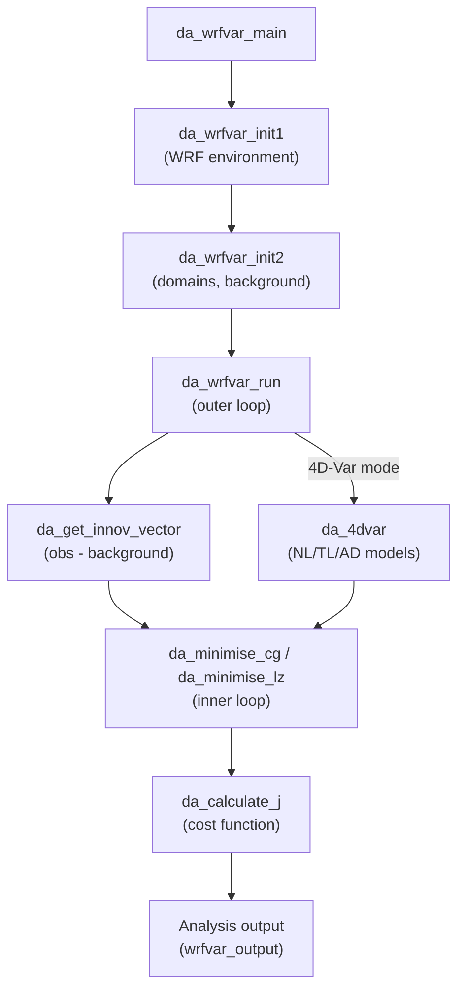

### Cost Function and Minimization

The variational analysis minimizes a cost function with multiple terms:

**J = J_b + J_o + J_c + J_e**

- **J_b** — Background term: departure from the background forecast, weighted by background error covariance B
- **J_o** — Observation term: departure from observations, weighted by observation error covariance R
- **J_c** — Constraint term: physical constraints (divergence, wind perturbation energy)
- **J_e** — Ensemble term: hybrid ensemble contribution (when enabled)

The minimization module (`da_minimisation.f90`) provides two solvers:

- `da_minimise_cg()` — Conjugate Gradient (CG) solver, default for 3D-Var
- `da_minimise_lz()` — Lanczos solver, useful for producing eigenvalue-based preconditioning

Key namelist parameters controlling minimization:

| Parameter | Description |
|---|---|
| `ntmax` | Maximum inner-loop iterations per outer loop |
| `eps` | Convergence criterion for gradient norm |
| `precondition_cg` | Enable CG preconditioning |
| `cv_options` | Control variable option (CV5, CV6, CV7, etc.) |

### 4D-Var Mode

When compiled with `#ifdef VAR4D`, WRFDA activates time-dependent assimilation via `da_4dvar.f90`. Unlike 3D-Var (which assimilates all observations at a single analysis time), 4D-Var propagates the model state forward and backward across an assimilation window:

1. **Nonlinear model** (`da_nl_model`) — integrates WRF forward, saving trajectory
2. **Tangent linear model** (`da_tl_model`) — linearized forward propagation
3. **Adjoint model** (`da_ad_model`) — backward propagation of gradient information
4. Observations are assimilated at their actual times (FGAT: First Guess at Appropriate Time)

Configuration keys: `var4d = .true.`, `num_fgat_time`, `var4d_lbc` (lateral boundary control).

### Observation Handling

`da_obs.f90` implements the observation operator **H** (and its adjoint **H^T**) that maps the model state to observation space. The module covers 60+ observation types:

**Conventional observations:** SYNOP, METAR, SHIPS, BUOY, SOUND, PILOT, PROFILER, TAMDAR, AIREP, RADAR, LIGHTNING, RAIN

**Satellite observations:** Radiance (AMSU-A/B, ATMS, HIRS, IASI, MWTS, MWHS, AHI, GOES-ABI, SEVIRI, AMSR2, GMI, SSMIS), AMVs (GEOAMV, POLARAMV), SATEM, SSMI, QSCAT

**GPS observations:** GPSREF (refractivity), GPSPW (precipitable water), GPSEPH (excess phase)

The core transforms are:
- `da_transform_xtoy()` — forward operator (model space → observation space)
- `da_transform_xtoy_adj()` — adjoint operator (observation space → model space)

### Radiance Data Assimilation

The `da_radiance/` directory contains a complete satellite radiance subsystem interfacing with two radiative transfer models:

- **CRTM** (Community Radiative Transfer Model) via `da_crtm.f90`
- **RTTOV** (Radiative Transfer for TOVS) via `da_rttov.f90`

Each RT model provides forward (`_direct`), tangent linear (`_tl`), adjoint (`_ad`), and K-matrix (`_k`) operators. The radiance module also handles:

- **Bias correction** — Variational bias correction (VarBC) with scan-angle and air-mass predictors
- **Cloud detection** — Automatic screening of cloud-contaminated channels
- **Quality control** — Sensor-specific QC routines (e.g., `da_qc_amsua.inc`, `da_qc_iasi.inc`)
- **Multi-format I/O** — BUFR, HDF5, and NetCDF4 readers for different satellite platforms

### Control Variables and Background Errors

`da_control.f90` is the central configuration module, defining all namelist parameters and physical constants used across WRFDA. Key background error options (`cv_options`):

- **CV5** — Streamfunction, velocity potential, unbalanced temperature/pressure, pseudo-relative humidity
- **CV6** — Adds moisture control variable extensions
- **CV7** — Direct wind components (u, v) instead of stream function

The control variable size is tracked via `cv_size_domain_jb`, `cv_size_domain_je`, etc., enabling flexible hybrid configurations where ensemble covariances augment the static background error.

### Typical Workflow

1. Prepare background (`wrfinput` from WRF forecast) and observation files
2. Configure `namelist.input` with `&wrfvar4`, `&wrfvar5`, `&wrfvar7` groups
3. Run `da_wrfvar.exe` — initializes, reads obs, runs minimization loop
4. Output: `wrfvar_output` (analysis), diagnostic files (cost function history, observation statistics, filtered radiances)
5. For cycling: feed `wrfvar_output` back into WRF as the next forecast initial condition

## WRF-Chem: Atmospheric Chemistry & Aerosols

<details>
<summary>Relevant Files</summary>

<ul>
<li><code>chem/chem_driver.F</code></li>
<li><code>chem/chemics_init.F</code></li>
<li><code>chem/emissions_driver.F</code></li>
<li><code>chem/aerosol_driver.F</code></li>
<li><code>chem/mechanism_driver.F</code></li>
<li><code>chem/dry_dep_driver.F</code></li>
<li><code>Registry/registry.chem</code></li>
<li><code>Registry/Registry.EM_CHEM</code></li>
</ul>

</details>

WRF-Chem extends the base WRF model with fully online atmospheric chemistry, coupling meteorology, emissions, gas-phase reactions, aerosol dynamics, and deposition within every model timestep. The chemistry system is highly modular: users select a gas-phase mechanism, an aerosol scheme, a photolysis option, and emission sources independently, allowing a wide range of scientific configurations.

### Architecture Overview

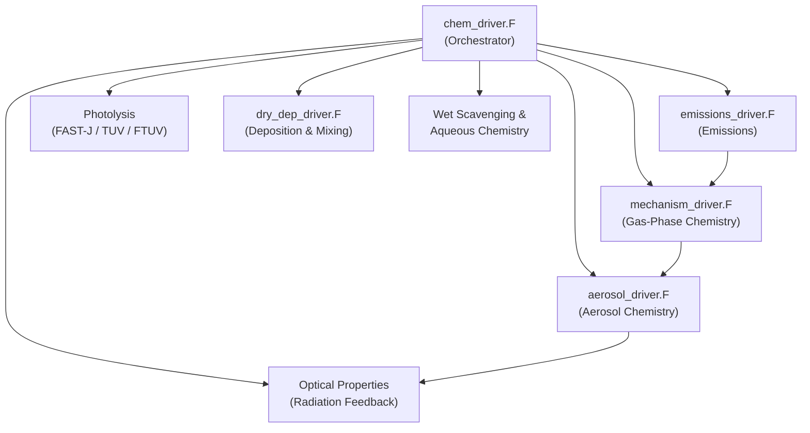

The main entry point each timestep is `chem_driver()` in `chem/chem_driver.F`. It reads `config_flags%chem_opt` to determine which mechanisms are active, then dispatches to the appropriate sub-drivers in the order shown above.

### Initialization (`chemics_init.F`)

`chem_init()` runs once at simulation start and prepares all chemistry state:

- Reads `chem_opt`, `phot_opt`, and `aer_ic_opt` from the namelist.
- Allocates the 4-D species array `chem(i, k, j, num_chem)` — the central data structure holding every advected chemical tracer.
- Initialises mechanism-specific lookup tables (e.g., `cbmz_init_wrf_mixrats()`, `mosaic_init_wrf_mixrats()`, `aerosols_sorgam_init()`).
- Sets up photolysis rate tables and reads any external climatology files.

### Emissions (`emissions_driver.F`)

`emissions_driver()` integrates sources from multiple independent modules before every chemistry solve:

- **Anthropogenic** — time-interpolated gridded inventories (TNO, EDGAR) read into `emis_ant(i, kemit, j, species)`.
- **Biogenic** — BEIS3.14 or MEGAN2.04 calculates isoprene, monoterpenes, and other VOCs from LAI, PAR, and temperature.
- **Fire / Biomass Burning** — a plume-rise model distributes emissions vertically; frequency controlled by `plumerisefire_frq`.
- **Dust** — GOCART, AFWA, or University of Cologne schemes driven by wind speed, soil texture (`erod`), and vegetation cover.
- **Sea Salt** — five size-bin scheme driven by 10-m wind (`u10`, `v10`).
- **GHG Fluxes** — VPRM model for CO₂/CH₄ biosphere exchange.

### Gas-Phase Chemistry (`mechanism_driver.F`)

`mechanism_driver()` selects and calls the solver matching `chem_opt`. Supported mechanisms include:

| Mechanism | Description |
|-----------|-------------|
| RADM2 | Regional Acid Deposition Model v2, ~159 species |
| RACM / RACM-SOA-VBS | Regional Atmospheric Chemistry Mechanism + SOA |
| CBMZ | Carbon Bond Mechanism Z |
| CB05 | Updated carbon bond with improved VOC speciation |
| MOZART | Multi-scale solver with stratospheric coupling |
| SAPRC99 | Speciated Pollutant Removal Chemistry, ~100 species |
| KPP-based | Kinetic PreProcessor auto-generated solvers |

Photolysis rates (e.g., `ph_no2`, `ph_o31d`) are passed as 3-D arrays into each solver, pre-computed by the selected photolysis scheme (FAST-J, TUV, or FTUV).

### Aerosol Chemistry (`aerosol_driver.F`)

`aerosols_driver()` routes to the appropriate aerosol scheme:

- **GOCART** — simple mass-based transport of sulfate, BC, OC, dust (4 bins), and sea salt (4 bins).
- **MADE/SORGAM** — three-mode (Aitken, accumulation, coarse) thermodynamic equilibrium using ISORROPIA.
- **MOSAIC** — 4-bin or 8-bin sectional scheme with full aqueous chemistry, coagulation, and condensation.
- **CAM-MAM** — 3-mode or 7-mode modal scheme with aerosol–cloud interactions and nucleation.
- **SOA-VBS** — volatility basis set treating semi-volatile organics in binned volatility classes.

Key process coverage per scheme:

- **Nucleation** (binary/ternary H₂SO₄–H₂O, ion-induced)
- **Coagulation** (Brownian, shear, gravitational)
- **Water uptake** (hygroscopic growth from composition)
- **Heterogeneous reactions** (e.g., N₂O₅ hydrolysis on aerosol surfaces)

The aerosol extinction field `aerwrf(i, k, j)` is computed at the end of each timestep and fed back into the WRF radiation scheme, enabling aerosol–radiation–meteorology coupling.

### Dry Deposition & Vertical Mixing (`dry_dep_driver.F`)

`dry_dep_driver()` removes species from the lowest model layer and mixes tracers through the PBL:

- **Gas deposition** — Wesely scheme computes aerodynamic (`Ra`), sublayer (`Rb`), and surface (`Rc`) resistances from vegetation type (`ivgtyp`), friction velocity (`ust`), and solar radiation.
- **Aerosol deposition** — scheme-specific drivers (`gocart_drydep_driver()`, `mosaic_drydep_driver()`) account for gravitational settling, Brownian diffusion, and impaction.
- **Vertical mixing** — K-theory diffusion using PBL height (`pbl_h`) redistributes all tracers; activated aerosol CCN concentrations (`ccn1`–`ccn6`) are treated separately.

### Registry & State Variables

`Registry/registry.chem` defines every chemistry variable that WRF allocates and manages:

- Emission fields `e_so2`, `e_no`, `e_iso`, `e_pm_25`, `e_eci`, `e_so4i`, … (200+ named species).
- Wet-scavenging sinks (`qlsink`, `precr`, `preci`).
- Aerosol optical diagnostics (`tauaer1`–`tauaer4`, `gaer1`–`gaer4`).
- Restart fields (`last_chem_time_year/month/day/…`) to resume chemistry state across job boundaries.

Variables carry dimension tags (`ikj` for 3-D, `ij` for 2-D), I/O flags (`h` for history output, `r` for restart), and unit strings, ensuring consistent I/O across all supported mechanisms.

### Selecting a Configuration

A minimal namelist excerpt activating CBMZ gas-phase chemistry with MOSAIC-4-bin aerosols:

```fortran
&chem
 chem_opt        = 401   ! CBMZ + MOSAIC 4-bin
 phot_opt        = 4     ! FTUV photolysis
 gas_drydep_opt  = 1     ! Wesely dry deposition
 aer_drydep_opt  = 1     ! aerosol dry deposition
 bio_emiss_opt   = 3     ! MEGAN2.04 biogenic emissions
 dust_opt        = 1     ! GOCART dust
 seas_opt        = 1     ! sea salt
/
```

Changing `chem_opt` is the primary lever: it simultaneously selects the gas-phase solver, the aerosol scheme, and the set of advected tracers registered in `registry.chem`.

## Build System, Configuration & Test Cases

<details>
<summary>Relevant Files</summary>

<ul>
<li><code>configure</code></li>
<li><code>configure_new</code></li>
<li><code>arch/configure.defaults</code></li>
<li><code>arch/Config.pl</code></li>
<li><code>CMakeLists.txt</code></li>
<li><code>doc/README.cmake_build</code></li>
<li><code>test/em_real/</code></li>
<li><code>main/real_em.F</code></li>
<li><code>main/ideal_em.F</code></li>
</ul>

</details>

WRF supports two parallel build systems: a legacy shell/Perl-based approach centered on the `configure` script, and a modern CMake-based approach introduced via `configure_new`. Both ultimately produce the same set of executables (`wrf`, `real`, and `ideal`) but differ in tooling, dependency discovery, and automation support.

### Legacy Build System (`configure` + `compile`)

The traditional workflow starts by running `./configure`, which parses command-line flags and then delegates to the Perl script `arch/Config.pl`. That script reads architecture stanzas from `arch/configure.defaults` and writes a `configure.wrf` Makefile fragment containing compiler paths, optimization flags, and preprocessor defines. Running `./compile` then picks up that fragment and drives the recursive `make` across all source subdirectories.

**`configure` flags:**

| Flag | Purpose |
|------|---------|
| `-d` | Debug build (no optimization) |
| `-D` | Debug with floating-point traps and traceback |
| `-r8` | Promote reals to 8-byte (double precision) |
| `-os`, `-mach` | Override OS/machine auto-detection |
| `chem` / `kpp` | Enable WRF-Chem or KPP chemistry |
| `wrfda` / `4dvar` | Configure for data assimilation cores |
| `titan` / `mars` / `venus` | Planetary atmosphere variants |

**`arch/configure.defaults` stanza structure:**

Each stanza targets a specific OS, compiler, and parallelism combination. Key fields per stanza include `SFC`/`SCC` (serial compilers), `DM_FC`/`DM_CC` (MPI compilers), `FCOPTIM`/`FCNOOPT` (optimization flags), `DMPARALLEL`, `OMP`, and `RWORDSIZE`. Supported compiler families include GNU (gfortran/gcc), Intel (ifort/icc), NVIDIA/PGI (nvfortran), IBM (xlf/xlc), and Cray cross-compilers.

### Modern Build System (`configure_new` + CMake)

The CMake-based system (`CMakeLists.txt`) requires CMake 3.20+ and enforces out-of-source builds. Running `./configure_new` launches an interactive wizard powered by `arch/configure_reader.py`, which reads the same `configure.defaults` stanzas but only shows entries whose compilers are present in `PATH`. It writes a CMake toolchain file to `_build/wrf_config.cmake`, after which CMake configures and `./compile_new` drives the build.

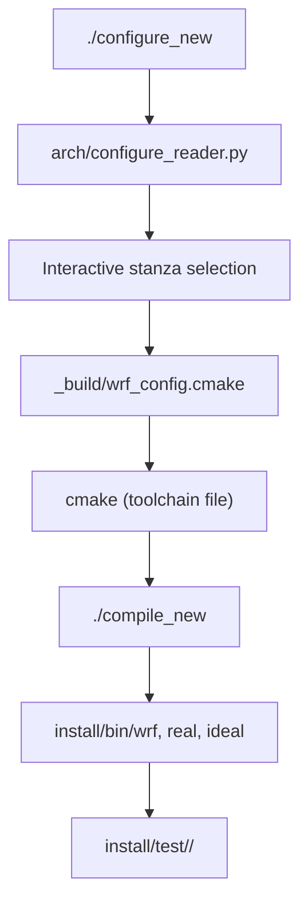

**Non-interactive CMake example:**

```bash
./configure_new -p GNU -x -- \
  -DWRF_CORE=ARW \
  -DWRF_NESTING=BASIC \
  -DWRF_CASE=EM_REAL \
  -DUSE_MPI=ON
./compile_new -j 12
```

**Key CMake cache variables:**

| Variable | Options | Default |
|----------|---------|---------|
| `WRF_CORE` | `ARW`, `DA`, `DA_4D_VAR`, `PLUS`, `CONVERT` | `ARW` |
| `WRF_NESTING` | `NONE`, `BASIC`, `MOVES`, `VORTEX` | `NONE` |
| `WRF_CASE` | `EM_REAL`, `EM_FIRE`, `EM_LES`, `EM_B_WAVE`, … | `EM_REAL` |
| `USE_MPI` / `USE_OPENMP` | `ON` / `OFF` | `OFF` |
| `USE_DOUBLE` | `ON` / `OFF` | `OFF` |
| `ENABLE_CHEM` / `ENABLE_KPP` | `ON` / `OFF` | `OFF` |
| `ENABLE_HYDRO` | `ON` / `OFF` | `OFF` |

Dependency discovery uses `find_package()` with optional `*_ROOT` hints (e.g., `netCDF_ROOT`, `HDF5_ROOT`, `MPI_ROOT`). The CMake build also copies test-case input files from `test/<case>/` into `install/test/<case>/` automatically.

### Initializing Simulations: `real_em.F` vs `ideal_em.F`

Before `wrf` can run, initial conditions must be created by one of two preprocessor executables:

**`real` (from `main/real_em.F`)** — reads WPS output files (`met_em.*.nc`) containing interpolated reanalysis or forecast data. It calls `module_initialize_real` to produce `wrfinput_d0X` (initial conditions) and `wrfbdy_d01` (lateral boundary conditions). This path supports multiple nested domains, chemistry initialization, and data assimilation restart files.

**`ideal` (from `main/ideal_em.F`)** — synthesizes atmospheric conditions from namelist parameters and an optional `input_sounding` vertical profile. It calls `module_initialize_ideal` and produces only `wrfinput_d01`; no boundary conditions are generated because the domain is periodic or isolated.

| Aspect | `real` | `ideal` |
|--------|--------|---------|
| Input | WPS `met_em.*` files | Namelist + `input_sounding` |
| Boundary file | `wrfbdy_d01` generated | Not generated |
| Nested domains | Full multi-domain support | Simplified |
| Use case | Operational / hindcast runs | Sensitivity studies, development |

### Test Cases

Test cases live under `test/` and are named after the `WRF_CASE` CMake variable. Each directory provides one or more `namelist.input.*` files covering specific scenario variants.

**Real-data test cases (`test/em_real/`):**

The default `namelist.input` configures a 36-hour, two-domain run (15 km outer / 5 km inner) starting 2019-09-04 12 UTC with the `CONUS` physics suite. Variant namelists cover chemistry (`namelist.input.chem`), fire behavior (`namelist.input.fire`), global domains, ndown one-way nesting, and PBL-to-LES scale bridging.

**Ideal test cases:**

- `em_b_wave` — mid-latitude baroclinic wave (benchmark)
- `em_squall2d_x` / `em_squall2d_y` — 2-D squall line (x- or y-aligned)
- `em_quarter_ss` — quarter-circle shear / supercell thunderstorm
- `em_les` — Large-Eddy Simulation boundary layer
- `em_heldsuarez` — Held-Suarez global dry-atmosphere test
- `em_grav2d_x` / `em_hill2d_x` — 2-D gravity wave / mountain-wave cases
- `em_tropical_cyclone` — tropical cyclone bogussing
- `em_fire` — coupled fire-atmosphere model
- `em_scm_xy` — single-column model

### Running a Simulation (Quick Reference)

```bash
# Real-data workflow
cd install/test/em_real
# (place met_em.* files here)
./real            # produces wrfinput_d01, wrfbdy_d01
mpirun -np 16 ./wrf

# Ideal workflow (e.g., squall line)
cd install/test/em_squall2d_x
./ideal           # produces wrfinput_d01
mpirun -np 4 ./wrf
```

To clean a CMake build entirely, run `./cleanCMake.sh` from the source root. For the legacy system, `./clean -a` removes compiled objects and the `configure.wrf` file.

---